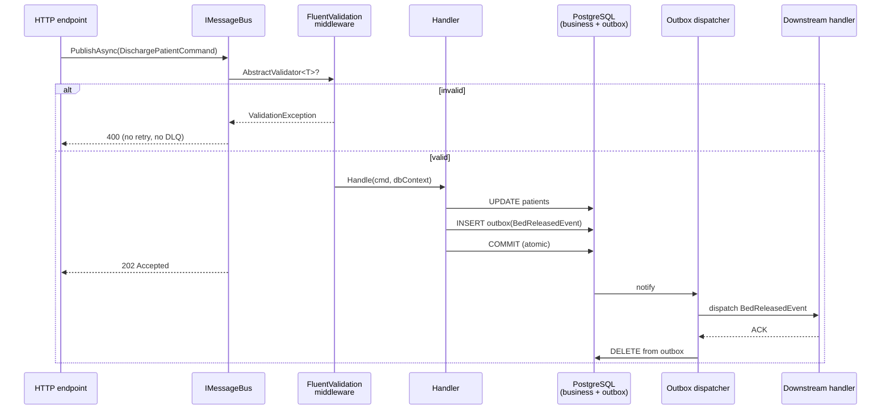
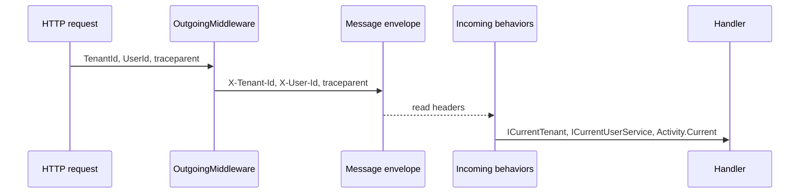

import { Aside } from '@astrojs/starlight/components';

For a decade, "CQRS in .NET" meant one thing: install MediatR, sprinkle `IRequestHandler<T>` everywhere, marvel at how clean the controllers look. It became reflex. New project, new MediatR.

Then production hits. Your "send invoice email" command runs *inside* the HTTP transaction. The DB commit succeeds, the SMTP call times out, the user sees a 500. You add a retry loop. You add a try/catch. You add a `BackgroundService` that polls a `pending_email` table you wrote yourself. Six months later you've reinvented half a message bus, badly.

The problem is that **MediatR is not a mediator for CQRS** — it's an in-process function dispatcher. The thing you actually need is a **message bus with a transactional outbox**. That's what `Granit.Wolverine` gives you, and this article shows exactly how.

## What MediatR is, and isn't

MediatR routes a `request` object to a handler in the same call stack, in the same thread, in the same transaction. That is its entire feature set. It is roughly 400 lines of code wrapped around `IServiceProvider.GetRequiredService<>`.

Things MediatR does **not** do:

- Persist messages to survive a process crash
- Retry transient failures with backoff
- Dispatch work *after* the database transaction commits
- Schedule work for later
- Send messages between services or even between modules
- Provide a dead-letter queue for poison messages
- Propagate tenant, user or trace context across async boundaries

That list is exactly the list of things you need the moment a CQRS command does anything besides "write one row and return". Email, webhook, queued report, "create user → provision tenant", anything cross-module — MediatR doesn't help. You bolt on Hangfire, Quartz, a SQL polling service, a `Channel<T>`, a custom outbox table. By the time it's done, your "lightweight mediator" has five dependencies and a maintenance owner.

## What you actually want

Most CQRS commands need three properties together:

1. **Atomic with the data.** If the row commits, the side effect must happen. If the row rolls back, the side effect must not.
2. **Durable.** A pod kill mid-handler must not lose the message.
3. **Async from the caller.** The HTTP request returns 202 immediately; the side effect runs after the transaction.

That triple is the **transactional outbox** pattern. The side effect (`SendInvoiceEmailCommand`) is written to an `outbox` table inside the *same* `SaveChanges` as the business row. After commit, a separate worker reads the outbox and dispatches. If the worker crashes, the message is still on disk — it gets picked up next time.

You can build this. You shouldn't. Wolverine ships it.

## Wolverine in 30 seconds

[Wolverine](https://wolverinefx.net/) is a MIT-licensed message bus and command runtime by Jeremy D. Miller (the author of StructureMap and Marten). In Granit it's wrapped in two packages:

| Package                       | Role                                                  |
| ----------------------------- | ----------------------------------------------------- |
| `Granit.Wolverine`            | Bus, routing, context propagation, FluentValidation   |
| `Granit.Wolverine.Postgresql` | PostgreSQL outbox + transport (no broker required)    |

A single `[DependsOn(typeof(GranitWolverinePostgresqlModule))]` on your app module wires:

- A **PostgreSQL outbox** that lives in your existing app database
- **PostgreSQL as the transport itself** — no RabbitMQ, no Kafka, no broker pod to operate
- **Convention-based handler discovery** — no `IRequestHandler<T>` interface to implement
- **FluentValidation** as bus middleware — invalid commands skip handlers and go straight to the error queue
- **Tenant + user + W3C trace context** propagation across async message processing

```json title="appsettings.json"
{
  "Wolverine": {
    "MaxRetryAttempts": 3,
    "RetryDelays": ["00:00:05", "00:00:30", "00:05:00"]
  },
  "WolverinePostgresql": {
    "TransportConnectionString": "Host=db;Database=myapp;Username=app;Password=..."
  }
}
```

## A handler, the Granit way

Wolverine handlers don't implement an interface. They are plain classes with a `Handle` method, discovered by convention from any assembly marked `[assembly: WolverineHandlerModule]`.

```csharp title="DischargePatientHandler.cs"
public class DischargePatientHandler
{
    public static IEnumerable<object> Handle(
        DischargePatientCommand command,
        PatientDbContext db)
    {
        var patient = db.Patients.Find(command.PatientId)
            ?? throw new EntityNotFoundException(typeof(Patient), command.PatientId);

        patient.Discharge();

        // Local — same transaction, in-process queue
        yield return new PatientDischargedOccurred(patient.Id, patient.BedId);

        // Distributed — persisted in the outbox, dispatched post-commit
        yield return new BedReleasedEvent(
            patient.BedId, patient.WardId, DateTimeOffset.UtcNow);
    }
}
```

Three things to notice:

1. **No interface.** No `IRequestHandler<DischargePatientCommand, Unit>`. No `Mediator.Send(...)` plumbing.
2. **`yield return` for fan-out.** The handler returns a sequence of follow-up messages. Wolverine writes all of them to the outbox **inside the same `SaveChanges`**. Atomic by construction.
3. **Two message kinds, two transports.** `IDomainEvent` runs in-process on a local queue. `IIntegrationEvent` (the `*Eto`) goes through the durable outbox. Same syntax, different guarantees.

<Aside type="caution" title="Handler visibility — Granit convention">
Handlers must be `public class` (non-static) with `public static Handle` methods. Wolverine discovers types via `Assembly.ExportedTypes`; `public static class` is skipped unless decorated with `[WolverineHandler]`, and `internal` is invisible. Don't use either — see [coding standards](/contributing/coding-standards/).
</Aside>

## What happens when you call the bus

Here is the full lifecycle of a single command. Every box is something Wolverine does for you — and that you'd be reimplementing with MediatR.



The HTTP request returns the moment the database commits. Everything past that arrow is async, durable, and retried automatically with the configured backoff (`5s → 30s → 5min`, then dead-letter). MediatR can't draw this diagram — half the boxes don't exist for it.

## Domain events vs integration events

Granit splits messages into two clearly named buckets, enforced by architecture tests:

|             | Domain event                      | Integration event              |
| ----------- | --------------------------------- | ------------------------------ |
| Suffix      | `*Event` (`IDomainEvent`)         | `*Eto`  (`IIntegrationEvent`)  |
| Scope       | In-process, same transaction      | Cross-module, durable          |
| Transport   | Local in-memory queue             | PostgreSQL outbox → transport  |
| Lifetime    | Lives and dies with the request   | Survives crashes, broker hops  |
| Example     | `PatientDischargedOccurred`       | `BedReleasedEto`               |

```csharp
public sealed record PatientDischargedOccurred(
    Guid PatientId, Guid BedId) : IDomainEvent;

public sealed record BedReleasedEto(
    Guid BedId, Guid WardId, DateTimeOffset ReleasedAt) : IIntegrationEvent;
```

The two-bucket discipline is **the** thing MediatR users miss. Without it, every `IRequest` is implicitly synchronous. With it, you make the durability cost visible at the type level. Anyone reading the code knows what survives a kill -9 and what doesn't.

## The validation pipeline you don't write

Wolverine runs FluentValidation as **bus middleware**, before the handler ever sees the message:

```csharp title="DischargePatientCommandValidator.cs"
public class DischargePatientCommandValidator
    : AbstractValidator<DischargePatientCommand>
{
    public DischargePatientCommandValidator()
    {
        RuleFor(x => x.PatientId).NotEmpty();
    }
}
```

Invalid messages **bypass retries** and go straight to the error queue — retrying a malformed command is just burning CPU. Other exceptions follow the configured backoff. With MediatR you'd write a `ValidationBehavior<TRequest, TResponse>`, register it in the right order, and hope nobody adds a behavior that wraps it incorrectly. With Wolverine, validators are picked up by `[assembly: WolverineHandlerModule]` discovery — same convention as handlers.

## Context that survives async boundaries

A command published in an HTTP request runs in some background thread minutes later. The handler still needs to know *who* sent it (for `AuditedEntity.CreatedBy`), *which tenant* (for query filters), and *which trace* (for Tempo). Wolverine moves all three through the message envelope automatically.



The result: `AuditedEntityInterceptor` writes the correct `CreatedBy` even from a Wolverine handler running 12 hours after the original request. Every span the handler emits joins the original trace in Grafana Tempo. None of this is in MediatR's mandate; you'd own the wiring.

## Why PostgreSQL-as-transport instead of RabbitMQ

The single most underrated decision in Wolverine is that **the outbox table can also be the transport**. You write a row in the outbox, the dispatcher picks it up, and that's the entire wire. No broker pod, no AMQP credentials, no extra alert rules. For most applications below 10k messages/sec, this is a permanent answer. When you outgrow it, Wolverine speaks RabbitMQ and Azure Service Bus too — same handler code, different transport binding.

Compared to the usual MediatR-plus-something stack:

| Concern                  | MediatR + handcraft   | MediatR + MassTransit | Granit.Wolverine     |
| ------------------------ | --------------------- | --------------------- | -------------------- |
| In-process mediator      | Yes                   | Yes                   | Yes                  |
| Transactional outbox     | DIY                   | Yes (config-heavy)    | Yes (default)        |
| Transport without broker | DIY                   | No                    | PostgreSQL native    |
| Retry + DLQ              | DIY                   | Yes                   | Yes                  |
| Scheduled messages       | Hangfire/Quartz       | Yes                   | Yes (Cronos)         |
| FluentValidation pipe    | Custom behavior       | Third-party           | Built in             |
| Tenant + user propagation| DIY                   | Possible              | Built in             |
| Operational footprint    | App + cron + table    | App + RabbitMQ        | App + Postgres       |

## When MediatR is still the right call

This is not a hit piece. MediatR is excellent at exactly one thing — **synchronous in-process dispatch** — and there are codebases where that is enough:

- A small monolith where every command is "validate → write → return", with no side effects
- A library where you want internal CQRS without imposing infrastructure on consumers
- A team that genuinely does not need durability and never will

For everything else — anything that sends an email, hits a third party, fans out across modules, or must survive a redeploy — you want a real bus. `Granit.Wolverine` is what that looks like when the framework owns the boilerplate.

## Takeaways

- **MediatR is an in-process function dispatcher**, not a CQRS infrastructure. Most production CQRS needs an outbox, retries, scheduling and a transport — none of which MediatR provides.
- **Wolverine is the CQRS bus most teams reinvent badly.** Outbox, transport, retries, DLQ, scheduling and validation in one MIT package.
- **PostgreSQL is the transport.** No broker pod, no AMQP, no extra ops. Same database that holds your business data.
- **Domain events vs integration events** is a type-level contract: `*Event` is in-process, `*Eto` is durable. Suffix discipline is enforced by architecture tests.
- **Handlers stay plain.** No `IRequestHandler<T>`. Convention discovery via `[assembly: WolverineHandlerModule]`. Side effects via `yield return`.
- **Tenant, user and trace context travel with the message** — your audit trail and your Grafana traces stay correct across async boundaries.

## Further reading

- [Wolverine — Messaging & Command Bus for .NET](/dotnet/infrastructure/wolverine-messaging/) — full module reference
- [ADR-005 — Wolverine + Cronos](/dotnet/architecture/adr/005-wolverine-cronos/) — why Wolverine, why not MediatR/MassTransit/NServiceBus
- [Mediator Pattern — In-Process Command Routing](/dotnet/architecture/patterns/mediator/) — the pattern as Granit applies it
- [Command Pattern — CQRS & Wolverine Handlers](/dotnet/architecture/patterns/command/) — the handler convention in detail
- [Observability in .NET 10](/blog/observability-dotnet-10-serilog-opentelemetry-grafana/) — how trace context flows from HTTP to Wolverine handler
- [Don't Mock the Database](/blog/dont-mock-the-database-use-testcontainers/) — what your handler tests should actually exercise
