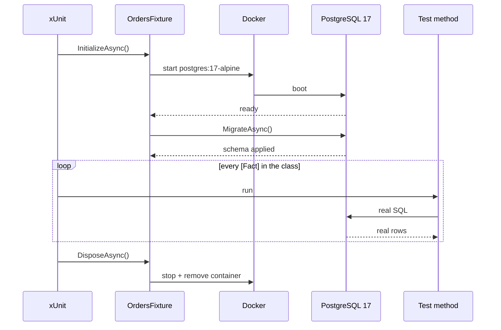

Your tests are green. All 4,812 of them. Coverage is 87 %. You deploy to staging. The very first query against PostgreSQL throws `42883: operator does not exist: jsonb @> text`. Two hours later you learn that `EF Core InMemory` silently accepted a query the real database rejects.

The test suite lied. **It was mocking reality.**

## The problem

Integration tests need to exercise the full persistence stack: EF Core migrations, FK constraints, transactions, JSONB operators, partial indexes, multi-tenant global query filters, the Wolverine outbox pattern. None of that works the same — and some of it doesn't work at all — on `UseInMemoryDatabase` or SQLite.

The cost of the mismatch shows up in production, not in CI.

## The bad practice

You probably have this somewhere in your test project:

```csharp title="OrderRepositoryTests.cs — Don't do this"
public sealed class OrderRepositoryTests
{
    private readonly AppDbContext _db;

    public OrderRepositoryTests()
    {
        var options = new DbContextOptionsBuilder<AppDbContext>()
            .UseInMemoryDatabase(Guid.NewGuid().ToString())
            .Options;
        _db = new AppDbContext(options);
    }

    [Fact]
    public async Task FindByMetadata_MatchesJsonbFilter()
    {
        // This test passes locally. It will never pass against PostgreSQL.
        var match = await _db.Orders
            .Where(o => EF.Functions.JsonContains(o.Metadata, "{\"vip\":true}"))
            .ToListAsync(TestContext.Current.CancellationToken);

        match.ShouldHaveSingleItem();
    }
}
```

Everything that makes this test a lie:

- **`UseInMemoryDatabase` is not a database.** It's a LINQ-to-objects evaluator. No SQL is ever generated. No migration is ever applied. Your production query plan is irrelevant here.
- **JSONB operators are a fiction.** `JsonContains`, `@>`, `->>` — all silently no-op or throw. SQLite has the same gap.
- **FK constraints don't fire.** Inserting an orphan row succeeds in InMemory, fails in Postgres.
- **Transactions are a stub.** `BeginTransactionAsync` returns a fake that doesn't serialize anything.
- **Global query filters behave differently.** The InMemory provider has known divergences with named filters, multi-tenant predicates, and soft-delete interceptors.

You are testing an abstraction layer, not your database. When staging fails, the test suite has no idea why.

## The good practice

Spin up an **ephemeral PostgreSQL container**, apply migrations, run the test, tear it down. One `IAsyncLifetime`, one NuGet package, real SQL.

```csharp title="OrdersFixture.cs"
using Testcontainers.PostgreSql;

public sealed class OrdersFixture : IAsyncLifetime
{
    private readonly PostgreSqlContainer _postgres = new PostgreSqlBuilder()
        .WithImage("postgres:17-alpine")
        .WithDatabase("orders_test")
        .WithUsername("test")
        .WithPassword("test")
        .Build();

    public string ConnectionString => _postgres.GetConnectionString();

    public async ValueTask InitializeAsync()
    {
        await _postgres.StartAsync();

        var options = new DbContextOptionsBuilder<AppDbContext>()
            .UseNpgsql(ConnectionString)
            .Options;

        await using var db = new AppDbContext(options);
        await db.Database.MigrateAsync();
    }

    public ValueTask DisposeAsync() => _postgres.DisposeAsync();
}
```

```csharp title="OrderRepositoryTests.cs — Do this"
public sealed class OrderRepositoryTests(OrdersFixture fixture)
    : IClassFixture<OrdersFixture>
{
    private AppDbContext CreateContext() =>
        new(new DbContextOptionsBuilder<AppDbContext>()
            .UseNpgsql(fixture.ConnectionString)
            .Options);

    [Fact]
    public async Task FindByMetadata_MatchesJsonbFilter()
    {
        // Arrange
        await using var db = CreateContext();
        db.Orders.Add(new Order { Metadata = """{ "vip": true }""" });
        await db.SaveChangesAsync(TestContext.Current.CancellationToken);

        // Act
        var match = await db.Orders
            .Where(o => EF.Functions.JsonContains(o.Metadata, """{ "vip": true }"""))
            .ToListAsync(TestContext.Current.CancellationToken);

        // Assert
        match.ShouldHaveSingleItem();
    }
}
```

This test either passes against a real Postgres or tells you exactly how your production query is broken. No third option.

## The fixture lifecycle

`IAsyncLifetime` + `IClassFixture<T>` gives you one container per test class, shared across facts, torn down when the class is done:



The 3–5 s cost lives in the first arrow. Everything after it is network-local SQL against a throwaway database that nobody else can see.

## What you get back

| Concern                       | InMemory / SQLite    | Testcontainers          |
| ----------------------------- | -------------------- | ----------------------- |
| EF Core migrations            | Skipped              | Applied end-to-end      |
| JSONB / `@>` / `->>`          | No-op or throws      | Real PostgreSQL         |
| FK constraints                | Ignored              | Enforced                |
| Transactions & isolation      | Stubbed              | Real MVCC               |
| Global query filters          | Partial divergence   | Exact production parity |
| Wolverine outbox tables       | Not created          | Real `mt_*` schema      |
| Per-test isolation            | Per-context          | Per-container           |
| Startup cost                  | 0 ms                 | ~3–5 s (once per class) |
| Docker required               | No                   | Yes (CI + dev)          |

The `~3–5 s` startup is the only honest downside. You pay it once per test class via `IClassFixture<T>` (or once per collection via `ICollectionFixture<T>`), not once per test.

## Why it matters

Three incidents out of four that masquerade as "weird behaviour in prod" are a test that never reproduced prod. The classic shapes:

1. **Broken migration.** A new column is `NOT NULL` without a default. InMemory doesn't care. The first real insert in staging fails.
2. **Silent query downgrade.** EF Core translates your LINQ to client-side evaluation against InMemory. In Postgres it fails, or worse, changes meaning.
3. **Isolation bug.** A global query filter or soft-delete interceptor behaves differently against the InMemory provider. Data that should be hidden leaks in tests — or data that should be visible is missing.

Testcontainers kills all three categories at the PR stage.

<aside>
**On the cost.** "But 3 seconds per fixture!" — yes, and it runs in parallel across test classes. A Granit integration suite with ~40 fixtures starts ~40 containers concurrently and completes in under a minute on a laptop. CI runners have Docker-in-Docker. The cost is real but small, and the alternative is finding the bug in production.
</aside>

## Decision rule

Use Testcontainers when any of these is true — and that covers most of the surface area:

- The test exercises a **`DbContext`, a query, a migration or an interceptor**.
- The test depends on **PostgreSQL-specific features** (JSONB, `gen_random_uuid`, partial indexes, `CITEXT`, transactional DDL).
- The test validates **Wolverine** messaging, the outbox, or Postgres-based persistence.
- The test asserts on **multi-tenant isolation** or any global query filter.

Keep `FakeTimeProvider`, `NSubstitute` and regular unit tests for pure business logic — services with no `DbContext`, domain invariants, value objects. Those don't need a container.

## Takeaways

- **`EF Core InMemory` and SQLite do not test your database.** They test an abstraction that lies about it.
- **Real bugs live in real SQL.** JSONB, FKs, transactions, global filters all diverge silently on in-memory providers.
- **Testcontainers runs PostgreSQL as a first-class test dependency** — ephemeral, isolated, reproducible in CI.
- **Amortize startup with `IClassFixture<T>`.** ~3–5 s per fixture, parallel across classes, once per run.
- **Mocks go on the seams, not on the database.** Mock `IClock`, `ICurrentUserService`, `IVaultClient`. Never `DbContext`.

## Further reading

- [Testing Guide — xUnit, Shouldly, NSubstitute, Testcontainers](/contributing/testing-guide/) — full Granit test conventions
- [ADR-007 — Testcontainers](/dotnet/architecture/adr/007-testcontainers/) — why in-memory was rejected
- [Persistence — Isolated DbContexts & migrations](/dotnet/data/persistence/) — the stack your tests must exercise
- [Stop Using DateTime.Now](/blog/stop-using-datetime-now/) — the other half: mock time, not the database
- [Isolated DbContext per Module](/blog/isolated-dbcontext-per-module/) — why each module's tests need their own schema
