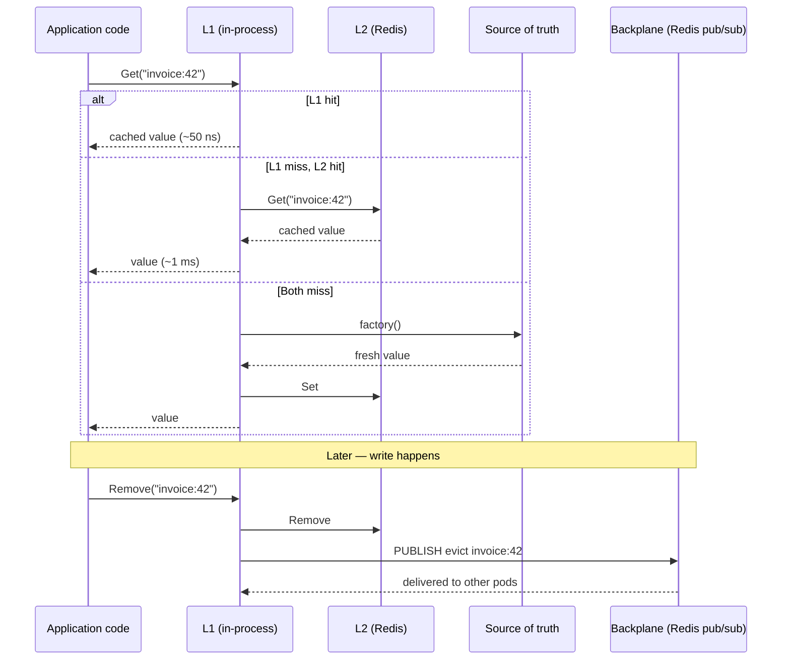

import { Aside } from '@astrojs/starlight/components';

You scale your API from one pod to three. Latency drops, throughput climbs, you ship a Slack message about it. Two days later support tickets land: a user updated their profile, hit refresh, and saw the *old* value. Then the new one. Then the old one again. The pattern is unmistakable: the load balancer is rotating them across three pods, each holding a stale in-process cache, each happily serving its own version of reality.

The fix is not "stop caching". The fix is to **layer caches**: a fast in-process L1, a shared L2 in Redis, and a pub/sub **backplane** that tells every pod when to evict. That is what Microsoft calls `HybridCache`, what FusionCache calls hybrid caching, and what Granit ships preconfigured with sensible defaults.

## Why one layer is never enough

Pick any single layer and it fails on something:

| Layer | Fast? | Shared? | Survives restart? | Invalidates across pods? |
| ----- | ----- | ------- | ----------------- | ----------------------- |
| `IMemoryCache` only | Yes (~50 ns) | No | No | No |
| Redis only | No (~1 ms) | Yes | Yes | N/A — already shared |
| In-memory + manual Redis sync | Yes | Yes | Partial | Only if you remember |

The first row is what most teams start with and what causes the bug above. The second is fast enough for many workloads but adds 0.5–2 ms of network round-trip to every read — multiply by ten cache hits per request and your "performance optimization" became a slowdown. The third row is what most teams end up writing themselves: an `IMemoryCache` in front, a `RedisCache` behind, and a hand-rolled `Dictionary<string, DateTimeOffset>` to track invalidations. By month six it is unmaintainable.

## The hybrid model

A hybrid cache solves this by making the layers invisible to the caller:



The caller sees a single API. The cache decides where to fetch from, where to write, and — crucially — broadcasts evictions so every other pod's L1 stays consistent.

## The two implementations you will hear about

The .NET ecosystem now ships **two** competing hybrid caches:

- **`Microsoft.Extensions.Caching.Hybrid`** — the official one, GA in .NET 9, expanded in .NET 10. API surface is `HybridCache.GetOrCreateAsync<T>(key, factory)`. Stamping out the rough edges, but missing fail-safe (returning a stale value when the factory throws), eager refresh, and a real backplane story at the time of writing.
- **FusionCache** — community project by Jody Donetti, around since 2021. Same hybrid model, but ships fail-safe, eager refresh, factory timeouts with background completion, OpenTelemetry, and first-class Redis backplane support. The reference implementation everybody else compares against.

Granit picks **FusionCache**. The reasons are pragmatic, not ideological:

1. **Fail-safe** — if the factory throws (database down, downstream API timeout), FusionCache can return the last known good value instead of a `503`. For multi-tenant SaaS where one tenant's bad data should not break another's reads, this is the difference between a Slack notification and a PagerDuty incident.
2. **Factory timeouts** — soft and hard timeouts mean a slow database query does not pin a request thread for 30 seconds. FusionCache returns the stale value, then completes the refresh in the background.
3. **OpenTelemetry built in** — every cache call emits `cache.hit`, `cache.miss`, `cache.factory.duration`. Drop a Grafana dashboard on top and you can see your hit rate evolve over a deployment.
4. **Mature backplane** — `ZiggyCreatures.FusionCache.Backplane.StackExchangeRedis` has been in production at scale for years and handles connection drops, message ordering, and self-message filtering correctly.

`HybridCache` will close most of those gaps over time. Until then, FusionCache is the conservative choice — and the API is similar enough that swapping later is mostly a `using` statement.

<Aside type="note">
**Naming note.** This article uses "HybridCache" as the conceptual term for the L1 + L2 + backplane pattern. Granit's implementation is FusionCache. Microsoft's `HybridCache` follows the same model and would slot into the same architectural diagram.
</Aside>

## The setup — two NuGet packages, zero configuration code

Granit ships caching as two modules:

- `Granit.Caching` — registers FusionCache with an in-memory L1, fail-safe, factory timeouts, eager refresh, and tenant-aware key prefixing.
- `Granit.Caching.StackExchangeRedis` — adds the L2 Redis cache and the Redis pub/sub backplane.

Add the packages, declare the modules, and configuration takes care of the rest:

```csharp title="Program.cs"
builder.AddGranit(granit => granit
    .AddModule<GranitCachingModule>()
    .AddModule<GranitCachingStackExchangeRedisModule>());
```

```jsonc title="appsettings.json"
{
  "Cache": {
    "KeyPrefix": "myapp",
    "EncryptValues": true,
    "Encryption": { "Key": "base64-key-from-vault" },
    "Redis": {
      "Configuration": "redis:6379",
      "InstanceName": "myapp:"
    }
  }
}
```

The Redis module declares `IsEnabled` to return `false` when no Redis configuration is present, so dev environments fall back to L1 only without any code change. CI runs against a Testcontainers Redis. Production reads the connection string from Vault via `ConnectionStringName`.

## The code your services actually write

```csharp title="InvoiceService.cs"
public sealed class InvoiceService(
    IFusionCache cache,
    IInvoiceRepository repository)
{
    public Task<Invoice> GetByIdAsync(Guid invoiceId, CancellationToken ct) =>
        cache.GetOrSetAsync(
            $"invoice:{invoiceId}",
            async (ctx, token) => await repository.GetAsync(invoiceId, token).ConfigureAwait(false),
            options => options.SetDuration(TimeSpan.FromMinutes(15)),
            token: ct);
}
```

That is the entire pattern. `GetOrSetAsync` checks L1, then L2, then runs the factory. Every layer transition is invisible. The `SetDuration(15 minutes)` interacts with the framework defaults — fail-safe extends the entry by `FailSafeMaxDuration` if the factory ever throws, and eager refresh starts a background refresh once the entry is past its `EagerRefreshThreshold`.

## The hard part: invalidation

Reads are easy. The hard part is making sure all three pods drop their L1 entry the moment one of them does a write.

Without a backplane:

1. Pod A handles `PUT /invoices/42`, updates the database, evicts its own L1, writes the new value to L2.
2. Pod B has `invoice:42` in L1 from a read 30 seconds ago.
3. Next request to pod B hits L1, returns the stale value.
4. User sees the old data for up to 15 minutes (the L1 TTL).

With a Redis backplane:

1. Pod A's eviction publishes a message on the Redis pub/sub channel `myapp:fusioncache:invoice:42`.
2. Pods B and C are subscribed. They receive the message and drop the entry from their L1.
3. Next request to any pod misses L1, hits L2 (which already has the new value), and serves it.

Granit wires this up automatically. The relevant lines are six, and you do not write them:

```csharp title="RedisCachingServiceCollectionExtensions.cs (excerpt)"
services.AddFusionCache()
    .WithRegisteredDistributedCache();           // L2 = Redis

services.AddFusionCacheStackExchangeRedisBackplane(_ => { });
services.AddOptions<RedisBackplaneOptions>()
    .Configure<IConnectionMultiplexer>((bp, mux) =>
        bp.ConnectionMultiplexerFactory = () => Task.FromResult(mux));
```

The backplane reuses the same `IConnectionMultiplexer` as the L2 cache, so you pay for one Redis connection, not two.

## Driving invalidation from domain events

Manual `cache.RemoveAsync` calls scattered across services are the second-most-common cause of stale-cache bugs after "no backplane at all". Forget one and the cache silently lies for an hour.

Granit's pattern is to invalidate caches **from event handlers**, not from the write path itself. The Features module is a textbook example:

```csharp title="FeatureValueChangedEvent.cs"
public sealed record FeatureValueChangedEvent(
    string FeatureName,
    Guid? TenantId);
```

```csharp title="FeatureCacheInvalidationHandler.cs"
public class FeatureCacheInvalidationHandler
{
    public static async Task HandleAsync(
        FeatureValueChangedEvent @event,
        IFusionCache cache,
        CancellationToken cancellationToken)
    {
        string key = FeatureCacheKey.Build(@event.TenantId, @event.FeatureName);
        await cache.ExpireAsync(key, token: cancellationToken).ConfigureAwait(false);
    }
}
```

The write path raises `FeatureValueChangedEvent`. Wolverine routes it to the handler. The handler expires the entry. Every other pod gets the backplane message and drops its copy. The write path itself never imports `IFusionCache`, never knows a cache exists, and stays focused on persisting the value.

This is the pattern the framework uses everywhere caching meets writes — Permissions, Localization, Settings, Templating. Centralizing invalidation on the event makes it impossible to drift: any code path that mutates the underlying state will raise the event, and any cache layered on top will hear it.

## Multi-tenancy without the footgun

Granit applications are multi-tenant by default, which means key collisions across tenants are a security incident waiting to happen. The `TenantAwareFusionCache` decorator wraps the singleton `IFusionCache` and prefixes every key with `t:{tenantId}:` — transparently, by reading `ICurrentTenant` at call time:

```csharp
// Tenant A calls
cache.GetOrSetAsync("invoice:42", ...);
// Internally writes to: myapp:t:00000000-0000-0000-0000-...:invoice:42

// Tenant B calls the same key
cache.GetOrSetAsync("invoice:42", ...);
// Internally writes to: myapp:t:11111111-1111-1111-1111-...:invoice:42
```

Two completely separate cache namespaces. No code change in `InvoiceService`. The decorator reads `ICurrentTenant` per call, so it stays correct even though the cache itself is a singleton — `ICurrentTenant` is backed by `AsyncLocal<T>` and reflects the current request's scope.

## Encryption when L2 is shared infrastructure

Redis is rarely the application's exclusive infrastructure. A shared cluster used by multiple services means cached values — invoices, user profiles, feature flags — are visible to anyone with `redis-cli` access. For workloads with personal data, this is a compliance problem (GDPR Art. 32 — protection in transit and at rest).

Granit ships AES-256-GCM encryption for L2 entries:

```jsonc title="appsettings.json"
{
  "Cache": {
    "EncryptValues": true,
    "Encryption": { "Key": "base64-key-from-vault" }
  }
}
```

Set the flag, ship the key from Vault, and `EncryptingFusionCacheSerializer` decorates the JSON serializer. L1 stays plaintext (it never leaves the process). L2 entries are ciphertext-on-the-wire and ciphertext-at-rest. The backplane pub/sub messages contain only keys, never values, so they need no encryption.

If you forget to set `EncryptValues = true`, the framework logs a warning at startup. It is intentionally loud:

```text
warn: Granit.Caching.StackExchangeRedis: Redis distributed cache is active but
      Cache:EncryptValues is disabled — cached values are stored in plaintext in
      Redis. Set Cache:EncryptValues to true for production deployments.
```

## What to measure

The two metrics that tell you a hybrid cache is working as intended:

| Metric | Healthy range | Meaning |
| ------ | ------------- | ------- |
| `cache.hit_ratio` (L1) | > 0.85 | Most reads never leave the process |
| `cache.factory.duration` p99 | < 100 ms | Factory itself is not the bottleneck |
| `cache.backplane.messages_received` per pod | non-zero | Other pods are evicting; backplane is alive |

A hit ratio under 0.5 usually means TTLs are too short or the eager refresh threshold is too aggressive. Zero backplane messages on a multi-pod deployment means either you have no writes (suspicious) or the backplane configuration is broken.

## Key takeaways

- **Single-layer caches do not survive horizontal scaling.** L1-only goes stale, L2-only loses the latency win.
- **Hybrid caching = L1 + L2 + backplane.** All three are required. Skip the backplane and stale data is the new default.
- **FusionCache is the mature .NET implementation today.** Microsoft's `HybridCache` follows the same model and will catch up; Granit will track it as parity lands.
- **Invalidate from event handlers, not from write paths.** Centralizes the cache logic and makes it impossible to drift.
- **Tenant prefixing is non-negotiable in multi-tenant apps.** The decorator does it transparently — do not roll your own.
- **Encrypt L2 when Redis is shared infrastructure.** AES-256-GCM is one config flag and zero code change.

## Further reading

- [Granit.Caching module reference](/dotnet/data/caching/)
- [FusionCache project](https://github.com/ZiggyCreatures/FusionCache)
- [HashiCorp Vault integration](/blog/secrets-management-with-hashicorp-vault-in-dotnet-10/) — where the encryption key lives
- [CQRS Without MediatR — How Granit Uses Wolverine](/blog/cqrs-without-mediatr-how-granit-uses-wolverine/) — the event bus that drives invalidation
