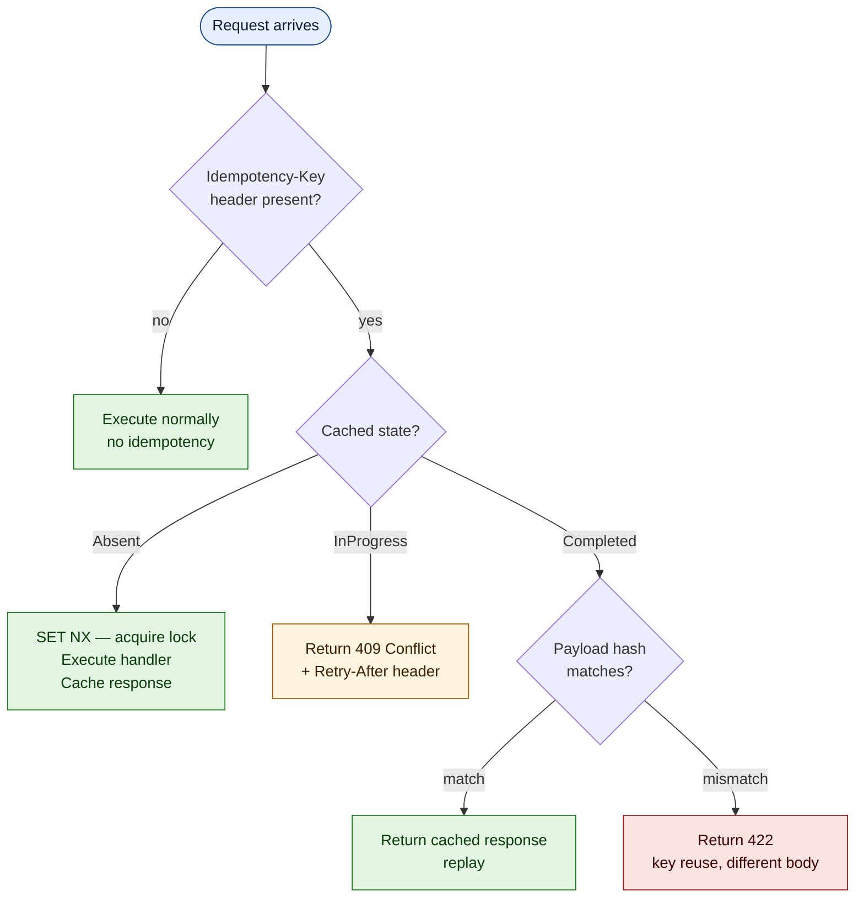

Your payment endpoint runs. The database row is inserted. The response is on its way back — and the connection drops. The client retries. Now you have **two charges** for the same order. The customer notices before you do.

This is not a theoretical edge case. It happens every day on every API that accepts POST requests over an unreliable network (all of them). The HTTP specification already solved this for GET, PUT, and DELETE — they are idempotent by definition. POST is the outlier. **Idempotency keys** close that gap.

## What is an idempotency key?

An idempotency key is a client-generated unique identifier attached to a request via a header. The server uses it to recognize retries and return the **original response** instead of executing the operation again.

```text
POST /api/v1/payments/charge
Idempotency-Key: 550e8400-e29b-41d4-a716-446655440000
Content-Type: application/json

{ "orderId": "ORD-42", "amount": 149.99, "currency": "EUR" }
```

If the server has seen this key before, it returns the cached response — same status code, same body, same headers. The client cannot tell the difference between a fresh response and a replay. That is the point.

## Why client-generated?

The key **must** come from the client because only the client knows whether a request is new or a retry. The server cannot distinguish a legitimate duplicate (user clicked "Pay" twice) from a network retry (load balancer timed out, client resent). The key is the client's declaration: *"this is the same logical operation."*

In practice, a UUID v4 generated before the first attempt works. The client stores it alongside the request and reuses it on retry. Some teams use a deterministic key derived from business data (`SHA-256(orderId + amount + currency)`) — this prevents the "same intent, different key" problem when the client forgets to store the original.

## The three failure modes without idempotency

Every non-idempotent POST is vulnerable to three scenarios:

| Scenario | What happens | Impact |
| ---------- | ------------- | -------- |
| **Network retry** | Load balancer times out, resends the request | Double charge, duplicate record |
| **Client retry** | Mobile app loses connectivity, user taps again | Same as above, plus user frustration |
| **Saga compensation** | Orchestrator retries a failed step after partial success | Inconsistent state across services |

All three produce the same symptom: **duplicate side effects**. The fix is the same for all three: recognize the retry, return the original result.

## How Granit handles it

`Granit.Http.Idempotency` implements the full Stripe-style idempotency pattern as ASP.NET Core middleware. The state machine has three states:



### Mark an endpoint as idempotent

Decorate any endpoint with `[Idempotent]`:

```csharp title="PaymentEndpoints.cs"
group.MapPost("/charge", ChargeAsync)
    .WithName("ChargePayment")
    .WithSummary("Initiates a payment charge.")
    .WithDescription(
        "Charges the specified amount against the payment method on file. " +
        "Requires an Idempotency-Key header to prevent duplicate charges.")
    .Produces<PaymentChargeResponse>(StatusCodes.Status201Created)
    .ProducesProblem(StatusCodes.Status409Conflict)
    .ProducesProblem(StatusCodes.Status422UnprocessableEntity)
    .WithMetadata(new IdempotentAttribute { Required = true });
```

`Required = true` means the middleware **rejects** requests without the header — returning 400 instead of silently executing without protection. For payment endpoints, this is the right default.

### Configure the behavior

```json title="appsettings.json"
{
  "Idempotency": {
    "HeaderName": "Idempotency-Key",
    "CompletedTtl": "24:00:00",
    "InProgressTtl": "00:00:30",
    "ExecutionTimeout": "00:00:25",
    "MaxBodySizeBytes": 1048576
  }
}
```

| Option | Default | Purpose |
| -------- | --------- | --------- |
| `HeaderName` | `Idempotency-Key` | HTTP header name |
| `CompletedTtl` | 24 hours | How long a completed response is cached |
| `InProgressTtl` | 30 seconds | Lock duration for in-flight requests |
| `ExecutionTimeout` | 25 seconds | Max time before the lock is released on timeout |
| `MaxBodySizeBytes` | 1 MiB | Maximum request body size for hash computation |

The `ExecutionTimeout` **must** be less than `InProgressTtl`. If the handler takes longer than `ExecutionTimeout`, the middleware releases the lock and returns 503 — allowing the client to retry safely.

### Wire the middleware

```csharp title="Program.cs"
await app.UseGranitAsync();
app.UseGranitIdempotency(); // After authentication — needs ICurrentUserService
```

Placement matters: the middleware must run **after** authentication and authorization because the composite Redis key includes the tenant ID and user ID.

## Composite key: tenant isolation by design

The Redis key is not just a hash of the idempotency header. It is a composite of five elements:

```text
{prefix}:{tenantId}:{userId}:{METHOD}:{routePattern}:{sha256(idempotencyKey)}
```

Example: `idp:acme-corp:d4e5f6a7:POST:/api/v1/payments/charge:a1b2c3d4...`

This structure prevents three classes of attack:

- **Cross-tenant replay** — tenant A cannot reuse tenant B's idempotency key
- **Cross-user replay** — user A cannot replay user B's cached response
- **Cross-endpoint collision** — the same key on `/charge` and `/refund` are independent

The idempotency key value itself is SHA-256 hashed before storage. This prevents enumeration attacks — even with Redis access, an attacker cannot reconstruct client-generated keys.

## Payload hash: catching key reuse with a different body

A common mistake: the client sends the same idempotency key with a different request body. Maybe the user changed the amount and retried. The server **must not** return the cached response for the original amount.

Granit computes a SHA-256 digest over `METHOD + route + idempotency key + request body` using `IncrementalHash` and `ArrayPool<byte>` — zero-allocation streaming. If the hash does not match the cached entry, the middleware returns **422 Unprocessable Entity**:

```json title="422 response"
{
  "type": "https://tools.ietf.org/html/rfc7807",
  "title": "Idempotency payload mismatch",
  "status": 422,
  "detail": "The Idempotency-Key has already been used with a different request payload."
}
```

The client must generate a **new** key for the modified request. This is correct behavior — changing the payload means it is a different logical operation.

## Double-click protection

When two identical requests arrive simultaneously (the user double-tapped "Pay"), the first request acquires the lock via `SET NX`. The second request finds the key in `InProgress` state and receives **409 Conflict** with a `Retry-After` header:

```text
HTTP/1.1 409 Conflict
Retry-After: 2
Content-Type: application/problem+json

{
  "type": "https://tools.ietf.org/html/rfc7807",
  "title": "Request in progress",
  "status": 409,
  "detail": "A request with this Idempotency-Key is currently being processed."
}
```

The client waits 2 seconds and retries. By then, the first request has completed and the retry receives the cached response. No double charge. No race condition.

## What gets cached (and what does not)

Not every response should be replayed. Authentication failures, for example, should never be cached — the user might fix their token and retry legitimately.

| Status codes | Cached | Rationale |
| ------------- | -------- | ----------- |
| 2xx, 400, 404, 409, 410, 422 | Yes | Deterministic outcomes safe to replay |
| 401, 403 | No | Auth state may change between retries |
| 5xx | No | Transient failures should be retried fresh |
| 499 (client disconnect) | No | Response never reached the client |

When a 5xx occurs, the middleware **deletes** the lock — freeing the key for a clean retry.

## Database-level idempotency: defense in depth

HTTP-level idempotency handles the network layer. But what about the database? If two pods process the same payment before the Redis lock propagates, you still get duplicates.

Granit uses **unique indexes** as a second line of defense in domains where duplication has financial impact:

```csharp title="PaymentTransactionConfiguration.cs"
builder.HasIndex(e => new { e.TenantId, e.IdempotencyKey })
    .IsUnique()
    .HasDatabaseName("uq_granitp_transactions_tenant_idempotency");
```

```csharp title="MeterEventConfiguration.cs"
builder.HasIndex(e => new { e.TenantId, e.IdempotencyKey })
    .IsUnique()
    .HasDatabaseName("ix_granitm_meter_events_dedup");
```

The database constraint catches what the middleware misses. The middleware prevents unnecessary database round-trips. Together, they provide **defense in depth** — no single layer failure can produce duplicates.

## Observability

The middleware exposes four OpenTelemetry counters:

| Metric | What it tells you |
| -------- | ------------------ |
| `granit.http.idempotency.lock_acquired` | Successful lock acquisitions (new requests) |
| `granit.http.idempotency.conflicts` | 409 responses (concurrent duplicates) |
| `granit.http.idempotency.replayed` | Cached responses served (successful dedup) |
| `granit.http.idempotency.hash_mismatches` | 422 responses (key reuse with different payload) |

A spike in `replayed` means clients are retrying heavily — check upstream timeouts. A spike in `hash_mismatches` means clients are reusing keys incorrectly — check the SDK documentation.

## Client-side implementation

A well-behaved client follows this pattern:

```typescript title="api-client.ts"
async function chargePayment(order: Order): Promise<PaymentResponse> {
  const idempotencyKey = crypto.randomUUID();

  for (let attempt = 0; attempt < 3; attempt++) {
    const response = await fetch("/api/v1/payments/charge", {
      method: "POST",
      headers: {
        "Content-Type": "application/json",
        "Idempotency-Key": idempotencyKey, // Same key on every retry
      },
      body: JSON.stringify({
        orderId: order.id,
        amount: order.total,
        currency: "EUR",
      }),
    });

    if (response.status === 409) {
      const retryAfter = parseInt(response.headers.get("Retry-After") ?? "2");
      await sleep(retryAfter * 1000);
      continue;
    }

    return response.json();
  }

  throw new Error("Payment request failed after 3 attempts");
}
```

The key is generated **once**, before the loop. Every retry sends the **same** key. If the server returns 409, the client respects `Retry-After`. This is the entire client-side contract.

## Key takeaways

- **Every POST endpoint that mutates state needs idempotency protection.** Network retries are not edge cases — they are normal operation.
- **The client generates the key** because only the client knows whether a request is new or a retry.
- **Payload hashing** prevents key reuse with a different body — a common source of subtle bugs.
- **Double-click protection** (409 + Retry-After) handles concurrent duplicates without data corruption.
- **Defense in depth**: HTTP middleware + database unique indexes cover both network-level and infrastructure-level races.
- **`Granit.Http.Idempotency`** implements the full pattern — state machine, tenant isolation, payload verification, observability — in a single middleware call.

## Further reading

- [Idempotency reference](/dotnet/api/idempotency/) — full option reference, state machine diagram, response caching rules
- [Configure idempotency guide](/dotnet/guides/configure-idempotency/) — step-by-step setup with Redis and endpoint decoration
- [Idempotency pattern](/dotnet/architecture/patterns/idempotency/) — architecture decision, rationale matrix, algorithm steps
- [RFC 7807: ProblemDetails — The Only Way to Return Errors](/blog/rfc-7807-problem-details-the-only-way-to-return-errors/) — error format used by idempotency responses
