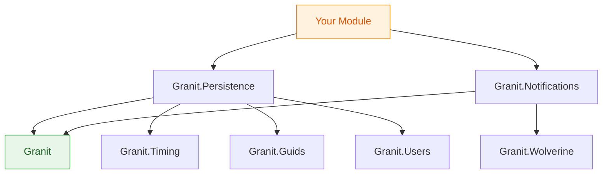

import { Tabs, TabItem } from "@astrojs/starlight/components";

Every .NET team rebuilds the same infrastructure. Authentication, authorization, audit trails, multi-tenancy, notification dispatch, file storage, localization, feature flags, document generation — the list is long and the implementations are always slightly different, slightly incomplete, and never quite production-ready on day one. We spent years watching this pattern repeat across projects before deciding to stop rebuilding and start composing.

Granit is the result. It is an open-source modular framework for **.NET 10** that packages 93 production-ready NuGet packages into a strict dependency graph with **zero circular references**. You install only what you need. Every package enforces GDPR and ISO 27001 constraints by default, so compliance is not an afterthought bolted on before an audit — it is baked into the interceptors, the query filters, and the encryption layer from the start.

## Why another framework?

The .NET ecosystem has mature building blocks — Entity Framework Core, ASP.NET Core Minimal APIs, FluentValidation, Serilog, OpenTelemetry. What it lacks is **opinionated composition**. How should those libraries work together in a modular monolith? How do you enforce tenant isolation across 20 modules without every developer remembering to add a `WHERE TenantId = @tenantId` clause? How do you guarantee that every entity mutation produces an audit trail entry?

Granit answers these questions with **conventions over configuration**. You declare your module, list its dependencies, and the framework handles the cross-cutting concerns: audit interceptors, soft-delete query filters, tenant isolation, encryption at rest, structured logging. Your team writes domain logic instead of infrastructure glue.

This is not a full-stack application template. It is not a code generator. It is a **framework of composable, independently versioned packages** that you pull in through NuGet and configure through a dependency-declared module system — built from scratch for .NET 10, C# 14, and modern deployment targets.

## Core principles

### Modular monolith with an extraction path

Granit is designed around the [modular monolith architecture](/blog/why-modular-monolith/). Every module owns its data through an **isolated DbContext**, communicates with other modules through well-defined interfaces or in-process messaging (Wolverine), and declares its dependencies explicitly through `[DependsOn]` attributes.

This means two things. First, you get a single deployable unit with the operational simplicity of a monolith. Second, when scaling pressures or team growth justify it, you can extract a module into a standalone service because the boundaries are already enforced — no untangling of shared database tables, no hunting for hidden coupling.

### Enforced boundaries

The dependency graph is a strict **directed acyclic graph (DAG)**, validated at build time by architecture tests. If module A depends on module B, module B cannot depend on module A — not directly, not transitively. This is not a convention documented in a wiki and ignored under deadline pressure. It is a compilation constraint enforced by `Granit.ArchitectureTests` on every CI run.

Each `*.EntityFrameworkCore` package owns its tables and applies query filters through `ApplyGranitConventions`. No module reads another module's tables directly. If module A needs data from module B, it goes through B's public interface. This makes module extraction a deployment decision, not an architecture decision.

### Compliance by default

Every Granit application gets **GDPR** and **ISO 27001** compliance out of the box:

- **Audit trail**: `AuditedEntityInterceptor` records who created and modified every entity, when, and from which tenant context. No opt-in required — if your entity inherits from `AuditedEntity`, it is audited.
- **Soft delete**: `SoftDeleteInterceptor` converts `DELETE` operations into `IsDeleted = true` updates and applies global query filters so deleted records are invisible to normal queries. This satisfies the right to erasure while preserving referential integrity for audit purposes.
- **Encryption at rest**: `Granit.Vault.HashiCorp` integrates with HashiCorp Vault's Transit engine, and `Granit.Vault.Azure` with Azure Key Vault, for field-level encryption. Sensitive data — national identification numbers, health records, financial details — is encrypted before it reaches the database.
- **Privacy markers**: `IProcessingRestrictable` lets you freeze processing on a per-record basis, satisfying GDPR Article 18 (right to restriction of processing).
- **Tenant isolation**: Multi-tenant query filters ensure that tenant A never sees tenant B's data, even if a developer forgets to filter manually.

## What you get

Granit is organized into package groups. You can install a single package or pull in a **bundle** that brings a curated set of packages for common scenarios.

<Tabs>
  <TabItem label="Core & Utilities">
    The foundation layer provides the module system, domain base types, and cross-cutting utilities.

    | Package | What it does |
    |---------|-------------|
    | `Granit` | Module system (`GranitModule`, `[DependsOn]`), shared domain types (`Entity`, `AggregateRoot`, `ValueObject`) |
    | `Granit.Timing` | `IClock` abstraction and `TimeProvider` integration — [never use DateTime.Now](/blog/stop-using-datetime-now/) |
    | `Granit.Guids` | `IGuidGenerator` with sequential GUIDs for clustered index performance |
    | `Granit.Validation` | FluentValidation integration with international validators |
    | `Granit.Validation.Europe` | France/Belgium-specific validators (NISS, SIREN, VAT, RIB) |
    | `Granit.Analyzers` | Custom Roslyn analyzers and code fixes that enforce Granit conventions at compile time |
  </TabItem>

  <TabItem label="Security & Identity">
    Authentication, authorization, encryption, and identity management — all integrated with Keycloak as the default identity provider.

    | Package | What it does |
    |---------|-------------|
    | `Granit.Users` | `ICurrentUserService`, security abstractions |
    | `Granit.Authentication.JwtBearer` | JWT Bearer middleware with Keycloak token validation |
    | `Granit.Authentication.JwtBearer.Keycloak` | Claims transformation for Keycloak tokens |
    | `Granit.Authorization` | Policy-based authorization with EF Core store |
    | `Granit.Vault` | Vault abstractions — transit encryption, dynamic credentials |
    | `Granit.Vault.HashiCorp` | HashiCorp Vault — Transit encryption, dynamic DB credentials |
    | `Granit.Vault.Azure` | Azure Key Vault — RSA-OAEP-256 encryption, dynamic credentials from Key Vault Secrets |
    | `Granit.Privacy` | GDPR privacy helpers (processing restriction, data minimization) |
    | `Granit.Identity` | Identity provider abstractions (`IIdentityProvider`, `IUserLookupService`) |
    | `Granit.Identity.Keycloak` | Keycloak Admin API implementation with cache-aside user sync |
  </TabItem>

  <TabItem label="Data & Persistence">
    Everything related to storing, caching, and querying data — with built-in audit trails and tenant isolation.

    | Package | What it does |
    |---------|-------------|
    | `Granit.Persistence` | EF Core interceptors for audit, soft delete, entity versioning |
    | `Granit.Caching` | FusionCache (L1+L2+backplane, fail-safe, eager refresh) with Redis and AES encryption |
    | `Granit.MultiTenancy` | Tenant resolution, isolation, and per-tenant configuration |
    | `Granit.Settings` | Application settings with EF Core store and change tracking |
    | `Granit.Features` | Feature flags — Toggle, Numeric, and Selection types |
    | `Granit.BlobStorage` | Blob storage with S3, Azure, FileSystem, Database, and Proxy providers |
    | `Granit.ReferenceData` | i18n reference data with CRUD endpoints |
  </TabItem>

  <TabItem label="Messaging & Notifications">
    Wolverine-based messaging, webhook delivery, and a notification engine with six delivery channels.

    | Package | What it does |
    |---------|-------------|
    | `Granit.Wolverine` | Wolverine integration with PostgreSQL transactional outbox |
    | `Granit.Webhooks` | Webhook subscriptions with reliable delivery and retry |
    | `Granit.Notifications` | Notification engine with fan-out and delivery tracking |
    | `Granit.Notifications.Email` | Email via SMTP, Brevo, or Azure Communication Services |
    | `Granit.Notifications.Sms` | SMS via Brevo or Azure Communication Services |
    | `Granit.Notifications.WhatsApp` | WhatsApp Business API |
    | `Granit.Notifications.WebPush` | Web Push notifications (VAPID) |
    | `Granit.Notifications.MobilePush` | Mobile Push — FCM, Azure Notification Hubs |
    | `Granit.Notifications.SignalR` | Real-time notifications via SignalR |
  </TabItem>

  <TabItem label="Documents & Data Exchange">
    Template rendering, document generation, and structured data import/export.

    | Package | What it does |
    |---------|-------------|
    | `Granit.Templating` | Template engine built on Scriban with EF Core store |
    | `Granit.DocumentGeneration.Pdf` | HTML-to-PDF rendering via PuppeteerSharp |
    | `Granit.DocumentGeneration.Excel` | Excel generation via ClosedXML |
    | `Granit.DataExchange` | Import pipeline: Extract, Map, Validate, Execute |
    | `Granit.DataExchange.Csv` | CSV parsing via Sep (high-performance) |
    | `Granit.DataExchange.Excel` | Excel parsing via Sylvan.Data.Excel |
    | `Granit.Workflow` | FSM engine with publication lifecycle and audit |
  </TabItem>
</Tabs>

That is a subset. The full catalog includes **100+ packages** covering localization (17 cultures with source-generated keys), background job scheduling (Wolverine + Cronos), API versioning, OpenAPI documentation (Scalar), cookie consent (Klaro), image processing (WebP/AVIF via Magick.NET), timeline and audit events, and more. Browse the complete list in the [module reference](/dotnet/).

## Getting started

Add the Granit meta-packages to your project and wire them up in `Program.cs`:

```csharp title="Program.cs"
var builder = WebApplication.CreateBuilder(args);

builder.Services.AddGranit(builder.Configuration, granit =>
{
    granit.AddEssentials();       // Core, Timing, Guids, Validation, Security
    granit.AddApi();              // Versioning, OpenAPI (Scalar), ExceptionHandling, CORS
    granit.AddPersistence<AppDbContext>(options =>
    {
        options.UsePostgresql(builder.Configuration.GetConnectionString("Default"));
    });
    granit.AddCaching(options =>
    {
        options.UseRedis(builder.Configuration.GetConnectionString("Redis"));
    });
    granit.AddNotifications(options =>
    {
        options.AddEmail();
        options.AddSignalR();
    });
    granit.AddLocalization();     // 17 cultures, source-generated keys
    granit.AddMultiTenancy();     // Tenant isolation via query filters
});

var app = builder.Build();
app.UseGranit();
app.Run();
```

Each `Add*` call registers the module's services, interceptors, and middleware. You do not configure each library individually — Granit's module system composes them and resolves the dependency graph.

To create your own module, define a class inheriting from `GranitModule` and declare its dependencies:

```csharp title="InvoicingModule.cs"
[DependsOn(typeof(GranitPersistenceModule))]
[DependsOn(typeof(GranitNotificationsModule))]
[DependsOn(typeof(GranitTemplatingModule))]
public class InvoicingModule : GranitModule
{
    public override void ConfigureServices(ServiceConfigurationContext context)
    {
        context.Services.AddScoped<IInvoiceService, InvoiceService>();
        context.Services.AddGranitValidatorsFromAssemblyContaining<CreateInvoiceValidator>();
    }
}
```

Your module now has access to persistence with audit trails, notification dispatch, and Scriban templates — all correctly configured with tenant isolation, soft delete filters, and structured logging. The framework handles the plumbing; your team handles the business logic.

## The dependency graph is law

One principle deserves extra emphasis: **the dependency graph is not advisory**. Every Granit module declares its dependencies through `[DependsOn]` attributes, and every `<ProjectReference>` in the solution is validated against architecture tests that run on every CI build.



If you introduce a circular dependency — even an indirect one through three intermediate packages — the build fails. This is intentional. Circular dependencies are the leading cause of "big ball of mud" architectures, and catching them at compile time is cheaper than discovering them during a module extraction six months later.

## Localization at scale

Granit ships with support for **17 cultures**: 14 base languages (English, French, Dutch, German, Spanish, Italian, Portuguese, Chinese, Japanese, Polish, Turkish, Korean, Swedish, Czech) and 3 regional variants (fr-CA, en-GB, pt-BR). Regional variant files only contain keys that differ from the base language — Canadian French inherits from French by default and overrides only the terms that differ.

Localization keys are **source-generated**. A Roslyn source generator reads your `.json` resource files and produces strongly-typed accessor classes. No magic strings, no runtime key mismatches, no missing translations discovered in production.

## Open source

Granit is released under the **Apache-2.0** license. The source code, documentation, architecture tests, and all 100+ packages are open. We chose Apache-2.0 deliberately: it is permissive enough for commercial use while providing patent protection that MIT does not.

The repository includes community files (`CONTRIBUTING.md`, `CODE_OF_CONDUCT.md`, `SECURITY.md`) and follows a standard contribution workflow:

1. Fork the repository
2. Create a feature branch from `develop`
3. Ensure all tests pass (`dotnet test`) and code is formatted (`dotnet format --verify-no-changes`)
4. Submit a merge request targeting `develop`

We welcome contributions at every level — bug reports, documentation improvements, new validators for `Granit.Validation.Europe`, additional notification channels, and performance optimizations. The architecture tests and CI pipeline will catch structural issues before review, so you can focus on the logic.

## What comes next

This initial release is the foundation. The roadmap includes:

- **Publication to nuget.org** for frictionless package installation
- **Project templates** (`dotnet new granit-api`, `dotnet new granit-module`) for quick scaffolding
- **Additional identity providers** beyond Keycloak (Entra ID, Cognito — now available)
- **GraphQL support** alongside the existing Minimal API and REST patterns
- **Performance benchmarks** published on every release to track regression

We are building Granit because we believe the .NET ecosystem deserves a modular framework that takes compliance seriously, enforces architectural discipline, and lets teams focus on what makes their application unique instead of rebuilding the same infrastructure for the tenth time.

## Further reading

- [Getting started](/dotnet/getting-started/) — install Granit and build your first module
- [Modular monolith vs microservices](/dotnet/concepts/modular-monolith-vs-microservices/) — the architecture spectrum and where Granit fits
- [Why we chose modular monolith](/blog/why-modular-monolith/) — the decision behind the architecture
- [Stop using DateTime.Now](/blog/stop-using-datetime-now/) — why Granit enforces `TimeProvider` and `IClock`
- [Module reference](/dotnet/) — the complete package catalog with dependency graphs
