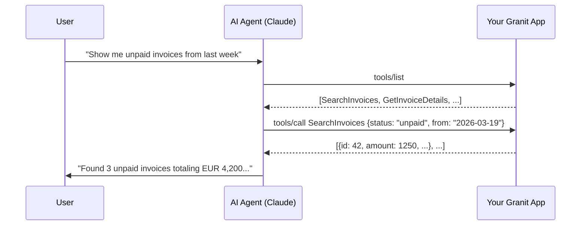
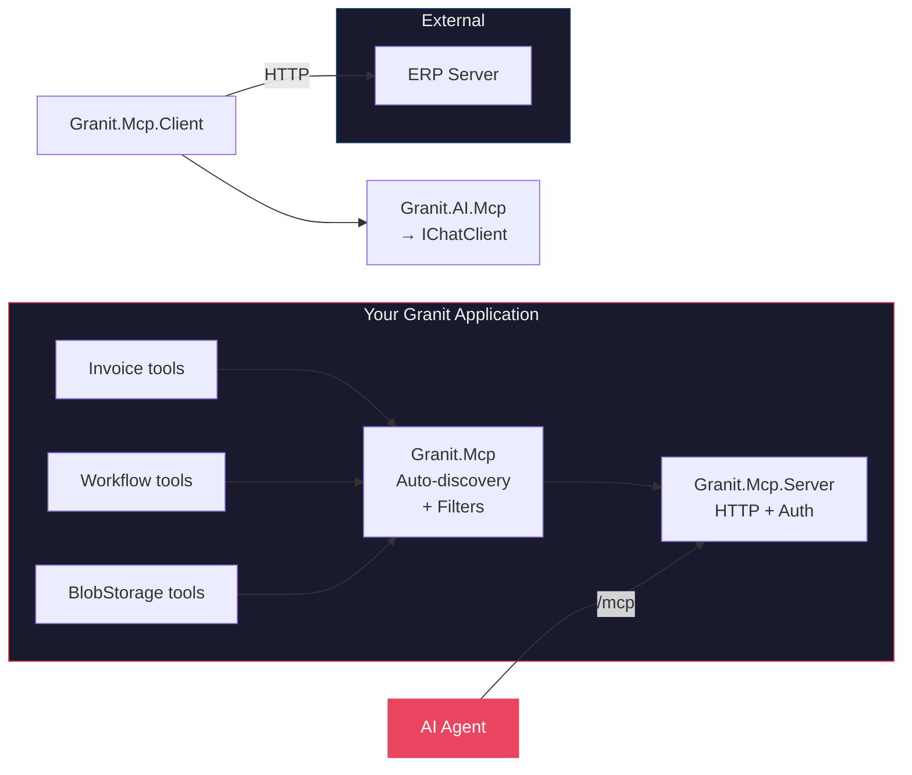

import { Tabs, TabItem } from "@astrojs/starlight/components";

Your API already exposes endpoints for humans. What if AI agents could discover and
invoke them too — with the same permissions, the same multi-tenancy isolation, and
automatic PII redaction?

That's what the **Model Context Protocol** (MCP) enables. And with the new
`Granit.Mcp` module family, any Granit module can become an MCP server in 3 steps.

## What is MCP?

MCP is an open protocol (created by Anthropic, backed by Microsoft) that lets AI
agents — Claude Desktop, GitHub Copilot, Cursor, or your own custom agents —
**discover and invoke tools** exposed by your application over HTTP.

Think of it as OpenAPI for AI agents, but bidirectional: the agent lists available
tools, picks the right one based on the user's intent, passes typed parameters, and
gets structured results back.



The agent doesn't need custom integrations, API documentation, or prompt engineering.
It reads tool descriptions, decides which ones to call, and handles the conversation.

## What Granit adds on top of the SDK

The official [MCP C# SDK](https://github.com/modelcontextprotocol/csharp-sdk) handles
the protocol. Granit adds what enterprise apps need:

| Concern | MCP SDK alone | With Granit.Mcp |
|---------|--------------|-----------------|
| **Tool discovery** | Manual registration | Auto-discovery from module assemblies |
| **Authorization** | Roll your own | `[Authorize(Policy = "...")]` with Granit RBAC |
| **PII in responses** | You handle it | `[SensitiveData]` + sanitization pipeline (GDPR) |
| **Multi-tenancy** | Not supported | `[McpTenantScope]` + `ICurrentTenant` injection |
| **Error leakage** | Stack traces exposed | `ErrorSanitizer` strips connection strings and traces |
| **Observability** | Basic | OpenTelemetry metrics + activity source |
| **Module scoping** | All tools always | `EnabledModules` config limits exposure |

Four new packages, zero new abstractions. Everything plugs into the SDK's native
filter pipeline.

## Architecture



| Package | Purpose |
|---------|---------|
| **Granit.Mcp** | Auto-discovery, sanitization pipeline, metrics |
| **Granit.Mcp.Server** | ASP.NET Core HTTP transport, `[Authorize]`, permissions |
| **Granit.Mcp.Client** | Connect to external MCP servers (HTTP + stdio) |
| **Granit.AI.Mcp** | Inject MCP tools into AI workspaces, sampling guard |

## AI-enable your module in 3 steps

### Step 1: Install and register

```bash
dotnet add package Granit.Mcp.Server
```

```csharp title="Program.cs"
builder.AddGranit(granit =>
{
    granit.AddModule<GranitMcpServerModule>();
});

app.MapGranitMcpServer();
```

That's it for infrastructure. The MCP endpoint is live at `/mcp`, protected by
`Mcp.Server.Access` permission.

### Step 2: Create a tool class

Add a class in your module with `[McpServerToolType]` and `[McpExposed]`:

```csharp title="InvoiceMcpTools.cs"
[McpServerToolType, McpExposed]
[Authorize(Policy = "Invoicing.Invoices.Read")]
public sealed class InvoiceMcpTools(IInvoiceReader reader)
{
    [McpServerTool, Description("Search invoices by status and date range.")]
    [McpToolOptions(ReadOnly = true)]
    public async Task<string> SearchInvoicesAsync(
        [Description("Invoice status: draft, sent, paid, overdue")] string status,
        [Description("Start date (ISO 8601)")] DateOnly from,
        ICurrentTenant tenant,    // DI-injected, invisible to agent
        CancellationToken ct)
    {
        var invoices = await reader.SearchAsync(status, from, ct);
        return JsonSerializer.Serialize(invoices);
    }

    [McpServerTool, Description("Permanently voids an invoice.")]
    [Authorize(Policy = "Invoicing.Invoices.Manage")]
    [McpToolOptions(Destructive = true)]
    public async Task<string> VoidInvoiceAsync(
        [Description("Invoice ID")] Guid invoiceId,
        [Description("Reason for voiding")] string reason,
        CancellationToken ct)
    {
        await reader.VoidAsync(invoiceId, reason, ct);
        return $"Invoice {invoiceId} voided.";
    }
}
```

### Step 3: There is no step 3

`GranitMcpModule` auto-discovers your tool class from the module assembly. The AI agent
sees `SearchInvoices` and `VoidInvoice` with their descriptions and parameter schemas.

The `ICurrentTenant` and `CancellationToken` parameters are **invisible** to the agent —
the SDK resolves them from DI automatically.

## Authorization: no custom attributes

You might expect a `[RequiresMcpPermission]` attribute. We built one, then deleted it.

The SDK supports standard `[Authorize]` via `.AddAuthorizationFilters()`. Granit's
`DynamicPermissionPolicyProvider` already maps policy names to RBAC permissions. So
`[Authorize(Policy = "Invoicing.Invoices.Read")]` just works — same attribute you use on
Minimal API endpoints.

- **Class-level**: all tools in the class require the permission
- **Method-level**: override per tool for fine-grained control
- **`ClaimsPrincipal`**: injectable into any tool method for runtime checks

## GDPR: PII never reaches the agent

MCP tool responses are **sanitized before they leave your app**. This happens in
the SDK's `AddCallToolFilter` pipeline — not a parallel abstraction.

```csharp title="PatientResponse.cs"
using Granit.DataProtection;

public sealed class PatientResponse
{
    public Guid Id { get; init; }
    public string DisplayName { get; init; }

    [SensitiveData(Level = Sensitivity.Confidential)]
    public string Email { get; init; }

    [SensitiveData(Level = Sensitivity.Restricted, Mode = SensitiveDataMode.Hash)]
    public string NationalId { get; init; }
}
```

One attribute, three sensitivity levels (ISO 27001 A.8.2), three protection modes:

| Level | Mode | Behavior | When to use |
|-------|------|----------|-------------|
| **`Internal`** | `Mask` | `"***"` | Names, usernames |
| **`Confidential`** | `Mask` | `"***"` | Email, phone, IP |
| **`Restricted`** | `Omit` | Remove entirely | Passwords, tokens |
| **`Restricted`** | `Hash` | Stable SHA-256 | Correlation IDs (SSN) |

The `ErrorSanitizer` also strips stack traces and connection strings from error
responses — no accidental `Server=db.prod;Password=...` leaking to an AI agent.

## Multi-tenancy: tools follow the tenant

Three visibility filters compose independently:

1. **`[McpExposed]`** — required in production (`Explicit` mode). Prevents accidental
   exposure of internal services
2. **`[McpTenantScope(RequireTenant = true)]`** — hides tools when no tenant context
   is active
3. **`EnabledModules`** — configuration-driven whitelist to reduce context window
   saturation (AI agents work better with fewer, well-described tools)

```json title="appsettings.json"
{
  "Mcp": {
    "Server": {
      "EnabledModules": ["Invoicing", "Scheduling", "BlobStorage"]
    }
  }
}
```

## Consuming external MCP servers

The flow works both ways. `Granit.Mcp.Client` provides a named factory for connecting
to MCP servers exposed by other services:

```csharp title="Program.cs"
builder.AddGranitMcpClient();
```

```json title="appsettings.json"
{
  "Mcp": {
    "Client": {
      "Connections": {
        "erp": { "Url": "https://erp.internal/mcp" },
        "local-tools": {
          "Transport": "stdio",
          "Command": "python",
          "Arguments": ["-m", "data_analyzer_mcp"]
        }
      }
    }
  }
}
```

`Granit.AI.Mcp` bridges these external tools into AI workspaces — MCP tools become
`AITool` instances in your `IChatClient` pipeline. The `SamplingGuard` prevents
external servers from abusing your LLM budget (disabled by default, rate-limited when
enabled).

## Key takeaways

- **MCP lets AI agents discover and invoke your application tools** — no custom
  integrations, no prompt engineering per endpoint
- **Granit.Mcp wraps the official SDK** with auto-discovery, RBAC authorization,
  GDPR sanitization, multi-tenancy, and observability
- **3 lines to expose your first tool**: install, register, annotate
- **Standard `[Authorize]`** — no custom auth attributes, uses your existing
  permission definitions
- **PII is protected by default** — `[SensitiveData]` is a single cross-cutting
  attribute consumed by auditing, MCP, logging, and GDPR exports
- **4 packages, 31 tests, zero circular dependencies** — ready for production

## Further reading

- [MCP overview](/dotnet/mcp/) — full architecture and design principles
- [Setup guide](/dotnet/mcp/setup/) — installation, configuration, client setup
- [Creating tools](/dotnet/mcp/tools/) — attributes, DI injection, return types
- [Security & GDPR](/dotnet/mcp/security/) — authorization, sanitization, DPoP
- [MCP C# SDK documentation](https://csharp.sdk.modelcontextprotocol.io/)
