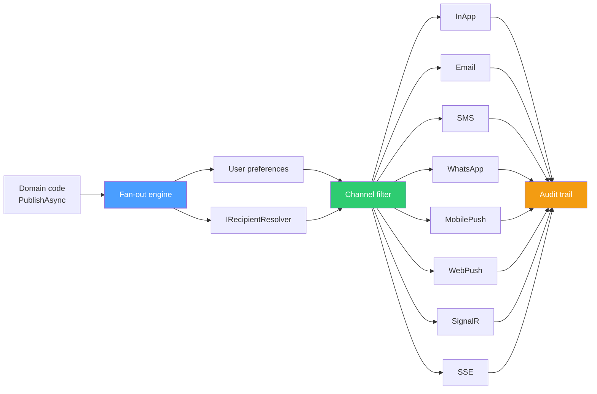

import { Tabs, TabItem } from "@astrojs/starlight/components";

A user uploads a 4 GB export. When it finishes, you want to: send them an email with the download link, ping their browser tab so the spinner disappears, push a notification to their phone if the tab is closed, and SMS them if the export failed and they configured an SLA escalation. That is **four channels, one event**. Most .NET teams end up with four `if` branches, four configuration blocks, four retry policies, four sets of templates, and zero observability across them.

`Granit.Notifications` exists to collapse this into a single `INotificationPublisher.PublishAsync()` call. The fan-out engine reads the user's preferences, resolves their contact info, dispatches to every registered channel in parallel, and records every delivery attempt in an immutable audit trail. This article walks through the architecture, the seven built-in channels, and how to add your own.

## The fan-out architecture

Domain code does not know about email, SMS, or sockets. It publishes a `NotificationDefinition` — a typed record that names the event, carries data, and declares which channels are eligible. The engine takes it from there.



Three things matter:

- **Channels are loosely coupled.** They register through `INotificationChannel`. Unregistered channels are silently skipped with a warning log — the framework degrades gracefully rather than crashing.
- **Preferences gate delivery.** The user said "no SMS for low-priority alerts"? The filter strips SMS before it reaches the channel.
- **Every attempt is recorded.** ISO 27001 auditors want proof you tried to notify; the engine writes a row per channel, per recipient, per outcome.

## The seven built-in channels

| Channel | Constant | Provider |
| --------- | ---------- | ---------- |
| In-app inbox | `NotificationChannels.InApp` | Built-in |
| Email | `NotificationChannels.Email` | SMTP, SendGrid, Brevo, AWS SES, Azure Communication Services, Scaleway |
| SMS | `NotificationChannels.Sms` | Twilio, Brevo, AWS SNS, Azure Communication Services |
| WhatsApp | `NotificationChannels.WhatsApp` | Twilio, Brevo |
| Mobile Push | `NotificationChannels.MobilePush` | Firebase Cloud Messaging, AWS SNS, Azure Notification Hubs |
| Web Push (W3C) | `NotificationChannels.Push` | VAPID-signed (RFC 8030/8291/8292) |
| SignalR | `NotificationChannels.SignalR` | Built-in hub + Redis backplane |
| Server-Sent Events | `NotificationChannels.Sse` | Native .NET 10 SSE |

Provider selection uses **Keyed Services**. You ask for `IEmailSender` keyed `"Brevo"` and the right implementation resolves at runtime — no `if (provider == "Brevo")` switches anywhere in the framework.

## Setting up production-grade notifications

```csharp title="AppModule.cs"
[DependsOn(typeof(GranitNotificationsWolverineModule))]
[DependsOn(typeof(GranitNotificationsEntityFrameworkCoreModule))]
public sealed class AppModule : GranitModule
{
    public override void ConfigureServices(ServiceConfigurationContext context)
    {
        // Persistence — replaces in-memory defaults
        context.Builder.AddGranitNotificationsEntityFrameworkCore(
            opts => opts.UseNpgsql(context.Configuration
                .GetConnectionString("Notifications")));

        // Email via Brevo (also handles SMS + WhatsApp under one API key)
        context.Services.AddGranitNotificationsBrevo();
        context.Services.AddGranitNotificationsEmail(opts => opts.Provider = "Brevo");
        context.Services.AddGranitNotificationsSms(opts => opts.Provider = "Brevo");
        context.Services.AddGranitNotificationsWhatsApp(opts => opts.Provider = "Brevo");

        // Mobile push via FCM
        context.Services.AddGranitNotificationsMobilePush();
        context.Services.AddGranitNotificationsMobilePushGoogleFcm();

        // Real-time browser delivery
        context.Services.AddGranitNotificationsSignalR(
            context.Configuration.GetConnectionString("Redis")!);

        // Inbox + preferences endpoints
        context.Services.AddGranitNotificationsEndpoints();
    }

    public override void OnApplicationInitialization(
        ApplicationInitializationContext context)
    {
        context.App.MapGranitNotifications();
        context.App.MapHub<NotificationHub>("/hubs/notifications");
    }
}
```

You added one provider package per channel. That's the entire wiring.

## Defining a notification

Each `*.Notifications` package owns one or more `NotificationDefinition` singletons. The pattern is consistent across every Granit module that emits user-facing events.

```csharp title="ExportReadyNotification.cs"
public sealed class ExportReadyNotification : NotificationDefinition
{
    public static readonly ExportReadyNotification Instance = new();

    public override string Name => "documents.export_ready";

    public override IReadOnlyList<string> SupportedChannels =>
        [NotificationChannels.InApp,
         NotificationChannels.Email,
         NotificationChannels.SignalR,
         NotificationChannels.MobilePush];

    public override NotificationPriority Priority => NotificationPriority.Normal;
}
```

The `Name` is `snake_case` and namespaced — it is how preferences and templates are looked up. The `SupportedChannels` list declares the menu; per-user preferences pick from it.

## Publishing — one call, seven possible deliveries

```csharp title="ExportCompletedHandler.cs"
public class ExportCompletedHandler(INotificationPublisher publisher)
{
    public async Task Handle(
        ExportCompletedEvent evt,
        CancellationToken ct)
    {
        await publisher.PublishAsync(new NotificationRequest
        {
            Definition = ExportReadyNotification.Instance,
            RecipientUserId = evt.UserId,
            Data = new Dictionary<string, object?>
            {
                ["FileName"] = evt.FileName,
                ["DownloadUrl"] = evt.DownloadUrl,
                ["ExpiresAt"] = evt.ExpiresAt,
            },
        }, ct).ConfigureAwait(false);
    }
}
```

That single call:

1. Looks up the user's `RecipientInfo` via your `IRecipientResolver`.
2. Filters channels by user preferences (the user disabled SMS? skipped).
3. Renders the email template (with the `FileName` / `DownloadUrl` substituted).
4. Pushes a SignalR message if the user is connected.
5. Sends an FCM push to every registered device token for that user.
6. Persists an in-app inbox entry.
7. Writes seven `NotificationDelivery` rows — one per channel — with status, timestamp, error message, and attempt number.

## Durable dispatch with Wolverine

In-process `Channel<T>` dispatch is fine for development. In production you want **at-least-once delivery survival across crashes**. `Granit.Notifications.Wolverine` wires the publisher to the Wolverine outbox: the request is committed to the same database transaction as your domain change, then Wolverine picks it up, fans out to channels, and applies exponential backoff on transient failures.

```csharp
[DependsOn(typeof(GranitNotificationsWolverineModule))]
public class AppModule : GranitModule { }
```

The handler signature does not change. Whether you run in-memory or behind an outbox is a deployment concern, not a domain concern.

## Connecting your user model

Granit does not know who your users are. Your application implements `IRecipientResolver` once:

```csharp title="AppRecipientResolver.cs"
public sealed class AppRecipientResolver(AppDbContext db) : IRecipientResolver
{
    public async Task<RecipientInfo?> ResolveAsync(
        string userId,
        CancellationToken cancellationToken = default)
    {
        var user = await db.Users
            .AsNoTracking()
            .FirstOrDefaultAsync(u => u.Id == Guid.Parse(userId), cancellationToken)
            .ConfigureAwait(false);

        if (user is null) return null;

        return new RecipientInfo
        {
            UserId = userId,
            Email = user.Email,
            PhoneNumber = user.PhoneNumberE164,
            PreferredCulture = user.Culture, // BCP 47 — drives template selection
            DisplayName = user.FullName,
        };
    }
}
```

`PreferredCulture` is the hook that makes localization automatic — Granit ships templates in 17 cultures and selects the right one per recipient.

## Adding a custom channel

The framework covers email/SMS/push/real-time. Some teams need Microsoft Teams, Slack, or a corporate paging system. The contract is one method:

```csharp title="TeamsNotificationChannel.cs"
public sealed class TeamsNotificationChannel(
    IRecipientResolver resolver,
    IHttpClientFactory httpClientFactory)
    : INotificationChannel
{
    public string Name => "Teams";

    public async Task SendAsync(
        NotificationDeliveryContext context,
        CancellationToken cancellationToken = default)
    {
        var recipient = await resolver
            .ResolveAsync(context.RecipientUserId, cancellationToken)
            .ConfigureAwait(false);
        if (recipient?.Email is null) return;

        var http = httpClientFactory.CreateClient("Teams");
        // POST to the Microsoft Graph chatMessage endpoint...
    }
}

// Register
services.AddSingleton<INotificationChannel, TeamsNotificationChannel>();
```

Add `"Teams"` to a definition's `SupportedChannels`, ship a template, done. The audit trail picks up the new channel for free.

## What you get for free

- **Templating.** HTML templates are embedded resources; per-tenant overrides live in the database. The `<title>` tag becomes the email subject — no `Subject` field to forget.
- **Localization.** 17 cultures (14 base + 3 regional). Templates ship as `.html` / `.fr.html` / `.de.html`. Recipients with `PreferredCulture = "fr-CA"` get the closest match.
- **Backoff and retry.** Wolverine outbox dispatch retries transient channel failures without re-running domain logic.
- **Preferences.** A REST endpoint exposes per-user, per-notification, per-channel toggles. The fan-out engine respects them.
- **Compliance.** Every delivery attempt is recorded. ISO 27001 audit ready out of the box. PII in audit rows is governed by the same erasure rules as the rest of your data via `Granit.Notifications.Privacy`.

## Key takeaways

- One `INotificationPublisher.PublishAsync()` call fans out to all eligible channels, filtered by user preferences.
- Channels are loosely coupled — register only what you ship, swap providers via Keyed Services.
- `IRecipientResolver` is the only interface your app must implement; the rest is conventions.
- `Granit.Notifications.Wolverine` upgrades in-process dispatch to durable outbox-backed delivery without changing handler code.
- Adding a custom channel is one class and one DI registration.

## Further reading

- [Notifications overview](/dotnet/infrastructure/notifications/)
- [Notification channels](/dotnet/infrastructure/notifications/channels/)
- [Email channel](/dotnet/infrastructure/notifications/email-channel/)
- [SMS, push and real-time channels](/dotnet/infrastructure/notifications/sms-push-realtime/)
- [Fan-out engine](/dotnet/infrastructure/notifications/fan-out-engine/)
- [Wolverine integration](/dotnet/infrastructure/notifications/wolverine-integration/)
- [SSE vs SignalR vs WebSockets](/blog/sse-vs-signalr-vs-websockets/)
