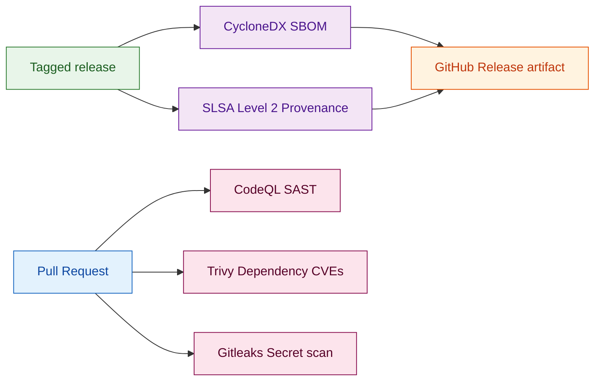
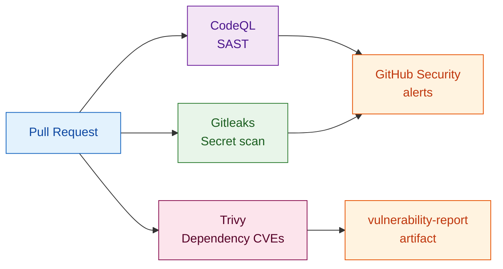

NIS 2 is not a checklist you fill in before an audit. It is a legal obligation that applies **now** — Belgium transposed the directive in April 2024, and most EU member states followed by October 2024. If your application serves a regulated sector, or if your customers do, you are in scope.

This article maps NIS 2's technical requirements to concrete Granit controls — both in the CI/CD pipeline and in the framework modules themselves.

## What NIS 2 actually requires

The directive targets two categories of organizations: **essential entities** (energy, transport, banking, health, digital infrastructure) and **important entities** (postal services, waste management, food, chemicals, digital providers). Both categories must comply with Article 21.

**Article 21 §2** defines ten risk management measures. The ones that touch your software stack directly:

| Measure | What it means for developers |
|---|---|
| §2(b) — Incident handling | Detection, logging, structured response procedures |
| §2(c) — Business continuity | Backups, multi-tenancy isolation, failover |
| §2(e) — Security in development | SAST, dependency scanning, secure SDLC |
| §2(h) — Cryptography | Encryption at rest and in transit, key management |
| §2(i) — Access control | Authentication, authorization, least-privilege |

**Article 21 §3** adds supply chain obligations: you must assess the security of your **software suppliers**. Any framework or library in your production stack is part of that supply chain.

:::note
NIS 2 does not mandate a specific standard. But ISO 27001 is widely accepted as a conformant control framework — and Granit already targets it by design.
:::

## Supply chain security — the pipeline

NIS 2 Art. 21 §3 requires that you know what is in your software and can demonstrate its integrity. Granit's CI/CD pipeline provides five layers of supply chain assurance.



### SBOM — know every dependency

Every release generates a **Software Bill of Materials** in CycloneDX JSON format using the official .NET tool:

```yaml title=".github/workflows/ci.yml"
- name: Install CycloneDX
  run: dotnet tool install --global CycloneDX

- name: Generate SBOM
  run: dotnet CycloneDX Granit.slnx -o ./sbom --json

- name: Upload SBOM artifact
  uses: actions/upload-artifact@v7
  with:
    name: sbom
    path: sbom/bom.json
    retention-days: 90

- name: Attach SBOM to release
  if: startsWith(github.ref, 'refs/tags/v')
  run: gh release upload ${{ github.ref_name }} sbom/bom.json --clobber
```

The `bom.json` artifact is retained for 90 days on every build and permanently attached to every tagged GitHub release. Your customers can download it directly from the release page and feed it into their own vulnerability scanners.

### SLSA Level 2 — build provenance

Starting with version tags, every release package is accompanied by a **cryptographic provenance attestation**:

```yaml title=".github/workflows/ci.yml"
- name: Attest build provenance
  uses: actions/attest-build-provenance@v2
  with:
    subject-path: nupkgs/*.nupkg
```

This satisfies [SLSA Level 2](https://slsa.dev/spec/v1.0/levels): an unforgeable link between the published package and the exact source commit and build environment that produced it. Consumers can verify the attestation with `gh attestation verify`.

### Vulnerability scanning — Trivy + CodeQL + Gitleaks

Three automated scanners run on every pull request and push:



- **CodeQL** — SAST analysis for injection, deserialization, path traversal and other OWASP Top 10 issues. Results appear in the repository Security › Code scanning alerts tab.
- **Trivy** — scans all NuGet dependencies against the CVE database. The `vulnerability-report` artifact gives you a full list of known CVEs in the dependency tree.
- **Gitleaks** — blocks commits containing API keys, connection strings, or other secrets before they reach the repository.

### Reproducible builds

```xml title="Directory.Build.props"
<RestorePackagesWithLockFile>true</RestorePackagesWithLockFile>
<RestoreLockedMode Condition="'$(CI)' == 'true'">true</RestoreLockedMode>
```

`packages.lock.json` pins the exact resolved version of every transitive dependency. CI runs in locked mode — any undeclared version drift fails the build. This prevents dependency confusion attacks and ensures the build you tested is the build you shipped.

### License inventory

`THIRD-PARTY-NOTICES.md` lists every third-party dependency with its SPDX license identifier and copyright notice. It is updated on every dependency change as part of the contribution process. For NIS 2 Art. 21 §3, it provides the legal component of the supply chain inventory — alongside the technical CycloneDX SBOM — confirming that no dependency introduces a license incompatible with commercial distribution or an unreviewed legal obligation.

### Least-privilege CI tokens

```yaml title=".github/workflows/ci.yml"
permissions: read-all  # OpenSSF Token-Permissions — workflow-level default
```

Individual jobs declare only the permissions they need (`contents: write` for release uploads, `id-token: write` for provenance attestation). A compromised workflow step cannot exfiltrate secrets or push to branches it has no business touching.

## Embedded technical controls

The pipeline covers supply chain. The framework modules cover the runtime obligations.

### Access control and authentication (Art. 21 §2(i))

`Granit.Authorization` provides dynamic RBAC/ABAC: permissions are stored in the database, evaluated at runtime, and can differ per tenant. There is no hardcoded role-to-permission mapping to recompile when your access model changes.

```csharp title="Program.cs"
builder.AddGranit(granit => granit
    .AddModule<GranitAuthorizationModule>()
    .AddModule<GranitAuthorizationEntityFrameworkCoreModule>());
```

For modern OAuth 2.0 flows, `Granit.Bff` and `Granit.Authentication.DPoP` implement the full FAPI 2.0 security profile:

| Mechanism | Protection | RFC |
|---|---|---|
| PKCE | Authorization code interception | RFC 7636 |
| PAR | Parameter tampering + PII leakage | RFC 9126 |
| DPoP | Token replay + theft | RFC 9449 |
| `private_key_jwt` | Client authentication without shared secrets | RFC 7523 |

Tokens never reach the browser. The BFF pattern keeps `access_token` and `refresh_token` server-side in an encrypted session cookie (`HttpOnly`, `Secure`, `SameSite=Strict`). This directly satisfies NIS 2 Art. 21 §2(i): a compromised client — including a malicious npm package injected via a supply chain attack — cannot exfiltrate authentication tokens that the browser never held.

### Audit trail (Art. 21 §2(b))

`AuditedEntityInterceptor` runs inside every `SaveChangesAsync` call. No application code is needed:

```csharp title="Any entity inheriting AuditedEntity"
// These four fields are set automatically — application code never touches them
// CreatedAt  → IClock.Now (always UTC)
// CreatedBy  → ICurrentUserService.UserId (or "system" for background jobs)
// ModifiedAt → IClock.Now
// ModifiedBy → ICurrentUserService.UserId
public sealed class Invoice : FullAuditedEntity<Guid>
{
    public decimal Amount { get; private set; }
    public string Currency { get; private set; } = default!;
}
```

The interceptor participates in the same database transaction as the business write — the audit record is atomic with the change it describes. Retention minimum: 3 years.

For business-level events ("Invoice approved by Marie"), the `Timeline` module records actor, timestamp, and a Markdown body independently of the field-level audit trail.

### Cryptography (Art. 21 §2(h))

`Granit.Encryption` provides field-level encryption at rest via `IStringEncryptionService`. In production, `Granit.Vault.HashiCorp` delegates to HashiCorp Vault Transit — the encryption key never leaves Vault:

```csharp title="PatientService.cs"
public class PatientService(IStringEncryptionService encryption)
{
    public async Task StoreNationalIdAsync(
        string nationalId, CancellationToken cancellationToken)
    {
        string encrypted = await encryption
            .EncryptAsync(nationalId, cancellationToken)
            .ConfigureAwait(false);
        // Only the encrypted value is persisted
    }
}
```

Encryption in transit is enforced unconditionally: `RequireHttpsMetadata = true` with no override in production.

`Granit.Privacy` adds **crypto-shredding** for the right to erasure: destroying a tenant's encryption key renders all their encrypted data unreadable without touching the audit trail.

### Incident detection and observability (Art. 21 §2(b))

`Granit.Observability` wires Serilog + OpenTelemetry in a single module registration:

```csharp title="Program.cs"
builder.AddGranit(granit => granit
    .AddModule<GranitObservabilityModule>());
```

Every module emits structured logs (`[LoggerMessage]` source-generated, no string interpolation), metrics via `IMeterFactory`, and distributed traces via `ActivitySource`. The Grafana LGTM stack (Loki, Grafana, Tempo, Mimir) provides the production visualization layer — correlating a user-visible error to the exact trace span and log lines that caused it.

:::tip
Structured logs with a `trace_id` field satisfy the NIS 2 incident traceability requirement. You can reconstruct the exact sequence of events for any incident from the Tempo trace alone.
:::

### Business continuity (Art. 21 §2(c))

Multi-tenancy isolation prevents data leaks between customers. Granit supports three isolation strategies:

| Strategy | Isolation | Data residency |
|---|---|---|
| `SharedDatabase` | Query filter on `TenantId` | Same database |
| `SchemaPerTenant` | PostgreSQL schema separation | Same server |
| `DatabasePerTenant` | Physical separation | Separate databases |

The `IMultiTenant` query filter is applied by `ApplyGranitConventions` in `OnModelCreating` — application code never writes `WHERE TenantId = ...` and cannot accidentally omit it.

`Granit.RateLimiting` protects availability against abusive traffic patterns. `Granit.Persistence` with named EF Core 10 query filters (`HasQueryFilter(name, expr)`) ensures filters are individually toggleable for administrative operations without disabling all isolation.

## NIS 2 compliance matrix

| Art. 21 requirement | Granit control | Layer |
|---|---|---|
| §2(b) — Incident handling | `Granit.Observability` (LGTM stack) + `Granit.Auditing` | Framework |
| §2(b) — Incident traceability | Structured logs + distributed traces (OpenTelemetry) | Framework |
| §2(c) — Business continuity | Multi-tenancy isolation + soft-delete + `Granit.Persistence` | Framework |
| §2(e) — Secure development | CodeQL + Trivy + Gitleaks + SonarCloud | Pipeline |
| §2(h) — Cryptography at rest | `Granit.Encryption` + `Granit.Vault.HashiCorp` | Framework |
| §2(h) — Cryptography in transit | HTTPS enforcement (`RequireHttpsMetadata = true`) | Framework |
| §2(h) — Secret scanning | Gitleaks | Pipeline |
| §2(i) — Authentication | PKCE + PAR + DPoP + `private_key_jwt`, FAPI 2.0 | Framework |
| §2(i) — Authorization | `Granit.Authorization` (dynamic RBAC/ABAC) | Framework |
| §2(i) — Least-privilege CI | `permissions: read-all` + per-job scopes | Pipeline |
| §3 — Supply chain — SBOM | CycloneDX JSON on every release | Pipeline |
| §3 — Supply chain — integrity | SLSA Level 2 build provenance | Pipeline |
| §3 — Supply chain — reproducibility | `packages.lock.json` locked builds | Pipeline |
| §3 — Supply chain — license inventory | `THIRD-PARTY-NOTICES.md` | Repository |

:::caution
Granit covers the **technical controls**. NIS 2 also requires organizational measures: incident response procedures, governance policies, executive accountability, and registration with your national authority (CCN in Belgium). These are not something a framework can provide.
:::

## Key takeaways

- NIS 2 Art. 21 §3 makes your framework a supply chain concern — Granit publishes a CycloneDX SBOM and SLSA Level 2 provenance on every release.
- The pipeline enforces OpenSSF Token-Permissions (least-privilege tokens), CodeQL SAST, Trivy CVE scanning, and Gitleaks secret detection on every PR.
- The framework modules cover the runtime obligations: FAPI 2.0 authentication, dynamic RBAC/ABAC, field-level encryption with Vault key management, tamper-proof audit trails, and structured observability.
- `packages.lock.json` ensures the build you tested is the build you shipped — no surprise transitive upgrades.
- The compliant path is the default path: you cannot accidentally skip the audit trail, tenant filter, or HTTPS enforcement.

## Further reading

- [Security overview](/dotnet/security/security-overview/) — choosing the right security modules
- [GDPR & ISO 27001 compliance](/dotnet/concepts/compliance/) — full compliance architecture
- [FAPI 2.0 security profile](/dotnet/security/openiddict/advanced/fapi-2-security-profile/) — banking-grade OAuth 2.0
- [Observability](/dotnet/core/observability/) — Serilog + OpenTelemetry + Grafana LGTM
- [Multi-tenancy](/dotnet/concepts/multi-tenancy/) — isolation strategies
- [CI/CD pipeline](/dotnet/operations/ci-cd/) — full GitHub Actions workflow documentation
