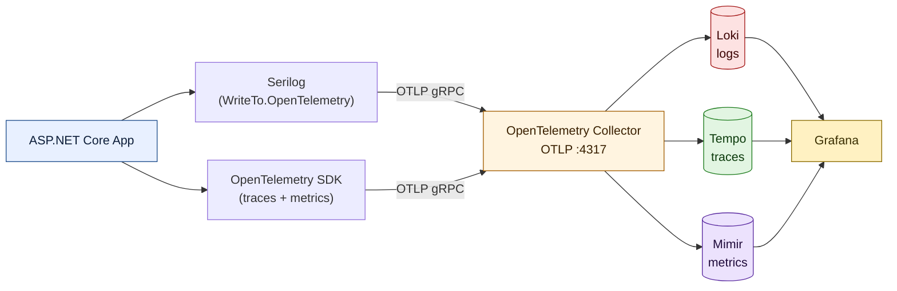

import { Aside } from '@astrojs/starlight/components';

You ship to production. A customer reports that "placing an order hangs sometimes". You open your log platform: ten thousand lines of unstructured text, no correlation ID, no user context, no trace. You switch to APM: the request disappears the moment it hits the message bus. You open your metrics dashboard: CPU is green, latency is green, nothing is obviously wrong.

This is the cost of bolt-on observability. **Three signals, three vendors, three formats, no correlation.** And if any of those vendors stores your telemetry outside the EU, you just bought yourself a GDPR problem on top of the debugging one.

This article shows how `Granit.Observability` wires **Serilog**, **OpenTelemetry** and the **Grafana LGTM stack** (Loki, Grafana, Tempo, Mimir) into a .NET 10 app with a single `AddGranitObservability()` call — OTLP-native, sovereignty-compliant, and with logs, traces and metrics correlated by the same `TraceId`.

## The three signals, and why they must share an ID

Modern observability rests on three pillars, standardized by the CNCF:

| Signal     | Question it answers                     | Stored in     |
| ---------- | --------------------------------------- | ------------- |
| **Logs**   | What happened (discrete events)?        | Loki          |
| **Traces** | Where did time go (causal chain)?       | Tempo         |
| **Metrics**| How much, how often (aggregates)?       | Mimir         |

Any one of these alone is a guessing game. Logs without traces can't tell you that the 800 ms latency came from a Wolverine handler three hops away. Traces without logs tell you *where* the slow span is but not *why*. Metrics tell you the SLO is breached but not *which* request breached it.

The missing glue is a **shared correlation ID**. In OpenTelemetry, that's the `TraceId` — a 16-byte hex string propagated through the W3C `traceparent` header. If every log line, every span and every exception carries it, you can pivot from a Grafana alert → Mimir panel → Tempo waterfall → Loki log line in four clicks.

That is exactly what the LGTM stack + `Granit.Observability` gives you.

## Why Serilog *and* OpenTelemetry?

OpenTelemetry now has a logs signal of its own. So why keep Serilog?

Two reasons:

1. **Enrichment ergonomics.** Serilog's fluent API, namespace-scoped level overrides, destructuring operators (`@`) and enrichers (`WithMachineName`, `WithTenantId`, `WithUserId`) are still ahead of `Microsoft.Extensions.Logging`.
2. **OTLP sink.** `Serilog.Sinks.OpenTelemetry` ships every Serilog event to an OTLP collector as a proper log record — same wire format as traces and metrics. You get Serilog's authoring ergonomics *and* OTel's unified transport.

<Aside type="note">
This is the trade-off formalized in [ADR-001](/dotnet/architecture/adr/001-observability/). Application Insights and Datadog were rejected on **data sovereignty** grounds (US Cloud Act), and `Microsoft.Extensions.Logging + OpenTelemetry` was rejected on enrichment flexibility.
</Aside>

## The OTLP pipeline

Every signal travels the same path: **application → OTLP gRPC → OpenTelemetry Collector → backend**.



The collector is the single chokepoint: it batches, retries, redacts, tenant-routes, and fans out. Your app only ever speaks OTLP to `localhost:4317` (or a sidecar). Swap the backend — Elasticsearch, Jaeger, self-hosted Mimir, whatever — and the app doesn't change.

## Day one — one call, done

`Granit.Observability` hides all the wiring behind a single extension:

```csharp title="Program.cs"
var builder = WebApplication.CreateBuilder(args);
builder.AddGranitObservability();

var app = builder.Build();
app.Run();
```

And a single config block:

```json title="appsettings.Production.json"
{
  "Observability": {
    "ServiceName": "orders-api",
    "ServiceVersion": "1.4.0",
    "ServiceNamespace": "acme",
    "Environment": "production",
    "OtlpEndpoint": "http://otel-collector.monitoring:4317",
    "EnableTracing": true,
    "EnableMetrics": true
  }
}
```

That single call registers:

- Serilog with a **console sink** (dev) and an **OTLP sink** (prod → Loki)
- OpenTelemetry **tracing** with ASP.NET Core, `HttpClient` and EF Core instrumentations
- OpenTelemetry **metrics** with ASP.NET Core and `HttpClient` instrumentations
- Resource attributes `service.name`, `service.version`, `service.namespace`, `deployment.environment` attached to every signal

Health check endpoints (`/health/*`) are filtered out so they don't flood Tempo with noise.

## Automatic log enrichment — the ISO 27001 angle

Every log entry emitted by a Granit app is automatically enriched with the following properties — no manual instrumentation required:

| Property          | Source                  | Why it matters                                      |
| ----------------- | ----------------------- | --------------------------------------------------- |
| `ServiceName`     | `ObservabilityOptions`  | Routing in Loki                                     |
| `ServiceVersion`  | `ObservabilityOptions`  | Correlate bugs with deployments                     |
| `Environment`     | `ObservabilityOptions`  | `production` vs `staging` dashboards                |
| `TenantId`        | `ICurrentTenant`        | Multi-tenancy isolation in queries                  |
| `UserId`          | `ICurrentUserService`   | **Mandatory for ISO 27001 A.12.4 audit trail**      |
| `TraceId`         | `Activity.Current`      | Pivot from log → trace                              |
| `SpanId`          | `Activity.Current`      | Pivot from log → exact span                         |
| `MachineName`     | Environment             | Pod name in Kubernetes                              |

<Aside type="caution" title="ISO 27001 audit trail">
`UserId` and `TenantId` enrichment is **not optional**. ISO 27001 A.12.4 requires every data-access event to be attributable to a specific user and tenant. `Granit.Observability` adds these automatically from `ICurrentUserService` and `ICurrentTenant` — remove that enrichment and you fail the audit.
</Aside>

## Distributed traces that cross async boundaries

The hardest part of distributed tracing isn't the HTTP call — it's the **async boundary**. An HTTP request publishes a Wolverine message to the outbox. A worker picks it up 400 ms later. Does the worker's work appear on the original trace?

With `Granit.Observability` + `Granit.Wolverine`, **yes** — automatically.

**Sender side** — `OutgoingContextMiddleware` captures `Activity.Current.Id` (the W3C `traceparent`) and injects it into the envelope headers alongside `TenantId` and `UserId`.

**Receiver side** — `TraceContextBehavior` reads `traceparent`, parses it with `ActivityContext.TryParse()`, and starts a `wolverine.message.handle` bridge activity with the original trace as parent.

The result in Tempo:

```mermaid
gantt
    title Single trace — HTTP → Wolverine → EF Core
    dateFormat x
    axisFormat %L ms

    section HTTP
    POST /api/orders               :http, 0, 64

    section App
    PublishAsync OrderPlacedEvent  :pub,  2, 4

    section Wolverine
    OrderPlacedHandler             :hdl,  14, 62

    section EF Core
    INSERT orders                  :ins,  18, 27
    Commit transaction             :cmt,  58, 61
```



One trace, one ID, spanning HTTP + message bus + database. That is what you need to answer "where did the 800 ms go?".

## Adding your own spans — the soft-dependency pattern

Every Granit module that does significant I/O declares a dedicated `ActivitySource` in a `Diagnostics/` folder. Here's the recipe for your own module:

```csharp title="Diagnostics/InventoryActivitySource.cs"
internal static class InventoryActivitySource
{
    internal const string Name = "Acme.Inventory";
    internal static readonly ActivitySource Source = new(Name);
    internal const string CheckStock = "inventory.check-stock";
}
```

Register it once during DI setup:

```csharp title="InventoryModule.cs"
public static IServiceCollection AddInventory(this IServiceCollection services)
{
    GranitActivitySourceRegistry.Register(InventoryActivitySource.Name);
    return services;
}
```

Then instrument the I/O:

```csharp title="InventoryService.cs"
public async Task<int> CheckStockAsync(Guid productId, CancellationToken ct)
{
    using var activity = InventoryActivitySource.Source.StartActivity(
        InventoryActivitySource.CheckStock);

    activity?.SetTag("inventory.product_id", productId.ToString());

    var stock = await _db.Stock
        .Where(s => s.ProductId == productId)
        .Select(s => s.Quantity)
        .FirstOrDefaultAsync(ct);

    activity?.SetTag("inventory.stock_level", stock);
    return stock;
}
```

Two properties make this pattern **soft-dependent** on `Granit.Observability`:

1. **Registry-based discovery.** `AddGranitObservability()` iterates `GranitActivitySourceRegistry` and calls `AddSource()` for each registered name — no module needs to reference the observability package.
2. **Null-tolerant API.** If no OTel listener is attached (e.g., a unit test or an app that doesn't install `Granit.Observability`), `StartActivity()` returns `null` and every `activity?.SetTag(...)` becomes a free no-op.

Modules stay observability-agnostic. The observability package lights them up at startup.

## PII redaction — mandatory, enforced by architecture tests

A log line saying `User john.doe@acme.com reset their password` is a GDPR Article 5 violation the moment it lands in Loki. A span tag `email=john.doe@acme.com` is worse — metric cardinality explodes and the tag value survives in Mimir for weeks.

`Granit.Diagnostics.LogRedaction` gives you redaction helpers that make the safe path the easy path:

```csharp title="PasswordResetService.cs"
using Granit.Diagnostics;

_logger.LogPasswordResetRequested(LogRedaction.Email(user.Email));
activity?.SetTag("user.email_domain", LogRedaction.EmailDomain(user.Email));
```

| Helper                 | Input                    | Output                 |
| ---------------------- | ------------------------ | ---------------------- |
| `Email(string)`        | `john.doe@acme.com`      | `joh***@acme.com`      |
| `EmailDomain(string)`  | `john.doe@acme.com`      | `acme.com`             |
| `Phone(string)`        | `+33612345678`           | `+336*****78`          |
| `Token(string)`        | `dLkj3FDmAbCdEfGh`       | `dLkj...fGh`           |
| `IpAddress(string)`    | `192.168.1.42`           | `192.168.1.***`        |
| `HashPrefix(string)`   | *(any)*                  | `a1b2c3d4`             |

Two architecture tests back this up:

- `LoggerMessagePiiConventionTests` — scans every `[LoggerMessage]` template for parameter names matching PII patterns (`email`, `phone`, `ip`, `token`…) and fails the build if the value isn't wrapped in `LogRedaction`.
- `ActivitySourcePiiConventionTests` — same check on `*ActivitySource.cs` tag constants.

The result: **you cannot merge code that leaks PII to Loki or Tempo**. It simply fails to build.

## Querying the stack

Once telemetry lands in the LGTM backends, Grafana is your single pane:

**LogQL — all errors for one user, one tenant, in the last hour:**

```text
{service_name="orders-api", environment="production"}
  | json
  | Level = "Error"
  | TenantId = "d3f9..."
  | UserId   = "a2b7..."
```

**TraceQL — all traces slower than 1 s hitting the orders module:**

```text
{ resource.service.name = "orders-api" && duration > 1s }
```

**PromQL — p95 latency of the orders endpoint, 5-minute window:**

```text
histogram_quantile(0.95,
  sum by (le, route) (
    rate(http_server_request_duration_seconds_bucket{
      service_name="orders-api", route="/api/orders"
    }[5m])
  )
)
```

In Grafana, configure a **data source correlation** between Loki and Tempo on the `TraceId` field. Clicking a log line then opens the matching trace — the full HTTP → message bus → database chain — in one click.

## Data sovereignty, for free

This stack happens to solve a compliance problem most teams discover too late:

- **All three backends run on your own infrastructure** (Kubernetes, European cloud, air-gapped datacenter — your call).
- **No telemetry leaves the EU.** No US Cloud Act exposure. No variable SaaS bill.
- **OTLP is a CNCF standard.** If you ever want to move off Grafana, you flip the collector's exporters and your app doesn't know.

Compare that to a SaaS APM where your logs, traces and every customer interaction land on US infrastructure by default. GDPR and ISO 27001 treat that as a cross-border data transfer — you need SCCs, DPIAs, and a very patient legal team.

## Takeaways

- **Three signals, one ID.** Logs, traces and metrics are only useful together — the shared `TraceId` is the glue.
- **Serilog + OpenTelemetry beats either alone.** Serilog for authoring, OTel for transport. One OTLP pipe to the Grafana LGTM stack.
- **One call sets it all up.** `builder.AddGranitObservability()` configures sinks, instrumentations, enrichers and the activity-source registry.
- **Async boundaries are the trap.** `Granit.Wolverine` propagates `traceparent` across the outbox so HTTP → message handler is a single trace.
- **PII redaction is non-negotiable.** `LogRedaction` + architecture tests make it impossible to merge a leak.
- **Self-hosted LGTM keeps you sovereign.** No Cloud Act, no vendor lock-in, no per-GB surprise bill.

## Further reading

- [Observability — Serilog & OpenTelemetry](/dotnet/core/observability/) — full module reference
- [Observability — Grafana LGTM & OpenTelemetry](/dotnet/operations/observability/) — production setup, alert rules, dashboards
- [Set Up End-to-End Tracing](/dotnet/guides/end-to-end-tracing/) — step-by-step tracing across Wolverine
- [ADR-001 — Serilog + OpenTelemetry](/dotnet/architecture/adr/001-observability/) — why this stack was chosen
- [Stop Using DateTime.Now](/blog/stop-using-datetime-now/) — another injectable building block
- [LoggerMessage over string interpolation](/blog/loggermessage-over-string-interpolation/) — the logging primitive this article leans on
