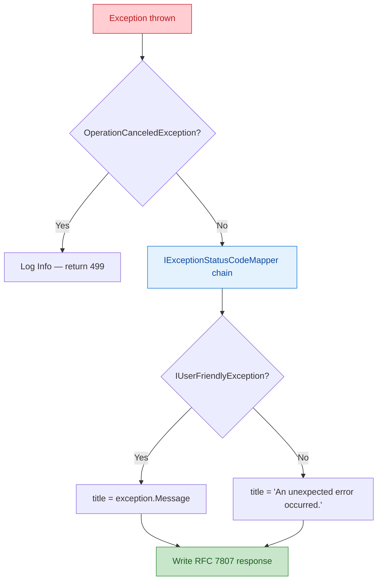

import { Tabs, TabItem, Aside } from "@astrojs/starlight/components";

Quick: what does this response mean?

```json
HTTP/1.1 400 Bad Request
Content-Type: application/json

"Product name is required"
```

Is it a validation error? A business rule violation? Should the client retry? Where is the field name for the form to highlight? What happened to the trace ID for debugging?

A bare string tells the client **nothing useful**. RFC 7807 exists to fix this — and in 2026, there is no reason to return errors any other way.

## What RFC 7807 actually says

[RFC 7807](https://www.rfc-editor.org/rfc/rfc7807) (updated by [RFC 9457](https://www.rfc-editor.org/rfc/rfc9457)) defines a standard JSON shape for HTTP error responses. The content type is `application/problem+json`, and the body contains five standard members:

```json
{
  "type": "https://tools.ietf.org/html/rfc7231#section-6.5.1",
  "title": "Product name is required.",
  "status": 400,
  "detail": "The 'name' field must be between 1 and 200 characters.",
  "instance": "/api/v1/products"
}
```

| Member     | Required | Purpose |
|------------|----------|---------|
| `type`     | Yes      | URI identifying the error type (can be a documentation link) |
| `title`    | Yes      | Short human-readable summary (same for all occurrences of this error type) |
| `status`   | Yes      | HTTP status code (redundant with the response, but useful when responses are logged standalone) |
| `detail`   | No       | Human-readable explanation specific to **this occurrence** |
| `instance` | No       | URI identifying **this specific occurrence** (request path, trace ID) |

The spec explicitly allows **extension members** — custom fields alongside the standard ones. This is key for real-world APIs.

## Why bare strings are harmful

Consider a React frontend consuming your API. With a bare string response:

```typescript
// What the frontend developer is forced to write
try {
  await api.post('/products', data);
} catch (error) {
  // Is this a validation error? A 500? A network failure?
  // Is the message safe to display to the user?
  // Which field failed?
  alert(error.response?.data ?? 'Something went wrong');
}
```

With Problem Details:

```typescript
// Structured error handling
try {
  await api.post('/products', data);
} catch (error) {
  const problem = error.response?.data;
  if (problem.status === 422 && problem.errors) {
    // Highlight specific fields
    Object.entries(problem.errors).forEach(([field, codes]) => {
      setFieldError(field, localize(codes[0]));
    });
  } else {
    showToast(problem.title, 'error');
  }
}
```

**Structured errors enable structured handling.** The frontend can differentiate validation failures from business rule violations, map error codes to localized strings, and route specific status codes to specific UI behaviors — all without parsing strings.

## The .NET 10 way: `TypedResults.Problem()`

ASP.NET Core has built-in support for Problem Details. The correct way to return an error in Minimal API is:

```csharp title="ProductEndpoints.cs"
private static async Task<Results<Ok<ProductResponse>, ProblemHttpResult>>
    GetByIdAsync(Guid id, ProductDbContext db, CancellationToken ct)
{
    var product = await db.Products.FindAsync([id], ct);

    if (product is null)
    {
        return TypedResults.Problem(
            detail: $"No product found with ID '{id}'.",
            statusCode: StatusCodes.Status404NotFound);
    }

    return TypedResults.Ok(new ProductResponse(product.Id, product.Name, product.Price));
}
```

This produces:

```json
HTTP/1.1 404 Not Found
Content-Type: application/problem+json

{
  "type": "https://tools.ietf.org/html/rfc7231#section-6.5.4",
  "title": "Not Found",
  "status": 404,
  "detail": "No product found with ID '0193a5b2-7c3d-7def-8a12-bc3456789abc'."
}
```

<Aside type="caution" title="The anti-pattern to eliminate">

Never use `TypedResults.BadRequest("message")`. It returns `application/json` with a bare string — not Problem Details. Granit's `GRAPI002` Roslyn analyzer catches this at build time and offers an automatic code fix.

```csharp
// GRAPI002 — will not compile with treat-warnings-as-errors
return TypedResults.BadRequest("Product name is required");

// Auto-fix
return TypedResults.Problem(
    detail: "Product name is required",
    statusCode: StatusCodes.Status400BadRequest);
```

</Aside>

## Granit's exception-to-Problem Details pipeline

Returning `TypedResults.Problem()` manually works for anticipated errors. But what about exceptions? Unhandled `NullReferenceException`? Third-party library failures? Domain exceptions thrown deep in the call stack?

Granit's `ExceptionHandling` module converts **every exception** into a well-formed Problem Details response through a chain of responsibility pipeline.



### Setup — one line

```csharp title="Program.cs"
app.UseGranitExceptionHandling(); // Must be the FIRST middleware
app.UseRouting();
app.UseAuthentication();
app.UseAuthorization();
```

### Built-in exception mappings

The `DefaultExceptionStatusCodeMapper` handles common exception types out of the box:

| Exception | Status | Content type |
|-----------|--------|---|
| `EntityNotFoundException` | 404 | `application/problem+json` |
| `NotFoundException` | 404 | `application/problem+json` |
| `ForbiddenException` | 403 | `application/problem+json` |
| `ValidationException` | 422 | `application/problem+json` |
| `ConflictException` | 409 | `application/problem+json` |
| `BusinessRuleViolationException` | 422 | `application/problem+json` |
| `BusinessException` | 400 | `application/problem+json` |
| `TimeoutException` | 408 | `application/problem+json` |
| `OperationCanceledException` | 499 | `application/problem+json` |
| Any other | 500 | `application/problem+json` |

Every response is `application/problem+json`. No exceptions. No bare strings. **Consistency by default.**

### The exception hierarchy

Granit provides a structured exception hierarchy designed to map cleanly to Problem Details:

```csharp title="Throwing a business error"
// BusinessException: safe to expose to clients (IUserFriendlyException)
// Includes an error code for client-side localization
throw new BusinessException(
    "Appointment:SlotUnavailable",
    "The requested time slot is no longer available.");
```

This produces:

```json
{
  "status": 400,
  "title": "The requested time slot is no longer available.",
  "errorCode": "Appointment:SlotUnavailable",
  "traceId": "abcd1234ef567890"
}
```

The three marker interfaces control what appears in the response:

| Interface | Purpose | Effect on Problem Details |
|-----------|---------|--------------------------|
| `IUserFriendlyException` | Message is safe for end users | `title` = exception message |
| `IHasErrorCode` | Machine-readable error code | `errorCode` extension member added |
| `IHasValidationErrors` | Field-level validation failures | `errors` dictionary added |

Exceptions that do **not** implement `IUserFriendlyException` get their message masked to `"An unexpected error occurred."` in production. Internal details (SQL fragments, file paths, PHI) never leak to the client.

<Aside type="tip" title="ISO 27001 compliance">

This masking is not optional politeness — it is an ISO 27001 requirement. Internal error messages may contain schema details, connection strings, or personal data. The `ExposeInternalErrorDetails` option exists for development only. Never enable it in production.

</Aside>

### Validation errors: the `errors` dictionary

FluentValidation failures get special treatment. The `errors` dictionary maps field names to arrays of **error codes** (not human-readable messages):

```json
{
  "status": 422,
  "title": "One or more validation errors occurred.",
  "errors": {
    "Name": ["Granit:Validation:NotEmptyValidator"],
    "Price": ["Granit:Validation:GreaterThanValidator"]
  }
}
```

Why codes instead of messages? Because the **frontend resolves them to localized strings** via `GET /api/{version}/localization`. A French user sees "Le nom est obligatoire.", a Dutch user sees "Naam is verplicht." — from the same error code. This is how you do i18n-friendly validation without duplicating messages between backend and frontend.

### Custom mappers: extend the chain

Other Granit modules register their own mappers to handle domain-specific exceptions:

```csharp title="InvoiceConcurrencyMapper.cs"
internal sealed class InvoiceConcurrencyMapper : IExceptionStatusCodeMapper
{
    public int? TryGetStatusCode(Exception exception) => exception switch
    {
        InvoiceLockedException => StatusCodes.Status423Locked,
        _ => null
    };
}
```

```csharp title="InvoicingModule.cs"
services.AddSingleton<IExceptionStatusCodeMapper, InvoiceConcurrencyMapper>();
```

Mappers are evaluated in registration order. Return `null` to pass to the next mapper. The `DefaultExceptionStatusCodeMapper` is always last as a catch-all.

## The Granit extension members

Standard RFC 7807 gets you `type`, `title`, `status`, `detail`, and `instance`. Granit adds two extension members that make error responses actionable:

```json
{
  "status": 422,
  "title": "Invoice amount must be positive.",
  "detail": null,
  "traceId": "abcd1234ef567890",
  "errorCode": "Invoices:InvalidAmount",
  "errors": {
    "Amount": ["Granit:Validation:GreaterThanValidator"]
  }
}
```

| Extension | Source | When present |
|-----------|--------|-------------|
| `traceId` | `Activity.Current?.TraceId` or `HttpContext.TraceIdentifier` | **Always** — enables log correlation |
| `errorCode` | `IHasErrorCode.ErrorCode` | Exception implements `IHasErrorCode` |
| `errors` | `IHasValidationErrors.ValidationErrors` | Exception implements `IHasValidationErrors` |

The `traceId` deserves emphasis: every error response carries the distributed trace ID. When a user reports "I got an error", the support team searches by trace ID and finds the exact request across all services. No guessing. No "can you reproduce it?".

## OpenAPI: document your errors

Problem Details are only useful if clients **know they are coming**. Every Granit endpoint declares its error responses explicitly:

```csharp title="ProductEndpoints.cs"
group.MapGet("/{id:guid}", GetByIdAsync)
    .WithName("GetProductById")
    .WithSummary("Returns a product by its unique identifier.")
    .WithDescription("Fetches the full product details. Returns 404 if not found.")
    .Produces<ProductResponse>()
    .ProducesProblem(StatusCodes.Status404NotFound);
```

The `.ProducesProblem()` call tells OpenAPI generators that this endpoint can return `application/problem+json` with a 404 status. Generated TypeScript clients get proper type narrowing:

```typescript
// Generated client knows about the 404 case
const result = await client.getProductById(id);
// result is ProductResponse — 404 is thrown as a typed ProblemDetailsError
```

## The full picture: five lines of defense

Here is how error handling works end-to-end in a Granit application:

| Layer | Mechanism | Example |
|-------|-----------|---------|
| **Build time** | `GRAPI002` analyzer | Flags `TypedResults.BadRequest("string")` |
| **Validation** | `FluentValidationEndpointFilter` | Auto-validates requests, returns 422 with `errors` dictionary |
| **Domain** | Typed exceptions | `throw new EntityNotFoundException(typeof(Product), id)` |
| **Pipeline** | `IExceptionStatusCodeMapper` chain | Maps exceptions to status codes |
| **Response** | `GranitExceptionHandler` | Serializes as `application/problem+json` with extensions |

No error escapes as a bare string. No status code is returned without `application/problem+json`. No internal detail leaks to the client in production.

## Key takeaways

- **RFC 7807 Problem Details** is the only acceptable format for HTTP error responses. Bare strings break structured error handling, localization, and OpenAPI contracts.
- **`TypedResults.Problem()`** is the .NET 10 primitive. Use it for anticipated errors. Let Granit's exception pipeline handle everything else.
- **`IUserFriendlyException`** controls what the client sees. Without it, the message is masked in production (ISO 27001).
- **Error codes over messages** — the frontend resolves `Granit:Validation:NotEmptyValidator` to localized strings. Ship codes, not strings.
- **`traceId` on every error** enables instant log correlation. No reproduction steps needed.

## Further reading

- [Exception Handling module reference](/dotnet/api/exception-handling/) — full pipeline documentation
- [HTTP Conventions](/dotnet/architecture/http-conventions/) — status codes, DTO naming, pagination
- [Anti-Patterns](/troubleshooting/anti-patterns/) — common mistakes including `TypedResults.BadRequest`
- [Guard Clauses](/dotnet/architecture/patterns/guard-clause/) — fail-fast with typed exceptions
- [Validation](/dotnet/core/validation/) — FluentValidation with localized error codes
