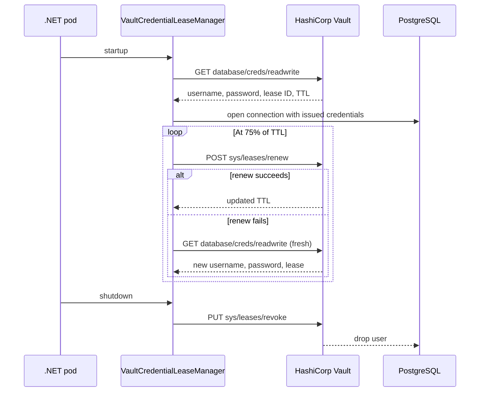

Your connection string is in `appsettings.json`. Maybe you moved it to an environment variable. Maybe you even use Azure Key Vault or AWS Secrets Manager. But the credential is still **static** — created once, shared across pods, rotated manually (if ever), and valid until someone remembers to revoke it.

That is not secrets management. That is secrets storage with extra steps.

**HashiCorp Vault** solves a fundamentally different problem: it **generates** credentials on demand, with automatic expiration, lease renewal, and zero human intervention. Combined with its Transit engine for encryption and KV v2 for per-entity key isolation, it covers the three pillars of secrets management that compliance frameworks (ISO 27001, SOC 2, GDPR) actually require.

## The three problems Vault solves

### 1. Static database credentials

Every pod in your cluster shares the same PostgreSQL username and password. If one pod is compromised, every pod is compromised. Rotating the credential means restarting all pods simultaneously. Nobody does it.

**Vault's answer: dynamic database credentials.** Each pod requests its own temporary username/password from the Vault database engine. The credentials are scoped to a role (`readwrite`), have a TTL (e.g., 1 hour), and are automatically revoked when the lease expires. Compromise one pod, and you have compromised one short-lived credential that expires before the attacker can move laterally.

### 2. Application-level encryption

You encrypt PII in the database. But your AES key lives in the application config — or worse, in source control. The encryption protects against database breaches, not application breaches.

**Vault's answer: Transit encryption.** The application sends plaintext to Vault, Vault returns ciphertext. The encryption key **never leaves Vault**. The application cannot extract it, exfiltrate it, or accidentally log it. Key rotation is a Vault-side operation — the application does not need to change.

### 3. GDPR right to erasure

A user requests data deletion under GDPR Article 17. You have their data scattered across 15 tables, 3 event streams, and 2 backup systems. Deleting everything is an audit nightmare.

**Vault's answer: crypto-shredding.** Each entity gets its own AES-256 key stored in Vault KV v2. To "delete" the data, you destroy the key. The ciphertext in your database becomes permanently unreadable — across all tables, all backups, all replicas. One API call replaces a multi-week data purge.

## How Granit integrates Vault

`Granit.Vault.HashiCorp` wraps VaultSharp into three focused abstractions, each solving one of the problems above.

### Module setup

```csharp title="AppHostModule.cs"
[DependsOn(typeof(GranitVaultHashiCorpModule))]
public sealed class AppHostModule : GranitModule { }
```

```json title="appsettings.json"
{
  "Vault": {
    "Address": "https://vault.example.com",
    "AuthMethod": "Kubernetes",
    "KubernetesRole": "my-backend",
    "DatabaseMountPoint": "database",
    "DatabaseRoleName": "readwrite",
    "TransitMountPoint": "transit",
    "KvMountPoint": "secret",
    "LeaseRenewalThreshold": 0.75
  }
}
```

The module is **disabled in Development** — no local Vault instance required. In development, Granit falls back to the local AES provider for encryption and static credentials for the database. The API surface is identical. Your code does not know the difference.

## Dynamic database credentials

`VaultCredentialLeaseManager` is a `BackgroundService` that manages the full credential lifecycle:



The service implements `IDatabaseCredentialProvider`:

```csharp title="Using dynamic credentials"
public sealed class ConnectionStringBuilder(IDatabaseCredentialProvider credentials)
{
    public string Build(string host, string database) =>
        $"Host={host};Database={database};" +
        $"Username={credentials.Username};Password={credentials.Password}";
}
```

The `LeaseRenewalThreshold` of 0.75 means a 1-hour TTL credential is renewed at the 45-minute mark. This provides a 15-minute buffer for transient Vault unavailability. If renewal fails, the manager obtains entirely fresh credentials — no manual intervention, no pod restart.

### Why this matters for compliance

- **ISO 27001 A.9.2.3**: *"Secret authentication information shall be controlled through a formal management process."* Dynamic credentials with automatic expiration satisfy this control.
- **SOC 2 CC6.1**: *"Logical access security software and configuration management."* Per-pod credentials with TTL-based revocation demonstrate least-privilege access control.
- **No shared secrets**: each pod has its own credential, its own lease, its own TTL. Compromising one credential does not affect other pods.

## Transit encryption: keys that never leave Vault

`ITransitEncryptionService` provides three operations:

```csharp title="ITransitEncryptionService.cs"
public interface ITransitEncryptionService
{
    Task<string> EncryptAsync(string keyName, string plaintext,
        CancellationToken cancellationToken = default);

    Task<string> DecryptAsync(string keyName, string ciphertext,
        CancellationToken cancellationToken = default);

    Task<string> RewrapAsync(string keyName, string ciphertext,
        CancellationToken cancellationToken = default);

    int? GetKeyVersion(string ciphertext);
}
```

### Encrypt and decrypt

```csharp title="PatientService.cs"
public sealed class PatientService(ITransitEncryptionService transit)
{
    public async Task<string> EncryptSsnAsync(string ssn,
        CancellationToken cancellationToken = default)
    {
        return await transit.EncryptAsync("patient-pii", ssn, cancellationToken)
            .ConfigureAwait(false);
        // Returns: "vault:v3:kL9mN2pQ7rS5tV8wX1yZ..."
    }

    public async Task<string> DecryptSsnAsync(string ciphertext,
        CancellationToken cancellationToken = default)
    {
        return await transit.DecryptAsync("patient-pii", ciphertext, cancellationToken)
            .ConfigureAwait(false);
    }
}
```

The ciphertext format — `vault:v{N}:...` — embeds the key version. When you rotate the Transit key, new encryptions use `v4`, but existing `v3` ciphertexts remain decryptable. You know which rows need re-encryption by inspecting the version prefix.

### Rewrap: key rotation without plaintext exposure

`RewrapAsync` re-encrypts ciphertext to the latest key version **server-side**. The plaintext never leaves Vault, never transits the network, never touches application memory:

```csharp title="ReEncryptionJob.cs"
public class ReEncryptionHandler
{
    public static async Task Handle(
        ReEncryptBatchJob job,
        ITransitEncryptionService transit,
        AppDbContext db,
        CancellationToken cancellationToken)
    {
        var patients = await db.Patients
            .Where(p => EF.Functions.Like(p.EncryptedSsn, "vault:v1:%")
                      || EF.Functions.Like(p.EncryptedSsn, "vault:v2:%"))
            .Take(job.BatchSize)
            .ToListAsync(cancellationToken)
            .ConfigureAwait(false);

        foreach (var patient in patients)
        {
            patient.EncryptedSsn = await transit
                .RewrapAsync("patient-pii", patient.EncryptedSsn, cancellationToken)
                .ConfigureAwait(false);
        }

        await db.SaveChangesAsync(cancellationToken).ConfigureAwait(false);
    }
}
```

After rotation, retired key versions can be configured in `ReEncryptionOptions.RetiredKeyVersions`. The `IStringEncryptionProvider` will **refuse to decrypt** ciphertext encrypted with a retired version — forcing re-encryption before access.

## Per-entity key isolation: crypto-shredding for GDPR

`IEntityEncryptionKeyStore` manages individual AES-256 keys in Vault KV v2:

```csharp title="UserDataService.cs"
public sealed class UserDataService(
    IEntityEncryptionKeyStore keyStore,
    ITransitEncryptionService transit)
{
    public async Task<byte[]> GetEncryptionKeyAsync(Guid userId,
        CancellationToken cancellationToken = default)
    {
        // Each user gets their own AES-256 key, stored in Vault
        return await keyStore.GetOrCreateKeyAsync("User", userId.ToString(),
            cancellationToken).ConfigureAwait(false);
    }

    public async Task EraseUserDataAsync(Guid userId,
        CancellationToken cancellationToken = default)
    {
        // Destroy the key — all encrypted data becomes permanently unreadable
        await keyStore.DeleteKeyAsync("User", userId.ToString(),
            cancellationToken).ConfigureAwait(false);
    }
}
```

The Vault KV path follows a strict convention:

```text
secret/data/granit/encryption/isolated/{entityType}/{entityId}
```

Key operations:

- **GetOrCreateKeyAsync**: Atomic create with CAS=0 (check-and-set). If two pods race, the second reads the key the first created. No duplicates.
- **DeleteKeyAsync**: Calls `DeleteMetadataAsync` — all versions destroyed, irreversible. Key material is zeroed in memory via `CryptographicOperations.ZeroMemory()`.
- **In-memory LRU cache**: Reduces Vault round-trips for hot keys. Cache entries are evicted on delete.

### Why crypto-shredding beats row deletion

| Approach | Tables | Backups | Event streams | Audit trail |
| ---------- | -------- | --------- | --------------- | ------------- |
| Row deletion | Must find and delete in all 15 tables | Must restore and re-delete in all backups | Cannot delete from immutable event streams | Breaks audit continuity |
| Crypto-shredding | Data stays, unreadable | Backups stay, unreadable | Events stay, unreadable | Audit trail intact, data inaccessible |

One `DeleteKeyAsync` call. One Vault operation. All data — past, present, and replicated — becomes cryptographic noise. The audit trail proves erasure happened without requiring data destruction proof across every storage system.

## Authentication: Kubernetes in production, token in development

`VaultClientFactory` selects the auth method based on configuration:

```csharp title="appsettings.Development.json"
{
  "Vault": {
    "Address": "http://localhost:8200",
    "AuthMethod": "Token",
    "Token": "dev-only-token"
  }
}
```

```csharp title="appsettings.Production.json"
{
  "Vault": {
    "Address": "https://vault.internal",
    "AuthMethod": "Kubernetes",
    "KubernetesRole": "my-backend"
  }
}
```

In Kubernetes, the pod's service account JWT (mounted at `/var/run/secrets/kubernetes.io/serviceaccount/token`) authenticates against Vault. No static token, no environment variable, no secret mounted from a ConfigMap. The JWT is rotated by Kubernetes, and the Vault policy is scoped to the pod's service account.

## Health check

`VaultHealthCheck` maps Vault's `/sys/health` endpoint to ASP.NET Core health check states:

| Vault status | Health state | Rationale |
| ------------- | ------------- | ----------- |
| Active | Healthy | Primary node, reads and writes |
| Standby | Degraded | Passive replica, reads work, writes forwarded |
| Sealed | Unhealthy | No operations possible |
| Unreachable | Unhealthy | Network or DNS issue |

The health check is tagged `readiness` and `startup` — Kubernetes probes will pull the pod from the load balancer if Vault becomes unreachable. No requests hit a pod that cannot decrypt data.

## Observability

Every Vault operation is traced and metered:

**Metrics** (meter: `Granit.Vault`):

| Metric | What it tells you |
| -------- | ------------------ |
| `granit.vault.operations.completed` | Successful operations by type (encrypt, decrypt, rewrap) |
| `granit.vault.operations.errors` | Failed operations by type and provider |
| `granit.vault.operation.duration` | Latency histogram per operation |
| `granit.vault.rotations.detected` | Key version changes detected during decrypt |

**Traces** (activity source: `Granit.Vault.HashiCorp`):

Activities for `vault.transit.encrypt`, `vault.transit.decrypt`, `vault.transit.rewrap`, `vault.db.obtain-credentials`, `vault.db.renew-lease`, `vault.kv.read`, `vault.kv.write`, `vault.kv.delete` — each tagged with `vault.key_name` and `vault.mount_point`.

A spike in `rotations.detected` means rows encrypted with old key versions are being accessed — schedule a re-encryption batch. A spike in `operations.errors` means Vault is degraded — check the health check dashboard.

## Provider abstraction

Granit does not lock you into HashiCorp Vault. The abstraction layer (`Granit.Vault`) defines provider-agnostic interfaces. Four implementations ship today:

| Provider | Transit (server-side rewrap) | Dynamic DB credentials | Per-entity keys |
| ---------- | ----- | ------ | ------ |
| `Granit.Vault.HashiCorp` | Yes | Yes | Yes (KV v2) |
| `Granit.Vault.Azure` | No (client-side rewrap) | No | Yes (Key Vault) |
| `Granit.Vault.Aws` | No (client-side rewrap) | No | Yes (Secrets Manager) |
| `Granit.Vault.GoogleCloud` | No (client-side rewrap) | No | Yes (Secret Manager) |

HashiCorp Vault is the only provider that supports **server-side rewrap** — the plaintext never leaves the vault during key rotation. The other providers fall back to decrypt-then-encrypt, which is still secure but requires the plaintext to transit the network twice.

## Key takeaways

- **Static credentials are a single point of compromise.** Dynamic credentials with automatic expiration limit blast radius to one pod and one TTL window.
- **Application-level encryption is only as strong as key management.** Transit encryption keeps the key in Vault — the application never sees it.
- **GDPR erasure is a crypto-shredding problem, not a data deletion problem.** Destroying one key makes all encrypted data permanently unreadable.
- **`Granit.Vault.HashiCorp`** wraps VaultSharp into three focused abstractions — dynamic credentials, transit encryption, and per-entity key isolation — with full observability and health checks.
- **Development requires zero Vault infrastructure.** The module is disabled in Development, falling back to local AES and static credentials with an identical API surface.

## Further reading

- [Vault module reference](/dotnet/data/vault/) — full option reference, provider comparison, configuration examples
- [Crypto-Shredding: GDPR Erasure Without Deleting Rows](/blog/crypto-shredding-gdpr-erasure-without-deleting-rows/) — deep dive into per-entity key isolation
- [GDPR by Design](/blog/gdpr-by-design/) — how Granit modules implement privacy controls
- [NIS2-Ready .NET Applications](/blog/nis2-ready-dotnet-applications/) — compliance patterns including encryption at rest
