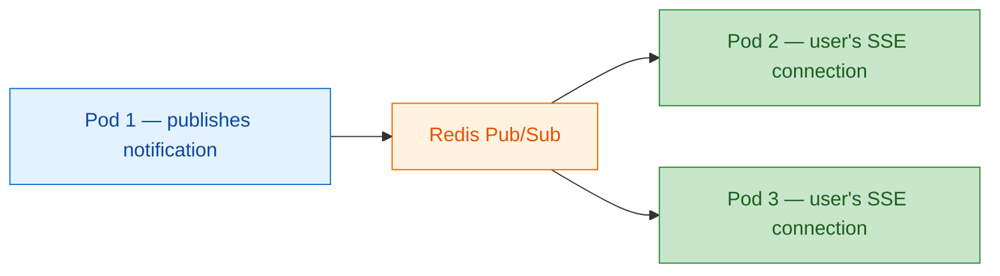

import { Tabs, TabItem, Aside } from "@astrojs/starlight/components";

WebSockets get all the hype. But most real-time features in business applications — notification bells, live dashboards, order status trackers, activity feeds — are **one-way**: the server pushes, the client listens. For this, you do not need a bidirectional binary channel. You need **Server-Sent Events**.

.NET 10 finally treats SSE as a first-class Minimal API result type. No more manual `text/event-stream` header manipulation. No more raw `Response.Body.WriteAsync()`. One method call, one `IAsyncEnumerable`, done.

## What is SSE?

Server-Sent Events is a **W3C standard** ([spec](https://html.spec.whatwg.org/multipage/server-sent-events.html)) that defines a simple protocol for server-to-client push over a single HTTP connection. The server holds the response open and sends newline-delimited events:

```text
event: notification
data: {"id":"abc","title":"Invoice approved","severity":"success"}

event: __heartbeat__
data:

event: notification
data: {"id":"def","title":"New comment on PR #42","severity":"info"}
```

That's it. Plain text. Standard HTTP. The browser's built-in `EventSource` API handles reconnection, `Last-Event-ID` tracking, and event parsing — with **zero JavaScript dependencies**.

### Why not WebSockets?

| Concern | SSE | WebSockets |
|---------|-----|------------|
| Direction | Server to client | Bidirectional |
| Protocol | Standard HTTP | `ws://` (protocol upgrade) |
| Proxy compatibility | Works everywhere | Some corporate proxies drop upgrades |
| Reconnection | Browser-native with `Last-Event-ID` | Manual implementation required |
| Client library | Browser `EventSource` (0 KB) | Browser `WebSocket` (0 KB) |
| HTTP/2 multiplexing | Yes (shares connection) | No (separate TCP socket) |
| Binary data | No | Yes |

The critical insight: **HTTP/2 multiplexing**. With HTTP/1.1, every SSE stream consumed a dedicated TCP connection (browsers limit to 6 per domain). HTTP/2 multiplexes all streams over a single TCP connection, removing this limitation entirely. In 2026, HTTP/2 is the default everywhere — the old "6 connection limit" argument against SSE is obsolete.

## .NET 10: `TypedResults.ServerSentEvents()`

Before .NET 10, SSE required manual plumbing:

```csharp title="Before .NET 10 — manual SSE"
app.MapGet("/stream", async (HttpContext ctx, CancellationToken ct) =>
{
    ctx.Response.ContentType = "text/event-stream";
    ctx.Response.Headers.CacheControl = "no-cache";
    ctx.Response.Headers.Connection = "keep-alive";

    while (!ct.IsCancellationRequested)
    {
        await ctx.Response.WriteAsync($"data: {JsonSerializer.Serialize(message)}\n\n", ct);
        await ctx.Response.Body.FlushAsync(ct);
    }
});
```

Manual content type. Manual headers. Manual flushing. Manual serialization with `\n\n` delimiters. Easy to get wrong.

.NET 10 introduces `TypedResults.ServerSentEvents()` — a first-class result type that accepts an `IAsyncEnumerable<T>` and handles all the protocol details:

```csharp title=".NET 10 — native SSE"
app.MapGet("/stream", (CancellationToken ct) =>
    TypedResults.ServerSentEvents(StreamEvents(ct)));

static async IAsyncEnumerable<MyEvent> StreamEvents(
    [EnumeratorCancellation] CancellationToken ct)
{
    while (!ct.IsCancellationRequested)
    {
        yield return new MyEvent("something happened");
        await Task.Delay(1000, ct);
    }
}
```

**What the framework handles for you:**

- Sets `Content-Type: text/event-stream` and `Cache-Control: no-cache`
- Serializes each yielded item as a `data:` frame with JSON
- Flushes after each event (no buffering)
- Respects `CancellationToken` when the client disconnects
- Integrates with OpenAPI metadata

## Building a real notification stream

Let's go from zero to a production-ready SSE notification endpoint. We'll build the same system that `Granit.Notifications.Sse` implements, piece by piece.

### Step 1: The connection manager

Each SSE client is a long-lived HTTP connection. We need to track active connections per user and route messages to all of a user's browser tabs/devices.

The core data structure: a `ConcurrentDictionary` of user IDs to their active connections, where each connection wraps a bounded `Channel<T>`:

```csharp title="SseConnectionManager.cs"
internal sealed class SseConnectionManager(
    IGuidGenerator guidGenerator,
    IOptions<SseChannelOptions> options) : ISseConnectionManager, IDisposable
{
    private readonly ConcurrentDictionary<string,
        ConcurrentDictionary<Guid, SseConnection>> _connections = new();

    public SseConnection? Connect(string userId)
    {
        ArgumentNullException.ThrowIfNull(userId);

        var userConnections = _connections
            .GetOrAdd(userId, _ => new ConcurrentDictionary<Guid, SseConnection>());

        if (userConnections.Count >= options.Value.MaxConnectionsPerUser)
        {
            return null; // Prevent resource exhaustion
        }

        var channel = Channel.CreateBounded<SseNotificationMessage>(
            new BoundedChannelOptions(options.Value.MaxBufferSize)
            {
                FullMode = BoundedChannelFullMode.DropOldest,
                SingleWriter = false,
                SingleReader = true,
            });

        SseConnection connection = new(guidGenerator.Create(), userId, channel);
        userConnections.TryAdd(connection.ConnectionId, connection);
        return connection;
    }

    public async ValueTask SendToUserAsync(
        string userId, SseNotificationMessage message, CancellationToken ct = default)
    {
        if (!_connections.TryGetValue(userId, out var userConnections))
            return; // No active connections — InApp channel persists it

        foreach (var connection in userConnections.Values)
        {
            connection.Channel.Writer.TryWrite(message); // Best-effort, non-blocking
        }

        await ValueTask.CompletedTask.ConfigureAwait(false);
    }
}
```

**Key design decisions:**

- **`BoundedChannelFullMode.DropOldest`** — when a slow client falls behind, the oldest messages are dropped. The InApp channel persists all notifications, so nothing is lost permanently.
- **`SingleReader = true`** — each connection has exactly one HTTP response reading it, enabling lock-free channel optimizations.
- **`TryWrite` (not `WriteAsync`)** — non-blocking. If the buffer is full, the oldest item drops. We never block the notification publisher waiting on a slow client.
- **Per-user connection limit** — prevents resource exhaustion from a user opening 50 browser tabs. Default: 10 connections.

### Step 2: The SSE endpoint

The endpoint authenticates the user, registers a connection, and streams events using `TypedResults.ServerSentEvents()`:

```csharp title="SseNotificationEndpoints.cs"
public static class SseNotificationEndpoints
{
    internal const string HeartbeatEventType = "__heartbeat__";

    public static RouteGroupBuilder MapGranitSseNotifications(
        this IEndpointRouteBuilder endpoints)
    {
        var group = endpoints.MapGranitGroup("/notifications")
            .RequireAuthorization();

        group.MapGet("/stream", HandleStream)
            .WithName("NotificationSseStream")
            .WithSummary("SSE stream for real-time notifications")
            .ExcludeFromDescription();

        return group;
    }

    private static IResult HandleStream(
        ISseConnectionManager connectionManager,
        IOptions<SseChannelOptions> options,
        HttpContext httpContext,
        CancellationToken ct)
    {
        string? userId = httpContext.User.FindFirst("sub")?.Value
            ?? httpContext.User.FindFirst(ClaimTypes.NameIdentifier)?.Value;

        if (userId is null)
            return TypedResults.Problem(
                detail: "User identifier claim not found.",
                statusCode: StatusCodes.Status401Unauthorized);

        SseConnection? connection = connectionManager.Connect(userId);

        if (connection is null)
            return TypedResults.Problem(
                detail: "Too many concurrent SSE connections.",
                statusCode: StatusCodes.Status429TooManyRequests);

        return TypedResults.ServerSentEvents(
            StreamNotifications(connectionManager, connection,
                options.Value.HeartbeatIntervalSeconds, ct));
    }
}
```

Two things worth noting:

1. **429 Too Many Requests** when the connection limit is reached — not a silent failure, a proper RFC 7807 Problem Details response.
2. **`ExcludeFromDescription()`** — SSE endpoints don't belong in the OpenAPI spec (clients can't call them through generated code).

### Step 3: The streaming loop with heartbeats

The `IAsyncEnumerable` loop is the heart of the SSE endpoint. It waits for channel data or emits a heartbeat to keep the connection alive:

```csharp title="StreamNotifications (IAsyncEnumerable)"
private static async IAsyncEnumerable<SseNotificationMessage> StreamNotifications(
    ISseConnectionManager connectionManager,
    SseConnection connection,
    int heartbeatSeconds,
    [EnumeratorCancellation] CancellationToken ct)
{
    try
    {
        while (!ct.IsCancellationRequested)
        {
            bool hasData = await WaitForDataOrHeartbeatAsync(
                connection, heartbeatSeconds, ct).ConfigureAwait(false);

            if (hasData)
            {
                while (connection.Reader.TryRead(out var message))
                {
                    yield return message;
                }
            }
            else
            {
                yield return new SseNotificationMessage
                {
                    NotificationTypeName = "__heartbeat__",
                };
            }
        }
    }
    finally
    {
        connectionManager.Disconnect(connection);
    }
}
```

**Why heartbeats matter:**

- Reverse proxies (Nginx, AWS ALB, Cloudflare) timeout idle connections after 60–120 seconds
- Load balancers use heartbeats to detect dead backends
- Clients use heartbeat absence to detect stale connections and reconnect

The default heartbeat interval is **30 seconds** — well within the timeout window of any proxy.

<Aside type="caution" title="Never compress SSE streams">

Response compression (Brotli, gzip) **buffers data** before sending. For SSE, this means events accumulate in the compression buffer instead of streaming to the client in real time. Granit's `ResponseCompression` module hardcodes `text/event-stream` as excluded — this is not configurable, it is a safety invariant.

</Aside>

### Step 4: The notification channel

The `SseNotificationChannel` implements `INotificationChannel` — the same interface as Email, SMS, SignalR, and every other Granit channel. This is what makes SSE a plug-and-play transport:

```csharp title="SseNotificationChannel.cs"
internal sealed class SseNotificationChannel(
    ISseConnectionManager connectionManager) : INotificationChannel
{
    public string Name => NotificationChannels.Sse;

    public async Task SendAsync(
        NotificationDeliveryContext context, CancellationToken ct = default)
    {
        SseNotificationMessage message = new()
        {
            NotificationId = context.NotificationId,
            NotificationTypeName = context.NotificationTypeName,
            Severity = context.Severity,
            Data = context.Data,
            RelatedEntityType = context.RelatedEntity?.EntityType,
            RelatedEntityId = context.RelatedEntity?.EntityId,
            OccurredAt = context.OccurredAt,
        };

        await connectionManager
            .SendToUserAsync(context.RecipientUserId, message, ct)
            .ConfigureAwait(false);
    }
}
```

Your application code never touches this class. You call `INotificationPublisher.PublishAsync()`, the fan-out engine delivers to every registered channel, and SSE clients receive the event in their open HTTP stream.

### Step 5: Wire it up

<Tabs>
<TabItem label="Backend (Program.cs)">

```csharp title="Program.cs"
var builder = WebApplication.CreateBuilder(args);
builder.AddGranit(granit => granit.AddModule<AppModule>());

builder.Services.AddGranitNotificationsSse(options =>
{
    options.HeartbeatIntervalSeconds = 30;
    options.MaxConnectionsPerUser = 10;
    options.MaxBufferSize = 100;
});

var app = builder.Build();
app.UseGranit();
app.MapGranitSseNotifications();
app.Run();
```

</TabItem>
<TabItem label="Frontend (React)">

```tsx title="App.tsx"
import { NotificationProvider } from '@granit/react-notifications';
import { createSseTransport } from '@granit/notifications-sse';

const transport = createSseTransport({
  streamUrl: '/api/v1/notifications/stream',
  tokenGetter: () => keycloak.token,
  heartbeatTypeName: '__heartbeat__', // auto-filtered
});

function App() {
  return (
    <NotificationProvider config={{ apiClient: api }} transport={transport}>
      <NotificationBell />
    </NotificationProvider>
  );
}
```

</TabItem>
<TabItem label="Frontend (vanilla JS)">

```javascript title="sse-client.js"
const source = new EventSource('/api/v1/notifications/stream', {
  withCredentials: true,
});

source.onmessage = (event) => {
  const notification = JSON.parse(event.data);
  if (notification.notificationTypeName === '__heartbeat__') return;
  showToast(notification);
};

source.onerror = () => {
  // EventSource auto-reconnects — just log it
  console.warn('SSE connection lost, reconnecting...');
};
```

</TabItem>
</Tabs>

The vanilla JavaScript example shows the zero-dependency story: **6 lines of code**, no npm packages, browser-native reconnection.

## Production checklist

### Connection limits

Without limits, a single user can exhaust server resources by opening tabs. `SseChannelOptions` provides three knobs:

| Option | Default | Purpose |
|--------|---------|---------|
| `HeartbeatIntervalSeconds` | 30 | Keep-alive for proxies and load balancers |
| `MaxConnectionsPerUser` | 10 | Prevents tab-explosion resource exhaustion |
| `MaxBufferSize` | 100 | Bounded channel per connection (drops oldest when full) |

### Scaling: single pod vs multi-pod

On a **single pod**, the `SseConnectionManager` is an in-memory singleton — all connections live in the same process. This works perfectly for monoliths and small deployments.

On **multiple pods** (Kubernetes), a user's SSE connection lands on one pod, but notifications may be published from another pod. You need a pub/sub layer to bridge them:



<Aside type="tip">
If multi-pod scaling is a day-one requirement, consider `Granit.Notifications.SignalR` with its built-in Redis backplane (`AddGranitNotificationsSignalR("redis:6379")`). Swapping transports requires changing one DI registration and one React import — see [SSE vs SignalR vs WebSockets](/blog/sse-vs-signalr-vs-websockets/).
</Aside>

### Authentication

The `EventSource` browser API does **not** support custom headers. This means you cannot send a Bearer token the usual way. Two strategies:

1. **Cookie-based auth** — the `EventSource` sends cookies automatically (`withCredentials: true`). This is the BFF (Backend-for-Frontend) pattern Granit recommends.
2. **`@microsoft/fetch-event-source`** — the library Granit's `@granit/notifications-sse` uses. It wraps `fetch()` with SSE parsing, supporting custom headers and automatic reconnection with token refresh.

### Reverse proxy configuration

Most proxies work out of the box, but verify these settings:

| Proxy | Setting | Recommended value |
|-------|---------|-------------------|
| **Nginx** | `proxy_buffering` | `off` (prevents event buffering) |
| **Nginx** | `proxy_read_timeout` | `3600s` (or higher — heartbeats keep it alive) |
| **AWS ALB** | Idle timeout | `120s` (heartbeats at 30s prevent disconnection) |
| **Cloudflare** | — | Works by default (100s timeout, heartbeats prevent it) |

## When SSE is not enough

SSE is the right tool for **unidirectional server push**. It is not the right tool when:

- The client needs to **send data in real time** (chat, collaborative editing) — use SignalR or WebSockets
- You need **binary frames** (file streaming, audio) — use WebSockets
- You need **built-in group management and Redis backplane** with zero custom code — use SignalR

For most enterprise applications, notification delivery is unidirectional. SSE handles it with fewer moving parts, fewer dependencies, and a simpler mental model than the alternatives.

## Key takeaways

- **.NET 10's `TypedResults.ServerSentEvents()`** turns SSE from manual plumbing into a one-liner. Yield events from `IAsyncEnumerable<T>`, the framework handles the rest.
- **`Channel<T>`** is the perfect backpressure primitive for per-connection buffering. Bounded channels with `DropOldest` prevent slow clients from blocking the publisher.
- **Heartbeats are mandatory** — proxies kill idle connections. 30-second intervals cover all common configurations.
- **Never compress SSE streams** — buffering breaks the real-time contract.
- **Granit's `INotificationChannel` abstraction** means SSE is a deployment choice, not an architecture decision. Your business code calls `INotificationPublisher.PublishAsync()` regardless of transport.

## Further reading

- [SSE vs SignalR vs WebSockets](/blog/sse-vs-signalr-vs-websockets/) — transport comparison and decision framework
- [Granit.Notifications module](/dotnet/infrastructure/notifications/) — full notification engine documentation
- [Notifications React SDK](/frontend/infrastructure/notifications/) — transport setup, hooks, and preferences
- [Response Compression](/dotnet/api/response-compression/) — why SSE and compression don't mix
