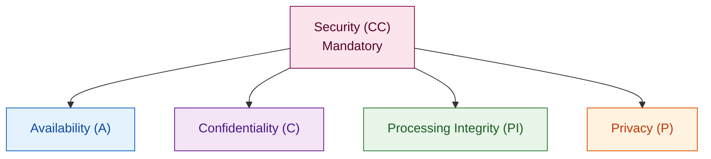

You close a deal with a large enterprise customer. Their security team sends a vendor assessment form. Question 3: "Do you have a SOC 2 Type 2 report?" If the answer is no, you go on a watch list. If it stays no for six months, the deal dies.

SOC 2 is not a regulation — but it is effectively a gate for selling to enterprise, healthcare, and financial services customers in North America and increasingly in Europe. This article maps Granit's modules to the five **Trust Service Criteria (TSC)** so you know exactly which technical controls you already have in place when you start your audit preparation. The focus is on what the framework provides out of the box — and what your team must still build around it.

## SOC 2 Type 2 in 90 seconds

The AICPA framework defines two report types:

| | Type 1 | Type 2 |
|---|---|---|
| **What it certifies** | Controls exist at a point in time | Controls operated effectively over a period (6–12 months) |
| **Audit duration** | 2–4 weeks | 6–12 months observation window |
| **Customer value** | Low ("you had the controls on day one") | High ("the controls actually work over time") |

The audit covers five Trust Service Criteria:



**Security (CC)** is mandatory. The other four are optional — but most enterprise customers require Availability and Confidentiality as a minimum.

:::note
**Processing Integrity (PI)** — ensuring that system processing is complete, valid, accurate, timely, and authorized — is not covered in this article. PI controls are highly application-specific (financial calculations, order processing, data pipelines) and cannot be addressed by a general-purpose framework. If your audit scope includes PI, you will need to instrument your own business logic with idempotency checks, reconciliation jobs, and processing logs.
:::

:::note
A SOC 2 audit certifies your **processes and controls**, not your code. The auditor reviews your policies, interviews your team, samples your logs, and tests your controls over the observation window. Granit gives you the *technical* controls. The *operational* controls around them — incident response runbooks, access review cadence, employee training — are on you.
:::

## CC6 — Logical access controls (Security TSC)

CC6 is the largest control family in SOC 2. It covers who can access what, how access is granted and revoked, and how you detect unauthorized access.

### CC6.1 — Authentication

`Granit.Authentication` supports JWT Bearer tokens with provider packages for Keycloak, Entra ID, Cognito, and Google Cloud. For high-security scenarios, `Granit.Authentication.DPoP` adds proof-of-possession tokens — access tokens are cryptographically bound to the client's private key and cannot be replayed by a third party even if intercepted:

```csharp title="Program.cs"
builder.AddGranit(granit => granit
    .AddModule<GranitAuthenticationJwtBearerKeycloakModule>()
    .AddModule<GranitAuthenticationDPoPModule>());
```

`RequireHttpsMetadata = true` is enforced unconditionally. There is no way to disable it in production — the option validator rejects the configuration at startup. (CC6.1 requires encrypted communications for authentication.)

### CC6.3 — Authorization and least-privilege

`Granit.Authorization` stores permissions in the database and evaluates them at runtime. There is no recompile cycle when your access model changes:

```csharp title="InvoiceEndpoints.cs"
group.MapDelete("/{id:guid}", DeleteAsync)
    .RequirePermission(InvoicePermissions.Invoices.Manage);
```

Permissions follow the `[Group].[Resource].[Action]` format, enforced by architecture tests. `Granit.MultiTenancy` isolates data at the query layer — permission policies can differ per tenant without duplicating application logic.

### CC6.6 — External access (FAPI 2.0)

For machine-to-machine and third-party integrations, `Granit.OpenIddict` implements the full **FAPI 2.0 security profile**:

| Mechanism | Threat it prevents | RFC |
|---|---|---|
| PKCE | Authorization code interception | RFC 7636 |
| PAR | Parameter tampering + PII leakage in URL | RFC 9126 |
| DPoP | Token replay + theft | RFC 9449 |
| `private_key_jwt` | Client impersonation without shared secrets | RFC 7523 |

### CC6.8 — Browser-side supply chain protection

CC6.8 covers protection against malicious software, including supply chain attacks that target the browser. `Granit.Bff` implements the Backend For Frontend pattern: tokens are stored server-side in an encrypted, `HttpOnly`, `SameSite=Strict` session cookie. The browser never receives an `access_token` or `refresh_token`. A successful XSS attack — including a compromised npm dependency injected via a supply chain attack — cannot exfiltrate tokens that the browser never had access to.

:::tip
This is the most underrated SOC 2 control in frontend-heavy applications. Most auditors specifically ask about token storage in SPAs. "Tokens live server-side in HttpOnly cookies managed by Granit.Bff" is a much stronger answer than "stored in localStorage with CSP headers."
:::

## CC7 — System operations and incident response

### CC7.1 — Anomaly detection

`Granit.Observability` exports three pillars via a single module registration:

```csharp title="Program.cs"
builder.AddGranit(granit => granit
    .AddModule<GranitObservabilityModule>());
```

- **Logs**: Serilog with `[LoggerMessage]` source generation. No string interpolation, no PII in log output, structured output to the Grafana Loki stack.
- **Metrics**: every module emits named metrics via `IMeterFactory` (e.g. `granit.authorization.permission.check`, `granit.persistence.query.duration`). Mimir stores and alerts on them.
- **Traces**: `ActivitySource` per module, correlated with logs via `trace_id`. Grafana Tempo provides flame graphs for any production request.

The Grafana LGTM stack ships as a Docker Compose overlay for local development. The same configuration deploys to production.

### CC7.2 — Audit trail

`AuditedEntityInterceptor` populates four fields on every database write — automatically, inside the same transaction:

```csharp title="Invoice.cs"
// Inheriting FullAuditedEntity<Guid> gives you:
// CreatedAt, CreatedBy, ModifiedAt, ModifiedBy
// DeletedAt, DeletedBy, IsDeleted (via ISoftDeletable)
public sealed class Invoice : FullAuditedAggregateRoot<Guid>
{
    public decimal Amount { get; private set; }

    public static Invoice Create(decimal amount)
    {
        // Factory method — audit fields set by interceptor, not by application code
        return new Invoice { Amount = amount };
    }
}
```

Application code cannot skip the audit trail. The interceptor runs unconditionally on every `SaveChangesAsync` call for entities that inherit from `AuditedEntity`.

For business-level events, `Granit.Webhooks` records delivery attempts with `SuspendedAt` and `SuspendedBy` fields — the auditor can trace exactly when a webhook was suspended and who triggered the state change.

:::note
SOC 2 CC7.2 requires that you detect unauthorized changes to data. The audit trail satisfies the detection requirement. Combine it with Grafana alerting on unexpected `ModifiedBy = "system"` patterns outside scheduled job windows for active anomaly detection.
:::

## CC6.7 and Confidentiality TSC — Encryption

### Encryption at rest

`Granit.Encryption` provides field-level encryption via `IStringEncryptionService`. In development, it uses AES-256-CBC with a local key. In production, `Granit.Vault.HashiCorp` delegates to HashiCorp Vault Transit:

```csharp title="PatientService.cs"
public class PatientService(IStringEncryptionService encryption)
{
    public async Task<Patient> CreateAsync(
        string name,
        string nationalId,
        CancellationToken cancellationToken)
    {
        string encryptedId = await encryption
            .EncryptAsync(nationalId, cancellationToken)
            .ConfigureAwait(false);

        return Patient.Create(name, encryptedId);
        // nationalId never persisted in plaintext
    }
}
```

The Vault module disables itself automatically in `Development` environment — no running Vault instance is needed locally. The same application code runs in both environments.

`Granit.Vault.HashiCorp` provides automatic key rotation via the Transit engine. Key rotation produces a new key version; existing ciphertext can be decrypted with old key versions until you explicitly rewrap it. The key **never leaves Vault** — this satisfies CC6.7 (encryption key management) and ISO 27001 A.8.24.

### Crypto-shredding — right to erasure without deleting rows

`Granit.Privacy` implements crypto-shredding for the GDPR right to erasure. When a tenant is offboarded:

1. The tenant's encryption key is destroyed in Vault.
2. All encrypted fields in the database become permanently unreadable.
3. The audit trail remains intact — no rows are deleted.

This resolves the compliance contradiction between GDPR (erase personal data) and SOC 2 (maintain immutable audit trails): the data is effectively erased without touching the rows that the audit trail references.

## Availability TSC — resilience

### A1.1 — Performance and capacity

`Granit.RateLimiting` protects endpoints against abusive traffic patterns with configurable sliding window, fixed window, and token bucket policies. Rate limit violations return a `429 Too Many Requests` with a `Retry-After` header — standard behavior that load testing and synthetic monitoring can validate for the auditor.

`Granit.Caching` reduces database pressure with FusionCache: a two-tier cache (in-memory L1 + distributed Redis L2) with fail-silent semantics. The cache layer is transparent to application code — queries that miss L1 and L2 fall through to the database without application changes.

### A1.2 — Multi-tenancy isolation

The three tenant isolation strategies map to different availability risk profiles:

| Strategy | Risk containment | Use case |
|---|---|---|
| `SharedDatabase` | One tenant's heavy queries can slow others | Cost-optimized SaaS |
| `SchemaPerTenant` | Schema-level separation reduces cross-tenant query contention | Mid-tier isolation |
| `DatabasePerTenant` | Full isolation — one tenant's database issue cannot affect others | Enterprise / regulated |

Named EF Core 10 query filters (`HasQueryFilter(name, expr)`) make individual filters togglable without disabling all tenant isolation — useful for administrative operations and incident investigation.

## Privacy TSC — personal data handling

`Granit.Privacy` implements the GDPR processing principles that also satisfy SOC 2 Privacy TSC criteria:

```csharp title="PatientPersonalDataProvider.cs"
public class PatientPersonalDataProvider : IPersonalDataProvider
{
    public string Category => "Medical records";

    public async Task<PersonalDataExport> ExportAsync(
        string userId, CancellationToken cancellationToken)
    {
        // Aggregated by the Privacy module for data portability requests
    }
}
```

- **Data minimization**: modules store only what they need. No central 40-column user profile table.
- **Processing restriction** (`IProcessingRestrictable`): records can be suspended from processing on data subject request. Global query filter applied by `ApplyGranitConventions`.
- **No PII in logs**: `[LoggerMessage]` source generation with explicit parameters prevents accidental PII interpolation into log strings. The Roslyn analyzer `Granit.Analyzers` flags direct string interpolation in log calls at compile time.
- **Data residency**: `DatabasePerTenant` strategy supports EU-only database placement, satisfying auditors in regulated industries.

## SOC 2 compliance matrix

| TSC criterion | Granit control | Module |
|---|---|---|
| CC6.1 — Authentication | JWT Bearer + DPoP + PKCE | `Granit.Authentication` |
| CC6.1 — Encrypted transport | `RequireHttpsMetadata = true` | `Granit.Authentication` |
| CC6.3 — Authorization | Dynamic RBAC/ABAC, runtime permissions | `Granit.Authorization` |
| CC6.3 — Tenant isolation | Query filters, 3 isolation strategies | `Granit.MultiTenancy` |
| CC6.6 — Third-party auth | FAPI 2.0 (PAR + DPoP + `private_key_jwt`) | `Granit.OpenIddict` |
| CC6.7 — Encryption at rest | Field-level AES / Vault Transit | `Granit.Encryption`, `Granit.Vault` |
| CC6.7 — Key management | HashiCorp Vault Transit, auto-rotation | `Granit.Vault.HashiCorp` |
| CC6.8 — Token protection | BFF pattern, HttpOnly cookies | `Granit.Bff` |
| CC7.1 — Anomaly detection | Structured logs + metrics + traces | `Granit.Observability` |
| CC7.2 — Audit trail | Interceptor-based, immutable, actor-attributed | `Granit.Auditing` |
| CC7.2 — Webhook audit | Delivery log + suspension tracking | `Granit.Webhooks` |
| A1.1 — Availability | Rate limiting, distributed caching | `Granit.RateLimiting`, `Granit.Caching` |
| A1.2 — Tenant isolation | Database/schema/filter strategies | `Granit.MultiTenancy`, `Granit.Persistence` |
| C1.1 — Confidentiality | Field encryption + crypto-shredding | `Granit.Encryption`, `Granit.Privacy` |
| P3.1 — Data minimization | Module-scoped storage, no shared profile table | Architecture |
| P4.1 — Personal data portability | `IPersonalDataProvider` aggregation | `Granit.Privacy` |
| P8.1 — Right to erasure | Crypto-shredding via Vault key destruction | `Granit.Privacy` |

## What Granit does not replace

SOC 2 auditors do not just review your code. They review:

- **Incident response procedures**: a documented runbook, not just Grafana dashboards
- **Access review cadence**: quarterly reviews of who has production access
- **Change management**: pull request policies, approval gates, deployment procedures
- **Employee training**: security awareness, phishing simulation records
- **Vendor management**: due diligence records for your own third-party dependencies
- **Penetration testing**: an annual external pen test with findings and remediation

Granit gives you the technical controls. The observation window requires that those controls operated effectively — which means your team followed the procedures, reviewed the alerts, and acted on the findings every day for six to twelve months.

:::caution
Starting a SOC 2 audit without the operational controls in place is expensive. The auditor will find gaps. Starting with Granit means the technical controls are already there — you can focus your preparation time on the processes and evidence collection.
:::

## Key takeaways

- SOC 2 Type 2 certifies that your controls operated effectively over 6–12 months — the observation window starts when you engage an auditor, not when you think you are ready.
- `Granit.Authorization` + `Granit.Authentication.DPoP` + `Granit.Bff` covers the CC6 access control family; `Granit.Observability` + `Granit.Auditing` covers CC7.
- `Granit.Vault.HashiCorp` satisfies CC6.7 key management — Vault Transit provides key rotation and HSM backing with the key never leaving Vault.
- `Granit.Privacy` crypto-shredding resolves the GDPR-vs-SOC2 audit trail contradiction: keys are destroyed, rows stay.
- The framework covers technical controls. Operational controls — procedures, training, access reviews — are the part that requires organizational investment.

## Further reading

- [GDPR & ISO 27001 compliance](/dotnet/concepts/compliance/) — architectural constraints for EU regulations
- [Security overview](/dotnet/security/security-overview/) — choosing the right security modules
- [Privacy module](/dotnet/compliance/privacy/) — GDPR erasure, data portability, crypto-shredding
- [Vault & Encryption](/dotnet/data/vault/) — field-level encryption, key management
- [BFF pattern](/dotnet/security/bff/) — token-safe frontend architecture
- [Production checklist](/dotnet/operations/production-checklist/) — go-live readiness gates
