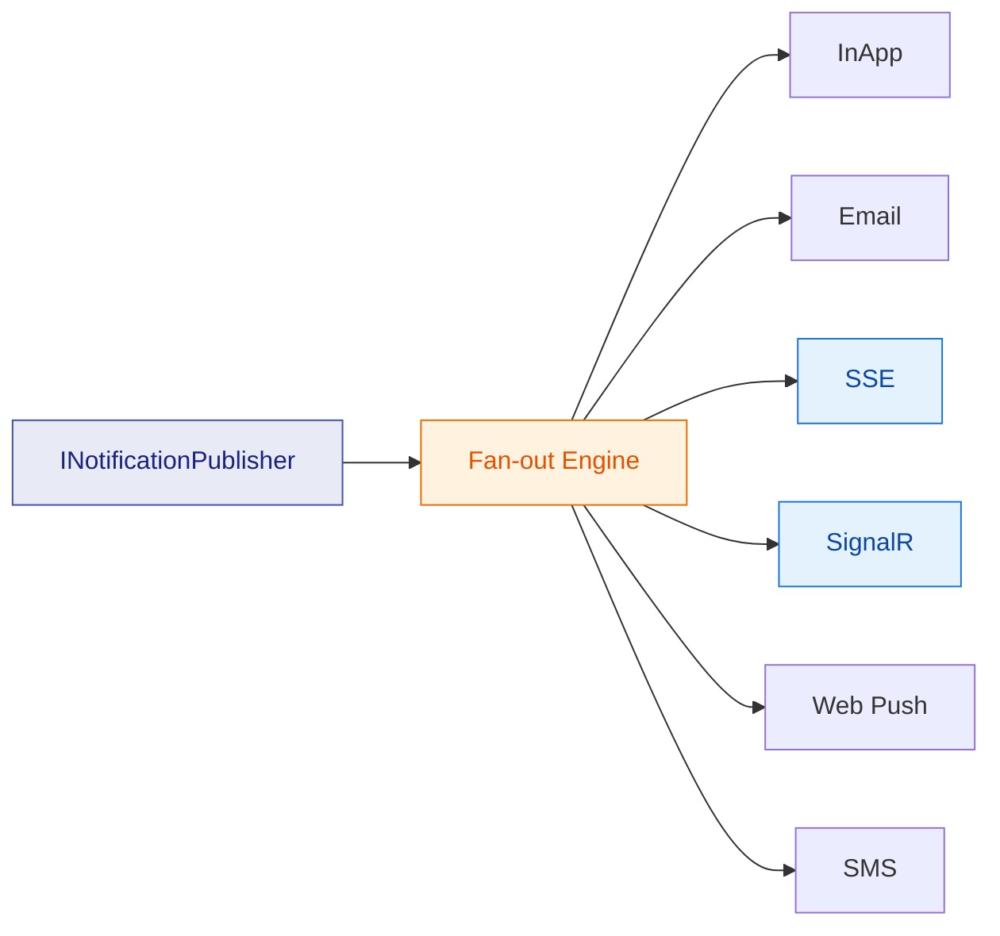
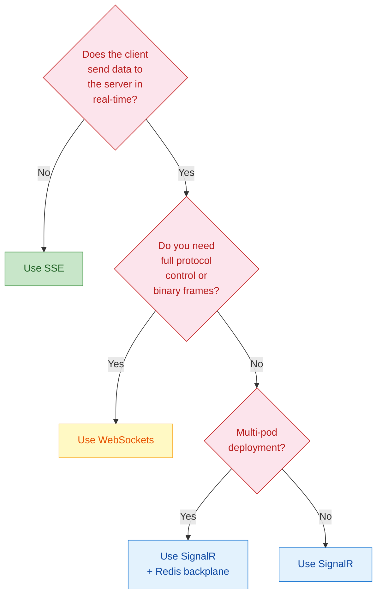

import { Tabs, TabItem, Aside } from "@astrojs/starlight/components";

Your API returns data. Your users want it **now**. Not after a polling interval. Not after a refresh. Now.

Choosing the wrong real-time transport means either over-engineering a simple notification feed or under-powering a collaborative editing experience. This article breaks down the three main options — **Server-Sent Events (SSE)**, **WebSockets**, and **SignalR** — with honest trade-offs, a decision framework, and concrete Granit setup code for each.

## The three contenders

Before comparing, let's establish what each protocol actually does at the wire level.

### Server-Sent Events (SSE)

SSE is a **one-way** channel from server to client over a plain HTTP connection. The server holds the response open and pushes `text/event-stream` frames. That's it.

```text
GET /notifications/stream HTTP/1.1
Accept: text/event-stream

HTTP/1.1 200 OK
Content-Type: text/event-stream

event: notification
data: {"id":"abc","title":"Invoice approved"}

event: __heartbeat__
data:

event: notification
data: {"id":"def","title":"New comment on PR #42"}
```

**Key characteristics:**

- **HTTP-native** — works through every proxy, CDN, and load balancer without special configuration
- **Auto-reconnect** — the browser `EventSource` API reconnects automatically with `Last-Event-ID`
- **Text-only** — no binary frames (JSON is fine, Protobuf is not)
- **Unidirectional** — server to client only; client-to-server uses regular HTTP requests
- **.NET 10 native** — `TypedResults.ServerSentEvents()` is a first-class Minimal API result type

### WebSockets

WebSockets upgrade an HTTP connection to a **full-duplex binary channel**. Both sides can send frames at any time, with minimal overhead (2-byte header vs HTTP's multi-hundred-byte headers).

```text
GET /ws HTTP/1.1
Upgrade: websocket
Connection: Upgrade

HTTP/1.1 101 Switching Protocols
Upgrade: websocket
```

**Key characteristics:**

- **Bidirectional** — true two-way communication with sub-millisecond latency
- **Binary + text** — supports both frame types natively
- **No auto-reconnect** — you implement retry logic yourself
- **Proxy-sensitive** — some corporate proxies and older load balancers drop or mishandle WebSocket upgrades
- **Connection management** — you own the lifecycle: heartbeats, authentication refresh, group routing

### SignalR

SignalR is **not a protocol** — it is an **abstraction layer** built by Microsoft on top of WebSockets, SSE, and Long Polling. It negotiates the best available transport and provides:

- **Hub pattern** — RPC-style method invocation (`hub.SendAsync("ReceiveNotification", data)`)
- **Automatic reconnection** — built-in retry with configurable backoff
- **Transport fallback** — WebSocket → SSE → Long Polling
- **Group management** — add/remove connections from named groups server-side
- **Redis backplane** — horizontal scaling across multiple pods without sticky sessions

## Head-to-head comparison

| Criterion | SSE | WebSockets | SignalR |
|---|---|---|---|
| **Direction** | Server → Client | Bidirectional | Bidirectional (Hub RPC) |
| **Protocol** | HTTP/1.1+ | ws:// / wss:// | WebSocket + SSE + LP fallback |
| **Binary support** | No (text/JSON) | Yes | Yes (MessagePack) |
| **Auto-reconnect** | Browser-native | Manual | Built-in |
| **Proxy compatibility** | Excellent | Variable | Excellent (fallback) |
| **Scaling (multi-pod)** | Sticky sessions or pub/sub | Sticky sessions or pub/sub | Redis backplane built-in |
| **Client library size** | 0 KB (browser-native) | 0 KB (browser-native) | ~45 KB (@microsoft/signalr) |
| **Server complexity** | Low | High | Medium |
| **.NET 10 support** | `TypedResults.ServerSentEvents()` | `WebSocketManager` | `MapHub<T>()` |

## When to use what

### Choose SSE when

- You need **server-to-client push only** (notifications, live feeds, dashboards)
- Your infrastructure has strict proxy or firewall rules
- You want **zero client dependencies** (browser `EventSource` API)
- You value simplicity over bidirectional communication

This covers **80% of real-time use cases** in business applications: notification bells, activity feeds, live status updates, dashboard tickers.

### Choose raw WebSockets when

- You need **low-latency bidirectional** communication (chat, collaborative editing, gaming)
- You send **binary data** (file streaming, audio/video signaling)
- You want **full control** over the wire protocol
- You are building a protocol bridge (e.g., MQTT over WebSocket)

### Choose SignalR when

- You want **bidirectional** communication **without managing WebSocket plumbing**
- You need **transport fallback** for hostile network environments
- You run **multiple pods in Kubernetes** and want built-in Redis backplane scaling
- Your team is already in the .NET ecosystem and wants the fastest path to production

## Granit's approach: transport-agnostic notifications

Granit's notification system decouples **what you send** from **how it arrives**. The `INotificationPublisher` fans out to every registered `INotificationChannel`. SSE and SignalR are just two of the available channels — and they are **mutually exclusive** (pick one per deployment).



The channel interface is intentionally minimal:

```csharp title="INotificationChannel.cs"
public interface INotificationChannel
{
    string Name { get; }
    Task SendAsync(NotificationDeliveryContext context, CancellationToken cancellationToken = default);
}
```

Both transports implement the same interface. Your application code **never references SSE or SignalR directly** — you publish through `INotificationPublisher` and the registered channels handle delivery.

### Setup: SSE

<Tabs>
<TabItem label="Program.cs">

```csharp title="Program.cs"
var builder = WebApplication.CreateBuilder(args);

builder.Services.AddGranitNotificationsSse(options =>
{
    options.HeartbeatIntervalSeconds = 30;
    options.MaxConnectionsPerUser = 10;
    options.MaxBufferSize = 100;
});

var app = builder.Build();
app.MapGranitSseNotifications(); // Maps GET /notifications/stream
app.Run();
```

</TabItem>
<TabItem label="React client">

```tsx title="App.tsx"
import { NotificationProvider } from '@granit/react-notifications';
import { createSseTransport } from '@granit/notifications-sse';

const transport = createSseTransport({
  streamUrl: '/api/v1/notifications/stream',
  tokenGetter: () => keycloak.token,
});

function App() {
  return (
    <NotificationProvider config={{ apiClient: api }} transport={transport}>
      <NotificationBell />
    </NotificationProvider>
  );
}
```

</TabItem>
</Tabs>

Under the hood, Granit uses .NET 10's native `TypedResults.ServerSentEvents()` to stream `IAsyncEnumerable<SseNotificationMessage>` with automatic heartbeats that keep connections alive through proxies.

### Setup: SignalR

<Tabs>
<TabItem label="Program.cs (single pod)">

```csharp title="Program.cs"
var builder = WebApplication.CreateBuilder(args);

builder.Services.AddGranitNotificationsSignalR();

var app = builder.Build();
app.MapHub<NotificationHub>("/hubs/notifications");
app.Run();
```

</TabItem>
<TabItem label="Program.cs (Kubernetes)">

```csharp title="Program.cs"
var builder = WebApplication.CreateBuilder(args);

// Redis backplane for multi-pod scaling
builder.Services.AddGranitNotificationsSignalR("redis:6379");

var app = builder.Build();
app.MapHub<NotificationHub>("/hubs/notifications");
app.Run();
```

</TabItem>
<TabItem label="React client">

```tsx title="App.tsx"
import { NotificationProvider } from '@granit/react-notifications';
import { createSignalRTransport } from '@granit/notifications-signalr';

const transport = createSignalRTransport({
  hubUrl: '/hubs/notifications',
  tokenGetter: () => keycloak.token,
});

function App() {
  return (
    <NotificationProvider config={{ apiClient: api }} transport={transport}>
      <NotificationBell />
    </NotificationProvider>
  );
}
```

</TabItem>
</Tabs>

<Aside type="tip">
Notice the React code is nearly identical. The `NotificationTransport` interface means you can swap SSE for SignalR (or vice versa) by changing **one import and one factory call**. No component changes needed.
</Aside>

### Publishing: identical for both transports

Regardless of which transport you register, your business code stays the same:

```csharp title="InvoiceService.cs"
public sealed class InvoiceApprovalService(INotificationPublisher notifications)
{
    public async Task ApproveAsync(Invoice invoice, CancellationToken ct)
    {
        invoice.Approve();

        await notifications.PublishAsync(
            InvoiceNotificationTypes.Approved,
            new InvoiceApprovedData(invoice.Id, invoice.Number),
            [invoice.CreatedByUserId],
            new EntityReference("Invoice", invoice.Id.ToString()),
            ct);
    }
}
```

The fan-out engine delivers this notification through **every registered channel** — InApp for persistence, SSE or SignalR for real-time push, Email if the user's preferences say so.

## Decision framework

Still unsure? Walk through these three questions:



**In practice**, most enterprise applications land on SSE for notification delivery. Bidirectional real-time (chat, collaboration) is a separate concern that typically warrants its own SignalR hub or a dedicated WebSocket endpoint — not the notification channel.

## Performance considerations

### Connection overhead

**SSE** holds one HTTP connection per client. On .NET 10, this is a kept-alive `IAsyncEnumerable` stream with near-zero per-frame overhead. The `SseConnectionManager` tracks connections per user and enforces a configurable `MaxConnectionsPerUser` limit (default: 10) to prevent resource exhaustion from excessive browser tabs.

**SignalR** negotiates WebSocket first, then falls back. WebSocket connections are long-lived TCP sockets with a 2-byte frame header. More efficient per message, but the negotiation handshake adds latency on first connection.

### Scaling

| Strategy | SSE | SignalR |
|---|---|---|
| **Single pod** | Works out of the box | Works out of the box |
| **Multi-pod (sticky)** | Sticky sessions via cookie/IP | Sticky sessions via cookie |
| **Multi-pod (stateless)** | External pub/sub (manual) | `AddStackExchangeRedis()` (one line) |

SignalR's built-in Redis backplane is its strongest scaling advantage. For SSE in a multi-pod environment, you would need to build a pub/sub layer yourself or use sticky sessions.

### Response compression

<Aside type="caution">
Do **not** enable response compression on SSE endpoints. Compressing a streaming response buffers events and breaks the real-time contract. WebSocket frames bypass HTTP response compression entirely (the protocol switches after the initial handshake), so no special handling is needed.
</Aside>

## The verdict

There is no universally "best" transport. But there is a **best transport for your use case**:

- **Notification feeds, dashboards, live status** → SSE. It is simpler, HTTP-native, and covers unidirectional push with zero client dependencies.
- **Chat, collaboration, bidirectional RPC** → SignalR. You get transport fallback, group management, and Redis scaling without building plumbing.
- **Custom protocols, binary streaming, maximum control** → Raw WebSockets. Accept the complexity tax only when the other options genuinely cannot do the job.

Granit lets you defer this decision. Register `AddGranitNotificationsSse()` today, swap to `AddGranitNotificationsSignalR("redis:6379")` tomorrow. Your business code, your React components, and your notification types stay untouched.

## Key takeaways

- **SSE** is the simplest real-time transport — one HTTP connection, server-to-client, browser-native reconnection. Choose it for notifications and feeds.
- **WebSockets** give maximum control and bidirectional binary communication. Choose them when you need full protocol ownership.
- **SignalR** abstracts WebSocket/SSE/Long Polling behind a Hub pattern with built-in Redis scaling. Choose it for bidirectional scenarios where convenience beats control.
- **Granit's `INotificationChannel` abstraction** means the transport is a deployment decision, not an architecture decision. Swap transports without touching business logic.
- **Don't default to the most powerful option.** SSE handles 80% of enterprise real-time needs with 20% of the complexity.

## Further reading

- [Granit.Notifications module reference](/dotnet/infrastructure/notifications/) — full notification engine documentation
- [Notifications React SDK](/frontend/infrastructure/notifications/) — transport setup, hooks, and Web Push
- [Response Compression](/dotnet/api/response-compression/) — why SSE and compression don't mix
- [Strategy Pattern in Granit](/dotnet/architecture/patterns/strategy/) — the pattern behind pluggable transports
