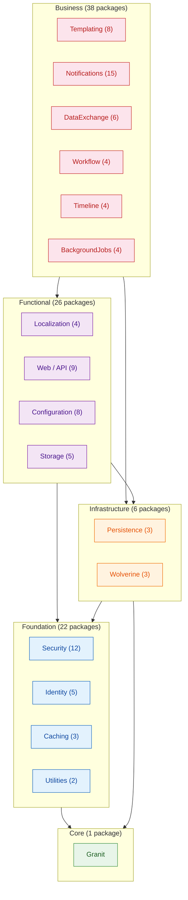

A framework with 100+ NuGet packages sounds like a dependency management nightmare. At that scale, one careless `ProjectReference` can create a cycle that makes incremental builds impossible, forces unnecessary recompilation, and turns your dependency graph into a tangled mess that no one dares to refactor.

Granit has shipped every release with zero circular dependencies. Not because we got lucky, but because the architecture makes cycles structurally impossible at three reinforcing levels: the module system rejects them at startup, architecture tests reject them at build time, and the layered design makes them unlikely in the first place.

This article explains how.

## The module system

Every Granit package that registers services exposes a **module class** — a sealed subclass of `GranitModule`. The module declares its dependencies explicitly via the `[DependsOn]` attribute:

```csharp title="GranitNotificationsModule.cs"
[DependsOn(
    typeof(GranitGuidsModule),
    typeof(GranitQueryEngineAbstractionsModule),
    typeof(GranitTimingModule))]
public sealed class GranitNotificationsModule : GranitModule
{
    public override void ConfigureServices(ServiceConfigurationContext context) =>
        context.Builder.AddGranitNotifications();
}
```

`[DependsOn]` is not documentation. It is a **load-order contract**. At startup, `ModuleLoader` walks the full dependency tree starting from the application's root module, instantiates every reachable module, and performs a **topological sort using Kahn's algorithm**. If the sort cannot complete — meaning the number of sorted modules is less than the total — a cycle exists. The application throws `InvalidOperationException` with the names of the modules involved:

```csharp title="ModuleLoader.cs (simplified)"
if (sorted.Count != descriptors.Count)
{
    IEnumerable<string> cycleTypes = descriptors.Keys
        .Except(sorted.Select(d => d.ModuleType))
        .Select(t => t.Name);
    throw new InvalidOperationException(
        $"Circular dependency detected among modules: {string.Join(", ", cycleTypes)}.");
}
```

The application does not start. There is no fallback, no warning, no "best-effort" ordering. A cycle is a hard failure, caught before a single service is registered. This is intentional: cycles that slip past development have a way of becoming permanent.

The topological order serves a second purpose. `GranitApplication` iterates over the sorted modules in sequence when calling `ConfigureServices` and `OnApplicationInitialization`. A module can rely on the fact that everything it declared in `[DependsOn]` has already been configured. This eliminates an entire class of "service not registered yet" bugs that plague frameworks with unordered service registration.

## The dependency convention

`[DependsOn]` follows a strict convention: **declare direct, non-transitive dependencies only**.

If `GranitNotificationsEntityFrameworkCoreModule` depends on `GranitPersistenceModule`, and `GranitPersistenceModule` already depends on `GranitTimingModule`, then `GranitNotificationsEntityFrameworkCoreModule` does not declare `GranitTimingModule`. The transitive dependency is already satisfied.

This matters for maintainability. When a dependency changes — say `GranitPersistenceModule` drops its dependency on `GranitTimingModule` — the build breaks only in modules that actually use Timing directly but relied on the transitive path. The break is immediate, localized, and fixable by adding the missing `[DependsOn]`. Compare this to the alternative, where every module redundantly declares the full transitive closure: changes to deep dependencies require updating dozens of unrelated modules.

One exception: `Granit` is the implicit root. Every module depends on it. No `[DependsOn(typeof(GranitCoreModule))]` is needed or expected.

## The DAG

Ninety-three packages organized into a strict **directed acyclic graph** with five layers. Each layer may depend on the layers below it, never on the layers above.



The **maximum depth** of the graph is five levels. No package sits more than five edges away from `Granit`. This is not a soft guideline — it is a consequence of the layering rules. A Business-layer package cannot reference another Business-layer package outside its own family (e.g., `Granit.Notifications` cannot reference `Granit.Workflow` directly). Cross-cutting concerns live in lower layers, available to everyone above.

Within each family, packages follow a predictable internal structure. Take Notifications (15 packages) as an example:

- **`Granit.Notifications`** — domain types, interfaces, fan-out logic
- **`Granit.Notifications.EntityFrameworkCore`** — persistence (isolated DbContext)
- **`Granit.Notifications.Endpoints`** — Minimal API routes
- **`Granit.Notifications.Email`** — email channel abstraction
- **`Granit.Notifications.Email.Smtp`** — SMTP transport
- **`Granit.Notifications.Brevo`** — Brevo (Sendinblue) transport
- **`Granit.Notifications.Sms`**, **`.WhatsApp`**, **`.Push`**, **`.SignalR`** — additional channels

The rule is: **one project = one NuGet package, namespace = project name**. An application that only needs email notifications installs `Granit.Notifications.Email.Smtp` — not all 15 packages. The DAG ensures that pulling in SMTP brings exactly `Notifications`, `Notifications.Email`, and their lower-layer dependencies. Nothing more.

## Build-time enforcement

The startup DAG validation catches cycles at runtime. But runtime is too late for a CI pipeline. Granit runs **architecture tests** in every build that enforce the same invariants statically.

### No circular project references

`ProjectDependencyTests` parses every `.csproj` in the `src/` directory, builds an adjacency graph from `<ProjectReference>` elements, and runs a DFS-based cycle detector. If project A references project B and project B references project A (directly or transitively), the test fails:

```csharp title="ProjectDependencyTests.cs"
[Fact]
public void No_circular_project_references()
{
    // Builds adjacency list from .csproj ProjectReference elements
    // DFS with coloring: white=unvisited, gray=in-stack, black=done
    // Any gray→gray edge is a cycle → test fails
}
```

This test operates at the MSBuild level — it catches cycles that `[DependsOn]` would not, because not every project exposes a module class. Pure library packages (analyzers, source generators, abstractions) have no `GranitModule` but still participate in the dependency graph.

### Layer boundary enforcement

`LayerDependencyTests` uses ArchUnitNET to enforce that types in lower layers do not reference types in higher layers:

- **Core types** must not depend on `EntityFrameworkCore` namespaces
- **Endpoint types** must not depend on `EntityFrameworkCore` namespaces
- **Endpoint types** must not inherit from domain entities
- **`IQueryable`** must not escape the persistence layer (with explicit exceptions for DataExchange, which needs it by design)

These tests encode the layering rules from the diagram above as executable specifications. A developer cannot accidentally add a `using Granit.Persistence` in a package that belongs to the Foundation layer — the build fails.

### Module naming conventions

`ModuleConventionTests` enforces that all `GranitModule` subclasses are **sealed** and follow the `Granit*Module` naming pattern. Sealing prevents inheritance hierarchies among modules, which would create implicit dependencies invisible to `[DependsOn]`.

## Soft dependencies

Not every cross-cutting concern justifies a hard `[DependsOn]`. Multi-tenancy is the canonical example.

Many Granit modules are **tenant-aware** — they filter queries by `TenantId`, scope caches by tenant, or tag audit entries with tenant context. But multi-tenancy is optional. A single-tenant application should not be forced to install `Granit.MultiTenancy`.

Granit solves this with the **soft dependency** pattern. The abstraction — `ICurrentTenant` — lives in `Granit.MultiTenancy`, available to every package without an additional reference:

```csharp title="ICurrentTenant.cs (in Granit)"
public interface ICurrentTenant
{
    bool IsAvailable { get; }
    Guid? Id { get; }
    string? Name { get; }
    IDisposable Change(Guid? id, string? name = null);
}
```

At startup, `AddGranit<T>()` registers a **null object implementation** via `TryAddSingleton`:

```csharp title="GranitHostBuilderExtensions.cs"
builder.Services.TryAddSingleton<ICurrentTenant>(NullTenantContext.Instance);
```

`NullTenantContext.IsAvailable` always returns `false`. `Change()` is a no-op. Any module can inject `ICurrentTenant` and check `IsAvailable` before using `Id`. If the application includes `Granit.MultiTenancy`, its module replaces the null object with the real `AsyncLocal`-based implementation. If not, everything continues to work — just without tenant isolation.

This pattern keeps the dependency graph clean. Persistence, Caching, BlobStorage, and Notifications all read `ICurrentTenant` without declaring `[DependsOn(typeof(GranitMultiTenancyModule))]`. The same principle applies to `IDataFilter` (in `Granit.DataFiltering`), which controls global query filters for soft-delete, active status, and publication state.

The rule: a hard `[DependsOn]` is required only when the module **must enforce** the dependency's presence — for example, `Granit.BlobStorage` requires a tenant context for GDPR-compliant file isolation and throws if none is available.

## Bundles

Ninety-three packages provide granularity. But most applications do not need to pick packages one by one. Granit ships **bundles** — meta-packages with zero code that aggregate common sets:

| Bundle | Contents |
|---|---|
| `Granit.Bundle.Essentials` | Core, Timing, Guids, Security, Validation, Persistence, Observability, ExceptionHandling, Diagnostics |
| `Granit.Bundle.Api` | Essentials + ApiVersioning, ApiDocumentation, Cors, Idempotency, Localization, Caching |
| `Granit.Bundle.Documents` | Templating, DocumentGeneration (PDF + Excel) |
| `Granit.Bundle.Notifications` | Notifications, Notifications.EF, Notifications.Endpoints, Email, Email.Smtp, SignalR |
| `Granit.Bundle.SaaS` | MultiTenancy, Features, RateLimiting, Bulkhead |

A bundle `.csproj` contains only `<ProjectReference>` elements — no source files, no module class. It is a curated dependency set that the application can install with a single package reference. The DAG remains the same; the bundle is just a convenient entry point.

Critically, bundles compose. `Granit.Bundle.Api` references `Granit.Bundle.Essentials`. An application that installs `Bundle.Api` gets everything from `Essentials` transitively. The topological sort deduplicates — every module is loaded exactly once regardless of how many paths lead to it.

## Why this matters

The zero-cycle guarantee is not an academic exercise. It has practical consequences that compound over time.

**Incremental builds are fast.** When a developer changes `Granit.Notifications.Email.Smtp`, only that project and its dependents rebuild. There are no hidden reverse edges that pull in unrelated packages. On a 100+-package solution, this is the difference between a 4-second incremental build and a 40-second full rebuild.

**Teams can work in parallel.** Two teams working on Notifications and DataExchange cannot create a cycle between their packages. The layering rules make it structurally impossible. If both teams need shared functionality, it belongs in a lower layer — which forces the right architectural conversation.

**Extraction is mechanical.** Because no package at the Business layer can reference a sibling family, extracting `Granit.Notifications` into a separate repository means copying the 15 Notifications packages and their declared dependencies. The dependency graph tells you exactly what comes along. No hidden coupling, no surprises at link time.

**Build-time safety catches mistakes early.** Architecture tests run in CI on every push. A junior developer adding a convenient `ProjectReference` that breaks the layering gets immediate feedback — not a design review two weeks later. The rules are encoded as tests, not as wiki pages that no one reads.

The combination of runtime DAG validation, build-time architecture tests, and a layered design that makes cycles unlikely creates a system where the dependency graph is both a design artifact and an enforced invariant. At 100+ packages, that enforcement is not optional — it is the only thing standing between a modular framework and an accidental monolith.

## Further reading

- [Dependency Graph](/dotnet/architecture/dependency-graph/) — interactive visualization of the full package graph
- [Module System pattern](/dotnet/architecture/patterns/module-system/) — detailed pattern description with implementation guidance
- [Layered Architecture pattern](/dotnet/architecture/patterns/layered-architecture/) — the four-layer model and its rules
