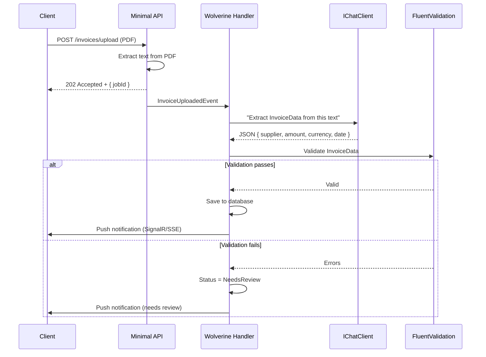

import { Tabs, TabItem } from "@astrojs/starlight/components";

Every B2B application eventually needs to parse documents: invoices from suppliers, CVs from
candidates, contracts from partners, identity documents for compliance. Traditional parsers
(regex, iText, rule-based) are fragile — they break on every layout variation.

`Granit.AI.Extraction` takes a different approach: send the document text to an LLM using
`ChatResponseFormat.ForJsonSchema<T>()` (MEAI native structured output), and get back a
strongly-typed C# object. The schema is derived automatically from the C# type — no manual
prompt engineering. The LLM handles layout variations, multilingual content, and messy
formatting — you get clean data.

## The problem

| Approach | Handles layout variations | Multilingual | Maintenance |
|----------|:---:|:---:|-------------|
| Regex/rule-based | No | No | One parser per format, constant updates |
| Template-based OCR | Partially | No | One template per provider/layout |
| **LLM extraction** | Yes | Yes | Zero maintenance — the model adapts |

The trade-off: LLM extraction is slower (5-15s) and costs tokens. That's why it's
designed to run **asynchronously** via Wolverine handlers, not in HTTP request paths.

## How it works



Key point: the HTTP endpoint returns **202 Accepted immediately**. The extraction
happens in background via Wolverine with automatic retry if the LLM is temporarily down.

## Setup

```csharp
builder.AddGranitAI();
builder.AddGranitAIOllama();       // or Azure OpenAI for production
builder.AddGranitAIExtraction();

// Register extractors for your domain types
builder.Services.AddDocumentExtractor<InvoiceData>();
builder.Services.AddDocumentExtractor<CandidateProfile>();
```

## Defining a result type

The result type is a plain C# record. The LLM infers the mapping from property names:

```csharp
public sealed record InvoiceData
{
    public string? Supplier { get; init; }
    public string? InvoiceNumber { get; init; }
    public decimal Amount { get; init; }
    public decimal? VatAmount { get; init; }
    public string? Currency { get; init; }
    public DateOnly? InvoiceDate { get; init; }
    public DateOnly? DueDate { get; init; }
}
```

:::tip
Use descriptive property names — the LLM uses them to understand what to extract.
`InvoiceDate` is much better than `Date1`. `VatAmount` is better than `Tax`.
:::

## Using the extractor

### In a Wolverine handler (recommended)

```csharp
public class InvoiceUploadedHandler(
    IDocumentExtractor<InvoiceData> extractor,
    InvoiceDbContext dbContext)
{
    public async Task HandleAsync(
        InvoiceUploaded message,
        CancellationToken cancellationToken)
    {
        ExtractionResult<InvoiceData> result = await extractor
            .ExtractAsync(message.DocumentText, cancellationToken)
            .ConfigureAwait(false);

        switch (result.Status)
        {
            case ExtractionStatus.Succeeded:
                // result.Data is fully typed — save it
                dbContext.Invoices.Add(Invoice.FromExtraction(result.Data!));
                await dbContext.SaveChangesAsync(cancellationToken)
                    .ConfigureAwait(false);
                break;

            case ExtractionStatus.NeedsReview:
                // Low confidence — save as draft, notify user
                dbContext.InvoiceDrafts.Add(InvoiceDraft.FromExtraction(
                    result.Data!, result.ConfidenceScore, result.Warnings));
                await dbContext.SaveChangesAsync(cancellationToken)
                    .ConfigureAwait(false);
                break;

            case ExtractionStatus.Failed:
                // Could not extract — log and notify
                // result.ErrorMessage has details
                break;
        }
    }
}
```

### The ExtractionResult

| Property | Type | Description |
|----------|------|-------------|
| `Status` | `ExtractionStatus` | `Succeeded`, `NeedsReview`, or `Failed` |
| `Data` | `TResult?` | The extracted object (null when Failed) |
| `ConfidenceScore` | `double?` | 0.0 to 1.0, based on LLM response metadata |
| `ErrorMessage` | `string?` | Error details when Failed |
| `Warnings` | `IReadOnlyList<string>` | Non-blocking issues (e.g., "Currency not found, defaulted to EUR") |

The `ReviewThreshold` option (default 0.7) controls the boundary between `Succeeded`
and `NeedsReview`. Below 0.7 confidence, the extraction is flagged for human review
even if the data looks valid.

## Advantages and risks

### Advantages

- **Zero parser maintenance** — the LLM adapts to layout variations automatically
- **Multilingual** — works with French invoices, German contracts, Japanese receipts
- **Strongly typed** — the result is a C# record, not a dictionary of strings
- **Validation integration** — results go through FluentValidation before persistence

### Risks and mitigations

| Risk | Impact | Mitigation |
|------|--------|-----------|
| **Hallucination** | LLM invents data not in the document | `ChatResponseFormat.ForJsonSchema<T>()` constrains the response to the schema; FluentValidation catches semantic inconsistencies |
| **PII in documents** | Documents contain personal data | Use Azure OpenAI with DPA or Ollama (local). Never send medical/legal docs to public APIs without a DPA |
| **Cost** | Each extraction costs tokens | Batch processing, cache similar documents, use smaller models (GPT-4o-mini) for simple docs |
| **Latency** | 5-15s per extraction | Always async (Wolverine handler), never in HTTP request path |
| **Wrong extraction** | LLM misreads a field | `NeedsReview` status for low confidence, human review workflow |

:::caution
The LLM extraction is **not a bypass for validation**. Every `ExtractionResult.Data` should
be validated by `GranitValidator<TResult>` before persistence. The AI extracts — your
validation rules enforce correctness.
:::

## Real-world use cases

| Domain | Document | Result type | Typical confidence |
|--------|----------|------------|-------------------|
| **Accounting** | Supplier invoices (PDF) | `InvoiceData` | 0.85-0.95 |
| **HR** | CVs/Resumes (PDF) | `CandidateProfile` | 0.70-0.85 |
| **Legal** | Contracts (PDF) | `ContractSummary` | 0.65-0.80 |
| **Compliance** | Identity documents | `IdentityDocument` | 0.80-0.90 |
| **Healthcare** | Lab results | `LabResult` | Use local model only |

## Configuration reference

| Property | Type | Default | Description |
|----------|------|---------|-------------|
| `WorkspaceName` | `string` | `"default"` | AI workspace for extraction |
| `ReviewThreshold` | `double` | `0.7` | Below this → `NeedsReview` |
| `TimeoutSeconds` | `int` | `30` | Extraction timeout |

## See also

- [Granit.AI overview](/dotnet/ai/setup/) — core module, providers, workspaces
- [AI: Import Mapping](/dotnet/ai/import-mapping/) — AI for CSV/Excel column mapping
- [AI: Semantic Search](/dotnet/ai/semantic-search/) — index extracted content for RAG
