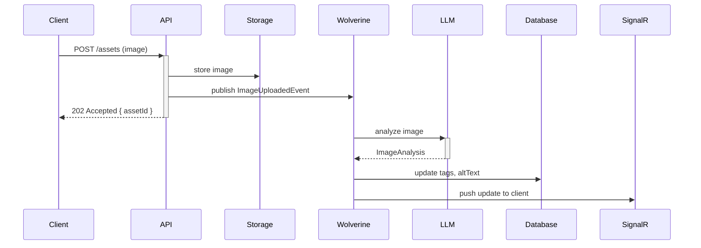

import { Tabs, TabItem } from "@astrojs/starlight/components";

`Granit.Imaging.AI` adds `IAIImageAnalyzer` to the imaging pipeline: send image bytes
and get back a description, detected objects, semantic tags, and a suggested alt text.

This enables accessibility automation, smart asset tagging, and content-aware
processing — without changing the existing `Granit.Imaging` image processing pipeline.

## Setup

<Tabs>
<TabItem label="Module">
```csharp
[DependsOn(
    typeof(GranitImagingAIModule),
    typeof(GranitAIOpenAIModule))]  // Must be a vision-capable model
public class AppModule : GranitModule { }
```
</TabItem>
<TabItem label="Program.cs">
```csharp
builder.AddGranitAI();
builder.AddGranitAIOpenAI();
builder.AddGranitImagingAI();
```
</TabItem>
<TabItem label="appsettings.json">
```json
{
  "AI": {
    "Imaging": {
      "WorkspaceName": "vision",
      "TimeoutSeconds": 30
    }
  }
}
```
</TabItem>
</Tabs>

:::caution[Vision model required]
`IAIImageAnalyzer` sends image bytes to the LLM. Your workspace must use a
**vision-capable model**:

| Provider | Models |
|----------|--------|
| OpenAI | `gpt-4o`, `gpt-4o-mini`, `gpt-4-turbo` |
| Azure OpenAI | `gpt-4o` (with vision enabled) |
| Anthropic | `claude-3-5-sonnet`, `claude-3-opus` |
| Ollama | `llava`, `llava-llama3`, `moondream` |

Text-only models will return an error. Configure a dedicated `vision` workspace.
:::

## Analyzing images

```csharp
public class ProductImageService(IAIImageAnalyzer analyzer)
{
    public async Task<ImageAnalysis> AnalyzeAsync(
        byte[] imageBytes,
        string mimeType,         // "image/jpeg", "image/png", "image/webp"
        CancellationToken ct)
    {
        return await analyzer
            .AnalyzeAsync(imageBytes, mimeType, ct)
            .ConfigureAwait(false);
    }
}
```

### Analysis result

```csharp
public sealed record ImageAnalysis(
    string Description,                      // "A red leather armchair in a modern living room"
    IReadOnlyList<string> DetectedObjects,   // ["armchair", "cushion", "lamp", "rug"]
    IReadOnlyList<string> Tags,              // ["furniture", "interior", "red", "modern"]
    string? SuggestedAltText);              // "Red leather armchair with matching ottoman in a bright living room"
```

### Example outputs by image type

**Product photo** (`chair_red_001.jpg`):
```json
{
  "description": "A red leather armchair with chrome legs against a white background",
  "detectedObjects": ["armchair", "chrome legs", "leather upholstery"],
  "tags": ["furniture", "seating", "red", "leather", "modern", "product"],
  "suggestedAltText": "Red leather armchair with polished chrome legs on white background"
}
```

**Document scan** (`invoice_scan.png`):
```json
{
  "description": "A scanned invoice document with company header and line items table",
  "detectedObjects": ["text", "table", "logo", "signature"],
  "tags": ["document", "invoice", "financial", "scanned"],
  "suggestedAltText": "Scanned invoice document with header and itemized table"
}
```

## Use cases

### Automatic alt text for accessibility

Alt text is required by WCAG 2.1. Generate it automatically when images are uploaded:

```csharp
public static async Task Handle(
    ImageUploadedEvent evt,
    IAIImageAnalyzer analyzer,
    IBlobStorage storage,
    IAssetRepository assets,
    CancellationToken ct)
{
    // Read image bytes from storage
    Stream imageStream = await storage.OpenReadAsync(evt.BlobKey, ct)
        .ConfigureAwait(false);

    using var ms = new MemoryStream();
    await imageStream.CopyToAsync(ms, ct).ConfigureAwait(false);

    ImageAnalysis analysis = await analyzer
        .AnalyzeAsync(ms.ToArray(), evt.MimeType, ct)
        .ConfigureAwait(false);

    // Store alt text and tags
    await assets.UpdateMetadataAsync(evt.AssetId, new AssetMetadata
    {
        AltText = analysis.SuggestedAltText,
        Tags = analysis.Tags,
        Description = analysis.Description,
    }, ct).ConfigureAwait(false);
}
```

### Smart tagging for media libraries

```csharp
public class MediaLibraryIndexer(IAIImageAnalyzer analyzer)
{
    public async Task<IReadOnlyList<string>> GetSearchTagsAsync(
        ReadOnlyMemory<byte> imageBytes,
        string mimeType,
        CancellationToken ct)
    {
        ImageAnalysis analysis = await analyzer
            .AnalyzeAsync(imageBytes, mimeType, ct)
            .ConfigureAwait(false);

        // Combine detected objects + semantic tags for full-text search
        return [.. analysis.DetectedObjects, .. analysis.Tags];
    }
}
```

### Integration with the Imaging pipeline

`IAIImageAnalyzer` is a standalone service — it does not hook into the
`IImageProcessor` pipeline automatically. Call it explicitly after processing:

```csharp
// Process → analyze → store
byte[] resized = await imageProcessor
    .Load(original)
    .Resize(800, 600)
    .ToArrayAsync(ct)
    .ConfigureAwait(false);

ImageAnalysis analysis = await analyzer
    .AnalyzeAsync(resized, "image/jpeg", ct)
    .ConfigureAwait(false);
```

## GDPR considerations

Images may contain personal data: faces, names on documents, ID cards.

| Image type | Recommendation |
|------------|---------------|
| Product photos (no people) | Any provider is fine |
| Document scans (invoices, contracts) | Use Azure OpenAI with DPA or Ollama |
| Profile photos / ID scans | **Local model only** (Ollama + LLaVA) — never send to public APIs |

Configure a provider-specific workspace for sensitive image types:

```json
{
  "AI": {
    "Workspaces": [
      {
        "Name": "vision-sensitive",
        "Provider": "Ollama",
        "Model": "llava",
        "SystemPrompt": "Analyze this image. Do not describe or transcribe any personal identifying information."
      }
    ]
  }
}
```

## Async pattern

Image analysis is never real-time — always async via Wolverine:



## Configuration reference

| Property | Type | Default | Description |
|----------|------|---------|-------------|
| `WorkspaceName` | `string?` | `null` (default) | AI workspace — must use a vision-capable model |
| `TimeoutSeconds` | `int` | `15` | LLM timeout — vision calls are slower than text |

## Security

### Output sanitization

LLM responses are sanitized before being returned in `ImageAnalysis`:

- **Control characters** stripped (prevents injection via invisible chars)
- **Text fields** capped at 2000 characters (`SuggestedAltText`: 500 chars)
- **List fields** capped at 50 items, each item at 200 characters

:::caution[Treat analysis results as untrusted]
An attacker can embed text instructions in an image (steganography, visible OCR text) that
influence the LLM response. Always HTML-encode `Description`, `Tags`, and `SuggestedAltText`
before rendering in a web page.
:::

### Metrics safety

The `content_type` metric tag is normalized against a fixed allowlist of 7 MIME types
(`image/jpeg`, `image/png`, `image/webp`, `image/avif`, `image/gif`, `image/bmp`,
`image/tiff`). Unrecognized values are mapped to `"other"` to prevent metrics cardinality
explosion from attacker-controlled MIME strings.

## See also

- [Granit.AI setup](/dotnet/ai/setup/) — providers, workspaces
- [Blob Storage Intelligence](/dotnet/ai/blob-storage-ai/) — file classification and PII in filenames
- [AI: Document Extraction](/dotnet/ai/document-extraction/) — extract structured data from documents
