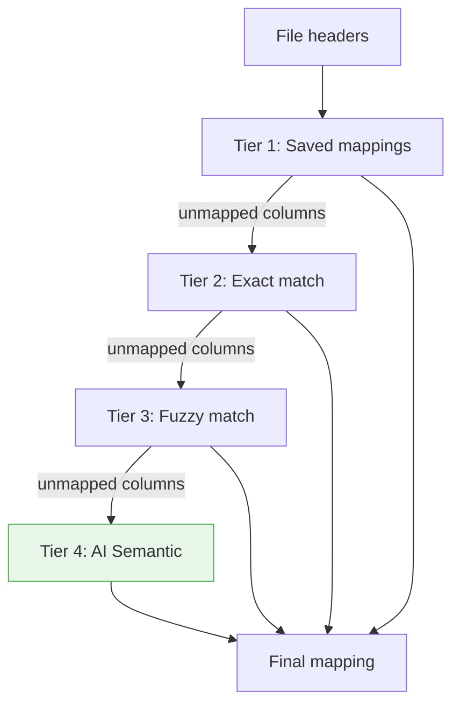

import { Tabs, TabItem, FileTree } from "@astrojs/starlight/components";

Every B2B application faces the same nightmare: data onboarding. Your client exports a
CSV from their legacy system (Sage, SAP, AS/400) with columns named `Nom_Clt_V2_Final`,
`dt_crea`, or simply `F_003`. Your system expects `CustomerName`, `CreatedAt`, `AmountExclTax`.
Someone has to map each column — manually, every time.

`Granit.DataExchange.AI` solves this by adding an **AI-powered Tier 4** to the existing
mapping pipeline. When exact and fuzzy matching fail, the LLM analyzes the column names
and target schema to suggest the mapping automatically.

## The problem

Traditional approaches fail on real-world data:

| Source column | Target property | Exact match? | Fuzzy match? | AI match? |
|---------------|----------------|:---:|:---:|:---:|
| `Email` | `Email` | Yes | — | — |
| `Courriel` | `Email` | No | Yes (alias) | — |
| `Nom_Clt_V2_Final` | `CustomerName` | No | No | Yes (0.92) |
| `MONTANT HT` | `AmountExclTax` | No | No | Yes (0.95) |
| `dt_crea` | `CreatedAt` | No | No | Yes (0.88) |
| `COL1` | ??? | No | No | Needs preview rows |

The first two tiers (exact + fuzzy) handle clean data. The AI tier handles the rest — which
is most of what you encounter in production B2B onboarding.

## How the 4-tier pipeline works



Each tier only processes columns that **previous tiers couldn't match**. The best confidence
wins per column. This means the AI is only called when necessary — most columns are matched
by cheaper tiers first.

| Tier | Confidence | Speed | Cost |
|------|-----------|-------|------|
| Saved | Highest (user-confirmed) | Instant | Free |
| Exact | High (case-insensitive name/alias) | Instant | Free |
| Fuzzy | Medium (Levenshtein ≥ 0.8) | Instant | Free |
| **Semantic (AI)** | Variable (0.0–1.0) | ~200ms | LLM tokens |

## Setup

```csharp
[DependsOn(
    typeof(GranitDataExchangeAIModule),
    typeof(GranitAIOllamaModule))]
public class AppModule : GranitModule { }
```

```csharp
builder.AddGranitAI();
builder.AddGranitAIOllama();       // or any provider
builder.AddGranitDataExchangeAI();
```

```json
{
  "AI": {
    "DataExchange": {
      "WorkspaceName": "default",
      "TimeoutSeconds": 10,
      "MinConfidenceScore": 0.6
    }
  }
}
```

That's it. The AI tier is automatically registered as the `ISemanticMappingService`
implementation, replacing the default no-op.

## What the LLM sees (and doesn't see)

This is critical for GDPR compliance. The LLM receives **only metadata**:

```text
Source columns: Nom_Clt_V2_Final, dt_crea, MONTANT HT, TVA

Target properties:
| Property       | Type             | Display Name     | Description          | Required |
|----------------|------------------|------------------|----------------------|----------|
| CustomerName   | String           | Customer Name    | Full customer name   | Yes      |
| CreatedAt      | DateTimeOffset   | Creation Date    | Record creation date | Yes      |
| AmountExclTax  | Decimal          | Amount excl. tax | Net amount           | Yes      |
| VatRate        | Decimal          | VAT Rate         | VAT percentage       | No       |
```

The LLM **never** receives:
- Row data (names, emails, amounts)
- Database records
- Tenant identifiers
- Any business data whatsoever

## Preview rows (opt-in for cryptic headers)

When column headers are meaningless (`COL1`, `F_003`, `FIELD_A`), headers alone aren't enough.
You can opt-in to send the first few data rows to the LLM:

```json
{
  "AI": {
    "DataExchange": {
      "IncludePreviewRows": true,
      "PreviewRowCount": 5
    }
  }
}
```

The LLM then sees:

```text
Source columns: COL1, COL2, COL3

Sample data (first rows):
| COL1              | COL2       | COL3     |
|-------------------|------------|----------|
| john@example.com  | John Doe   | +32 123  |
| jane@example.com  | Jane Smith | +32 456  |
```

With this context, the LLM can infer that `COL1` is an email, `COL2` is a name, etc.

:::danger
Preview rows may contain **PII** (names, emails, phone numbers). Only enable when:

1. The data is **known to be non-sensitive** (e.g., product catalog), OR
2. The AI provider has a **Data Processing Agreement** (Azure OpenAI, enterprise contracts), OR
3. A **local model** is used (Ollama — data never leaves your server)

Default is `false` — headers-only mode, fully GDPR-safe.
:::

## Soft dependency — zero changes to DataExchange

`Granit.DataExchange.AI` is a pure **additive** package. The DataExchange module defines
`ISemanticMappingService` with a null-object default:

```
Granit.DataExchange              → defines ISemanticMappingService
                                   registers NullSemanticMappingService (IsAvailable = false)

Granit.DataExchange.AI           → implements AISemanticMappingService (IsAvailable = true)
  references Granit.DataExchange    replaces via DI
  references Granit.AI
```

Without the AI package: Tier 4 is silently skipped. With it: Tier 4 activates.
No `if` statements, no feature flags — just DI composition.

## Security hardening

The AI mapping service applies multiple layers of defense:

- **Prompt injection protection** — preview row cell values and target field metadata
  (`DisplayName`, `Description`) are sanitized before embedding in the prompt. XML-like
  tags, pipe characters, and newlines are escaped to prevent markdown table breakout.
- **Output validation** — LLM suggestions are validated against known `ImportFieldMetadata`
  property paths and source headers. Suggestions targeting unknown properties are discarded.
  Confidence scores are clamped to `[0.0, 1.0]` to prevent the LLM from inflating scores.
- **Preview row truncation** — when `IncludePreviewRows` is enabled, rows are truncated
  to `PreviewRowCount` before prompt construction, preventing unbounded token consumption.
- **Startup validation** — `DataExchangeAIOptions` are validated at startup. Invalid
  configurations (`TimeoutSeconds: 0`, `MinConfidenceScore: -1.0`) are rejected immediately.

## Risks and limitations

| Risk | Mitigation |
|------|-----------|
| **LLM timeout** | 10s timeout (configurable), fallback to empty result — Tiers 1-3 still work |
| **Wrong mapping** | Minimum confidence threshold (0.6), user validates in wizard before import |
| **PII in preview rows** | Disabled by default, explicit opt-in required |
| **Cost** | Only called for unmapped columns after 3 free tiers, typically 1-5 columns per import |
| **LLM hallucination** | Structured output (JSON), validated against known property paths |
| **Prompt injection** | Cell values and field metadata sanitized before prompt embedding |

## Configuration reference

| Property | Type | Default | Description |
|----------|------|---------|-------------|
| `WorkspaceName` | `string` | `"default"` | AI workspace for mapping suggestions |
| `TimeoutSeconds` | `int` | `10` | LLM call timeout |
| `MinConfidenceScore` | `double` | `0.6` | Minimum score to accept a suggestion |
| `IncludePreviewRows` | `bool` | `false` | Include sample data rows (GDPR opt-in) |
| `PreviewRowCount` | `int` | `5` | Number of preview rows when enabled |

## See also

- [Granit.AI overview](/dotnet/ai/setup/) — core module, providers, workspaces
- [Data Exchange](/dotnet/business/data-exchange/) — the import/export module
- [AI: Document Extraction](/dotnet/ai/document-extraction/) — extract structured data from PDFs
