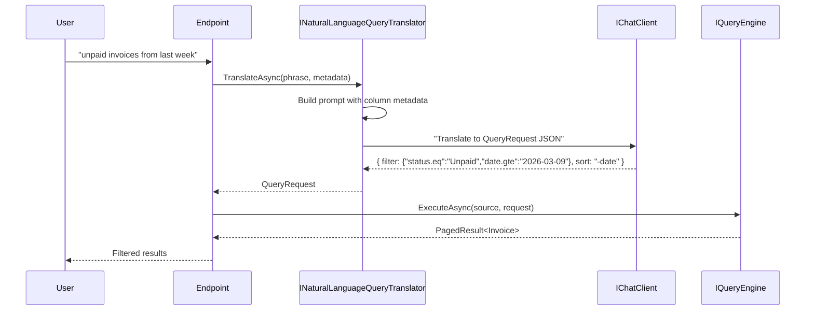

import { Tabs, TabItem } from "@astrojs/starlight/components";

Data grids with 50 filter dropdowns are powerful but intimidating. Users don't want to
learn which field is "Status", which operator is "Greater than", and how to combine
date ranges with text filters. They want to type **"unpaid invoices from last week
for Belgian clients"** and get results.

`Granit.QueryEngine.AI` makes this possible by translating natural language into the
structured `QueryRequest` format that Granit's query engine already understands.

## How it works



The key insight: the LLM **never sees your data**. It only sees the query metadata
(column names, filter types, sort options) and translates user intent into filters.
The actual query runs through the same type-safe `IQueryEngine` as manual filters.

## Why it's safe (no SQL injection)

The LLM output is a `QueryRequest` JSON — a structured object with typed filters.
It's **not** SQL. Two independent validation layers ensure safety:

**Layer 1 — Post-LLM whitelist validation** (in the translator itself):

- Filter keys are validated against the `QueryMetadata` filterable fields
- Sort fields, quick filter names, and group-by values are checked against their respective whitelists
- Any field the LLM hallucinates or is tricked into generating is silently stripped

**Layer 2 — QueryEngine runtime validation** (defense-in-depth):

- Only declared columns can be filtered
- Only valid operators for each column type are accepted
- Values are parameterized (no string concatenation)
- LIKE wildcards in string filters are escaped (CWE-943)

```text
User types: "DROP TABLE invoices; --"

LLM returns: { "filter": { "search.contains": "DROP TABLE invoices" } }
                                                  ↑ just a text search, not SQL

Query engine: WHERE SearchField LIKE @p0
                                       ↑ parameterized, harmless
```

Even if the LLM were compromised, the worst it could do is generate a valid filter
that returns unexpected results — never execute arbitrary SQL or access non-whitelisted
fields.

## What the LLM receives

Only **query metadata** — the schema of what's filterable, sortable, and searchable:

```text
You are a query translator. Convert natural language to a JSON QueryRequest.

Available filterable fields:
| Field     | Type           | Operators                    |
|-----------|----------------|------------------------------|
| status    | String         | eq, contains, in             |
| amount    | Decimal        | eq, gt, gte, lt, lte, between|
| createdAt | DateTimeOffset | eq, gt, gte, lt, lte, between|
| country   | String         | eq, contains, in             |

Available sortable fields: status, amount, createdAt, country

Available quick filters:
- overdue: "Overdue invoices"
- highValue: "Amount > 10000"

Today's date: 2026-03-16

Filter format: { "field.operator": "value" }
Sort format: "-field" for descending, "field" for ascending
```

The LLM **never** sees: row data, customer names, amounts, or any business information.

## Translation examples

| User says | Generated QueryRequest |
|-----------|----------------------|
| "unpaid invoices from last week" | `Filter: { "status.eq": "Unpaid", "createdAt.gte": "2026-03-09" }` |
| "top 10 clients by revenue" | `Sort: "-revenue"`, `PageSize: 10` |
| "Belgian customers created this month" | `Filter: { "country.eq": "BE", "createdAt.gte": "2026-03-01" }` |
| "overdue high-value invoices" | `QuickFilters: ["overdue", "highValue"]` |
| "doctors sorted by name" | `Filter: { "role.eq": "Doctor" }`, `Sort: "lastName"` |

## Setup

```csharp
builder.AddGranitAI();
builder.AddGranitAIOllama();
builder.AddGranitQueryEngineAI();
```

## Usage

```csharp
public static class InvoiceSearchEndpoints
{
    public static void MapInvoiceSearch(this IEndpointRouteBuilder routes)
    {
        routes.MapGet("/api/invoices/search", async (
            string q,
            INaturalLanguageQueryTranslator nlq,
            IQueryEngine<Invoice> engine,
            InvoiceDbContext db,
            CancellationToken ct) =>
        {
            QueryMetadata metadata = engine.GetMetadata();

            QueryRequest? request = await nlq
                .TranslateAsync(q, metadata, ct)
                .ConfigureAwait(false);

            // Fallback: if NLQ can't translate, use full-text search
            request ??= new QueryRequest { Search = q };

            PagedResult<Invoice> results = await engine
                .ExecuteAsync(db.Invoices, request, ct)
                .ConfigureAwait(false);

            return TypedResults.Ok(results);
        });
    }
}
```

### The fallback pattern

NLQ returns `null` when it can't translate the phrase (gibberish input, LLM timeout,
service unavailable). The calling code decides what to do — typically falls back to
the existing full-text search (`QueryRequest.Search`).

```csharp
QueryRequest? request = await nlq.TranslateAsync(userQuery, metadata, ct);

request ??= new QueryRequest { Search = userQuery }; // graceful fallback
```

This means NLQ is **always safe to deploy** — worst case, it's a no-op and the user
gets full-text search results instead.

## Performance

NLQ is one of the few AI features that runs **synchronously** in the request path,
because the user is waiting for search results.

| Metric | Value |
|--------|-------|
| Typical latency | 200-500ms |
| Timeout | 5s (configurable) |
| Fallback | Return `null` → full-text search |
| Token cost | ~200 input + ~100 output tokens per query |

For most use cases, the added latency is acceptable because it replaces the user
manually configuring 3-5 filter dropdowns (which takes 10-30 seconds).

## Advantages and risks

### Advantages

- **Intuitive UX** — users search in their own words, no filter training needed
- **Zero data exposure** — only metadata sent to the LLM
- **Type-safe** — output is a validated `QueryRequest`, not raw SQL
- **Progressive enhancement** — works alongside existing filters, not a replacement
- **Multilingual** — users can query in any language the LLM supports

### Risks and mitigations

| Risk | Mitigation |
|------|-----------|
| **Ambiguous queries** | LLM returns `null`, fallback to full-text search |
| **Wrong filter** | User sees results and can refine; no destructive action possible |
| **Latency spike** | 5s timeout, `null` return on timeout |
| **LLM cost** | ~300 tokens per query, cached metadata prompt |
| **Date misinterpretation** | Current date injected in prompt for "last week", "this month" |
| **Prompt injection** | User input sanitized via `PromptBuilder`; output validated against metadata whitelist |
| **PII in logs** | Natural language input never logged — only input length on failure |
| **Schema exposure** | Only metadata (column names, types) sent to LLM — document in DPA |

## Configuration reference

| Property | Type | Default | Description |
|----------|------|---------|-------------|
| `WorkspaceName` | `string` | `"default"` | AI workspace for NLQ translation |
| `TimeoutSeconds` | `int` | `5` | Short timeout — NLQ must be fast |

## See also

- [Granit.AI overview](/dotnet/ai/setup/) — core module, providers, workspaces
- [AI: Import Mapping](/dotnet/ai/import-mapping/) — AI for CSV/Excel column mapping
- [AI: Semantic Search](/dotnet/ai/semantic-search/) — vector-based similarity search
