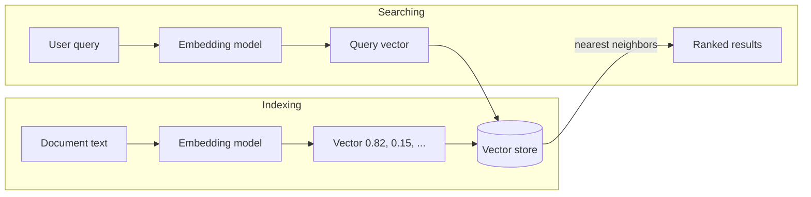
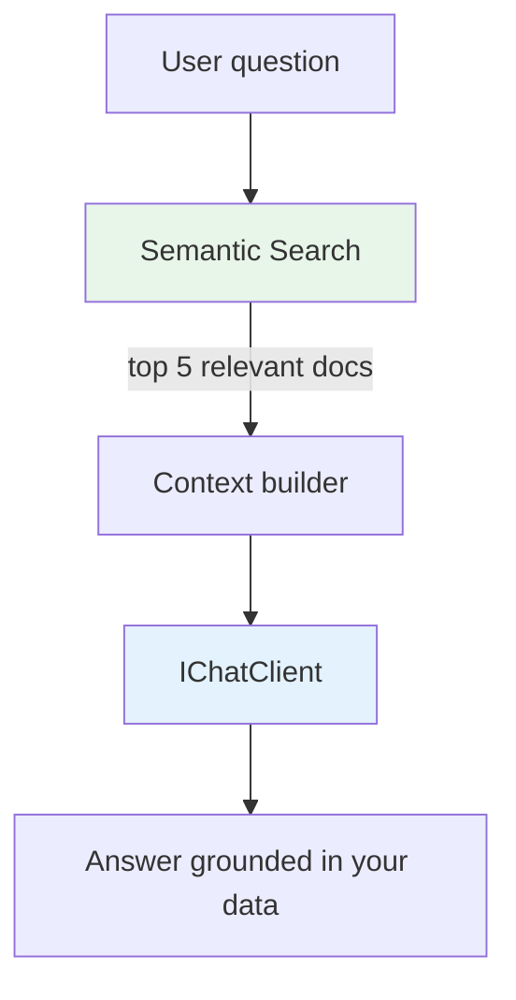

import { Tabs, TabItem } from "@astrojs/starlight/components";

Traditional search relies on keywords: if the user types "connection problem", your
`LIKE '%connection problem%'` query won't find the document titled "Authentication error 401".
The words are different, but the **meaning** is the same.

Semantic search solves this by comparing **meaning**, not text. `Granit.AI.VectorData` brings
this capability to your application with multi-tenant isolation and a clean abstraction.

## What are embeddings? (the 30-second explanation)

An **embedding** is a list of numbers (a vector) that represents the meaning of a text.
Texts with similar meanings have similar vectors — even if they use completely different words.

```text
"connection problem"     → [0.82, 0.15, 0.67, 0.31, ...]  ─┐
"authentication error"   → [0.79, 0.18, 0.64, 0.29, ...]  ─┤ Similar vectors!
                                                              │ (close in vector space)
"chocolate cake recipe"  → [0.12, 0.91, 0.03, 0.88, ...]  ─┘ Different vector
                                                              (far in vector space)
```

The AI model (embedding model) converts text into these vectors. Then, to search, you
convert the user's query into a vector and find the stored vectors closest to it.
That's semantic search.

## How it works in Granit



Two phases:
1. **Indexing** — convert documents into vectors and store them
2. **Searching** — convert the query into a vector and find the closest stored vectors

`Granit.AI.VectorData` handles both through `ISemanticSearchService`.

## What is RAG? (Retrieval-Augmented Generation)

RAG is a pattern that combines semantic search with LLM generation:



1. **Retrieve** — find the most relevant documents using semantic search
2. **Augment** — add those documents as context to the LLM prompt
3. **Generate** — the LLM answers using your data, not its training data

This is how you build:
- **FAQ bots** that answer from your actual documentation
- **Customer support assistants** that know your product
- **Internal knowledge bases** that search across all company documents

The LLM doesn't hallucinate (as much) because it's grounded in real documents
that you control.

## Setup

```csharp
builder.AddGranitAI();
builder.AddGranitAIOllama();        // for embeddings (nomic-embed-text)
builder.AddGranitAIVectorData();
// + a vector store provider (coming soon: Granit.AI.VectorData.PgVector)
```

## High-level API: ISemanticSearchService

For most use cases, `ISemanticSearchService` is all you need. It combines embedding
generation + vector storage in two simple methods:

### Indexing documents

```csharp
public class FaqIndexingService(ISemanticSearchService search)
{
    public async Task IndexFaqAsync(
        FaqEntry faq,
        CancellationToken cancellationToken)
    {
        // Convert FAQ content to a vector and store it
        await search.IndexAsync(
            collectionName: "faq",
            key: faq.Id.ToString(),
            text: $"{faq.Question}\n{faq.Answer}",
            cancellationToken).ConfigureAwait(false);
    }
}
```

### Searching

```csharp
public class FaqSearchService(ISemanticSearchService search)
{
    public async Task<IReadOnlyList<SemanticSearchResult>> SearchAsync(
        string userQuestion,
        CancellationToken cancellationToken)
    {
        return await search.SearchAsync(
            collectionName: "faq",
            query: userQuestion,
            limit: 5,
            cancellationToken).ConfigureAwait(false);
    }
}
```

### Full RAG example

```csharp
public class FaqChatService(
    ISemanticSearchService search,
    IAIChatClientFactory chatFactory)
{
    public async Task<string> AskAsync(
        string question,
        CancellationToken cancellationToken)
    {
        // 1. Retrieve relevant FAQ entries
        IReadOnlyList<SemanticSearchResult> relevant = await search
            .SearchAsync("faq", question, limit: 3, cancellationToken)
            .ConfigureAwait(false);

        // 2. Build context from retrieved documents
        string context = string.Join("\n\n", relevant.Select(r => r.Text));

        // 3. Generate answer grounded in context
        IChatClient client = await chatFactory
            .CreateAsync("support-chat", cancellationToken)
            .ConfigureAwait(false);

        ChatResponse response = await client.GetResponseAsync(
            $"""
            Answer the user's question based ONLY on the following context.
            If the answer is not in the context, say "I don't know".

            Context:
            {context}

            Question: {question}
            """,
            cancellationToken: cancellationToken).ConfigureAwait(false);

        return response.Text;
    }
}
```

## Low-level API: IVectorCollection

For advanced use cases (custom record types, metadata filtering, batch operations),
use `IVectorCollectionFactory` directly:

```csharp
public class PatientSimilarityService(IVectorCollectionFactory factory)
{
    public async Task<IReadOnlyList<VectorSearchResult<PatientRecord>>> FindSimilarAsync(
        ReadOnlyMemory<float> queryVector,
        CancellationToken cancellationToken)
    {
        IVectorCollection<PatientRecord> collection =
            factory.GetCollection<PatientRecord>("patients");

        return await collection
            .SearchAsync(queryVector, limit: 10, cancellationToken)
            .ConfigureAwait(false);
    }
}
```

## Multi-tenancy

Vector collections are automatically scoped to the current tenant (same pattern as
`IBlobKeyStrategy` in blob storage). Tenant A's documents are never returned in
Tenant B's searches — enforced at the storage layer, not the application layer.

## Embedding models

The embedding model converts text to vectors. Different models produce different
quality embeddings:

| Model | Provider | Dimensions | Quality | Speed |
|-------|----------|-----------|---------|-------|
| `text-embedding-3-small` | OpenAI | 1536 | Good | Fast |
| `text-embedding-3-large` | OpenAI | 3072 | Best | Slower |
| `nomic-embed-text` | Ollama (local) | 768 | Good | Fast, free |

Configure the embedding model via a dedicated workspace:

```json
{
  "AI": {
    "VectorData": {
      "EmbeddingWorkspace": "embeddings"
    }
  }
}
```

Then define the workspace:

```csharp
context.Add(new AIWorkspace
{
    Name = "embeddings",
    Provider = "Ollama",
    Model = "nomic-embed-text",
});
```

## Vector store providers

`Granit.AI.VectorData` defines the abstractions. You need a provider to actually
store and search vectors:

| Provider | Package | Status | Best for |
|----------|---------|--------|----------|
| **PgVector** | `Granit.AI.VectorData.PgVector` | Coming soon | Zero extra infra (PostgreSQL) |
| **Qdrant** | `Granit.AI.VectorData.Qdrant` | Planned | High-performance, dedicated vector DB |
| **Redis** | `Granit.AI.VectorData.Redis` | Planned | Already using Redis for caching |

:::tip
Start with **PgVector** if you already use PostgreSQL — it's a simple extension (`CREATE EXTENSION vector`)
and avoids adding another database to your infrastructure. For millions of vectors or
sub-millisecond search, consider Qdrant.
:::

## Advantages and risks

### Advantages

- **Search by meaning** — "connection problem" finds "authentication error 401"
- **Multilingual** — French questions find English documents (embedding models are multilingual)
- **No reindexing on schema changes** — vectors are schema-free
- **Composable** — combine with Granit.QueryEngine for hybrid search (semantic + structured filters)

### Risks and mitigations

| Risk | Impact | Mitigation |
|------|--------|-----------|
| **Embedding quality** | Poor embeddings = poor search results | Use a good model (text-embedding-3-small minimum), test with real queries |
| **Stale index** | Document updated but vector not re-indexed | Re-index on entity change events (Wolverine integration event) |
| **Cost** | Embedding generation costs tokens | Batch indexing, cache embeddings, local models (Ollama) for dev |
| **Storage size** | 1536 floats × 4 bytes = 6 KB per vector | PgVector handles millions; Qdrant handles billions |
| **GDPR** | Embeddings are derived from data | Right to erasure applies — delete vectors when deleting source data |

:::caution
Embeddings are **not reversible** — you can't reconstruct the original text from a vector.
However, they are derived from personal data, so GDPR right to erasure still applies.
When a user requests data deletion, delete their vectors too.
:::

## Configuration reference

| Property | Type | Default | Description |
|----------|------|---------|-------------|
| `EmbeddingWorkspace` | `string` | `"default"` | Workspace for embedding generation |
| `DefaultSearchLimit` | `int` | `10` | Default number of search results |

## See also

- [Granit.AI overview](/dotnet/ai/setup/) — core module, providers, workspaces
- [AI: Document Extraction](/dotnet/ai/document-extraction/) — extract text from PDFs for indexing
- [AI: Natural Language Query](/dotnet/ai/natural-language-query/) — structured filter search (complementary to semantic search)
