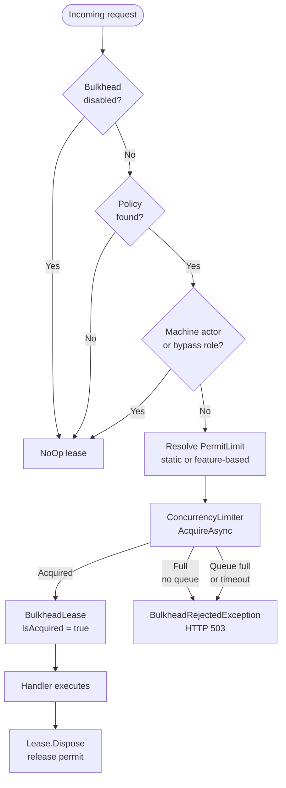

import { Tabs, TabItem } from "@astrojs/starlight/components";

`Granit.Http.Bulkhead` provides per-tenant bulkhead isolation built on .NET 10's
`System.Threading.RateLimiting.ConcurrencyLimiter`. When a tenant has too many
concurrent operations in flight, excess requests are rejected immediately (HTTP 503)
rather than queued — preventing thread pool exhaustion without hiding latency problems.

:::note[Per-pod isolation]
Bulkhead is in-memory, per pod. With N pods and `PermitLimit = P`, a tenant can use up
to N × P concurrent operations cluster-wide. For distributed quotas, use
[Rate Limiting](/dotnet/api/rate-limiting/) (Redis-backed).
:::

## Setup

```csharp
[DependsOn(typeof(GranitHttpBulkheadModule))]
public class AppModule : GranitModule { }
```

```json
{
  "Bulkhead": {
    "Enabled": true,
    "BypassRoles": ["SystemAdmin"],
    "Policies": {
      "api": { "PermitLimit": 20, "QueueLimit": 5, "QueueTimeout": "00:00:30" },
      "import": { "PermitLimit": 2, "QueueLimit": 0 },
      "report-generation": { "PermitLimit": 3, "QueueLimit": 0 }
    }
  }
}
```

## Applying to endpoints

```csharp
app.MapGet("/reports", handler)
   .RequireGranitBulkhead("report-generation");

app.MapPost("/import", handler)
   .RequireGranitBulkhead("import");
```

`RequireGranitBulkhead` is an endpoint filter. It acquires a lease before the handler
runs and releases it in a `finally` block — the lease is always released, even on
unhandled exceptions.

When the bulkhead is full, `BulkheadRejectedException` is thrown and mapped to
**503 Service Unavailable** by `Granit.Http.ExceptionHandling`.

## Applying to Wolverine messages

For background jobs and message handlers, use the `[Bulkhead]` attribute and register
the middleware once:

```csharp
// 1. Decorate the message
[Bulkhead("import")]
public record ImportDataCommand(Guid TenantId, Stream Data);

// 2. Register middleware in Wolverine setup
opts.Policies.AddMiddleware<BulkheadMiddleware>(
    chain => chain.MessageType
        .GetCustomAttributes(typeof(BulkheadAttribute), true).Length > 0);
```

The middleware follows Wolverine's before/after convention — the lease is released
after the handler completes, whether it succeeds or throws.

## Configuration reference

### GranitBulkheadOptions

| Property | Default | Description |
|----------|---------|-------------|
| `Enabled` | `true` | Master switch — disabling returns `NoOp` leases for all policies |
| `BypassRoles` | `[]` | Roles that skip bulkhead checks. Machine actors always bypass regardless |
| `UseFeatureBasedQuotas` | `false` | Resolve `PermitLimit` dynamically from `Granit.Features` |
| `IdleTimeout` | `00:30:00` | Evict unused per-tenant limiters after this idle period |
| `CleanupInterval` | `00:05:00` | How often the background cleanup job runs |
| `Policies` | required | Named policy definitions (case-insensitive keys) |

### BulkheadPolicyOptions

| Property | Default | Range | Description |
|----------|---------|-------|-------------|
| `PermitLimit` | `10` | 1–10,000 | Max concurrent operations per tenant for this policy |
| `QueueLimit` | `0` | 0–10,000 | Max queued requests when slots are full. `0` = reject immediately |
| `QueueTimeout` | `00:00:30` | positive | Max wait in queue. Only applies when `QueueLimit > 0` |
| `FeatureName` | `null` | — | Numeric `Granit.Features` feature to override `PermitLimit` per plan |

## Bypass logic

Requests skip the bulkhead check when:

1. **Machine actors** — `ICurrentUserService.IsMachine = true` (always bypassed)
2. **Configured roles** — user is in a role listed in `BypassRoles`
3. **Disabled** — `Enabled = false`
4. **Unknown policy** — policy name not found in `Policies` (no-op, no error)

## Feature-based quotas

When `UseFeatureBasedQuotas = true`, the `PermitLimit` for each policy is resolved
dynamically from a `Granit.Features` Numeric feature before each acquisition:

```json
{
  "Bulkhead": {
    "UseFeatureBasedQuotas": true,
    "Policies": {
      "import": {
        "PermitLimit": 2,
        "FeatureName": "Bulkhead.ImportLimit"
      }
    }
  }
}
```

If the feature is not defined or `IFeatureChecker` is not registered, it falls back to
the static `PermitLimit` from configuration.

## Metrics

`Granit.Http.Bulkhead` emits OpenTelemetry metrics via the `Granit.Http.Bulkhead` meter:

| Metric | Type | Description |
|--------|------|-------------|
| `granit.http.bulkhead.leases.active` | UpDownCounter | Currently active leases |
| `granit.http.bulkhead.requests.rejected` | Counter | Requests rejected (bulkhead full) |

Both metrics carry `policy` and `tenant_id` attributes.

## Architecture



## Public API summary

| Type | Package | Description |
|------|---------|-------------|
| `GranitHttpBulkheadModule` | `Granit.Http.Bulkhead` | Module class |
| `TenantPartitionedBulkhead` | `Granit.Http.Bulkhead` | Core orchestrator — inject to acquire leases manually |
| `BulkheadLease` | `Granit.Http.Bulkhead` | Disposable permit holder |
| `IBulkheadQuotaProvider` | `Granit.Http.Bulkhead` | Override to provide dynamic limits |
| `BulkheadRejectedException` | `Granit.Http.Bulkhead` | Thrown when bulkhead is full; mapped to HTTP 503 |
| `BulkheadAttribute` | `Granit.Http.Bulkhead` | Wolverine message marker |
| `RequireGranitBulkhead()` | `Granit.Http.Bulkhead` | Endpoint filter extension |
| `BulkheadMiddleware` | `Granit.Http.Bulkhead` | Wolverine before/after middleware |
| `AddGranitBulkhead()` | `Granit.Http.Bulkhead` | DI registration extension |
| `GranitBulkheadOptions` | `Granit.Http.Bulkhead` | Top-level options |
| `BulkheadPolicyOptions` | `Granit.Http.Bulkhead` | Per-policy options |

## See also

- [Rate Limiting](/dotnet/api/rate-limiting/) — distributed quota enforcement (Redis-backed)
- [Exception Handling](/dotnet/api/exception-handling/) — Problem Details for 503 responses
- [Features](/dotnet/infrastructure/feature-flags/) — feature-based quota resolution
- [API & Http overview](/dotnet/api/) — all HTTP infrastructure packages
