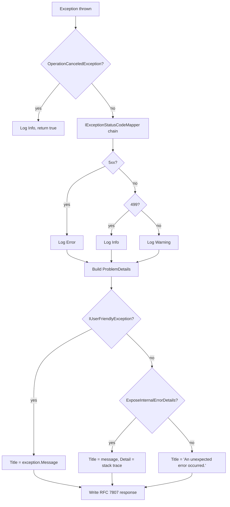

Granit.Http.ExceptionHandling provides a centralized exception-to-HTTP-response pipeline
implementing RFC 7807 Problem Details. All exceptions are caught, mapped to status
codes via a chain of responsibility, logged at the appropriate level, and serialized
as `application/problem+json`.

## Setup

```csharp
[DependsOn(typeof(GranitHttpExceptionHandlingModule))]
public class AppModule : GranitModule { }
```

In `Program.cs` (**must be the first middleware**):

```csharp
app.UseGranitExceptionHandling(); // Before routing, authentication, authorization
app.UseRouting();
app.UseAuthentication();
app.UseAuthorization();
```

## Exception handling pipeline



## IExceptionStatusCodeMapper

Chain of responsibility pattern. Mappers are evaluated in registration order;
the first non-null result wins. The `DefaultExceptionStatusCodeMapper` is registered
last as a catch-all.

**Default mappings:**

| Exception | Status code |
| --------- | ----------- |
| `EntityNotFoundException` | 404 |
| `NotFoundException` | 404 |
| `ForbiddenException` | 403 |
| `UnauthorizedAccessException` | 403 |
| `ValidationException` | 422 |
| `IHasValidationErrors` | 422 |
| `ConflictException` | 409 |
| `BusinessRuleViolationException` | 422 |
| `BusinessException` | 400 |
| `IHasErrorCode` | 400 |
| `NotImplementedException` | 501 |
| `OperationCanceledException` | 499 |
| `TimeoutException` | 408 |
| *(any other)* | 500 |

## Custom mapper

Other Granit modules register their own mappers to extend the chain:

```csharp
internal sealed class InvoiceConcurrencyMapper : IExceptionStatusCodeMapper
{
    public int? TryGetStatusCode(Exception exception) => exception switch
    {
        InvoiceLockedException => StatusCodes.Status423Locked,
        _ => null
    };
}

// In module ConfigureServices:
services.AddSingleton<IExceptionStatusCodeMapper, InvoiceConcurrencyMapper>();
```

## ProblemDetails extensions

The response body includes standard RFC 7807 fields plus Granit-specific extensions:

```json
{
  "status": 422,
  "title": "Invoice amount must be positive.",
  "detail": null,
  "traceId": "abcd1234ef567890",
  "errorCode": "Invoices:InvalidAmount",
  "errors": {
    "Amount": ["Granit:Validation:GreaterThanValidator"]
  }
}
```

| Extension | Source | Present when |
| --------- | ------ | ------------ |
| `traceId` | `Activity.Current?.TraceId` or `HttpContext.TraceIdentifier` | Always |
| `errorCode` | `IHasErrorCode.ErrorCode` | Exception implements `IHasErrorCode` |
| `errors` | `IHasValidationErrors.ValidationErrors` | Exception implements `IHasValidationErrors` |

:::danger
Never set `ExposeInternalErrorDetails: true` in production. Internal error messages
may contain PHI, SQL fragments, or internal paths (ISO 27001 violation).
:::

## Public API summary

| Category | Key types | Package |
| -------- | --------- | ------- |
| Module | `GranitHttpExceptionHandlingModule` | -- |
| Pipeline | `IExceptionStatusCodeMapper`, `GranitExceptionHandler` | `Granit.Http.ExceptionHandling` |
| Options | `ExceptionHandlingOptions` | `Granit.Http.ExceptionHandling` |
| Extensions | `AddGranitExceptionHandling()`, `UseGranitExceptionHandling()` | `Granit.Http.ExceptionHandling` |

## See also

- [Core module](/dotnet/core/module-system/) -- Exception hierarchy (`BusinessException`, `IHasErrorCode`)
- [Rate Limiting](/dotnet/api/rate-limiting/) -- 429 response uses same Problem Details format
- [API & Http overview](/dotnet/api/) -- All HTTP infrastructure packages
