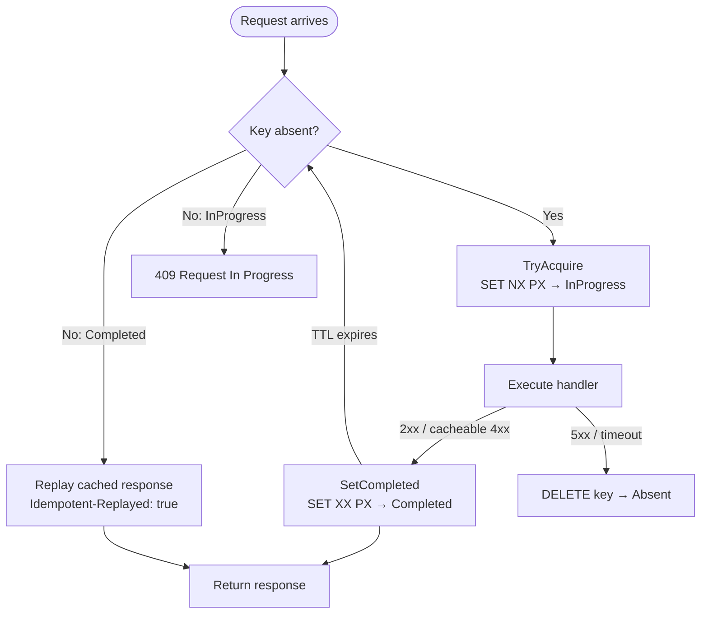

Granit.Http.Idempotency provides Stripe-style HTTP idempotency middleware backed by Redis.
Ensures that retried POST/PUT/PATCH requests produce the same response without
re-executing side effects. Uses SHA-256 composite keys and AES-256-GCM encrypted
entries.

## Setup

```csharp
[DependsOn(typeof(GranitHttpIdempotencyModule))]
public class AppModule : GranitModule { }
```

```json
{
  "Idempotency": {
    "HeaderName": "Idempotency-Key",
    "KeyPrefix": "idp",
    "CompletedTtl": "24:00:00",
    "InProgressTtl": "00:00:30",
    "ExecutionTimeout": "00:00:25",
    "MaxBodySizeBytes": 1048576
  }
}
```

In `Program.cs` (after authentication/authorization):

```csharp
app.UseAuthentication();
app.UseAuthorization();
app.UseGranitIdempotency(); // After auth so ICurrentUserService is populated
```

## Marking endpoints as idempotent

```csharp
app.MapPost("/api/v1/invoices", CreateInvoice)
    .WithMetadata(new IdempotentAttribute { Required = true });

// Optional key — middleware is bypassed when header is absent
app.MapPut("/api/v1/invoices/{id}", UpdateInvoice)
    .WithMetadata(new IdempotentAttribute { Required = false });

// Custom TTL (2 hours instead of default 24h)
app.MapPost("/api/v1/payments", ProcessPayment)
    .WithMetadata(new IdempotentAttribute { CompletedTtlSeconds = 7200 });
```

## State machine



## Composite key structure

The Redis key is partitioned by tenant, user, HTTP method, and route to prevent
cross-user key collisions:

```
{prefix}:{tenantId|global}:{userId|anon}:{method}:{routePattern}:{sha256(idempotencyKeyValue)}
```

**Example:** `idp:global:d4e5f6a7:POST:/api/v1/invoices:a1b2c3d4e5f6...`

## Payload hash verification

The middleware computes a SHA-256 digest of the composite input (method + route +
idempotency key value + request body). On replay, if the payload hash does not match
the stored entry, the request is rejected with 422 to prevent key reuse with a
different body.

## Response caching rules

| Status code | Cached? | Rationale |
| ----------- | ------- | --------- |
| 2xx | Yes | Successful responses are replayed |
| 400, 404, 409, 410, 422 | Yes | Deterministic client errors |
| 401, 403 | No | Authentication state may change |
| 5xx | No | Lock is released for retry |
| 499 (client disconnect) | No | Response may be truncated |

## Error responses

| Scenario | Status | Title |
| -------- | ------ | ----- |
| Missing header (required) | 422 | Missing Idempotency-Key |
| Multipart request | 422 | Unsupported Content-Type |
| Key in progress (another pod) | 409 | Request In Progress |
| Payload hash mismatch | 422 | Idempotency Key Conflict |
| Execution timeout | 503 | Execution Timeout |

Replayed responses include an `Idempotent-Replayed: true` header.

## Configuration reference

| Property | Default | Description |
| -------- | ------- | ----------- |
| `HeaderName` | `"Idempotency-Key"` | HTTP header name |
| `KeyPrefix` | `"idp"` | Redis key prefix |
| `CompletedTtl` | `24:00:00` | TTL for completed entries |
| `InProgressTtl` | `00:00:30` | Lock TTL (must be > `ExecutionTimeout`) |
| `ExecutionTimeout` | `00:00:25` | Max handler execution time |
| `MaxBodySizeBytes` | `1048576` | Max request body size to hash (1 MiB) |

## Public API summary

| Category | Key types | Package |
| -------- | --------- | ------- |
| Module | `GranitHttpIdempotencyModule` | -- |
| Store | `IIdempotencyStore`, `IIdempotencyMetadata`, `IdempotencyEntry`, `IdempotencyState` | `Granit.Http.Idempotency` |
| Metadata | `IdempotentAttribute` | `Granit.Http.Idempotency` |
| Options | `IdempotencyOptions` | `Granit.Http.Idempotency` |
| Extensions | `AddGranitIdempotency()`, `UseGranitIdempotency()` | `Granit.Http.Idempotency` |

## See also

- [Caching module](/dotnet/data/caching/) -- `ICacheValueEncryptor` used by idempotency store
- [API & Http overview](/dotnet/api/) -- All HTTP infrastructure packages
