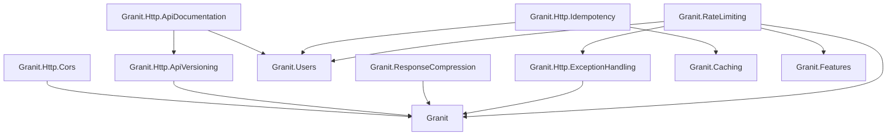

Nine packages that form the HTTP infrastructure layer of a Granit application.

## Choosing the right modules

Start with the problem you need to solve:

| Problem | Module | When to use |
| ------- | ------ | ----------- |
| Clients retry a POST and create duplicates | [Idempotency](/dotnet/api/idempotency/) | Any mutation endpoint called by mobile apps or unreliable networks |
| A single user floods your API | [Rate Limiting](/dotnet/api/rate-limiting/) | Public APIs, multi-tenant APIs, any endpoint exposed to untrusted clients |
| One slow tenant blocks requests for others | [Bulkhead](/dotnet/api/bulkhead/) | Multi-tenant SaaS where tenants share compute resources |
| API responses are large (JSON lists, reports) | [Response Compression](/dotnet/api/response-compression/) | Any API with responses > 1 KB, especially over mobile networks |
| You need to push events to external systems | [Webhooks](/dotnet/api/webhooks/) | Integration partners expect real-time notifications |
| You are introducing breaking API changes | [API Versioning](/dotnet/api/api-versioning/) | Any API with external consumers that cannot upgrade simultaneously |
| Frontend devs need to explore your API | [API Documentation](/dotnet/api/api-documentation/) | Always — self-service API exploration reduces support requests |
| Your API returns inconsistent error shapes | [Exception Handling](/dotnet/api/exception-handling/) | Always — standardizes all errors to RFC 7807 Problem Details |
| Browser clients call your API cross-origin | [CORS](/dotnet/api/cors-cross-origin/) | Any API consumed by SPAs or third-party frontends |

:::tip[Most applications need these four from day one]
**Exception Handling** + **CORS** + **API Documentation** + **API Versioning** — these
are foundational. Add Idempotency, Rate Limiting, Bulkhead, and Compression as your
traffic and integration patterns demand.
:::

## All packages

| Package | Purpose |
| ------- | ------- |
| [CORS](/dotnet/api/cors-cross-origin/) | Default policy, ISO 27001 wildcard rejection |
| [API Versioning](/dotnet/api/api-versioning/) | URL segment versioning, RFC 8594 deprecation headers |
| [API Documentation](/dotnet/api/api-documentation/) | Scalar OpenAPI UI, OAuth2/PKCE, multi-version docs |
| [Exception Handling](/dotnet/api/exception-handling/) | RFC 7807 Problem Details, chain of responsibility mapper |
| [Idempotency](/dotnet/api/idempotency/) | Stripe-style middleware, Redis state machine, AES-256 entries |
| [Rate Limiting](/dotnet/api/rate-limiting/) | SlidingWindow, FixedWindow, TokenBucket, Concurrency algorithms |
| [Webhooks](/dotnet/api/webhooks/) | HMAC-signed outbound webhooks, retry, subscription management |
| [Bulkhead](/dotnet/api/bulkhead/) | Per-tenant concurrency isolation, feature-based quotas, Wolverine middleware |
| [Response Compression](/dotnet/api/response-compression/) | Brotli + gzip with safe HTTPS defaults, SSE exclusion |

## Package dependencies

## See also

- [Architecture: HTTP Conventions](/dotnet/architecture/http-conventions/) -- Status codes, Problem Details, DTO naming
- [Security module](/dotnet/security/authentication/) -- JWT Bearer, authorization
