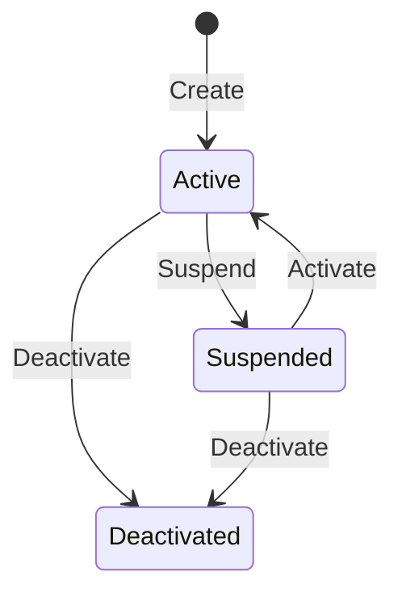

import { FileTree } from "@astrojs/starlight/components";

## Overview

`Granit.Webhooks.Endpoints` exposes a Minimal API for managing webhook subscriptions:
create and update subscriptions, transition through lifecycle states (active, suspended,
deactivated), rotate signing secrets, send test pings, and monitor delivery statistics.
Read endpoints require the `Webhooks.Subscriptions.Read` permission; mutating
operations (write, lifecycle, operations) additionally require
`Webhooks.Subscriptions.Manage`.

## Package structure

<FileTree>

- Granit.Webhooks.Endpoints/ Minimal API route groups + DTOs + validators
  - Granit.Webhooks Core abstractions (IWebhookSubscriptionReader/Writer)
  - Granit.Webhooks.EntityFrameworkCore EF Core persistence + IWebhookQueryableProvider

</FileTree>

## Installation

```csharp
// In your application startup
app.MapGranitWebhooks();

// With custom options:
app.MapGranitWebhooks(opts =>
{
    opts.RoutePrefix = "admin/webhooks";
    opts.TagName = "Webhook Administration";
});
```

## Configuration

| Option | Default | Description |
| ------ | ------- | ----------- |
| `RoutePrefix` | `"webhooks"` | Route prefix for all webhook endpoints |
| `TagName` | `"Webhooks"` | OpenAPI tag name for endpoint grouping |

## Endpoints

### Discovery

| Method | Route | Description |
| ------ | ----- | ----------- |
| `GET` | `/event-types` | List all registered webhook event types |

Returns the full list of event types declared by application modules via
`IWebhookEventTypeDefinitionProvider`. Each entry includes the event type name,
localized display name, description, and category for UI grouping. Labels are
resolved based on the `Accept-Language` header. Requires
`Webhooks.Subscriptions.Read` permission.

### Read — `Webhooks.Subscriptions.Read`

| Method | Route | Description |
| ------ | ----- | ----------- |
| `GET` | `/subscriptions/{id}` | Get a webhook subscription by ID |

### Write — `Webhooks.Subscriptions.Manage`

| Method | Route | Description |
| ------ | ----- | ----------- |
| `POST` | `/subscriptions` | Create a new subscription (returns signing secret once) |
| `PUT` | `/subscriptions/{id}` | Update a subscription's target URL |
| `DELETE` | `/subscriptions/{id}` | Hard-delete a subscription |

### Lifecycle — `Webhooks.Subscriptions.Manage`

| Method | Route | Description |
| ------ | ----- | ----------- |
| `POST` | `/subscriptions/{id}/activate` | Reactivate a suspended subscription |
| `POST` | `/subscriptions/{id}/suspend` | Suspend an active subscription |
| `POST` | `/subscriptions/{id}/deactivate` | Permanently deactivate a subscription |



### Operations — `Webhooks.Subscriptions.Manage`

| Method | Route | Description |
| ------ | ----- | ----------- |
| `POST` | `/subscriptions/{id}/rotate-secret` | Rotate the HMAC signing secret (legacy single-secret model) |
| `POST` | `/subscriptions/{id}/test-ping` | Send a Stripe-style test ping to the target URL |
| `GET` | `/stats` | Get aggregate delivery statistics (last 24h) |
| `GET` | `/subscriptions/{id}/keys` | List signing keys (Active / Retired / Revoked). Read-permission. See [Signing keys](/dotnet/api/webhooks/signing-keys/) |
| `POST` | `/subscriptions/{id}/keys` | Rotate via the [dual-key model](/dotnet/api/webhooks/signing-keys/) — overlap, grace period, audit history |
| `DELETE` | `/subscriptions/{id}/keys/{keyId}` | Revoke a specific signing key |

### Redelivery — requires authentication

Mapped separately via `MapGranitWebhooksRedelivery()`:

| Method | Route | Description |
| ------ | ----- | ----------- |
| `POST` | `/deliveries/{deliveryId}/retry` | Retry a previously failed delivery attempt |

Returns `202 Accepted` on success, `404` if not found, `409` if not retryable.

### Query

When `Granit.Webhooks.EntityFrameworkCore` is registered, query endpoints are available:

| Method | Route | Description |
| ------ | ----- | ----------- |
| `POST` | `/subscriptions/query` | Filter, sort, and paginate subscriptions |
| `POST` | `/deliveries/query` | Filter, sort, and paginate delivery attempts |

## DTOs

| DTO | Direction | Used by |
| --- | --------- | ------- |
| `WebhookEventTypeResponse` | Output | GET event-types |
| `WebhookSubscriptionCreateRequest` | Input | POST subscriptions |
| `WebhookSubscriptionCreatedResponse` | Output | POST subscriptions (includes signing secret) |
| `WebhookSubscriptionUpdateRequest` | Input | PUT subscriptions |
| `WebhookSubscriptionDeactivateRequest` | Input | POST deactivate |
| `WebhookSubscriptionResponse` | Output | GET, PUT, lifecycle endpoints |
| `WebhookSubscriptionRotateSecretResponse` | Output | POST rotate-secret |
| `WebhookSubscriptionTestPingResponse` | Output | POST test-ping |
| `WebhookSubscriptionStatsResponse` | Output | GET stats |

## Permissions

The route group applies `Webhooks.Subscriptions.Read` at the group level.
Mutating sub-groups (Write, Lifecycle, Operations) additionally require
`Webhooks.Subscriptions.Manage`. Both permissions are declared by
`WebhooksPermissionDefinitionProvider` and auto-discovered by
`GranitAuthorizationModule`.

| Permission | Applies to | Description |
| ---------- | ---------- | ----------- |
| `Webhooks.Subscriptions.Read` | Discovery, Read, Query, Stats | View subscriptions, list event types, query delivery history |
| `Webhooks.Subscriptions.Manage` | Write, Lifecycle, Operations | Create, update, delete, activate, suspend, deactivate, rotate secrets, test ping |

:::tip[Least privilege]
Grant `Read` to monitoring dashboards and support roles. Reserve `Manage` for
platform administrators who need to create or modify webhook subscriptions.
:::

## Validation

All request DTOs are automatically validated via `FluentValidation` through
`MapGranitGroup()`. Key rules:

- **Target URL**: HTTPS only, absolute URI, max 2048 chars
- **SSRF protection (registration)**: blocks private IP ranges (10.0.0.0/8, 172.16.0.0/12, 192.168.0.0/16, 169.254.0.0/16, 100.64.0.0/10), localhost, link-local IPv6, and blocked TLDs (.local, .internal, .onion)
- **SSRF protection (delivery)**: `SocketsHttpHandler.ConnectCallback` validates resolved IPs at connection time, preventing DNS rebinding attacks
- **Event type**: non-empty, max 200 chars, **must exist in the event type registry**
- **Deactivation reason**: non-empty, max 1000 chars

:::note
When creating a subscription, the event type is validated against `IWebhookEventTypeRegistry`.
Unknown event types are rejected with the `Granit:Validation:UnknownWebhookEventType` error
code. Call `GET /event-types` to discover valid values.
:::

:::caution
The signing secret is returned **only once** during subscription creation and secret
rotation. Store it immediately — there is no endpoint to retrieve it later. The framework
stores only the protected (HMAC) value.
:::

## See also

- [Webhooks](/dotnet/api/webhooks/) — core module documentation (publisher, delivery engine, retry)
- [Signing keys (dual-key rotation)](/dotnet/api/webhooks/signing-keys/) — `GET / POST / DELETE /webhooks/subscriptions/{id}/keys`, status flow, grace period, verification fallback
