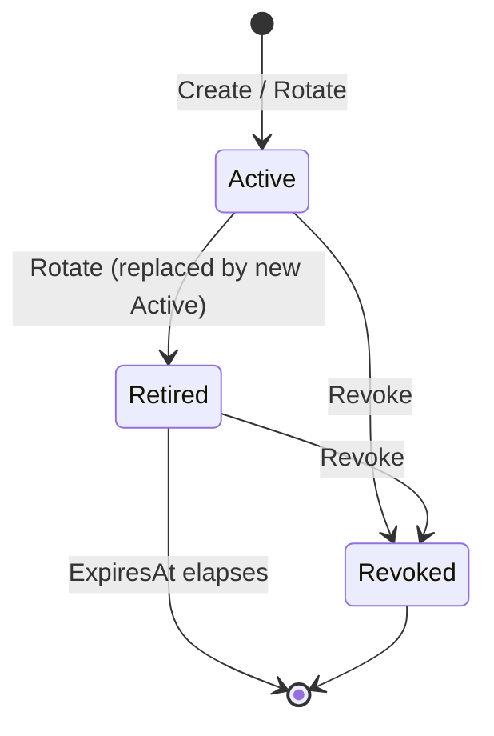
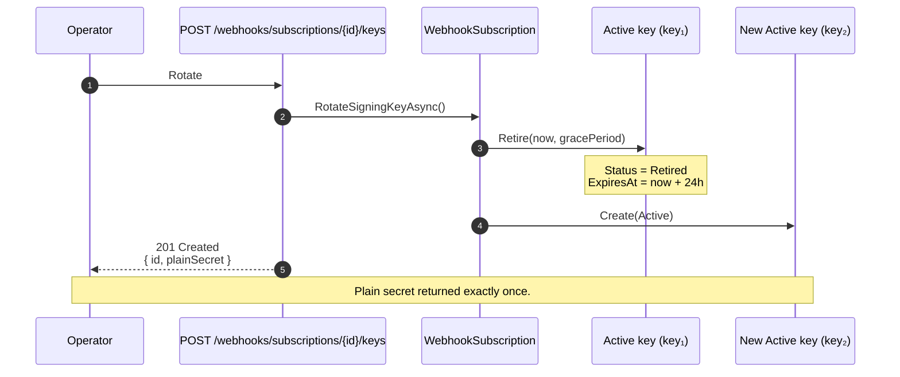

import { Aside, Tabs, TabItem, Badge } from "@astrojs/starlight/components";

## Why a dual-key model?

The legacy `WebhookSubscription.SigningSecret` field stored a single HMAC secret per
subscription. Rotating it was atomic: the old value was overwritten the moment a new
secret was minted, and any in-flight delivery still being verified by a subscriber
with the old key was rejected. Operators in regulated environments (ISO 27001 A.10.1
key management, A.8.24 cryptography) had no auditable key history, no way to grant
subscribers a grace window to switch secrets, and no way to revoke a single key
without rotating the entire subscription.

`WebhookSigningKey` replaces that field with a **proper key aggregate**: each
subscription owns a collection of keys, each with its own lifecycle, and rotation
becomes an **overlap** operation — the previous key keeps working for a configurable
grace period while the new key starts signing immediately.

<Aside type="note" title="The legacy field is still there">
`WebhookSubscription.SigningSecret` is marked obsolete but kept on the entity to
support hosts that have not yet rotated since upgrading. Verification falls back
to it when the subscription has no keys in the new collection (see
[Verification fallback](#verification-fallback) below). New subscriptions and
every rotation populate the new collection.
</Aside>

## Status lifecycle



| Status | Used to sign? | Accepted in verification? |
| ------ | :-----------: | ------------------------- |
| `Active` | Yes — the most recently rotated key signs every outbound delivery. | Always. |
| `Retired` | No. | Yes, while `ExpiresAt` is in the future. |
| `Revoked` | No. | Never. |

`Active` and `Retired` form the dual-key window. `Revoked` is the explicit kill
switch — a key the operator no longer wants accepted under any circumstance, even
if its grace period has not elapsed.

## Overlap rotation

When an operator rotates a subscription's signing key:

1. The current `Active` key transitions to `Retired` and gets `ExpiresAt = now + WebhooksOptions.RetiredKeyGracePeriod` (default **24 hours**, configurable up to 30 days).
2. A fresh `Active` key is created and immediately starts signing every new outbound delivery.
3. Subscribers that still hold the old secret can verify deliveries during the grace window, giving them time to fetch and deploy the new secret.
4. Once the grace window elapses, the retired key automatically stops being accepted in verification — no further action required.



The grace period can be overridden per rotation via the
`IWebhookSigningKeyWriter.RotateSigningKeyAsync(retiredKeyGracePeriod)` overload —
useful when an operator already knows that all subscribers have been notified and
prefers a tighter window (e.g. 10 minutes for a high-trust internal webhook).

## Verification fallback

Outbound signing always uses the `Active` key. **Inbound verification** (when a
subscriber posts back a signature for replay or webhook-relay scenarios) walks
the keys in priority order:

1. The `Active` key.
2. Any `Retired` key whose `ExpiresAt` is still in the future and which has not been `Revoked`.
3. As a last resort, the legacy `WebhookSubscription.SigningSecret` field, only when the subscription has no keys in the new collection.

The fallback rule is implemented by `WebhookSecretResolver` and ensures that
subscriptions created before the upgrade keep working until they are rotated for
the first time. Once a subscription has at least one `Active` key, the legacy
field is cleared and never read again.

<Aside type="caution" title="Plain-text secret returned exactly once">
The new key's plain-text secret is returned **only** in the rotation response.
There is no endpoint to retrieve it later — the framework persists only the
protected (encrypted via `IWebhookSecretProtector`) value. Treat this as you
would any other secret: store it in your secret manager immediately.
</Aside>

## Endpoints

The signing-key endpoints live on the same route group as the rest of
`Granit.Webhooks.Endpoints` (`MapGranitWebhooks()`). The default route prefix is
`webhooks`, so the absolute paths are `/webhooks/subscriptions/{id}/keys[/...]`.

| Method | Route | Permission | Description |
| ------ | ----- | ---------- | ----------- |
| `GET` | `/subscriptions/{id}/keys` | `Webhooks.Subscriptions.Read` | List all keys (Active, Retired, Revoked) for a subscription. |
| `POST` | `/subscriptions/{id}/keys` | `Webhooks.Subscriptions.Manage` | Initiate rotation. Returns `201` with the new key id and plain secret. |
| `DELETE` | `/subscriptions/{id}/keys/{keyId}` | `Webhooks.Subscriptions.Manage` | Revoke a specific key. Cannot revoke the last `Active` key. |

No dedicated permission family is introduced — keys are an integral part of the
subscription aggregate, so they share `Webhooks.Subscriptions.Read` /
`Webhooks.Subscriptions.Manage` (least privilege, ISO 27001 A.5.15).

### List keys

```http
GET /webhooks/subscriptions/{id}/keys
Accept: application/json
```

```json
[
  {
    "id": "8a41a4a0-...",
    "subscriptionId": "f0c2...",
    "createdAt": "2026-04-27T08:00:00Z",
    "expiresAt": null,
    "revokedAt": null,
    "lastRotationNotificationAt": null,
    "status": "Active"
  },
  {
    "id": "1b3c...",
    "subscriptionId": "f0c2...",
    "createdAt": "2026-04-26T08:00:00Z",
    "expiresAt": "2026-04-27T08:00:00Z",
    "revokedAt": null,
    "lastRotationNotificationAt": "2026-04-13T08:00:00Z",
    "status": "Retired"
  }
]
```

The protected secret is **never** included in this projection — only metadata.
`lastRotationNotificationAt` is populated by the rotation scanner (see
[`Granit.Webhooks.BackgroundJobs`](/dotnet/api/webhooks/)) and used to dedupe
`webhooks.signing_key_rotation_due` notifications.

### Rotate (create new Active key)

```http
POST /webhooks/subscriptions/{id}/keys
```

```json
{
  "id": "9d4e...",
  "subscriptionId": "f0c2...",
  "createdAt": "2026-04-27T08:00:00Z",
  "plainSecret": "<plain-text secret returned exactly once — store it now>"
}
```

Returns `201 Created`. The previous `Active` key is automatically retired with
`ExpiresAt = now + WebhooksOptions.RetiredKeyGracePeriod`. The endpoint is
idempotency-aware: pass an `Idempotency-Key` header to safely retry on transient
failures without minting two keys.

### Revoke

```http
DELETE /webhooks/subscriptions/{id}/keys/{keyId}
```

Returns `204 No Content` on success. Returns `400 Bad Request` if you attempt to
revoke the only `Active` key — rotate first to introduce a new `Active` key, then
revoke the old one. Returns `404 Not Found` if the key (or subscription) does not
exist.

## Configuration

```json
{
  "Webhooks": {
    "RetiredKeyGracePeriod": "1.00:00:00",
    "RotationLeadTimeDays": 14
  }
}
```

| Property | Default | Description |
| -------- | ------- | ----------- |
| `RetiredKeyGracePeriod` | `1.00:00:00` (24 hours) | How long a `Retired` key remains accepted in verification after rotation. Must be positive and ≤ 30 days. Override per-rotation via `RotateSigningKeyAsync(retiredKeyGracePeriod)`. |
| `RotationLeadTimeDays` | `14` | Number of days before `ExpiresAt` at which the daily rotation scanner emits `WebhookSigningKeyRotationDueEto`. Must be between 1 and 90. |

## Persistence

`WebhookSigningKey` is mapped as a child entity of `WebhookSubscription`. The
schema introduces a new `WebhookSigningKeys` table with these notable columns:

| Column | Notes |
| ------ | ----- |
| `Id` (PK) | `Guid`. |
| `SubscriptionId` (FK → `WebhookSubscriptions`) | Cascade delete with the parent subscription. |
| `ProtectedSecret` | Opaque, max 1000 chars. Format defined by the registered `IWebhookSecretProtector`. |
| `Status` | Enum (`Active=0`, `Retired=1`, `Revoked=2`). |
| `CreatedAt` / `ExpiresAt` / `RevokedAt` | UTC timestamps; `ExpiresAt` and `RevokedAt` are nullable. |
| `LastRotationNotificationAt` | Nullable; written by the rotation scanner to dedupe rotation-due notifications. |

<Aside type="caution" title="Hosts must add an EF migration">
`Granit.Webhooks.EntityFrameworkCore` ships the EF model only — it does **not**
generate migrations. After upgrading, every consuming application must add a
migration that creates `WebhookSigningKeys` (and the supporting indexes) and
applies it during deployment. Failing to do so will cause the new endpoints to
throw at runtime when they touch the missing table.
</Aside>

The legacy `WebhookSubscription.SigningSecret` column is retained intentionally —
removing it would break the [verification fallback](#verification-fallback) for
hosts that have not rotated yet. A future major version will drop the column once
all consumers have rotated at least once.

## See also

- [Webhooks](/dotnet/api/webhooks/) — core module: publisher, envelope, HMAC, retry
- [Webhook endpoints](/dotnet/api/webhooks-endpoints/) — full Minimal API surface, DTOs, permissions
- [Notifications conventions](/dotnet/infrastructure/notifications/conventions/) — `*.Notifications` package shape (the rotation-due notification ships here)
