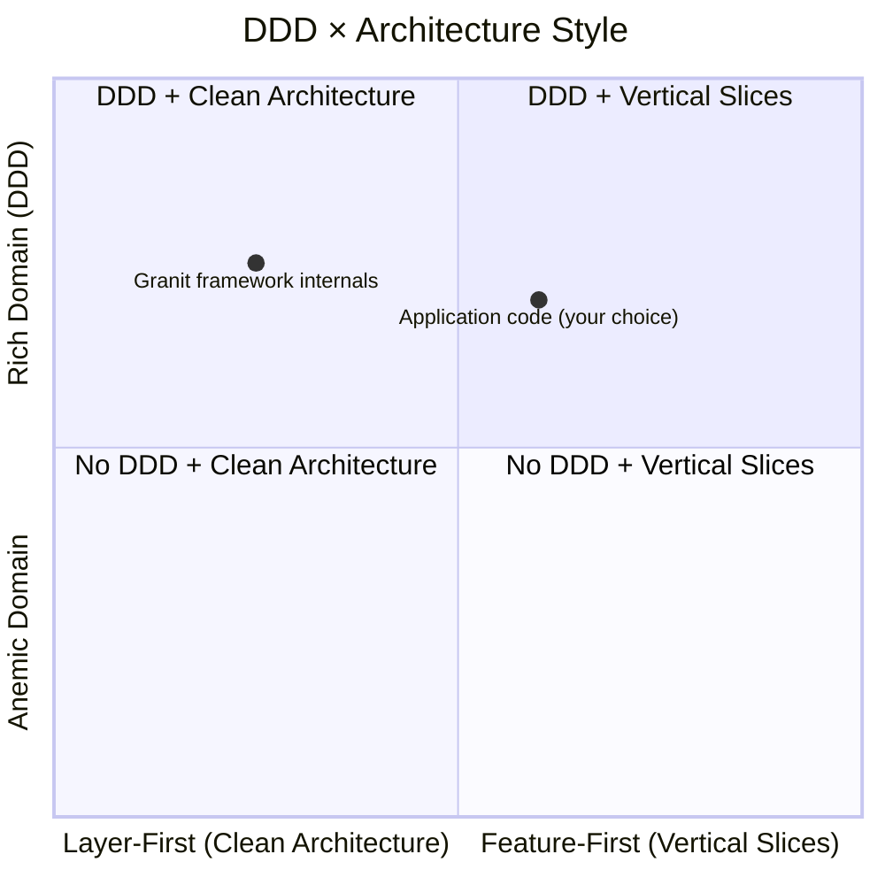
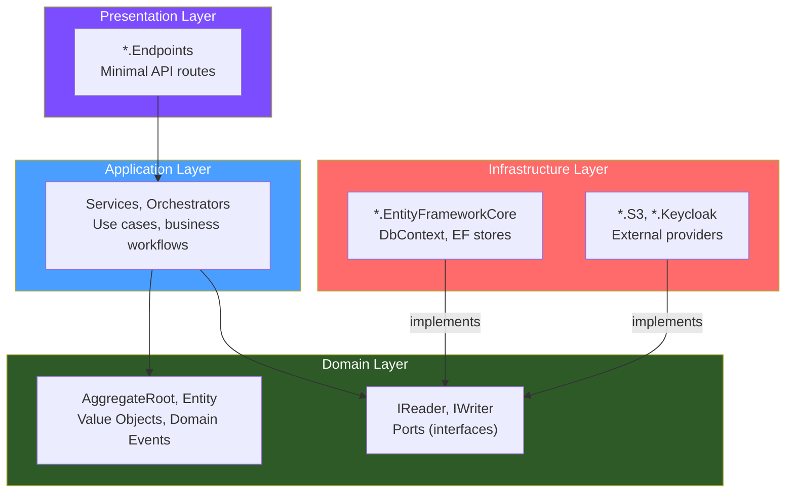
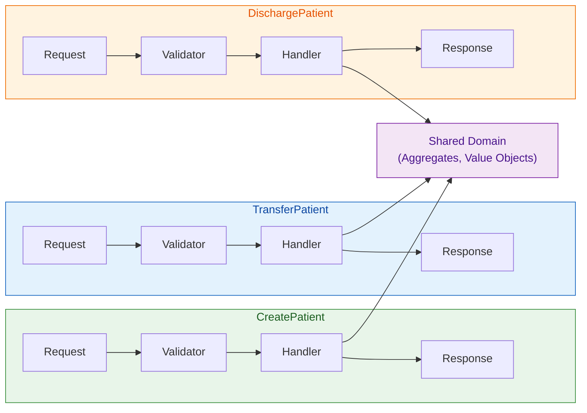

import { Tabs, TabItem } from "@astrojs/starlight/components";

Domain-Driven Design (DDD) is a **domain modeling discipline** — aggregates, value objects,
domain events, bounded contexts. It answers the question *"how do I model the business
domain?"* but says nothing about how to organize application code around that model.

That is the job of the **architecture style**: Clean Architecture and Vertical Slice
Architecture are two proven approaches. Granit supports both without structural changes.
The choice depends on your team, your domain complexity, and your delivery cadence.

## The orthogonality principle

DDD and architecture style operate on different axes. Picking one does not constrain
the other.



- **DDD** defines tactical patterns: `AggregateRoot`, `SingleValueObject<T>`,
  `IDomainEvent`, factory methods, invariant enforcement
- **Architecture style** defines code organization: by layer (Clean Architecture)
  or by feature (Vertical Slice Architecture)

Both axes are independent. You can use DDD with either style, and you can use
either style without DDD.

## Clean Architecture

Clean Architecture (Robert C. Martin) organizes code in **concentric rings**
with a strict dependency rule: dependencies always point inward. The domain
is at the center; infrastructure and presentation are at the edges.



### Mapping to Granit projects

| Clean Architecture ring | Granit project | Contains |
| --- | --- | --- |
| Domain | `Granit.{Module}` | Aggregates, value objects, interfaces (ports), events |
| Application | `Granit.{Module}` | Services, orchestrators, checkers, managers |
| Infrastructure | `Granit.{Module}.EntityFrameworkCore` | DbContext, EF stores (adapters) |
| Infrastructure | `Granit.{Module}.{Provider}` | S3, Keycloak, SMTP adapters |
| Presentation | `Granit.{Module}.Endpoints` | Minimal API routes, request/response DTOs |

:::note[Granit's internal structure IS Clean Architecture]
The framework's own module split — `Granit.BlobStorage` (domain + application),
`Granit.BlobStorage.EntityFrameworkCore` (infrastructure),
`Granit.BlobStorage.Endpoints` (presentation) — follows Clean Architecture by
design. The [Hexagonal Architecture](/dotnet/architecture/patterns/hexagonal-architecture/)
and [Layered Architecture](/dotnet/architecture/patterns/layered-architecture/) pattern
pages document this in detail.
:::

### When to choose Clean Architecture

<Tabs>
  <TabItem label="Good fit">
    - Large teams (5+ developers) working across the same domain
    - Complex domains with many cross-cutting business rules
    - Long-lived projects where testability and maintainability are critical
    - Regulatory environments requiring strict separation of concerns (GDPR, ISO 27001)
    - When the domain model is shared across many use cases
  </TabItem>
  <TabItem label="Watch out for">
    - Premature abstraction: do not create interfaces "just in case"
    - Layer ceremony: simple CRUD operations still pass through all layers
    - Horizontal changes: modifying a data field requires touching domain, application,
      infrastructure, and presentation
    - Over-injection: service constructors with 8+ dependencies signal a bloated
      application layer
  </TabItem>
</Tabs>

## Vertical Slice Architecture

Vertical Slice Architecture (Jimmy Bogard) organizes code by **feature**. Each
slice contains everything needed to handle a single use case: request, validation,
handler, persistence, and response. Slices share infrastructure but not business
logic.



### Mapping to Granit

Each Granit module is already a **coarse-grained vertical slice** (isolated DbContext,
own endpoints, own domain). Application developers building **on** Granit can go further
and organize their own modules as fine-grained vertical slices.

```text
src/App.PatientManagement/
├── Domain/
│   ├── Patient.cs                   # Shared aggregate root
│   └── ValueObjects/
│       └── MedicalRecordNumber.cs
├── Features/
│   ├── CreatePatient/
│   │   ├── CreatePatientRequest.cs
│   │   ├── CreatePatientValidator.cs
│   │   ├── CreatePatientHandler.cs
│   │   └── CreatePatientResponse.cs
│   ├── TransferPatient/
│   │   └── ...
│   └── DischargePatient/
│       └── ...
├── Persistence/
│   └── PatientManagementDbContext.cs
└── PatientManagementModule.cs
```

The [REPR pattern](/dotnet/architecture/patterns/repr/) already groups endpoints by feature,
and the [Vertical Slice Architecture](/dotnet/architecture/patterns/vertical-slice-architecture/)
pattern page documents the full approach.

### When to choose Vertical Slice Architecture

<Tabs>
  <TabItem label="Good fit">
    - Small teams (1--4 developers) shipping features independently
    - Rapid delivery cadence where changes must be localized
    - Features with distinct data needs and limited cross-cutting rules
    - Greenfield applications where you want to avoid premature abstraction
    - When each feature has a different level of complexity
  </TabItem>
  <TabItem label="Watch out for">
    - Code duplication across slices if shared logic is not extracted into the domain
    - Discovering cross-cutting invariants late — they still need a shared domain model
    - Loss of global visibility: harder to see "all the things that happen when a
      patient is admitted" when logic is spread across slices
    - Without discipline, slices can become mini-monoliths with duplicated persistence logic
  </TabItem>
</Tabs>

## Comparison

| Criterion | Clean Architecture | Vertical Slice Architecture |
| --- | --- | --- |
| Code organization | By technical layer | By feature / use case |
| Dependency direction | Always toward the center (domain) | Within the slice |
| Where DDD lives | Dedicated domain layer | Shared `Domain/` folder, used by all slices |
| Testing strategy | Mock boundaries between layers | Test each slice end-to-end |
| Change radius | Horizontal — a field change touches all layers | Vertical — a feature change touches one folder |
| Abstraction level | High — interfaces for everything | Low — abstractions only when needed |
| Team scaling | Multiple developers can own different layers | Multiple developers can own different features |
| Granit support | Native — the framework's own internal structure | Supported — REPR, CQRS, modules, and DDD building blocks all work |

## Granit's position

Granit takes an explicit stance on **framework internals** but leaves the choice
to **application developers**:

1. **Framework modules** follow Clean Architecture — hexagonal + layered structure
   with ports, adapters, and strict dependency rules. This is a deliberate choice
   for a framework consumed by many applications.

2. **Application code** built on Granit can adopt either style. The building blocks
   — `AggregateRoot`, `SingleValueObject<T>`, `IReader`/`IWriter`, `MapGranitGroup()`,
   `IDomainEvent`, `FluentValidation` — are architecture-style agnostic.

3. **Hybrid approaches** are valid. Many teams start with Clean Architecture for
   core domain modules and use VSA for simpler CRUD features. Granit's module system
   supports this: each module can follow its own internal organization.

:::tip[Start simple]
If you are unsure, start with the structure Granit already provides (Clean Architecture
via the module split). Refactor toward vertical slices when you notice that feature
changes consistently require touching multiple layers for simple operations.
:::

## Further reading

### Granit patterns

- [Hexagonal Architecture — Ports & Adapters](/dotnet/architecture/patterns/hexagonal-architecture/)
- [Layered Architecture — Module Layer Split](/dotnet/architecture/patterns/layered-architecture/)
- [Vertical Slice Architecture — Feature-Organized Code](/dotnet/architecture/patterns/vertical-slice-architecture/)
- [REPR — Request-Endpoint-Response](/dotnet/architecture/patterns/repr/)
- [CQRS — Reader/Writer Separation](/dotnet/architecture/patterns/cqrs/)
- [DDD Aggregate Roots](/dotnet/architecture/patterns/ddd-aggregate-roots/)
- [ADR-017 — DDD Aggregate Root & Value Object Strategy](/dotnet/architecture/adr/017-ddd-aggregate-value-object-strategy/)
- [Modular Monolith vs Microservices](/dotnet/concepts/modular-monolith-vs-microservices/)

### External references

- [Clean Architecture — Robert C. Martin](https://blog.cleancoder.com/uncle-bob/2012/08/13/the-clean-architecture.html)
- [Vertical Slice Architecture — Jimmy Bogard](https://www.jimmybogard.com/vertical-slice-architecture/)
- [Implementing Domain-Driven Design — Vaughn Vernon](https://www.oreilly.com/library/view/implementing-domain-driven-design/9780133039900/)
