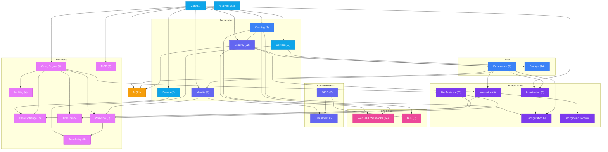
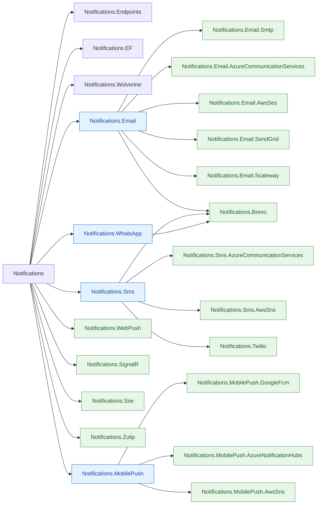
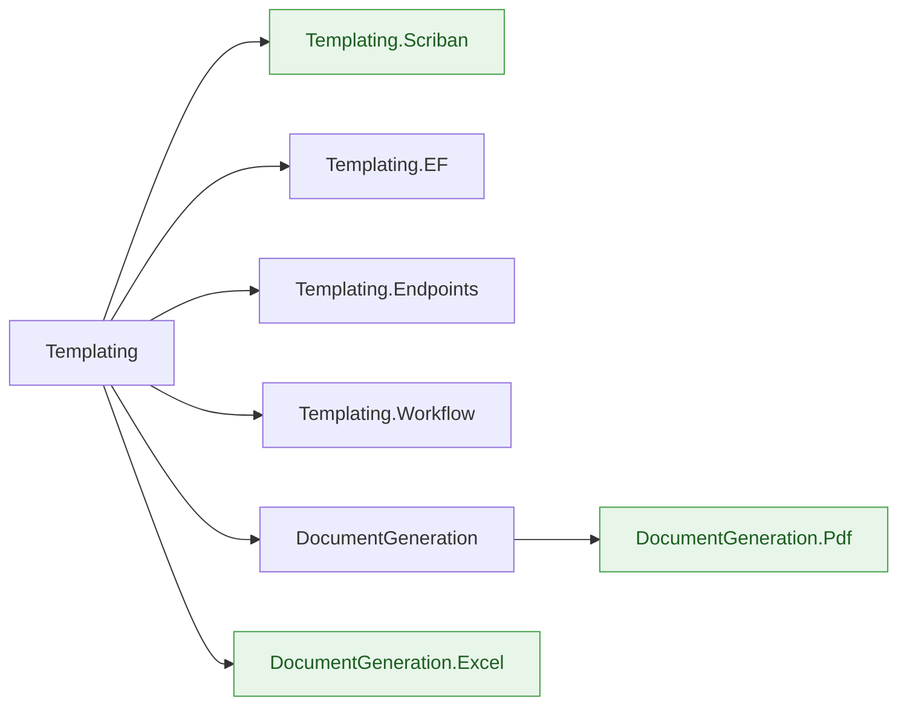
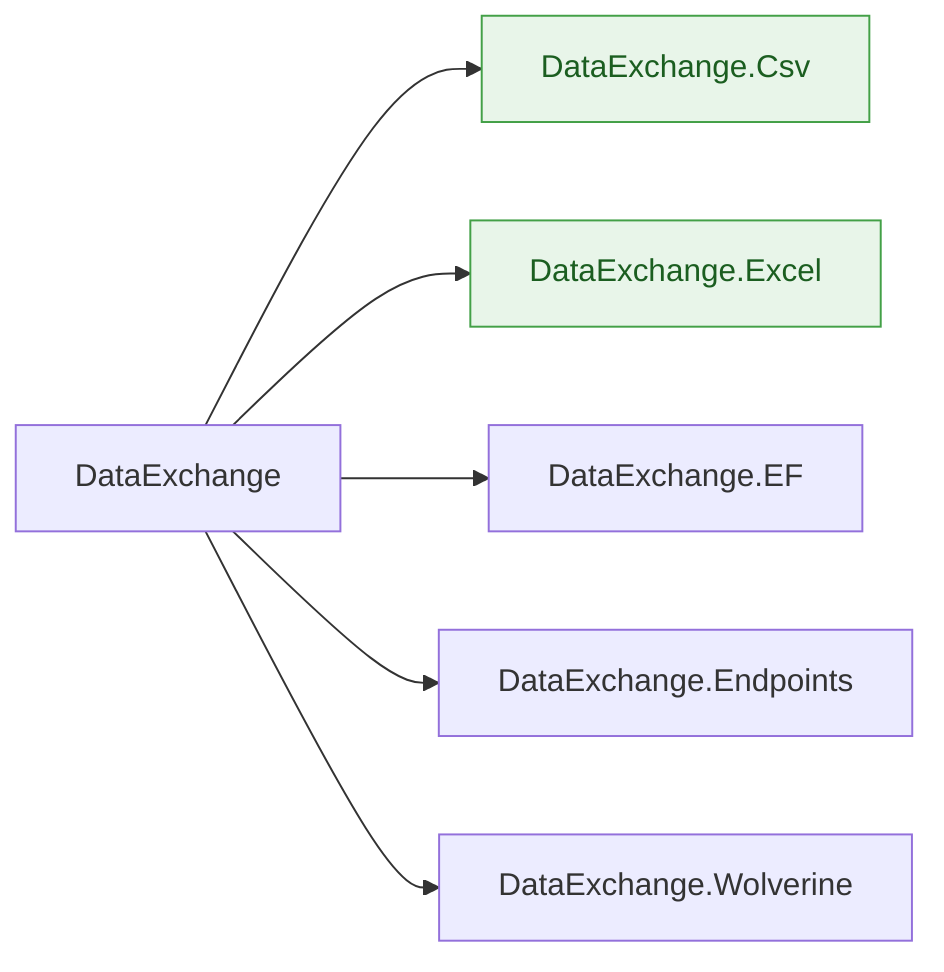
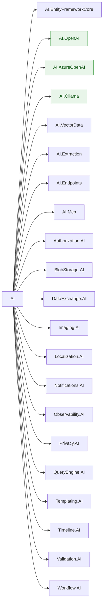

This page documents the dependency graph across all %%PACKAGE_COUNT%% Granit source packages. Arrows
indicate the direction of usage: `A --> B` means "A is used by B". `Granit`
is the root and feeds the entire tree.

Conventions used throughout this page:

- **Diagram arrows** flow from foundation to consumers (`Core → Security → Wolverine`).
  Tables still list dependencies from the consumer's perspective ("Depends on").
- Transitive dependencies on `Granit` are omitted when a package already depends
  on another module that depends on Core.
- The systematic pattern `*.Endpoints → Authorization` is omitted from the overview
  diagram (documented in the coupling rules section).
- `*.EntityFrameworkCore` packages are leaf nodes unless stated otherwise.

## High-level overview

Each node represents a functional domain with the package count in parentheses.

### Domain composition

| Domain | Packages |
|--------|----------|
| Utilities | Timing, Guids, Diagnostics, Diagnostics.Endpoints, Validation (4), Http.ExceptionHandling, Observability, MultiTenancy, Privacy (4), Cors, Bulkhead, RateLimiting, Testing (2) |
| Events | Events, Events.Wolverine |
| Identity | Identity, Identity.Endpoints, Identity.Federated (5 incl. Keycloak, EntraId, Cognito, GoogleCloud, EntityFrameworkCore), Identity.Local, Identity.Local.AspNetIdentity |
| Security | Encryption (3), Vault (5), Authentication.JwtBearer (5 incl. Keycloak, EntraId, Cognito, GoogleCloud), Authentication.ApiKeys (3), Authentication.DPoP, Authentication.OpenIddict, Authorization (3) |
| OpenIddict | OpenIddict, OpenIddict.Server, OpenIddict.Endpoints, OpenIddict.EntityFrameworkCore, OpenIddict.BackgroundJobs |
| OIDC | Oidc, Oidc.TokenManagement |
| BFF | Bff, Bff.BackgroundJobs, Bff.Endpoints, Bff.EntityFrameworkCore, Bff.Yarp |
| Configuration | Settings (3), Features (3), ReferenceData (3) |
| Web, API, and Webhooks | ApiVersioning, ApiDocumentation, Cookies (3), Http.Idempotency, Http.OutputCaching (2), Http.Resilience, Http.ResponseCompression, Http.SecurityHeaders, Webhooks (4) |
| Storage | BlobStorage (11 incl. AI, BackgroundJobs, Database, Endpoints), Imaging (3) |
| Persistence | Persistence, Persistence.Hosting, Persistence.Migrations (2), Persistence.Postgres, Persistence.SqlServer |
| Caching | Caching, Caching.StackExchangeRedis |
| Background Jobs | BackgroundJobs (4) |
| Localization | Localization, Localization.EntityFrameworkCore, Localization.Endpoints, Localization.SourceGenerator |
| Templating | Templating (5), DocumentGeneration (3) |
| Notifications | Notifications (4), Email (6), Sms (3), WhatsApp, WebPush, SignalR, Sse, Zulip, Brevo, Twilio, MobilePush (4) |
| Auditing | Auditing (4), AuditLog (4) |
| MCP | Mcp, Mcp.Client, Mcp.Server |
| Workflow | Workflow (4), Workflow.Notifications |
| Timeline | Timeline (4), Timeline.Notifications |
| DataExchange | DataExchange (5), DataExchange.Wolverine |
| QueryEngine | QueryEngine, QueryEngine.AspNetCore, QueryEngine.EntityFrameworkCore |
| Wolverine | Wolverine, Wolverine.Postgresql, Wolverine.SqlServer |
| AI | AI (8 incl. Endpoints, Mcp, VectorData, Extraction), and 13 cross-cutting `*.AI` packages |
| Analyzers | Analyzers, Analyzers.CodeFixes |

## Core layer dependencies

The backbone of the framework: security, distributed cache, and data persistence.

```mermaid
flowchart TD
    CORE["Core"]

    subgraph Primitives
        TIMING["Timing"]
        GUIDS["Guids"]
        EXC["ExceptionHandling"]
        ENCR["Encryption"]
    end

    subgraph Security
        JWT["Authentication.JwtBearer"]
        KC["Authentication.JwtBearer.Keycloak"]
        ENTRA["Authentication.JwtBearer.EntraId"]
        COGNITO["Authentication.JwtBearer.Cognito"]
        GC_AUTH["Authentication.JwtBearer.GoogleCloud"]
        APIKEYS["Authentication.ApiKeys"]
        APIKEYS_EP["Authentication.ApiKeys.Endpoints"]
        APIKEYS_EF["Authentication.ApiKeys.EntityFrameworkCore"]
    end

    subgraph Authorization
        AUTHZ["Authorization"]
        AUTHZ_EF["Authorization.EF"]
        AUTHZ_EP["Authorization.Endpoints"]
    end

    subgraph Caching
        CACHE["Caching"]
        CACHE_REDIS["Caching.Redis"]
    end

    subgraph Persistence
        PERS["Persistence"]
        PERS_MIG["Persistence.Migrations"]
        PERS_MIG_WOL["Persistence.Migrations.Wolverine"]
    end

    subgraph Wolverine
        WOL["Wolverine"]
        WOL_PG["Wolverine.Postgresql"]
        WOL_SQL["Wolverine.SqlServer"]
    end

    CORE --> Primitives
    CORE --> SEC
    CORE --> CACHE

    ENCR --> VAULT["Vault"]
    VAULT --> VAULT_HC["Vault.HashiCorp"]
    VAULT --> VAULT_AZ["Vault.Azure"]
    VAULT --> VAULT_AW["Vault.Aws"]
    VAULT --> VAULT_GC["Vault.GoogleCloud"]
    TIMING --> GUIDS

    SEC --> JWT
    JWT --> KC
    JWT --> ENTRA
    JWT --> COGNITO
    JWT --> GC_AUTH
    SEC --> APIKEYS
    APIKEYS --> APIKEYS_EP
    APIKEYS --> APIKEYS_EF

    SEC --> AUTHZ
    CACHE --> AUTHZ
    AUTHZ --> AUTHZ_EF
    AUTHZ --> AUTHZ_EP

    CACHE --> CACHE_REDIS

    GUIDS --> PERS
    SEC --> PERS
    EXC --> PERS
    PERS --> PERS_MIG
    PERS_MIG --> PERS_MIG_WOL

    SEC --> WOL
    WOL --> WOL_PG
    WOL --> WOL_SQL
    WOL --> PERS_MIG_WOL
    PERS --> WOL_PG
    PERS --> WOL_SQL

    style KC fill:#e8f5e9,stroke:#43a047,color:#1b5e20
    style ENTRA fill:#e8f5e9,stroke:#43a047,color:#1b5e20
    style COGNITO fill:#e8f5e9,stroke:#43a047,color:#1b5e20
    style GC_AUTH fill:#e8f5e9,stroke:#43a047,color:#1b5e20
    style VAULT_HC fill:#e8f5e9,stroke:#43a047,color:#1b5e20
    style VAULT_AZ fill:#e8f5e9,stroke:#43a047,color:#1b5e20
    style VAULT_AW fill:#e8f5e9,stroke:#43a047,color:#1b5e20
    style VAULT_GC fill:#e8f5e9,stroke:#43a047,color:#1b5e20
    style CACHE_REDIS fill:#e8f5e9,stroke:#43a047,color:#1b5e20
    style WOL_PG fill:#e8f5e9,stroke:#43a047,color:#1b5e20
    style WOL_SQL fill:#e8f5e9,stroke:#43a047,color:#1b5e20
```

### Utilities (flat dependencies)

| Package | Depends on |
|---------|------------|
| `Granit.Timing` | `Core` |
| `Granit.Http.ExceptionHandling` | `Core` |
| `Granit.Observability` | `Core` |
| `Granit.MultiTenancy` | `Core` |
| `Granit.Privacy` | `Core` |
| `Granit.Http.Cors` | `Core` |
| `Granit.Guids` | `Timing` |
| `Granit.Diagnostics` | `Timing` |
| `Granit.Diagnostics.Endpoints` | `Diagnostics`, `Authorization` |
| `Granit.Testing` | `Core` |
| `Granit.Testing.EntityFrameworkCore` | `Testing`, `Persistence` |
| `Granit.Validation` | `ExceptionHandling`, `Localization` |
| `Granit.Validation.Endpoints` | `Validation`, `Authorization` |
| `Granit.Validation.Europe` | `Validation`, `Localization` |
| `Granit.Validation.NorthAmerica` | `Validation`, `Localization` |
| `Granit.Validation.UnitedKingdom` | `Validation`, `Localization` |
| `Granit.Http.Bulkhead` | `Core`, `ExceptionHandling`, `Features`, `Security` |
| `Granit.RateLimiting` | `Core`, `ExceptionHandling`, `Features`, `Security` |

### Events

| Package | Depends on |
|---------|------------|
| `Granit.Events` | `Core` |
| `Granit.Events.Wolverine` | `Events`, `Wolverine` |

### Identity

| Package | Depends on |
|---------|------------|
| `Granit.Identity` | `Core`, `QueryEngine` |
| `Granit.Identity.Endpoints` | `Identity`, `Authorization` |
| `Granit.Identity.Federated` | `Identity` |
| `Granit.Identity.Federated.Keycloak` | `Identity.Federated` |
| `Granit.Identity.Federated.EntraId` | `Identity.Federated`, `Timing` |
| `Granit.Identity.Federated.Cognito` | `Identity.Federated` |
| `Granit.Identity.Federated.GoogleCloud` | `Identity.Federated` |
| `Granit.Identity.Federated.EntityFrameworkCore` | `Identity.Federated`, `Persistence` |
| `Granit.Identity.Local` | `Identity`, `Events`, `Guids`, `Timing` |
| `Granit.Identity.Local.AspNetIdentity` | `Identity`, `Identity.Local` |

### Localization

| Package | Depends on |
|---------|------------|
| `Granit.Localization` | `Core` |
| `Granit.Localization.EntityFrameworkCore` | `Localization`, `Persistence` |
| `Granit.Localization.Endpoints` | `Localization`, `Authorization` |
| `Granit.Localization.SourceGenerator` | none (source generator) |

### Configuration (Settings, Features, ReferenceData)

| Package | Depends on |
|---------|------------|
| `Granit.Settings` | `Caching`, `Encryption`, `Events` |
| `Granit.Settings.EntityFrameworkCore` | `Settings`, `Persistence` |
| `Granit.Settings.Endpoints` | `Settings`, `Authorization`, `Timing`, `Validation` |
| `Granit.Features` | `Caching`, `Localization` |
| `Granit.Features.EntityFrameworkCore` | `Features`, `Persistence` |
| `Granit.Features.Endpoints` | `Features`, `Authorization` |
| `Granit.ReferenceData` | `QueryEngine` |
| `Granit.ReferenceData.Endpoints` | `ReferenceData` |
| `Granit.ReferenceData.EntityFrameworkCore` | `ReferenceData`, `Persistence` |

### Web, API, and Webhooks

| Package | Depends on |
|---------|------------|
| `Granit.Http.ApiVersioning` | `Core` |
| `Granit.Http.ApiDocumentation` | `ApiVersioning`, `Security` |
| `Granit.Http.Cookies` | `Timing` |
| `Granit.Http.Cookies.Klaro` | `Cookies` |
| `Granit.Http.Cookies.Endpoints` | `Cookies`, `Core` |
| `Granit.Http.Idempotency` | `Caching`, `Security` |
| `Granit.Http.OutputCaching` | `Core` |
| `Granit.Http.OutputCaching.StackExchangeRedis` | `OutputCaching` |
| `Granit.Http.Resilience` | `Core` |
| `Granit.Http.ResponseCompression` | `Core` |
| `Granit.Http.SecurityHeaders` | `Core` |
| `Granit.Webhooks` | `Core`, `Guids`, `Http.Resilience`, `Encryption`, `Timing` |
| `Granit.Webhooks.EntityFrameworkCore` | `Webhooks`, `Persistence` |
| `Granit.Webhooks.Endpoints` | `Webhooks`, `Authorization` |
| `Granit.Webhooks.Wolverine` | `Webhooks`, `Wolverine` |

### Persistence

| Package | Depends on |
|---------|------------|
| `Granit.Persistence` | `Core`, `Guids`, `ExceptionHandling`, `Security` |
| `Granit.Persistence.Migrations` | `Persistence` |
| `Granit.Persistence.Migrations.Wolverine` | `Persistence.Migrations`, `Wolverine` |
| `Granit.Persistence.Hosting` | `Persistence`, `Persistence.Migrations` |
| `Granit.Persistence.Postgres` | `Persistence.Hosting` |
| `Granit.Persistence.SqlServer` | `Persistence.Hosting` |

### Storage and Imaging

| Package | Depends on |
|---------|------------|
| `Granit.BlobStorage` | `Core`, `Guids` |
| `Granit.BlobStorage.S3` | `BlobStorage` |
| `Granit.BlobStorage.AzureBlob` | `BlobStorage` |
| `Granit.BlobStorage.GoogleCloud` | `BlobStorage` |
| `Granit.BlobStorage.FileSystem` | `BlobStorage` |
| `Granit.BlobStorage.Database` | `BlobStorage`, `Persistence` |
| `Granit.BlobStorage.Proxy` | `BlobStorage` |
| `Granit.BlobStorage.EntityFrameworkCore` | `BlobStorage`, `Persistence` |
| `Granit.BlobStorage.BackgroundJobs` | `BlobStorage`, `BackgroundJobs` |
| `Granit.BlobStorage.Endpoints` | `BlobStorage`, `Authorization`, `QueryEngine.AspNetCore`, `RateLimiting`, `Validation` |
| `Granit.Imaging` | `Core` |
| `Granit.Imaging.MagickNet` | `Imaging` |

## Messaging and notification layer

### Notifications

Fan-out multi-channel engine with Brevo as a unified aggregator across Email, SMS,
and WhatsApp.

### Templating and Document Generation

Template engine (Scriban) with document rendering pipeline (HTML-to-PDF, Excel).

| Package | Depends on |
|---------|------------|
| `Granit.Templating` | `Timing` |
| `Granit.Templating.Scriban` | `Templating` |
| `Granit.Templating.EntityFrameworkCore` | `Templating` |
| `Granit.Templating.Endpoints` | `Templating`, `Authorization` |
| `Granit.Templating.Workflow` | `Templating`, `Workflow` |
| `Granit.DocumentGeneration` | `Templating` |
| `Granit.DocumentGeneration.Pdf` | `DocumentGeneration` |
| `Granit.DocumentGeneration.Excel` | `Templating` |

### Workflow and Timeline

These two domains share cross-module dependencies with Notifications and Identity.

| Package | Depends on |
|---------|------------|
| `Granit.Workflow` | `QueryEngine`, `Timing` |
| `Granit.Workflow.EntityFrameworkCore` | `Workflow`, `Persistence` |
| `Granit.Workflow.Endpoints` | `Workflow`, `Authorization` |
| `Granit.Workflow.Notifications` | `Workflow`, `Authorization`, `Identity`, `Notifications` |
| `Granit.Timeline` | `Core`, `Guids`, `QueryEngine`, `Timing` |
| `Granit.Timeline.EntityFrameworkCore` | `Timeline`, `Persistence` |
| `Granit.Timeline.Endpoints` | `Timeline`, `Authorization` |
| `Granit.Timeline.Notifications` | `Timeline`, `Notifications` |

### Background Jobs

| Package | Depends on |
|---------|------------|
| `Granit.BackgroundJobs` | `Core`, `Guids`, `Timing` |
| `Granit.BackgroundJobs.EntityFrameworkCore` | `BackgroundJobs` |
| `Granit.BackgroundJobs.Endpoints` | `BackgroundJobs`, `Authorization` |
| `Granit.BackgroundJobs.Wolverine` | `BackgroundJobs`, `Wolverine` |

### QueryEngine

| Package | Depends on |
|---------|------------|
| `Granit.QueryEngine` | `Core` |
| `Granit.QueryEngine.AspNetCore` | `QueryEngine`, `Authorization` |
| `Granit.QueryEngine.EntityFrameworkCore` | `QueryEngine`, `Persistence` |

### DataExchange

Import/export pipeline with format adapters (CSV, Excel) and async processing via Wolverine.

| Package | Depends on |
|---------|------------|
| `Granit.DataExchange` | `Events`, `Guids`, `QueryEngine`, `Timing`, `Validation` |
| `Granit.DataExchange.Csv` | `DataExchange` |
| `Granit.DataExchange.Excel` | `DataExchange` |
| `Granit.DataExchange.EntityFrameworkCore` | `DataExchange`, `Persistence` |
| `Granit.DataExchange.Endpoints` | `DataExchange`, `Authorization` |
| `Granit.DataExchange.Wolverine` | `DataExchange`, `Wolverine` |

### Auditing

| Package | Depends on |
|---------|------------|
| `Granit.Auditing` | `Core`, `QueryEngine` |
| `Granit.Auditing.ConfigurationChanges` | `Auditing`, `Features`, `Guids`, `Settings` |
| `Granit.Auditing.EntityFrameworkCore` | `Auditing`, `Caching`, `Persistence` |
| `Granit.Auditing.Endpoints` | `Auditing`, `Authorization`, `Validation` |

### Privacy and Encryption extensions

| Package | Depends on |
|---------|------------|
| `Granit.Privacy` | `Core` |
| `Granit.Privacy.BackgroundJobs` | `Privacy`, `BackgroundJobs` |
| `Granit.Privacy.Endpoints` | `Privacy`, `Authorization`, `Validation` |
| `Granit.Privacy.Notifications` | `Privacy`, `Notifications` |
| `Granit.Encryption.EntityFrameworkCore` | `Core`, `Encryption`, `Persistence` |
| `Granit.Encryption.BackgroundJobs` | `Encryption.EntityFrameworkCore` |

### Auth server (OpenIddict, OIDC, BFF)

| Package | Depends on |
|---------|------------|
| `Granit.Oidc` | `Core`, `Caching`, `Timing` |
| `Granit.Oidc.TokenManagement` | `Oidc`, `Caching`, `Timing` |
| `Granit.OpenIddict` | `Identity.Local`, `QueryEngine` |
| `Granit.OpenIddict.Server` | `OpenIddict` |
| `Granit.OpenIddict.EntityFrameworkCore` | `OpenIddict.Server`, `Encryption`, `Identity.Local`, `MultiTenancy`, `Persistence` |
| `Granit.OpenIddict.Endpoints` | `OpenIddict`, `OpenIddict.Server`, `Authorization`, `Caching`, `QueryEngine`, `Validation` |
| `Granit.OpenIddict.BackgroundJobs` | `OpenIddict`, `BackgroundJobs`, `Caching`, `Settings` |
| `Granit.Authentication.OpenIddict` | `OpenIddict` |
| `Granit.Authentication.DPoP` | `Core` |
| `Granit.Bff` | `Core`, `Caching`, `Oidc`, `Timing` |
| `Granit.Bff.Endpoints` | `Bff`, `Caching`, `Cookies`, `Oidc`, `Validation` |
| `Granit.Bff.EntityFrameworkCore` | `Bff`, `Encryption`, `Guids`, `Persistence` |
| `Granit.Bff.BackgroundJobs` | `Bff.EntityFrameworkCore`, `BackgroundJobs` |
| `Granit.Bff.Yarp` | `Bff`, `Oidc` |

### MCP

| Package | Depends on |
|---------|------------|
| `Granit.Mcp` | `Core` |
| `Granit.Mcp.Client` | `Mcp` |
| `Granit.Mcp.Server` | `Mcp`, `Authorization` |

### AI

Provider-agnostic AI layer built on `Microsoft.Extensions.AI`. Core provider packages plus
thirteen cross-cutting `*.AI` packages that add AI capabilities to existing modules.

| Package | Depends on |
|---------|------------|
| `Granit.AI` | `Core`, `Guids` |
| `Granit.AI.EntityFrameworkCore` | `AI`, `Persistence` |
| `Granit.AI.OpenAI` | `AI` |
| `Granit.AI.AzureOpenAI` | `AI` |
| `Granit.AI.Ollama` | `AI` |
| `Granit.AI.VectorData` | `AI` |
| `Granit.AI.Extraction` | `AI` |
| `Granit.AI.Endpoints` | `AI`, `Authorization` |
| `Granit.AI.Mcp` | `AI`, `Mcp` |
| `Granit.Authorization.AI` | `AI`, `Authorization` |
| `Granit.BlobStorage.AI` | `AI`, `BlobStorage` |
| `Granit.DataExchange.AI` | `AI`, `DataExchange` |
| `Granit.Imaging.AI` | `AI`, `Imaging` |
| `Granit.Localization.AI` | `AI`, `Localization` |
| `Granit.Notifications.AI` | `AI`, `Notifications` |
| `Granit.Observability.AI` | `AI`, `Observability` |
| `Granit.Privacy.AI` | `AI`, `Privacy` |
| `Granit.QueryEngine.AI` | `AI`, `QueryEngine` |
| `Granit.Templating.AI` | `AI`, `Templating` |
| `Granit.Timeline.AI` | `AI`, `Timeline` |
| `Granit.Validation.AI` | `AI`, `Validation` |
| `Granit.Workflow.AI` | `AI`, `Workflow` |

### Analyzers

| Package | Depends on |
|---------|------------|
| `Granit.Analyzers` | none (Roslyn analyzer) |
| `Granit.Analyzers.CodeFixes` | `Analyzers` |

## Soft dependencies

Several core interfaces live in `Granit` rather than in their dedicated module.
This allows any package to consume them without taking a hard reference to the
implementing module. The implementing module registers the real service; without it, a
null-object default is used.

| Interface | Declared in | Implemented by | Default behavior |
|-----------|-------------|----------------|------------------|
| `ICurrentTenant` | `Granit` | `Granit.MultiTenancy` | `NullTenantContext` (`IsAvailable = false`) |
| `ICurrentUserService` | `Granit` | `Granit.Authentication.JwtBearer` | `SystemCurrentUserService` |
| `ILocalEventBus` | `Granit` | `Granit.Events` | In-process dispatcher |
| `IDistributedEventBus` | `Granit` | `Granit.Events` | In-process fallback |
| `IDomainEventDispatcher` | `Granit` | `Granit.Events.Wolverine` | `NullDomainEventDispatcher` |
| `IDataFilter` | `Granit` | `Granit.Persistence` | No-op (all data visible) |

Modules that access `ICurrentTenant` use `using Granit.MultiTenancy;` and check
`IsAvailable` before reading `Id`. They do NOT declare `[DependsOn(typeof(GranitMultiTenancyModule))]`
or add a `ProjectReference` to `Granit.MultiTenancy`. The only exception is modules that
must enforce strict tenant isolation (e.g., BlobStorage for GDPR compliance).

## Bundle composition

Six meta-packages provide curated sets of modules for common application profiles.
Bundles contain no code -- they are `ProjectReference`-only `.csproj` files.

### Granit.Bundle.Essentials

Minimal API foundation.

| Included package |
|------------------|
| `Granit` |
| `Granit.Timing` |
| `Granit.Guids` |
| `Granit.Validation` |
| `Granit.Persistence` |
| `Granit.Observability` |
| `Granit.Http.Cors` |
| `Granit.Http.ExceptionHandling` |
| `Granit.Http.ResponseCompression` |
| `Granit.Http.SecurityHeaders` |
| `Granit.Diagnostics` |

### Granit.Bundle.Api

Complete REST API. Includes everything in `Bundle.Essentials` plus:

| Included package |
|------------------|
| `Granit.Http.ApiVersioning` |
| `Granit.Http.ApiDocumentation` |
| `Granit.Http.Idempotency` |
| `Granit.Localization` |
| `Granit.Localization.EntityFrameworkCore` |
| `Granit.Caching.StackExchangeRedis` |

### Granit.Bundle.Documents

Templating and document generation pipeline.

| Included package |
|------------------|
| `Granit.Templating` |
| `Granit.Templating.Scriban` |
| `Granit.Templating.EntityFrameworkCore` |
| `Granit.DocumentGeneration` |
| `Granit.DocumentGeneration.Pdf` |
| `Granit.DocumentGeneration.Excel` |

### Granit.Bundle.Notifications

Multi-channel notification engine with default channels.

| Included package |
|------------------|
| `Granit.Notifications` |
| `Granit.Notifications.EntityFrameworkCore` |
| `Granit.Notifications.Endpoints` |
| `Granit.Notifications.Email` |
| `Granit.Notifications.Email.Smtp` |
| `Granit.Notifications.SignalR` |

### Granit.Bundle.SaaS

Multi-tenant SaaS extensions.

| Included package |
|------------------|
| `Granit.MultiTenancy` |
| `Granit.Features` |
| `Granit.Features.EntityFrameworkCore` |
| `Granit.RateLimiting` |
| `Granit.Http.Bulkhead` |

### Granit.Bundle.OpenIddict

OpenID Connect server with local identity management.

| Included package |
|------------------|
| `Granit.Authentication.OpenIddict` |
| `Granit.OpenIddict` |
| `Granit.OpenIddict.Server` |
| `Granit.OpenIddict.EntityFrameworkCore` |
| `Granit.Identity.Local.AspNetIdentity` |
| `Granit.OpenIddict.Endpoints` |
| `Granit.OpenIddict.BackgroundJobs` |

## Dependency rules

These invariants are enforced by `Granit.ArchitectureTests` and apply to every package
in the repository.

1. **Core depends on nothing.** It is the root of the entire graph.

2. **Zero circular references.** The graph is a strict DAG (directed acyclic graph).
   The build will fail if a cycle is introduced.

3. **One project = one NuGet package.** The namespace matches the project name. No
   assembly contains types from another package's namespace.

4. **Functional packages never reference `*.EntityFrameworkCore` packages.** Abstractions
   live in the base package; EF Core implementations live in the `*.EntityFrameworkCore`
   companion. This keeps the base package ORM-agnostic.

5. **`*.Endpoints` packages depend on `Granit.Authorization`.** Every endpoint package
   uses `RequireAuthorization()` or policy-based authorization. This is a systematic
   pattern omitted from the diagrams for readability.

6. **Wolverine is the sole message bus.** All asynchronous processing flows through
   Wolverine: Notifications, Webhooks, BackgroundJobs, DataExchange.Wolverine,
   Persistence.Migrations.Wolverine.

7. **`Persistence.Migrations` is decoupled from Wolverine.** Batch dispatch is abstracted
   via `IMigrationBatchDispatcher` (Channel-based by default, Wolverine optional via
   `Granit.Persistence.Migrations.Wolverine`).

8. **Multi-tenancy is a soft dependency.** Modules use `ICurrentTenant` from
   `Granit.MultiTenancy` without referencing `Granit.MultiTenancy`. Hard dependency
   is reserved for strict tenant isolation (BlobStorage, GDPR).

## Graph properties

- **%%PACKAGE_COUNT%% source packages**, zero circular dependencies
- **Maximum depth**: 5 levels (e.g., Core → Security → Wolverine → Notifications →
  Email → Smtp, or Core → AI → AI.OpenAI → cross-cutting *.AI packages)
- **Leaf packages**: `*.EntityFrameworkCore`, `*.S3`, `*.GoogleCloud`, `*.AI` packages
  are almost always leaves
- **Root packages with no dependencies**: `Granit`, `Granit.Analyzers`,
  `Granit.Localization.SourceGenerator`
- **6 bundle meta-packages**: Essentials, Api, Documents, Notifications, SaaS, OpenIddict

## Intentional design decisions

Several patterns in the dependency graph may look like anomalies during an audit but
are deliberate choices.

### Isolated DbContext packages

Seven `*.EntityFrameworkCore` packages use an autonomous `DbContext` via
`IDbContextFactory` instead of the application `DbContext` managed by
`Granit.Persistence`: Authorization, BackgroundJobs, Localization, Features, Settings,
Webhooks, BlobStorage.

These modules manage infrastructure data (not business entities), use `IDbContextFactory`
for thread safety with parallel Wolverine handlers, and do not need
`AuditedEntityInterceptor` or `SoftDeleteInterceptor`.

### DataExchange depends on QueryEngine

The coupling is export-only: `DataExchange` reads `QueryDefinition` metadata to generate
tabular exports (columns, filters, sort). The import pipeline uses no QueryEngine types.

### DocumentGeneration.Excel depends on Templating

The XLSX package (ClosedXML) bypasses the HTML-to-render pipeline because XLSX is a
binary format. It references `Templating` for `ITextTemplateRenderer` (Scriban cell
rendering) and the polymorphic `RenderedContent` types.

### Notifications.Endpoints without RBAC

All notification endpoints are per-user self-service operations (inbox, preferences,
subscriptions). Each endpoint filters by `GetUserId(user)` and cannot access another
user's data. `.RequireAuthorization()` without a RBAC policy is sufficient.
