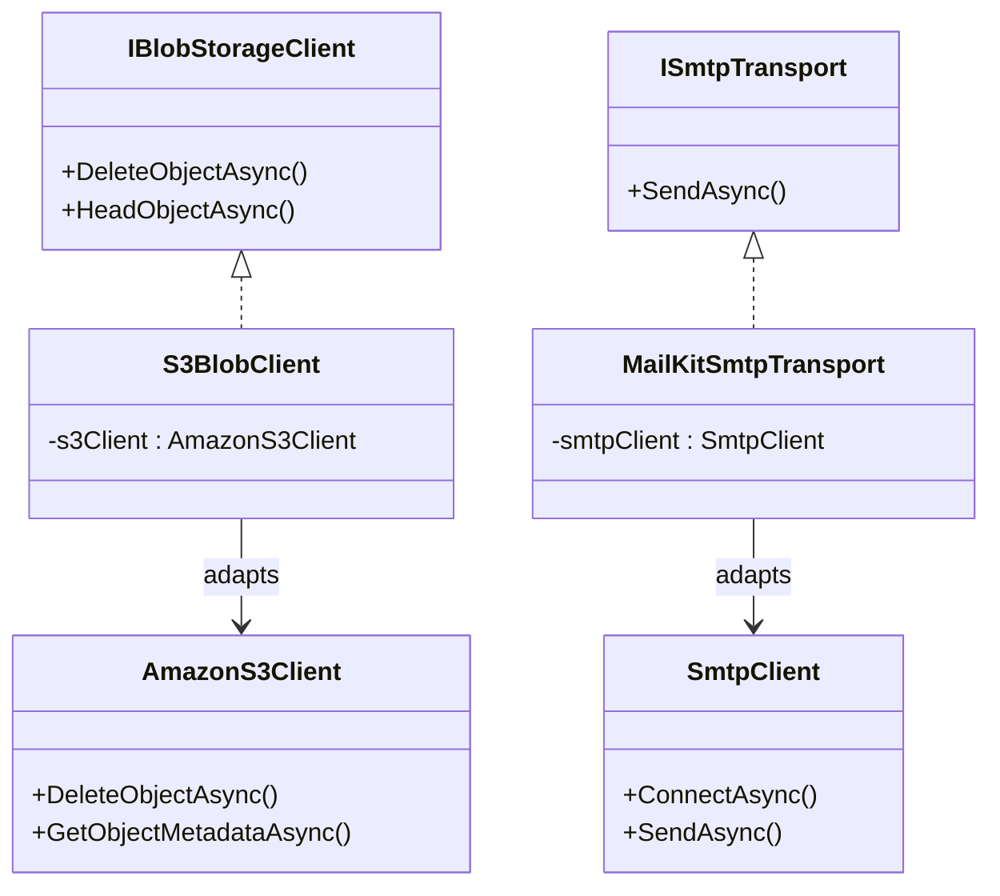

## Definition

The Adapter pattern converts the interface of an existing class into the
interface expected by the client, allowing incompatible components to
collaborate. The adapter wraps the existing class and translates calls.

## Diagram



## Implementation in Granit

| Adapter | File | Target interface | Adapted class |
|---------|------|------------------|---------------|
| `S3BlobClient` | `src/Granit.BlobStorage.S3/Internal/S3BlobClient.cs` | `IBlobStorageClient` | `AmazonS3Client` (AWS SDK) |
| `MailKitSmtpTransport` | `src/Granit.Notifications.Email.Smtp/MailKitSmtpTransport.cs` | `ISmtpTransport` | `SmtpClient` (MailKit, sealed) |

## Rationale

`S3BlobClient` isolates the framework from the AWS SDK, allowing provider
changes (European hosting, MinIO) without touching the core.
`MailKitSmtpTransport` wraps the sealed MailKit `SmtpClient` behind a
testable `ISmtpTransport` interface.

## Usage example

```csharp
// Replacing S3 with MinIO -- only the adapter changes
services.AddSingleton<IBlobStorageClient, MinioBlobClient>();

// The rest of the application code remains unchanged
IBlobStorage blobStorage = serviceProvider.GetRequiredService<IBlobStorage>();
PresignedUploadTicket ticket = await blobStorage.InitiateUploadAsync(
    "medical-documents",
    new BlobUploadRequest("mri-report.pdf", "application/pdf", MaxAllowedBytes: 50_000_000),
    cancellationToken);
```

## Further reading

- [Adapter -- refactoring.guru](https://refactoring.guru/design-patterns/adapter)
