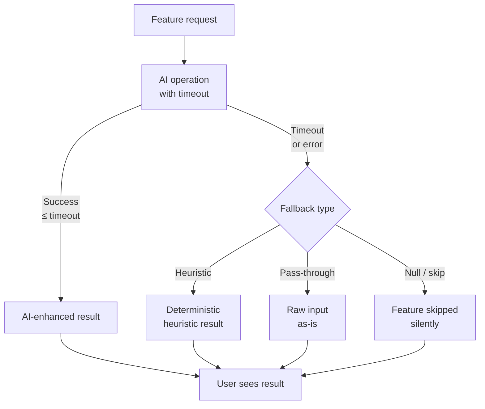

## Definition

**Graceful AI Fallback** is a resilience pattern for AI-enhanced features: every
AI operation is bounded by a short timeout, and failure (timeout, provider error,
incomprehensible response) silently falls back to a deterministic baseline. The user
experience degrades gracefully — from AI-enhanced to standard — rather than failing
with an error.

The pattern is the AI-specific application of the [Circuit Breaker and Retry](./circuit-breaker-retry/)
pattern: when the AI "circuit" opens, the fallback path takes over without bubbling
an exception to the caller.

## Diagram



## Implementation in Granit

The pattern appears consistently in all cross-cutting `*.AI` packages. Two timeout
tiers are used depending on user-facing latency sensitivity:

| Package | Timeout | Fallback |
|---------|---------|---------|
| `Granit.QueryEngine.AI` | 2 s | Pass phrase as `QueryRequest.Search` (full-text) |
| `Granit.DataExchange.AI` | 5 s | Heuristic `IMappingSuggestionService` |
| `Granit.Validation.AI` | 1 s | Skip AI check, return valid |
| `Granit.Notifications.AI` | 3 s | Use static template |
| `Granit.Privacy.AI` | 5 s | Conservative: mark field as potentially containing PII |

### QueryEngine.AI — NLQ fallback

```csharp
internal sealed class AINaturalLanguageQueryTranslator(
    IAIChatClientFactory factory,
    ILogger<AINaturalLanguageQueryTranslator> logger)
    : INaturalLanguageQueryTranslator
{
    public async Task<QueryRequest?> TranslateAsync(
        string phrase, QueryDefinition definition, CancellationToken ct)
    {
        using var cts = CancellationTokenSource.CreateLinkedTokenSource(ct);
        cts.CancelAfter(TimeSpan.FromSeconds(2));

        try
        {
            var workspace = await factory.CreateAsync("default", cts.Token);
            // ... build prompt from QueryDefinition metadata ...
            var response = await workspace.Chat.CompleteAsync<QueryRequest>(
                messages, cancellationToken: cts.Token);
            return response.Result;
        }
        catch (OperationCanceledException) when (!ct.IsCancellationRequested)
        {
            // Timeout — not user cancellation
            logger.AIQueryTranslationTimeout(phrase);
            return null;   // caller falls back to QueryRequest.Search = phrase
        }
        catch (Exception ex)
        {
            logger.AIQueryTranslationError(phrase, ex);
            return null;
        }
    }
}
```

### DataExchange.AI — heuristic fallback

```csharp
internal sealed class AIMappingSuggestionService(
    IAIChatClientFactory factory,
    IMappingSuggestionService heuristic,   // injected baseline
    ILogger<AIMappingSuggestionService> logger)
    : IMappingSuggestionService
{
    public async Task<MappingSuggestion[]> SuggestAsync(
        ImportPreview preview, ImportDefinition definition, CancellationToken ct)
    {
        using var cts = CancellationTokenSource.CreateLinkedTokenSource(ct);
        cts.CancelAfter(TimeSpan.FromSeconds(5));

        try
        {
            return await SuggestWithAIAsync(preview, definition, cts.Token);
        }
        catch (Exception ex) when (ex is not OperationCanceledException { CancellationToken: var c }
                                   || c == cts.Token)
        {
            logger.AIMappingFallback(ex.Message);
            return await heuristic.SuggestAsync(preview, definition, ct);
        }
    }
}
```

### Key conventions

1. **Short, separate `CancellationTokenSource`** — always linked to the caller's
   token so user cancellation still propagates, but the AI timeout is independent.
2. **Distinguish timeout from user cancellation** — check `!ct.IsCancellationRequested`
   before swallowing `OperationCanceledException`.
3. **Log at `Warning`, never `Error`** — a fallback is expected behavior, not a failure.
4. **Return `null` or the baseline, never throw** — the caller controls the user
   experience after a fallback.
5. **Configurable unavailability score** — for security-sensitive modules
   (e.g., `Authorization.AI`), the fallback returns a configurable `UnavailableRiskScore`
   (default `0.5` = "uncertain") rather than a hard-coded zero. This lets operators
   choose fail-open (`0.0`), fail-closed (`1.0`), or middle-ground (`0.5`) via config.

### Reference files

| File | Role |
|------|------|
| `src/Granit.QueryEngine.AI/AINaturalLanguageQueryTranslator.cs` | 2s timeout + null fallback |
| `src/Granit.DataExchange.AI/AIMappingSuggestionService.cs` | 5s timeout + heuristic fallback |
| `src/Granit.Validation.AI/AIContentModerationValidator.cs` | 1s timeout + pass-through |

## Rationale

| Problem | Graceful AI Fallback solution |
|---------|-------------------------------|
| LLM latency spikes block user requests | Hard timeout prevents unbounded wait |
| Provider outage breaks the feature | Fallback ensures feature remains usable |
| AI error propagates as 500 to user | Exception swallowed, baseline returned |
| Debugging silenced errors | `Warning` log with full context for observability |

## Further reading

- [Circuit Breaker and Retry](./circuit-breaker-retry/) — the underlying resilience pattern
- [AI module overview](/dotnet/ai/) — workspace and timeout configuration
- [QueryEngine.AI — Natural Language Query](/dotnet/ai/natural-language-query/)
- [DataExchange.AI — AI-assisted import mapping](/dotnet/ai/import-mapping/)
