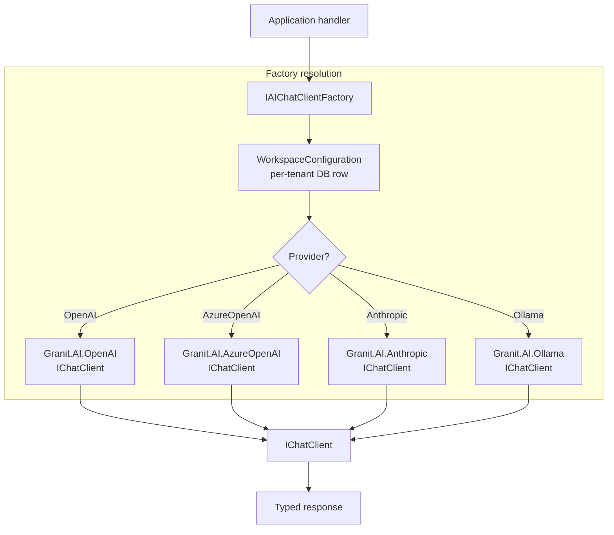

## Definition

The **AI Workspace** pattern provides named, per-tenant AI provider configurations
resolved at runtime through a central factory. It is the `IHttpClientFactory` pattern
applied to AI clients: each named workspace encapsulates a provider (OpenAI,
AzureOpenAI, Anthropic, Ollama), model selection, API credentials, and usage limits.
Callers request a workspace by name; the factory resolves the correct `IChatClient`
and `IEmbeddingGenerator` transparently.

This decouples application logic from the choice of provider — switching a tenant
from GPT-4o to Claude requires only a configuration change, not code change.

## Diagram



## Implementation in Granit

`Granit.AI` registers `IAIChatClientFactory` via `AddGranitAI()`. Provider packages
register their factory implementations (e.g., `AddGranitAIOpenAI()`).

### Core interface

```csharp
// Granit.AI
public interface IAIChatClientFactory
{
    Task<AIWorkspace> CreateAsync(
        string workspaceId,
        CancellationToken ct = default);
}

public sealed record AIWorkspace(
    IChatClient Chat,
    IEmbeddingGenerator<string, Embedding<float>>? Embeddings,
    AIWorkspaceOptions Options);
```

### Workspace configuration

Workspaces are defined per application (or per tenant) in `appsettings.json`
or in the database via `Granit.AI.EntityFrameworkCore`:

```json
{
  "AI": {
    "Workspaces": {
      "default": {
        "Provider": "OpenAI",
        "Model": "gpt-4o",
        "EmbeddingModel": "text-embedding-3-small"
      },
      "compliance": {
        "Provider": "AzureOpenAI",
        "Endpoint": "https://my-eu.openai.azure.com/",
        "Deployment": "gpt-4o-eu",
        "EmbeddingModel": "text-embedding-3-large"
      },
      "local-dev": {
        "Provider": "Ollama",
        "Model": "llama3.2"
      }
    }
  }
}
```

### Usage

```csharp
public class SummaryService(IAIChatClientFactory factory)
{
    public async Task<string> SummarizeAsync(
        string text, string tenantWorkspaceId, CancellationToken ct)
    {
        var workspace = await factory.CreateAsync(tenantWorkspaceId, ct);

        var response = await workspace.Chat.CompleteAsync(
        [
            new ChatMessage(ChatRole.System, "Summarize the following text in 3 bullet points."),
            new ChatMessage(ChatRole.User, text),
        ], cancellationToken: ct);

        return response.Message.Text ?? string.Empty;
    }
}
```

### Multi-tenancy integration

When `Granit.MultiTenancy` is registered, `IAIChatClientFactory` resolves the
workspace configuration for the current tenant automatically — overriding the
application-level default with a tenant-specific provider or model.

### Model capabilities

Each workspace response includes computed `AIModelCapabilities` resolved from the
provider's model catalog at read time. Core capabilities are strongly typed; provider-specific
features use an extensible `Extensions` set:

```csharp
public sealed record AIModelCapabilities
{
    public bool Chat { get; init; } = true;
    public bool Embeddings { get; init; }
    public bool Vision { get; init; }
    public bool ImageGeneration { get; init; }
    public bool Audio { get; init; }
    public bool ToolUse { get; init; }
    public bool Streaming { get; init; } = true;
    public bool StructuredOutput { get; init; }

    // Provider-specific extensions (web search, code interpreter, etc.)
    public IReadOnlySet<string> Extensions { get; init; } = new HashSet<string>();
}
```

The frontend can use these capabilities to conditionally enable or disable UI features
(e.g., hide the file attachment button when `Vision` is `false`).

### Module setup

```csharp
[DependsOn(typeof(GranitAIModule))]
[DependsOn(typeof(GranitAIOpenAIModule))]   // add providers as needed
[DependsOn(typeof(GranitAIAzureOpenAIModule))]
public class AppModule : GranitModule { }
```

### Reference files

| File | Role |
|------|------|
| `src/Granit.AI/IAIChatClientFactory.cs` | Factory interface |
| `src/Granit.AI/AIWorkspace.cs` | Resolved workspace record |
| `src/Granit.AI/GranitAIOptions.cs` | Top-level options with workspace dictionary |
| `src/Granit.AI.EntityFrameworkCore/` | DB-persisted workspace configurations |

## Rationale

| Problem | AI Workspace solution |
|---------|-----------------------|
| Hard-coded provider in application code | Named workspaces resolved at runtime |
| Same provider for all tenants | Per-tenant workspace override |
| API key management scattered across services | Centralized in workspace config + Vault |
| Switching provider requires code change | Configuration-only change |
| Test isolation | Inject `Ollama` workspace in tests, `OpenAI` in production |

## Further reading

- [AI module overview](/dotnet/ai/) — full workspace and provider documentation
- [AI Workspace pattern — Microsoft Extensions.AI](https://devblogs.microsoft.com/dotnet/introducing-microsoft-extensions-ai-preview/)
- [Factory Method](./factory-method/) — the GoF pattern underlying workspace creation
