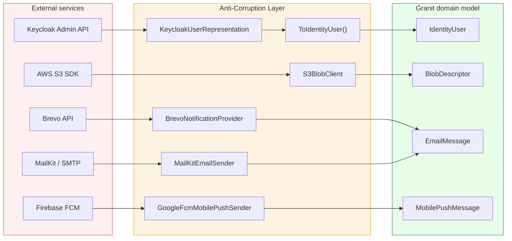

## Definition

The Anti-Corruption Layer (ACL) isolates the internal domain model from
external models (third-party APIs, SDKs, legacy formats). A translation layer
converts external DTOs into Granit domain types, preventing foreign concepts
from "polluting" the framework core.

## Diagram



## Implementation in Granit

### Keycloak -- the most comprehensive case

`Granit.Identity.Keycloak` is the framework's canonical ACL. Keycloak responses
are deserialized into `internal` DTOs (`KeycloakUserRepresentation`,
`KeycloakSessionRepresentation`, etc.) then converted to domain models via
`private static` methods:

```csharp
// External DTO (internal, never exposed)
internal sealed record KeycloakUserRepresentation(
    [property: JsonPropertyName("id")] string Id,
    [property: JsonPropertyName("username")] string Username,
    [property: JsonPropertyName("email")] string? Email,
    // ...
);

// Conversion to domain model
private static IdentityUser ToIdentityUser(KeycloakUserRepresentation user) =>
    new(user.Id, user.Username, user.Email, user.FirstName, user.LastName,
        user.Enabled, FlattenAttributes(user.Attributes));
```

**Specifics**:

- `FlattenAttributes()` -- converts Keycloak `Dictionary(string, List(string))`
  to Granit `Dictionary(string, string)` (multi-value attributes to single value)
- `ToIdentitySession()` -- converts Unix timestamps (milliseconds) to `DateTimeOffset`
- `ToIdentityGroup()` -- recursive mapping for subgroups

### Claims transformation (JWT)

`KeycloakClaimsTransformation` and `EntraIdClaimsTransformation` extract roles
from proprietary JSON structures (`realm_access.roles`,
`resource_access.{client}.roles`) and convert them to standard .NET
`ClaimTypes.Role` claims.

### ACL inventory in Granit

| External service | ACL package | External DTO to internal model |
| --- | --- | --- |
| Keycloak Admin API | `Granit.Identity.Keycloak` | `KeycloakUserRepresentation` to `IdentityUser` |
| Keycloak JWT | `Granit.Authentication.JwtBearer.Keycloak` | JSON `realm_access` to `ClaimTypes.Role` |
| Entra ID JWT | `Granit.Authentication.JwtBearer.EntraId` | JSON `roles` (v1.0/v2.0) to `ClaimTypes.Role` |
| AWS S3 SDK | `Granit.BlobStorage.S3` | `GetPreSignedUrlRequest` from `BlobUploadRequest` |
| MailKit SMTP | `Granit.Notifications.Email.Smtp` | `MimeMessage` from `EmailMessage` |
| Brevo API | `Granit.Notifications.Brevo` | JSON payload from `EmailMessage` / `SmsMessage` / `WhatsAppMessage` |
| Firebase FCM | `Granit.Notifications.MobilePush.GoogleFcm` | `FcmPayload` from `MobilePushMessage` |
| ImageMagick | `Granit.Imaging.MagickNet` | `MagickFormat` to/from `ImageFormat` (bidirectional) |
| Import systems | `Granit.DataExchange.EntityFrameworkCore` | External ID (Odoo `__export__`) to internal Entity ID |

### Architectural principles

1. **External DTOs are `internal`** -- never exposed outside the adapter package
2. **Conversion methods are `private static`** -- isolated from the rest of the code
3. **Error transformation** -- external errors are parsed and encapsulated in domain exceptions
4. **Graceful degradation** -- reads log a warning and return `null`; writes propagate the exception
5. **`[ExcludeFromCodeCoverage]`** -- on adapters requiring a live service (S3, SMTP)

### Reference files

| File | Role |
| --- | --- |
| `src/Granit.Identity.Keycloak/Internal/KeycloakIdentityProvider.cs` | Primary ACL (9 conversion methods) |
| `src/Granit.Identity.Keycloak/Internal/KeycloakUserRepresentation.cs` | Keycloak external DTO |
| `src/Granit.Authentication.JwtBearer.Keycloak/Authentication/KeycloakClaimsTransformation.cs` | JWT claims to Role |
| `src/Granit.BlobStorage.S3/Internal/S3BlobClient.cs` | S3 adapter |
| `src/Granit.Notifications.Email.Smtp/Internal/MailKitEmailSender.cs` | SMTP adapter |
| `src/Granit.Notifications.Brevo/Internal/BrevoNotificationProvider.cs` | Multi-channel Brevo |
| `src/Granit.Notifications.MobilePush.GoogleFcm/Internal/GoogleFcmMobilePushSender.cs` | FCM adapter |
| `src/Granit.Imaging.MagickNet/Internal/MagickFormatMapper.cs` | Image format mapping |

## Rationale

| Problem | ACL solution |
| --- | --- |
| Keycloak models in the domain = tight coupling | `internal` DTOs + static conversion |
| Keycloak API change = impact across the entire codebase | Only the adapter changes, the domain remains stable |
| JWT claims format differs between Keycloak and Entra ID | Dedicated transformations, unified `ClaimTypes.Role` model |
| Multi-value Keycloak attributes vs single-value Granit | `FlattenAttributes()` in the ACL |
| Unix timestamps (ms) in Keycloak vs `DateTimeOffset` in .NET | Conversion in `ToIdentitySession()` |

## Usage example

```csharp
// The endpoint only knows the IdentityUser domain model,
// never the Keycloak DTOs

private static async Task<Results<Ok<IdentityUser>, NotFound>> GetUserAsync(
    string userId,
    IIdentityProvider identityProvider,
    CancellationToken cancellationToken)
{
    // IIdentityProvider is implemented by KeycloakIdentityProvider
    // which does: API call > KeycloakUserRepresentation > ToIdentityUser()
    IdentityUser? user = await identityProvider
        .FindByIdAsync(userId, cancellationToken)
        .ConfigureAwait(false);

    return user is not null
        ? TypedResults.Ok(user)
        : TypedResults.NotFound();
}
```

## Further reading

- [Anti-Corruption Layer -- Microsoft Cloud Design Patterns](https://learn.microsoft.com/en-us/azure/dotnet/architecture/patterns/anti-corruption-layer)
