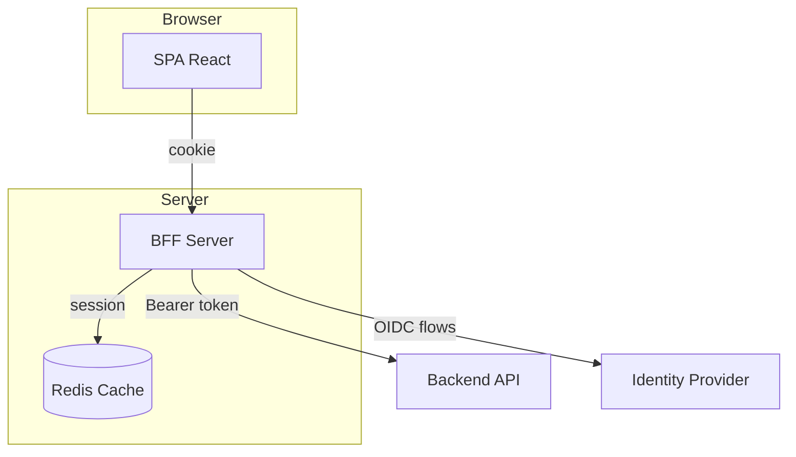
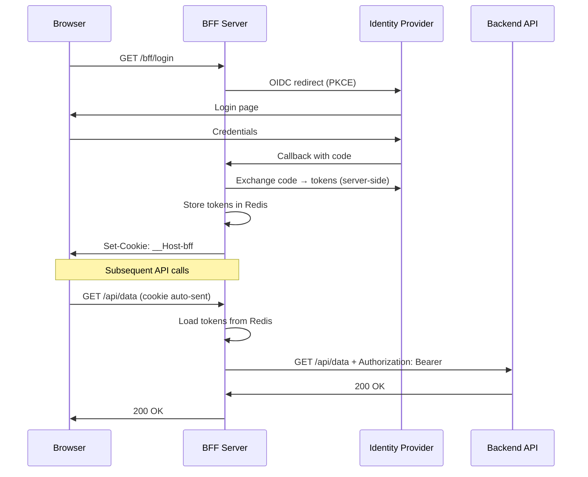

## Backends For Frontends (BFF) Pattern

The Backend For Frontend (BFF) pattern inserts a server-side proxy between a
Single Page Application (SPA) and the identity provider. The proxy performs
the OIDC authentication flow, stores tokens server-side, and attaches them
to upstream API calls. The browser only sees an HTTP-only session cookie —
tokens never reach JavaScript.

Recommended by the [OAuth 2.0 for Browser-Based Apps](https://datatracker.ietf.org/doc/html/draft-ietf-oauth-browser-based-apps)
specification. Implemented by Duende BFF, Azure AD BFF, and Granit.Bff.

## Diagram



## The problem

SPAs using `authorization_code + PKCE` store tokens in `localStorage`.
**Any XSS vulnerability gives an attacker full access to the user's tokens.**

Even a compromised npm dependency (supply-chain attack) can read
`localStorage.getItem('access_token')` and exfiltrate it.

## How it works



## Granit implementation

Three packages following the standard Granit module anatomy:

| Package | Purpose |
|---------|---------|
| `Granit.Bff` | Token store (Redis), CSRF (HMAC-SHA256), session cookies, diagnostics |
| `Granit.Bff.Endpoints` | `/bff/login`, `/bff/logout`, `/bff/user`, `/bff/csrf-token` |
| `Granit.Bff.Yarp` | YARP reverse proxy with automatic Bearer token injection |

### Key features

- **Multi-frontend** — serve multiple SPAs (Admin, Patient, Médecin) from one
  backend, each with isolated cookies, sessions, and OIDC clients
- **Automatic silent refresh** — tokens refreshed server-side before expiry,
  transparent to the SPA
- **CSRF protection** — HMAC-SHA256 double-submit cookie pattern, validated
  before proxying mutations
- **YARP hybrid routing** — `Granit.Bff.RequireAuth` metadata controls which
  routes get token injection; others proxied as-is
- **Provider agnostic** — works with OpenIddict, Keycloak, Entra ID, any OIDC

### Security properties

| Property | Implementation |
|----------|----------------|
| XSS protection | Tokens never in browser, cookies `HttpOnly` |
| CSRF protection | `X-CSRF-Token` header required on mutations |
| Cookie security | `__Host-` prefix, `Secure`, `SameSite=Strict` |
| Token storage | Redis, encrypted via `ICacheValueEncryptor` |
| Clickjacking | `X-Frame-Options: DENY` on login routes |

## When to use

| Scenario | Use BFF? |
|----------|:--------:|
| React/Vue/Angular SPA | **Yes** |
| Next.js (SSR) | No — tokens server-side natively |
| Mobile app (iOS/Android) | No — secure Keychain, no XSS |
| API-to-API (M2M) | No — use `client_credentials` |
| Blazor Server | No — tokens server-side natively |

## Configuration example

```json
{
  "Bff": {
    "Authority": "https://auth.example.com",
    "Frontends": [
      {
        "Name": "admin",
        "ClientId": "my-admin-bff",
        "ClientSecret": "...",
        "PathPrefix": "/admin",
        "StaticFilesPath": "wwwroot/admin"
      }
    ]
  }
}
```

## Key files

| File | Purpose |
|------|---------|
| `src/Granit.Bff/Options/GranitBffOptions.cs` | Options + `BffFrontendOptions` |
| `src/Granit.Bff/IBffTokenStore.cs` | Token storage interface |
| `src/Granit.Bff/IBffCsrfTokenGenerator.cs` | CSRF token interface |
| `src/Granit.Bff.Endpoints/Extensions/BffEndpointRouteBuilderExtensions.cs` | Endpoint registration |
| `src/Granit.Bff.Yarp/Internal/BffTokenInjectionTransform.cs` | YARP token injection |

## Related

- [BFF full documentation](/dotnet/security/bff/) — complete guide with getting started, architecture, security
- [Metadata pattern](/dotnet/architecture/patterns/metadata/) — entity extensibility
- [Cache-Aside pattern](/dotnet/architecture/patterns/cache-aside/) — FusionCache for token storage
