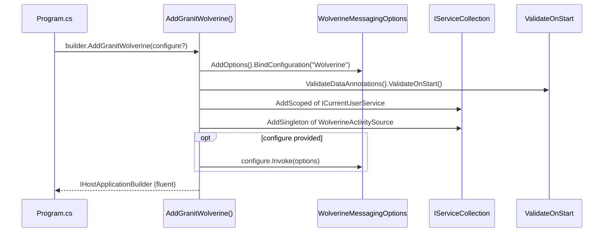

## Definition

The Builder pattern separates the construction of a complex object from its
representation, enabling different configurations via a fluent interface. In
Granit, this pattern manifests in the `AddGranit*()` extension methods that
configure services module by module.

## Diagram



## Implementation in Granit

Each module exposes an `AddGranit*()` extension method:

| Extension | File | Receiver |
|-----------|------|----------|
| `AddGranit<TModule>()` | `src/Granit/Extensions/GranitHostBuilderExtensions.cs` | `IHostApplicationBuilder` |
| `AddGranitWolverine()` | `src/Granit.Wolverine/Extensions/WolverineHostApplicationBuilderExtensions.cs` | `IHostApplicationBuilder` |
| `AddGranitBackgroundJobs()` | `src/Granit.BackgroundJobs/Extensions/BackgroundJobsHostApplicationBuilderExtensions.cs` | `IHostApplicationBuilder` |
| `AddGranitFeatures()` | `src/Granit.Features/ServiceCollectionExtensions.cs` | `IServiceCollection` |
| `AddGranitLocalization()` | `src/Granit.Localization/Extensions/LocalizationServiceCollectionExtensions.cs` | `IServiceCollection` |

**Audit note**: the signatures are not yet symmetric across modules (see
finding C2 in the critical dashboard). The target is the
`AddOptions<T>().BindConfiguration().ValidateOnStart()` pattern.

## Rationale

The Builder allows each NuGet package to self-configure without the host
application needing to know internal details. A single call replaces dozens
of DI registration lines.

## Usage example

```csharp
WebApplicationBuilder builder = WebApplication.CreateBuilder(args);

// One call per module -- fluent and composable
builder.AddGranit<MyAppHostModule>();
// Internally, the ModuleLoader calls AddGranitWolverine(),
// AddGranitPersistence(), AddGranitFeatures(), etc.
// in topological dependency order
```

## Further reading

- [Builder -- refactoring.guru](https://refactoring.guru/design-patterns/builder)
