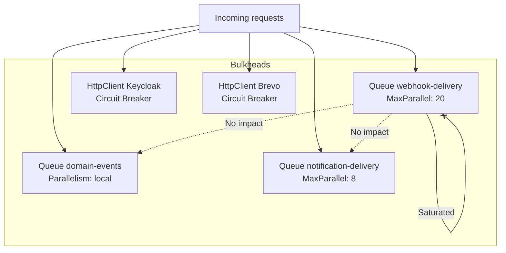
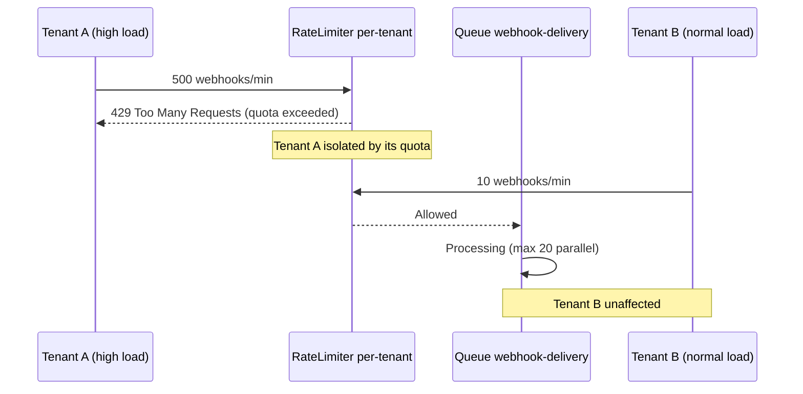

## Definition

The **Bulkhead** (watertight compartment) isolates system resources into
independent compartments, so that a failure or overload in one compartment does
not propagate to others. In a multi-tenant SaaS context, the pattern prevents
a greedy tenant, a slow notification channel, or a failing external service from
degrading the entire platform. Granit implements this pattern through a combination
of mechanisms: Wolverine queue partitioning, per-pipeline parallelism limits,
per-tenant quota isolation, and HTTP circuit breakers.

## Diagram





## Implementation in Granit

Granit implements Bulkhead Isolation through 5 complementary mechanisms, each
targeting a different isolation level:

### 1. Queue partitioning -- isolation by message type (Wolverine)

Messages are routed to dedicated queues with controlled parallelism. Each queue
operates as an independent compartment.

| Queue | Messages | Isolation |
| --- | --- | --- |
| `domain-events` | `IDomainEvent` | Local only, never routed to an external transport |
| `notification-delivery` | `DeliverNotificationCommand` | Configurable parallelism (default: 8) |
| `webhook-delivery` | `SendWebhookCommand` | Configurable parallelism (default: 20) |
| Error queue (DLQ) | `ValidationException` | Deterministic failures, no retry |

```csharp
// Explicit routing to local queue (AddGranitWolverine)
opts.PublishMessage<Core.Events.IDomainEvent>()
    .ToLocalQueue("domain-events");
```

### 2. MaxParallelDeliveries -- concurrency limits per pipeline

Each delivery pipeline limits the number of simultaneous operations, preventing
a saturated channel from consuming all pod resources.

| Module | Parameter | Default | Range |
| --- | --- | --- | --- |
| `Granit.Notifications` | `MaxParallelDeliveries` | 8 | 1--100 |
| `Granit.Webhooks` | `MaxParallelDeliveries` | 20 | 1--100 |

### 3. Per-tenant rate limiting -- quota isolation by tenant

`Granit.RateLimiting` partitions Redis counters by tenant. Each tenant has its
own independent counters -- a tenant can never consume another's quota.

| Element | Detail |
| --- | --- |
| Redis key | `{prefix}:{tenantId}:{policyName}` |
| Hash tag | `{tenantId}` guarantees co-location in Redis Cluster |
| Bypass | Configurable exempt roles |

### 4. Circuit breaker -- external HTTP service isolation

`AddStandardResilienceHandler()` (Microsoft.Extensions.Http.Resilience) is
applied to each `HttpClient` targeting an external service. When an external
service is down, the circuit opens and requests fail immediately without
consuming resources.

| Service | Circuit Breaker | Retry | Timeout |
| --- | --- | --- | --- |
| Keycloak Admin API | Yes | 3 attempts, exponential backoff | 30s / 2min |
| Brevo API | Yes | 3 attempts, exponential backoff | 30s / 2min |

```csharp
// Each external HttpClient is isolated by its own circuit breaker
services.AddHttpClient("keycloak-admin")
    .AddStandardResilienceHandler();
```

### 5. SemaphoreSlim -- anti-stampede per resource

Shared resources (token cache) use `SemaphoreSlim(1, 1)` to serialize
concurrent access. This mechanism prevents a request spike from generating N
parallel calls to the same external service. For distributed caching, FusionCache
provides native stampede protection (no manual `SemaphoreSlim` needed).

| Component | Protected resource | Pattern |
| --- | --- | --- |
| `KeycloakAdminTokenService` | Keycloak token | Double-check locking |
| FusionCache | Distributed cache | Native stampede protection |

### 6. Channel-based isolation -- Webhooks

The `WebhookDispatchWorker` uses two separate `System.Threading.Channels.Channel(T)`
to isolate the fan-out phase (trigger to commands) from the delivery phase
(command to HTTP POST). Both phases execute in parallel via `Task.WhenAll()`
without interference.

### Reference files

| File | Role |
| --- | --- |
| `src/Granit.Wolverine/Extensions/WolverineHostApplicationBuilderExtensions.cs` | Queue routing for domain-events |
| `src/Granit.RateLimiting/Internal/TenantPartitionedRateLimiter.cs` | Per-tenant isolation |
| `src/Granit.Identity.Keycloak/Internal/KeycloakAdminTokenService.cs` | SemaphoreSlim anti-stampede |
| `src/Granit.Caching/` | FusionCache native stampede protection |
| `src/Granit.Webhooks/Internal/WebhookDispatchWorker.cs` | Separate trigger/delivery channels |

## Rationale

| Problem | Solution |
| --- | --- |
| Webhook to a slow service blocks notifications | Separate queues with independent parallelism |
| Greedy tenant saturates the API for everyone | Quota counters partitioned by tenant |
| Down external service consumes threads | Circuit breaker cuts calls after threshold |
| Simultaneous cache miss = N calls to the provider | SemaphoreSlim serializes, only one call passes |
| Webhook fan-out blocks the delivery phase | Separate channels for trigger vs delivery |

## Usage example

```csharp
// --- Isolation by Wolverine queue ---
// IDomainEvent -> dedicated local queue, no interference with integration events
opts.PublishMessage<Core.Events.IDomainEvent>()
    .ToLocalQueue("domain-events");

// --- Configurable parallelism per module ---
// appsettings.json
// {
//   "Webhooks": { "MaxParallelDeliveries": 20 },
//   "Notifications": { "MaxParallelDeliveries": 8 }
// }

// --- Circuit breaker per external service ---
services.AddHttpClient("keycloak-admin", client =>
    client.BaseAddress = new Uri(keycloakUrl))
    .AddStandardResilienceHandler();

// --- Per-tenant rate limiting (automatic isolation) ---
app.MapGet("/api/v1/patients", GetPatientsAsync)
   .RequireGranitRateLimiting("api");
// Each tenant has its own Redis counters -- independent quota
```

## Further reading

- [Bulkhead pattern -- Microsoft Cloud Design Patterns](https://learn.microsoft.com/en-us/azure/dotnet/architecture/patterns/bulkhead)
