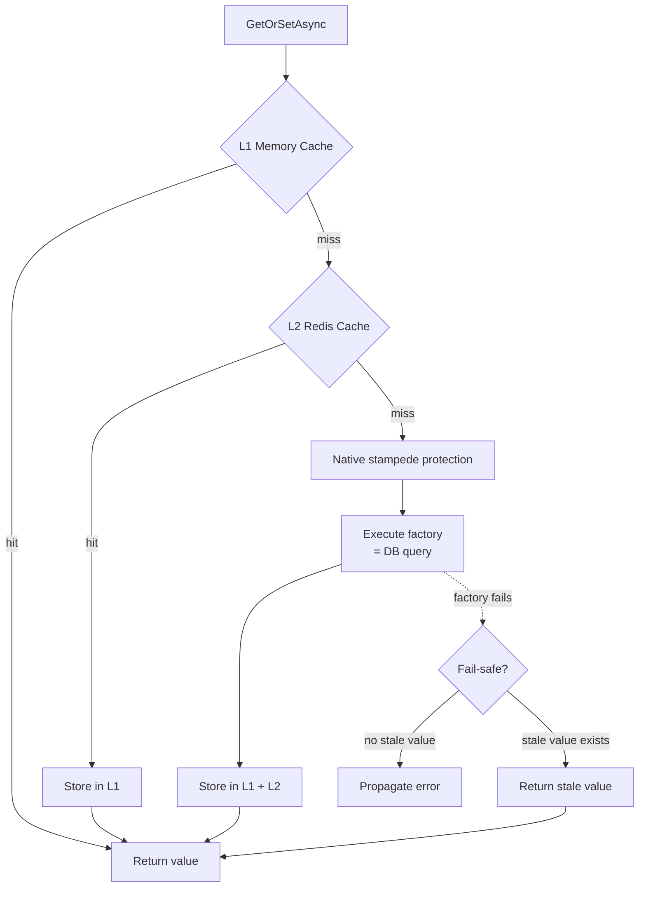

## Definition

The Cache-Aside pattern loads data into the cache on demand: on a miss, data is
retrieved from the source (DB), stored in cache, then returned. Subsequent
accesses are served from the cache.

Granit uses **FusionCache** (L1 in-process + L2 Redis) with native stampede
protection, fail-safe (stale-on-error), factory timeouts, and a Redis backplane
for cross-pod L1 invalidation.

## Diagram



## Implementation in Granit

| Component | File | Role |
| --------- | ---- | ---- |
| `IFusionCache` | FusionCache library | Cache-aside with native stampede protection, fail-safe, and backplane |
| `FeatureChecker` | `src/Granit.Features/Internal/FeatureChecker.cs` | FusionCache for feature resolution |
| `CachedLocalizationOverrideStore` | `src/Granit.Localization/Internal/CachedLocalizationOverrideStore.cs` | FusionCache for localization overrides |

### Anti-stampede

FusionCache provides native stampede protection: when 100 simultaneous requests
have a cache miss, only one executes the factory. The other 99 wait and receive
the result once the factory completes. No manual `SemaphoreSlim` or
double-check locking is needed.

### Per-tenant keys

In `FeatureChecker`, cache keys include the tenant:
`t:{tenantId}:{featureName}`. Invalidation via `ExpireAsync` targets only the
affected tenant and marks entries as stale (fail-safe fallback) rather than
deleting them.

## Rationale

| Problem | Solution |
| ------- | -------- |
| Feature resolution too slow (DB query on every request) | L1 cache (nanoseconds) + L2 Redis (microseconds) |
| Stampede on cache miss (100 requests = 100 DB queries) | FusionCache native stampede protection |
| Factory failure during cache miss | Fail-safe returns stale data instead of 500 error |
| Sensitive data in Redis cache | `EncryptingFusionCacheSerializer` (AES-256-GCM) |

## Usage example

```csharp
// Cache-aside is transparent to the caller
IFusionCache cache = serviceProvider
    .GetRequiredService<IFusionCache>();

PatientDto patient = await cache.GetOrSetAsync(
    $"patient:{patientId}",
    async (ctx, ct) => await LoadPatientFromDbAsync(patientId, ct),
    cancellationToken: cancellationToken);
// 1st call -> DB + stores in cache
// 2nd call -> returned from cache (L1 or L2)
```

## Further reading

- [Cache-Aside pattern -- Microsoft Cloud Design Patterns](https://learn.microsoft.com/en-us/azure/dotnet/architecture/patterns/cache-aside)
