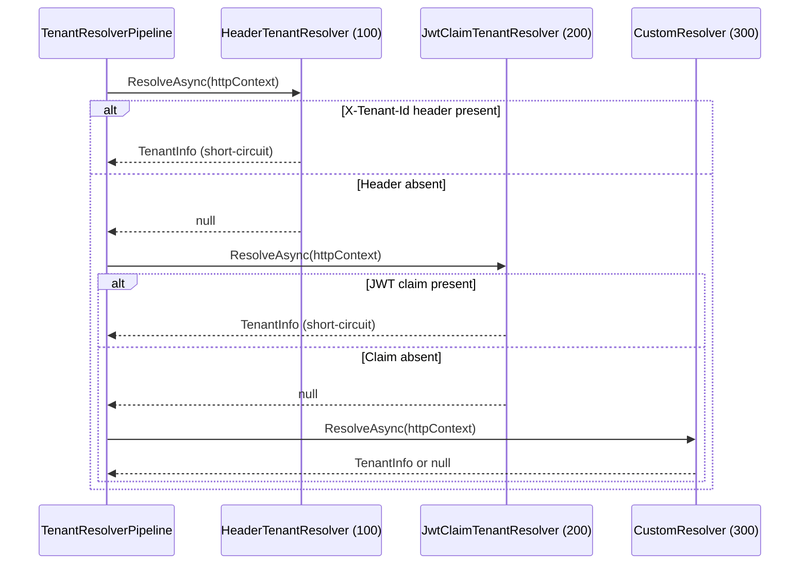

## Definition

The Chain of Responsibility pattern passes a request along an ordered chain
of handlers. Each handler decides whether to process the request or forward it
to the next one. The first capable handler short-circuits the chain.

## Diagram



## Implementation in Granit

### Tenant resolution

| Component | File | Role |
|-----------|------|------|
| `TenantResolverPipeline` | `src/Granit.MultiTenancy/Pipeline/TenantResolverPipeline.cs` | Iterates `ITenantResolver` instances by ascending `Order` |
| `HeaderTenantResolver` | `src/Granit.MultiTenancy/Resolvers/HeaderTenantResolver.cs` | Order=100, reads `X-Tenant-Id` |
| `JwtClaimTenantResolver` | `src/Granit.MultiTenancy/Resolvers/JwtClaimTenantResolver.cs` | Order=200, reads the JWT claim |

### Blob validation

| Component | File | Order | Role |
|-----------|------|-------|------|
| `MagicBytesValidator` | `src/Granit.BlobStorage/Validators/MagicBytesValidator.cs` | 10 | Verifies the actual MIME type |
| `MaxSizeValidator` | `src/Granit.BlobStorage/Validators/MaxSizeValidator.cs` | 20 | Verifies the file size |

The blob validation pipeline is a special case: **all** validators are executed
(no short-circuit), but the order determines error message priority.

## Rationale

The tenant resolution chain allows adding resolvers (query string, cookie,
subdomain) without modifying existing code. The ordering via the `Order`
property is configurable without recompilation.

## Usage example

```csharp
// Add a custom resolver -- inserts into the chain by Order
public sealed class SubdomainTenantResolver : ITenantResolver
{
    public int Order => 50; // Before HeaderTenantResolver (100)

    public Task<TenantInfo?> ResolveAsync(HttpContext context, CancellationToken cancellationToken)
    {
        string host = context.Request.Host.Host;
        // Extract tenant from subdomain...
        return Task.FromResult<TenantInfo?>(tenantInfo);
    }
}

// Registration
services.AddSingleton<ITenantResolver, SubdomainTenantResolver>();
```

## Further reading

- [Chain of Responsibility -- refactoring.guru](https://refactoring.guru/design-patterns/chain-of-responsibility)
