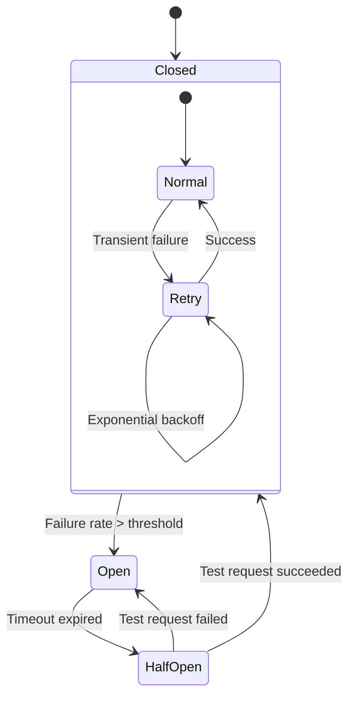
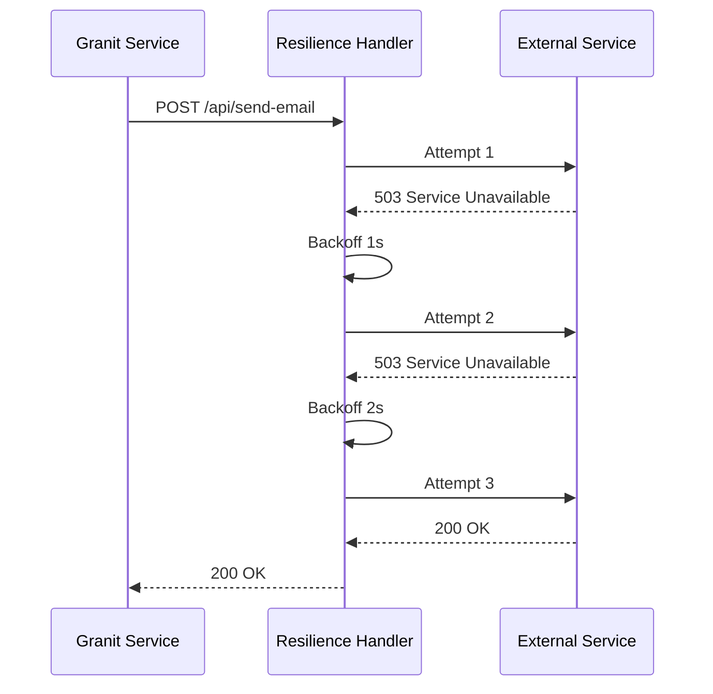

## Definition

The **Circuit Breaker** cuts calls to a failing service to prevent cascade
saturation. **Retry** automatically replays failed requests with exponential
backoff. Granit combines both via `Microsoft.Extensions.Http.Resilience` for
outgoing HTTP calls and Wolverine `RetryWithCooldown` for asynchronous messages.

## Diagram





## Implementation in Granit

### HTTP -- AddStandardResilienceHandler

Each `HttpClient` targeting an external service is configured with the .NET
standard resilience handler:

| Service | Registration file |
| --- | --- |
| Keycloak Admin API | `src/Granit.Identity.Keycloak/Extensions/IdentityKeycloakServiceCollectionExtensions.cs` |
| Microsoft Graph (Entra ID) | `src/Granit.Identity.EntraId/Extensions/IdentityEntraIdServiceCollectionExtensions.cs` |
| Brevo (email/SMS/WhatsApp) | `src/Granit.Notifications.Brevo/Extensions/BrevoNotificationsServiceCollectionExtensions.cs` |
| Zulip (chat) | `src/Granit.Notifications.Zulip/Extensions/ZulipNotificationsServiceCollectionExtensions.cs` |
| Firebase FCM (push) | `src/Granit.Notifications.MobilePush.GoogleFcm/Extensions/GoogleFcmMobilePushServiceCollectionExtensions.cs` |

```csharp
services.AddHttpClient("KeycloakAdmin", client =>
    {
        client.BaseAddress = new Uri(options.BaseUrl);
        client.Timeout = TimeSpan.FromSeconds(options.TimeoutSeconds);
    })
    .AddStandardResilienceHandler();
```

`AddStandardResilienceHandler()` automatically adds:

- **Retry** -- 3 attempts, exponential backoff on transient errors (429, 5xx)
- **Circuit Breaker** -- opens after exceeding the failure threshold over 30s
- **Timeout** -- per request (30s) and total (2min)
- **Rate Limiter** -- concurrency control

### Messaging -- Wolverine RetryWithCooldown

For asynchronous messages, Wolverine provides retry with progressive cooldown.
Example with webhooks (6 levels, 30s to 12h):

```csharp
opts.OnException<WebhookDeliveryException>()
    .RetryWithCooldown(
        TimeSpan.FromSeconds(30),     // Level 1
        TimeSpan.FromMinutes(2),      // Level 2
        TimeSpan.FromMinutes(10),     // Level 3
        TimeSpan.FromMinutes(30),     // Level 4
        TimeSpan.FromHours(2),        // Level 5
        TimeSpan.FromHours(12));      // Level 6 -> Dead-Letter Queue
```

### Resilience matrix by service

| Service | HTTP Resilience | Messaging retry | Special behavior |
| --- | --- | --- | --- |
| Keycloak Admin | Standard handler | -- | Graceful degradation on reads |
| Brevo | Standard handler | Wolverine retry | -- |
| SMTP | Configurable timeout | Wolverine retry | -- |
| Web Push | Standard handler | Wolverine retry | Auto-cleanup on HTTP 410 |
| Webhooks | Timeout 5-120s | 6 levels (30s to 12h) | Auto-suspend on 401/403/410 |
| Vault | -- | Lease renewal | Auto-refresh credentials |
| S3 | AWS SDK built-in retry | -- | Native SDK backoff |
| OTLP | -- | Buffer batch export | -- |

### Configurable timeouts

Each external service exposes a timeout via the Options pattern:

| Options | Property | Default | Range |
| --- | --- | --- | --- |
| `KeycloakAdminOptions` | `TimeoutSeconds` | 30 | -- |
| `BrevoOptions` | `TimeoutSeconds` | 30 | 1--300 |
| `SmtpOptions` | `TimeoutSeconds` | 30 | -- |
| `WebhooksOptions` | `HttpTimeoutSeconds` | 10 | 5--120 |

### Reference files

| File | Role |
| --- | --- |
| `src/Granit.Identity.Keycloak/Extensions/IdentityKeycloakServiceCollectionExtensions.cs` | Standard resilience on Keycloak |
| `src/Granit.Notifications.Brevo/Extensions/BrevoNotificationsServiceCollectionExtensions.cs` | Standard resilience on Brevo |
| `src/Granit.Webhooks/Extensions/WebhooksHostApplicationBuilderExtensions.cs` | RetryWithCooldown 6 levels |

## Rationale

| Problem | Solution |
| --- | --- |
| Temporarily down external service = cascade of 500s | Circuit Breaker cuts calls, prevents saturation |
| Transient network error = data loss | Retry with backoff replays automatically |
| Webhook endpoint down for hours | 6 progressive levels (30s to 12h) before dead-letter |
| Expired token on an external service | Auto-refresh via Vault lease renewal |
| `new HttpClient()` without resilience | `IHttpClientFactory` + systematic `AddStandardResilienceHandler()` |

## Usage example

```csharp
// --- Registration with standard resilience ---
services.AddHttpClient<GeoService>(client =>
    {
        client.BaseAddress = new Uri("https://api.geo.example.com");
    })
    .AddStandardResilienceHandler();

// --- The service has no awareness of the resilience ---
public sealed class GeoService(HttpClient httpClient)
{
    public async Task<GeoResult?> GeocodeAsync(
        string address,
        CancellationToken cancellationToken = default)
    {
        // Retry + Circuit Breaker + Timeout are transparent
        return await httpClient
            .GetFromJsonAsync<GeoResult>(
                $"/geocode?q={Uri.EscapeDataString(address)}",
                cancellationToken)
            .ConfigureAwait(false);
    }
}
```

## Further reading

- [Circuit Breaker pattern -- Microsoft Cloud Design Patterns](https://learn.microsoft.com/en-us/azure/dotnet/architecture/patterns/circuit-breaker)
- [Retry pattern -- Microsoft Cloud Design Patterns](https://learn.microsoft.com/en-us/azure/dotnet/architecture/patterns/retry)
