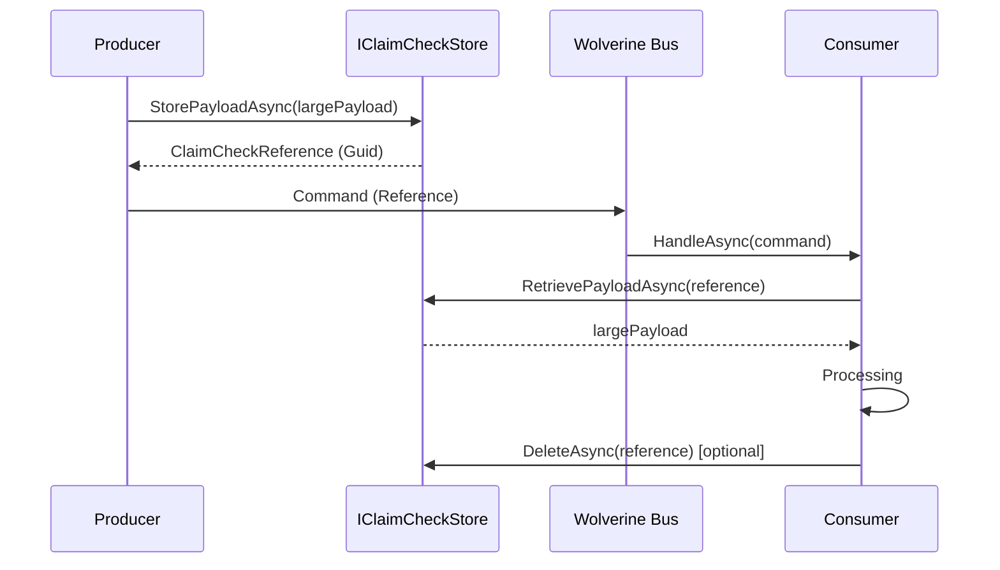
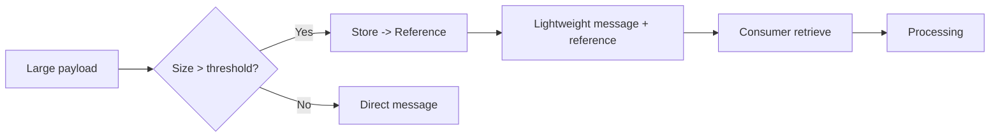

## Definition

The **Claim Check** (or Reference-Based Messaging) replaces large payloads in
messages with a lightweight reference to external storage. The producer serializes
the payload, stores it in a blob store or cache, and sends only a reference
identifier. The consumer uses this reference to retrieve the full payload before
processing. This pattern reduces message size, decreases pressure on the message
bus, and avoids transport size limit overflows.

## Diagram





## Implementation in Granit

Granit provides an `IClaimCheckStore` abstraction in `Granit.Wolverine` with a
**soft dependency**: if no implementation is registered in the DI container,
the feature is simply unavailable. Handlers resolve the store via
`IServiceProvider.GetService<IClaimCheckStore>()`.

### Abstraction

| Element | Detail |
| --- | --- |
| Interface | `IClaimCheckStore` |
| Package | `Granit.Wolverine` |
| Methods | `StoreAsync`, `RetrieveAsync`, `DeleteAsync` |
| Soft dependency | Resolved via `GetService()`, no `[DependsOn]` required |

```csharp
public interface IClaimCheckStore
{
    Task<Guid> StoreAsync(
        ReadOnlyMemory<byte> data,
        string? contentType = null,
        TimeSpan? expiry = null,
        CancellationToken cancellationToken = default);

    Task<byte[]?> RetrieveAsync(
        Guid referenceId,
        CancellationToken cancellationToken = default);

    Task<bool> DeleteAsync(
        Guid referenceId,
        CancellationToken cancellationToken = default);
}
```

### Typed extensions

`ClaimCheckExtensions` handle JSON serialization automatically:

| Method | Role |
| --- | --- |
| `StorePayloadAsync(T)` | Serializes to UTF-8 JSON and stores |
| `RetrievePayloadAsync(T)` | Retrieves and deserializes |
| `ConsumePayloadAsync(T)` | Retrieves, deserializes, and deletes (consume-once) |

### Reference

`ClaimCheckReference` is an immutable record carrying the storage identifier,
the payload type, and the content type:

```csharp
public sealed record ClaimCheckReference(
    Guid ReferenceId,
    string PayloadType,
    string ContentType = "application/json");
```

### Available implementations

| Implementation | Package | Usage |
| --- | --- | --- |
| `InMemoryClaimCheckStore` | `Granit.Wolverine` | Development and tests |
| BlobStorage-backed (custom) | Application | Production (S3, Azure Blob, Redis) |

The in-memory implementation uses a `ConcurrentDictionary` and does not enforce
expiry. In production, the application registers its own implementation via DI.

### Soft dependency pattern

The Claim Check follows the same pattern as `IFeatureChecker` in `Granit.RateLimiting`:

1. The interface is defined in the framework package (`Granit.Wolverine`)
2. No implementation is registered by default by `AddGranitWolverine()`
3. Handlers that need it resolve via `GetService<IClaimCheckStore>()`
4. If `Granit.BlobStorage` is installed, the application can register a store
   backed by blob storage
5. If no store is registered, the feature is disabled

### Reference files

| File | Role |
| --- | --- |
| `src/Granit.Wolverine/ClaimCheck/IClaimCheckStore.cs` | Store abstraction |
| `src/Granit.Wolverine/ClaimCheck/ClaimCheckReference.cs` | Reference record |
| `src/Granit.Wolverine/ClaimCheck/ClaimCheckExtensions.cs` | Typed JSON helpers |
| `src/Granit.Wolverine/ClaimCheck/Internal/InMemoryClaimCheckStore.cs` | Dev/test store |
| `src/Granit.Wolverine/ClaimCheck/ClaimCheckServiceCollectionExtensions.cs` | DI registration |

## Rationale

| Problem | Solution |
| --- | --- |
| Wolverine message > 1 MB = transport pressure | Payload stored externally, message reduced to a Guid |
| GDPR export with large data in saga state | Only the `BlobReferenceId` is stored (ISO 27001) |
| Tight coupling between Wolverine and BlobStorage | Soft dependency -- works without BlobStorage installed |
| Temporary payload forgotten in the store | `ConsumePayloadAsync` (consume-once) + configurable TTL |
| Manual serialization/deserialization | Typed extensions `StorePayloadAsync(T)` / `RetrievePayloadAsync(T)` |

## Usage example

```csharp
// --- Producer: offload a large payload ---
public sealed record ProcessMedicalRecordCommand(
    Guid PatientId,
    ClaimCheckReference RecordDataRef);

// In a handler or service
IClaimCheckStore claimCheckStore = serviceProvider
    .GetService<IClaimCheckStore>()
    ?? throw new InvalidOperationException("Claim check store not configured.");

MedicalRecordData largePayload = await BuildLargePayloadAsync(patientId, cancellationToken)
    .ConfigureAwait(false);

ClaimCheckReference reference = await claimCheckStore
    .StorePayloadAsync(largePayload, TimeSpan.FromHours(1), cancellationToken)
    .ConfigureAwait(false);

await messageBus.PublishAsync(
    new ProcessMedicalRecordCommand(patientId, reference),
    cancellationToken).ConfigureAwait(false);

// --- Consumer: retrieve and consume ---
public static async Task HandleAsync(
    ProcessMedicalRecordCommand command,
    IClaimCheckStore claimCheckStore,
    CancellationToken cancellationToken)
{
    MedicalRecordData? data = await claimCheckStore
        .ConsumePayloadAsync<MedicalRecordData>(
            command.RecordDataRef, cancellationToken)
        .ConfigureAwait(false)
        ?? throw new InvalidOperationException("Payload expired or already consumed.");

    // Process the medical record...
}

// --- DI registration (application) ---
// Development:
builder.Services.AddInMemoryClaimCheckStore();

// Production (custom implementation):
builder.Services.AddSingleton<IClaimCheckStore, S3ClaimCheckStore>();
```

## Further reading

- [Claim-Check pattern -- Microsoft Cloud Design Patterns](https://learn.microsoft.com/en-us/azure/dotnet/architecture/patterns/claim-check)
- [Enterprise Integration Patterns -- Claim Check](https://www.enterpriseintegrationpatterns.com/patterns/messaging/StoreInLibrary.html)
