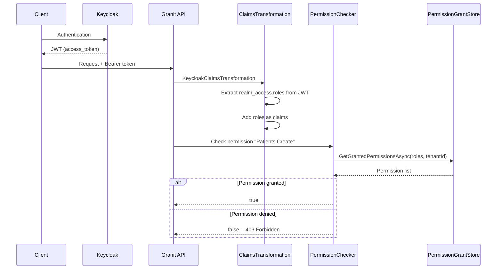

## Definition

The Claims-Based Identity pattern represents a user's identity as claims
(key-value pairs) extracted from a JWT token. RBAC (Role-Based Access Control)
restricts access by verifying that the user's role holds the required
permissions.

Granit combines JWT Keycloak + strict RBAC (permissions on roles only, never
per user) with a dynamic policy system.

## Diagram



## Implementation in Granit

### Authentication layer

| Component | File | Role |
| --- | --- | --- |
| `ICurrentUserService` | `src/Granit.Users/ICurrentUserService.cs` | `UserId`, `UserName`, `Email`, `GetRoles()`, `IsInRole()` |
| `KeycloakClaimsTransformation` | `src/Granit.Authentication.JwtBearer.Keycloak/Authentication/KeycloakClaimsTransformation.cs` | Extracts `realm_access.roles` from the Keycloak JWT |
| `WolverineCurrentUserService` | `src/Granit.Wolverine/Internal/WolverineCurrentUserService.cs` | `AsyncLocal` fallback for background handlers |

### Authorization layer

| Component | File | Role |
| --- | --- | --- |
| `DynamicPermissionPolicyProvider` | `src/Granit.Authorization/Authorization/DynamicPermissionPolicyProvider.cs` | Creates `AuthorizationPolicy` on the fly from permission names |
| `PermissionChecker` | `src/Granit.Authorization/Services/PermissionChecker.cs` | Evaluates permissions against role grants |
| `IPermissionDefinitionProvider` | `src/Granit.Authorization/Definitions/IPermissionDefinitionProvider.cs` | Permission declaration (code-first) |
| `EfCorePermissionGrantStore` | `src/Granit.Authorization.EntityFrameworkCore/Stores/EfCorePermissionGrantStore.cs` | EF Core grant persistence |

### Strict RBAC

- Permissions are assigned to **roles**, never to individual users
- Cache is per **role** (not per user) for performance
- `AdminRoles` bootstraps roles with all permissions at startup

## Rationale

| Problem | Solution |
| --- | --- |
| Keycloak returns roles in a custom format (`realm_access`) | `KeycloakClaimsTransformation` normalizes to standard claims |
| Background handlers have no `HttpContext` | `WolverineCurrentUserService` maintains user via `AsyncLocal` |
| Creating one policy per permission would be explosive | `DynamicPermissionPolicyProvider` creates policies on demand |
| Per-user grants do not scale (10K users x 100 permissions) | Strict RBAC: grants on roles (10 roles x 100 permissions) |

## Usage example

```csharp
// Declare permissions (code-first)
public sealed class PatientPermissionDefinitionProvider : IPermissionDefinitionProvider
{
    public void DefinePermissions(IPermissionDefinitionContext context)
    {
        PermissionGroup group = context.AddGroup("Patients");
        group.AddPermission("Patients.Create");
        group.AddPermission("Patients.Read");
        group.AddPermission("Patients.Delete");
    }
}
```

> Localized `displayName` values are optional in this simplified example. See the
> full authorization documentation for adding `LocalizableString`.

```csharp
// Protect an endpoint
app.MapPost("/api/patients", CreatePatientEndpoint.Handle)
    .RequireAuthorization("Patients.Create");

// Programmatic check
public static class DischargePatientHandler
{
    public static async Task Handle(
        DischargePatientCommand cmd,
        IPermissionChecker permissionChecker,
        CancellationToken cancellationToken)
    {
        bool canDischarge = await permissionChecker.IsGrantedAsync("Patients.Discharge", ct);
        if (!canDischarge)
            throw new ForbiddenException();
    }
}
```

## Further reading

- [Federated Identity pattern -- Microsoft Cloud Design Patterns](https://learn.microsoft.com/en-us/azure/dotnet/architecture/patterns/federated-identity)
