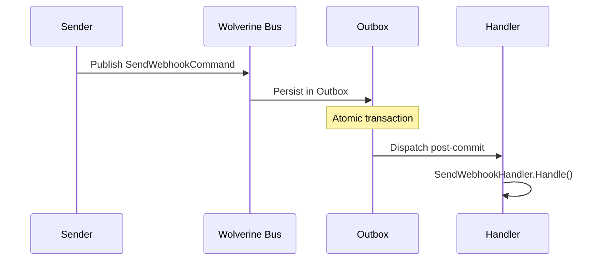

## Definition

The Command pattern encapsulates a request as an object, enabling
parameterization, queuing, logging, and undo of operations. The command is a
serializable DTO that decouples the sender from the executor.

In Granit, commands are Wolverine messages processed by automatically
discovered handlers.

## Diagram



## Implementation in Granit

| Command | File | Handler |
|---------|------|---------|
| `SendWebhookCommand` | `src/Granit.Webhooks/Messages/SendWebhookCommand.cs` | `SendWebhookHandler` |
| `RunMigrationBatchCommand` | `src/Granit.Persistence.Migrations/Messages/RunMigrationBatchCommand.cs` | `RunMigrationBatchHandler` |

Commands are plain C# classes (serializable DTOs). Wolverine discovers
handlers by naming convention (`Handle()` method).

## Rationale

Commands decouple the sender (HTTP handler) from the executor (background
handler). Serialization via the Outbox guarantees delivery even in case of
crash. Wolverine's automatic retry handles transient failures.

## Usage example

```csharp
// Define a command
public sealed class SendInvoiceEmailCommand
{
    public required Guid InvoiceId { get; init; }
    public required string RecipientEmail { get; init; }
}

// The handler is discovered automatically by Wolverine
public static class SendInvoiceEmailHandler
{
    public static async Task Handle(
        SendInvoiceEmailCommand command,
        IEmailService emailService,
        CancellationToken cancellationToken)
    {
        await emailService.SendInvoiceAsync(command.InvoiceId, command.RecipientEmail, ct);
    }
}

// Emission from an HTTP handler
public static class CreateInvoiceHandler
{
    public static IEnumerable<object> Handle(CreateInvoiceCommand cmd, InvoiceDbContext db)
    {
        Invoice invoice = new() { /* ... */ };
        db.Invoices.Add(invoice);

        // The command is persisted in the Outbox, not sent immediately
        yield return new SendInvoiceEmailCommand
        {
            InvoiceId = invoice.Id,
            RecipientEmail = cmd.Email
        };
    }
}
```

## Further reading

- [Command -- refactoring.guru](https://refactoring.guru/design-patterns/command)
