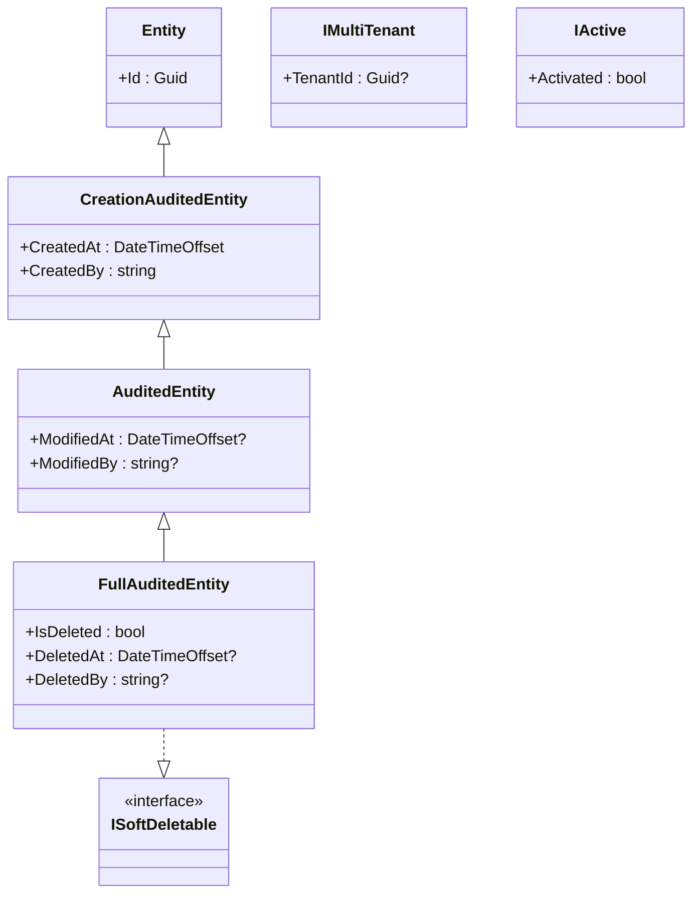

## Definition

The Composite pattern allows treating individual objects and compositions of
objects uniformly. In Granit, this pattern manifests in the auditable entity
hierarchy where each level adds capabilities while remaining uniformly
manipulable.

## Diagram



## Implementation in Granit

| Class | File | Added capabilities |
|-------|------|--------------------|
| `Entity` | `src/Granit/Domain/Entity.cs` | `Id` (Guid) |
| `CreationAuditedEntity` | `src/Granit/Domain/CreationAuditedEntity.cs` | `CreatedAt`, `CreatedBy` |
| `AuditedEntity` | `src/Granit/Domain/AuditedEntity.cs` | `ModifiedAt`, `ModifiedBy` |
| `FullAuditedEntity` | `src/Granit/Domain/FullAuditedEntity.cs` | `IsDeleted`, `DeletedAt`, `DeletedBy` (ISoftDeletable) |
| `ISoftDeletable` | `src/Granit/Domain/ISoftDeletable.cs` | Soft delete marker |
| `IMultiTenant` | `src/Granit/Domain/IMultiTenant.cs` | `TenantId` isolation |
| `IActive` | `src/Granit/Domain/IActive.cs` | `Activated` filtering |

The marker interfaces (`ISoftDeletable`, `IMultiTenant`, `IActive`) are
composable with the inheritance hierarchy. EF Core interceptors and query
filters detect these interfaces via reflection and apply the appropriate
behavior.

## Rationale

The progressive hierarchy allows choosing the required audit level per
entity. A reference entity (postal code) only needs `Entity`. A medical
entity under ISO 27001 needs `FullAuditedEntity` + `IMultiTenant`. The
interceptors treat all entities uniformly.

## Usage example

```csharp
// Simple entity -- identity only
public sealed class Country : Entity { }

// Entity with creation audit
public sealed class Invitation : CreationAuditedEntity { }

// Entity with full ISO 27001 audit + tenant isolation + GDPR soft delete
public sealed class MedicalRecord : FullAuditedEntity, IMultiTenant
{
    public Guid? TenantId { get; set; }
    public string Diagnosis { get; set; } = string.Empty;
}
// Interceptors automatically populate all audit fields
```

## Further reading

- [Composite -- refactoring.guru](https://refactoring.guru/design-patterns/composite)
