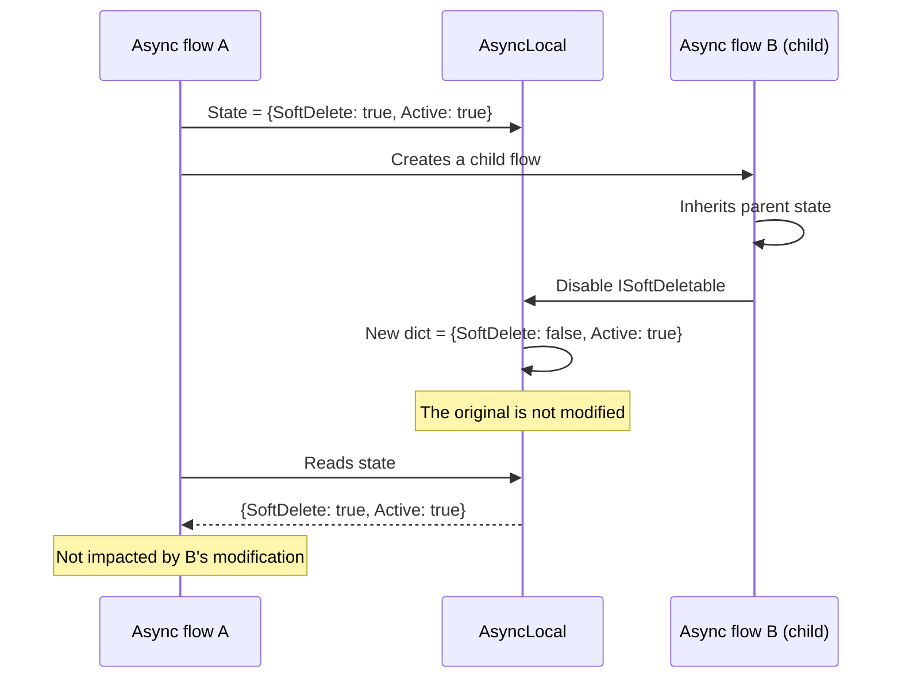

## Definition

The Copy-on-Write pattern guarantees thread-safety by creating a new copy of
the data structure on each modification, instead of mutating the existing one.
The previous state remains intact, enabling simple restoration and eliminating
data races.

## Diagram



## Implementation in Granit

| Component | File | Structure |
|-----------|------|-----------|
| `DataFilter` | `src/Granit/DataFiltering/DataFilter.cs` | `AsyncLocal<ImmutableDictionary<Type, bool>>` |

The `DataFilter` uses `ImmutableDictionary<Type, bool>.SetItem()` which returns
a **new** dictionary without mutating the original. Combined with
`AsyncLocal<T>`, this guarantees:

1. **Flow isolation**: a child flow that modifies filters does not disturb the
   parent flow
2. **Restoration**: the `IDisposable` scope keeps a reference to the old
   dictionary and restores it on `Dispose()`
3. **No locks**: `ImmutableDictionary` is inherently thread-safe

### Pitfall avoided -- child flow mutation

Without copy-on-write, an `AsyncLocal<Dictionary<T>>` shared between parent
and child could see the child's mutations affect the parent. With
`ImmutableDictionary`, `SetItem()` creates a new reference that does not
propagate back to the parent.

## Rationale

Data filtering must be isolated per request scope. If a middleware temporarily
disables soft delete for an admin operation, that change must not leak into
other concurrent requests or child `Task.Run()` flows.

## Usage example

```csharp
// Copy-on-write is transparent -- the API remains simple
using (dataFilter.Disable<ISoftDeletable>())
{
    // New ImmutableDictionary created: {SoftDelete: false}
    // The original remains intact

    await Task.Run(async () =>
    {
        // This child flow inherits {SoftDelete: false}
        // But if the child calls Enable<ISoftDeletable>(),
        // it creates a NEW dict for the child without touching the parent
    });
}
// Dispose() restores the original ImmutableDictionary
```
