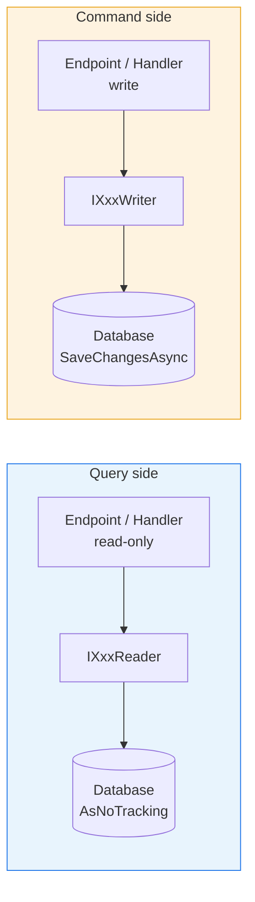
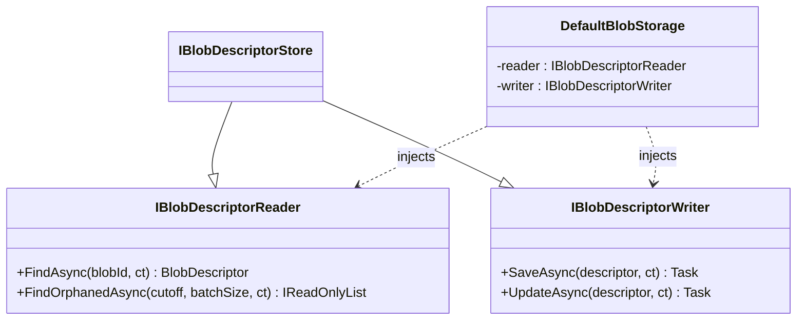

:::tip[Core principle]
CQRS is one of Granit's foundational design principles —
every data module enforces it. For the "why" (compliance,
least privilege, mental model), see the
[CQRS concept page](/dotnet/concepts/cqrs-command-query-separation/).
This page focuses on implementation details and inventory.
:::

## Definition

CQRS separates **read** (Query) and **write** (Command) operations into distinct
interfaces. Each consumer injects only the interface matching its intent, making
dependencies explicit and code easier to audit.

## Diagram





## Implementation in Granit

### Reader / Writer / Store convention

Each data module exposes **three interfaces**:

| Interface | Role | Example |
| --- | --- | --- |
| `IXxxReader` | Read-only operations | `IBlobDescriptorReader`, `IFeatureStoreReader` |
| `IXxxWriter` | Write-only operations | `IBlobDescriptorWriter`, `IFeatureStoreWriter` |
| `IXxxStore` | Reader + Writer union (for DI registration) | `IBlobDescriptorStore : IBlobDescriptorReader, IBlobDescriptorWriter` |

**Strict rule**: the combined `Store` exists for DI registration only.
Constructors of handlers, endpoints, and services **must** inject
`IXxxReader` or `IXxxWriter` separately, never the combined `Store`.

### Architectural enforcement

**ArchUnitNET tests** (`tests/Granit.ArchitectureTests/CqrsConventionTests.cs`):

```csharp
[Fact]
public void Reader_interfaces_should_end_with_Reader() =>
    NamingConventionRules.ReaderInterfacesShouldEndWithReader(Architecture);

[Fact]
public void Writer_interfaces_should_end_with_Writer() =>
    NamingConventionRules.WriterInterfacesShouldEndWithWriter(Architecture);
```

### Reader/Writer inventory (excerpt)

| Module | Reader | Writer |
| --- | --- | --- |
| BlobStorage | `IBlobDescriptorReader` | `IBlobDescriptorWriter` |
| Features | `IFeatureStoreReader` | `IFeatureStoreWriter` |
| Settings | `ISettingStoreReader` | `ISettingStoreWriter` |
| BackgroundJobs | `IBackgroundJobReader` | `IBackgroundJobWriter` |
| Webhooks | `IWebhookSubscriptionReader` | `IWebhookSubscriptionWriter` |
| Notifications | `IUserNotificationReader` | `IUserNotificationWriter` |
| Authorization | `IPermissionManagerReader` | `IPermissionManagerWriter` |
| Localization | `ILocalizationOverrideStoreReader` | `ILocalizationOverrideStoreWriter` |
| Templating | `IDocumentTemplateStoreReader` | `IDocumentTemplateStoreWriter` |
| Timeline | `ITimelineReader` | `ITimelineWriter` |
| DataExchange | `IImportJobReader` / `IExportJobReader` | `IImportJobWriter` / `IExportJobWriter` |
| ReferenceData | `IReferenceDataStoreReader` | `IReferenceDataStoreWriter` |

### Reference files

| File | Role |
| --- | --- |
| `src/Granit.BlobStorage/IBlobDescriptorReader.cs` | Canonical Reader interface |
| `src/Granit.BlobStorage/IBlobDescriptorWriter.cs` | Canonical Writer interface |
| `src/Granit.BlobStorage/IBlobDescriptorStore.cs` | Combined Store interface (DI only) |
| `src/Granit.BlobStorage/Internal/DefaultBlobStorage.cs` | Separate Reader + Writer injection |
| `src/Granit.BackgroundJobs.Endpoints/Endpoints/BackgroundJobsReadEndpoints.cs` | Endpoint injecting only `IBackgroundJobReader` |
| `src/Granit.BackgroundJobs.Endpoints/Endpoints/BackgroundJobsWriteEndpoints.cs` | Endpoint injecting only `IBackgroundJobWriter` |
| `tests/Granit.ArchitectureTests/CqrsConventionTests.cs` | CQRS convention tests |

## Rationale

| Problem | CQRS solution |
| --- | --- |
| A service injects a full store when it only reads | Injecting the Reader alone makes the intent explicit |
| ISO 27001 audit: who can write what? | The DI graph immediately shows components with write access |
| GDPR: no hard-delete on readers | Writer interfaces do not expose a physical `Delete` method |
| Refactoring: merging Reader/Writer for convenience | ArchUnitNET tests block the regression |
| Wolverine handlers: clear responsibility | Command handlers inject the Writer, query handlers the Reader |

## Usage example

```csharp
// --- Read endpoint -- injects ONLY the Reader ---
private static async Task<Ok<PagedResult<BackgroundJobStatus>>> GetAllJobsAsync(
    IBackgroundJobReader reader,
    [FromQuery] int page = 1,
    [FromQuery] int pageSize = 20,
    CancellationToken cancellationToken = default)
{
    IReadOnlyList<BackgroundJobStatus> all = await reader
        .GetAllAsync(cancellationToken).ConfigureAwait(false);
    return TypedResults.Ok(new PagedResult<BackgroundJobStatus>(/* ... */));
}

// --- Write endpoint -- injects ONLY the Writer ---
private static async Task<Results<NoContent, NotFound>> PauseJobAsync(
    string name,
    IBackgroundJobWriter writer,
    CancellationToken cancellationToken)
{
    await writer.PauseAsync(name, cancellationToken).ConfigureAwait(false);
    return TypedResults.NoContent();
}

// --- Wolverine command handler -- Writer only ---
public static async Task Handle(
    SendWebhookCommand command,
    IWebhookDeliveryWriter deliveryWriter,
    CancellationToken cancellationToken)
{
    await deliveryWriter.RecordSuccessAsync(command, /* ... */, cancellationToken)
        .ConfigureAwait(false);
}
```

## When NOT to merge Reader and Writer

These are the most common regressions caught by architecture tests:

| Anti-pattern | Why it breaks CQRS |
| --- | --- |
| Inject `IXxxStore` in a constructor | Bypasses the split — use Reader or Writer |
| Create a combined `IProductService` | Same problem — split into Reader + Writer |
| Pass `DbContext` to endpoints | No interface boundary, no audit trail |
| Inject the Writer "just in case" | Violates least privilege — remove it |

## Further reading

- [CQRS concept](/dotnet/concepts/cqrs-command-query-separation/) — mental model, compliance benefits, and
  common mistakes
- [CQRS pattern -- Microsoft Cloud Design Patterns](https://learn.microsoft.com/en-us/azure/dotnet/architecture/patterns/cqrs)
- [CQRS -- Martin Fowler](https://martinfowler.com/bliki/CQRS.html)
