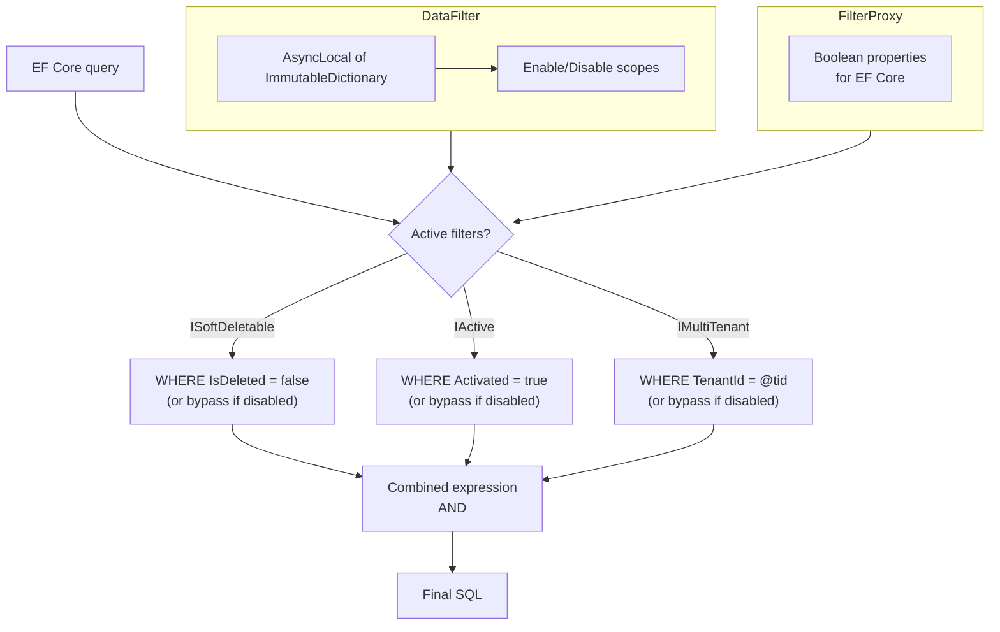

## Definition

The Data Filtering pattern automatically applies global filters to EF Core
queries based on marker interfaces implemented by entities. Filters are enabled
by default and can be temporarily disabled via an `IDisposable` scope.

Granit supports three filters:

- `ISoftDeletable` -- `WHERE IsDeleted = false`
- `IActive` -- `WHERE Activated = true`
- `IMultiTenant` -- `WHERE TenantId = @currentTenantId`

## Diagram



## Implementation in Granit

| Component | File | Role |
|-----------|------|------|
| `IDataFilter` | `src/Granit/DataFiltering/IDataFilter.cs` | Interface: `IsEnabled<T>()`, `Disable<T>()`, `Enable<T>()` |
| `DataFilter` | `src/Granit/DataFiltering/DataFilter.cs` | Implementation using `AsyncLocal<ImmutableDictionary<Type, bool>>` |
| `FilterProxy` | `src/Granit.Persistence/Extensions/ModelBuilderExtensions.cs` | Proxy exposing properties for EF Core |
| `ApplyGranitConventions()` | `src/Granit.Persistence/Extensions/ModelBuilderExtensions.cs` | Builds Expression Trees for `HasQueryFilter()` |

### Dynamic filter construction

`ApplyGranitConventions()` uses **Expression Trees** to build a single filter
per entity combining all applicable filters:

```csharp
// Pseudo-code of the generated filter for a FullAuditedEntity + IMultiTenant
entity => (!proxy.SoftDeleteEnabled || !entity.IsDeleted)
       && (!proxy.MultiTenantEnabled || entity.TenantId == proxy.CurrentTenantId)
```

The `FilterProxy` is essential: EF Core cannot call methods inside a query
filter. The proxy exposes simple properties that EF Core translates into SQL
parameters.

### Thread-safe state via AsyncLocal + ImmutableDictionary

The `DataFilter` uses `AsyncLocal<ImmutableDictionary<Type, bool>>`:

- **AsyncLocal**: state is isolated per `async/await` flow
- **ImmutableDictionary**: `SetItem()` creates a new dictionary (copy-on-write)
- **IDisposable scope**: `Disable<T>()` returns a scope that restores the
  previous state on `Dispose()`

## Rationale

| Problem | Solution |
|---------|----------|
| Forgetting a `WHERE IsDeleted = false` in a query | Filter is automatic, applied to all queries |
| Multi-tenant isolation: a query leaking another tenant's data | `WHERE TenantId = @tid` automatic on every `IMultiTenant` entity |
| Admin need to view deleted data | `dataFilter.Disable<ISoftDeletable>()` in a limited scope |
| Thread safety in async scenarios | `AsyncLocal` + `ImmutableDictionary` (copy-on-write) |

## Usage example

```csharp
// Filters are automatic -- nothing to do
List<Patient> activePatients = await db.Patients.ToListAsync(ct);
// SQL: SELECT ... WHERE IsDeleted = 0 AND TenantId = @tid

// Temporarily disable the soft delete filter
using (dataFilter.Disable<ISoftDeletable>())
{
    List<Patient> allPatients = await db.Patients.ToListAsync(ct);
    // SQL: SELECT ... WHERE TenantId = @tid (no IsDeleted filter)
}
// Filter is automatically re-enabled here
```

## Further reading

- [Query Object -- Martin Fowler (PoEAA)](https://martinfowler.com/eaaCatalog/queryObject.html)
