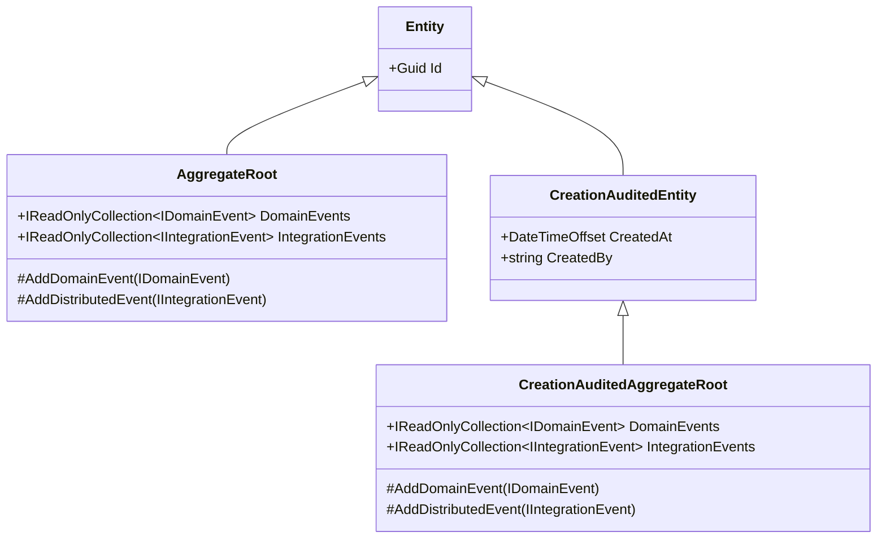

## Definition

An **Aggregate Root** is a DDD building block that forms the root of a consistency
boundary. It encapsulates invariants, manages state transitions via behavior methods,
and raises domain/integration events. External code interacts through methods
(`Approve()`, `Cancel()`), never through direct property mutation.

## When to Use

Use `AggregateRoot` (or audited variants) when the entity:

- Has a **state machine** (status transitions with business rules)
- **Raises domain or integration events**
- **Encapsulates invariants** that must be protected from external mutation
- Is the **root of a consistency boundary**

Use plain `Entity` when the entity is:

- **Append-only / immutable** after creation (audit logs, consent records)
- A **configuration record** (settings, feature flags)
- A **cache/mirror** of an external system
- A **lookup table** (reference data)

## Diagram



## Granit Implementation

### Choosing the Right Base Class

| Base Class | Use When |
| ---------- | -------- |
| `AggregateRoot` | No audit trail needed, manages own timestamps |
| `CreationAuditedAggregateRoot` | Needs `CreatedAt` / `CreatedBy` |
| `AuditedAggregateRoot` | Needs creation + modification audit |
| `FullAuditedAggregateRoot` | Needs full audit + soft delete (`ISoftDeletable`) |

### Gold Standard: BlobDescriptor

`BlobDescriptor` is the reference implementation for a well-designed aggregate root:

```csharp
public sealed class BlobDescriptor : AggregateRoot, IMultiTenant
{
    // 1. Private EF Core constructor — required for materialization
    private BlobDescriptor() { }

    // 2. Factory method — the only way to create an instance
    public static BlobDescriptor Create(
        Guid id, Guid? tenantId, string containerName,
        string objectKey, BlobUploadRequest request,
        DateTimeOffset createdAt) => new()
    {
        Id = id,
        TenantId = tenantId,
        ContainerName = containerName,
        ObjectKey = objectKey,
        Status = BlobStatus.Pending,
        CreatedAt = createdAt,
    };

    // 3. Private setters — no external mutation
    public string ContainerName { get; private set; } = string.Empty;
    public BlobStatus Status { get; private set; }

    // 4. Explicit interface for infrastructure injection
    public Guid? TenantId { get; private set; }
    Guid? IMultiTenant.TenantId
    {
        get => TenantId;
        set => TenantId = value;
    }

    // 5. Behavior method with guard clause + domain event
    public void MarkAsValid(
        string contentType, long sizeBytes, DateTimeOffset at)
    {
        if (Status != BlobStatus.Uploading)
            throw new InvalidOperationException(
                $"Cannot transition from {Status} to Valid.");

        Status = BlobStatus.Valid;
        VerifiedContentType = contentType;
        SizeBytes = sizeBytes;
        ValidatedAt = at;

        AddDomainEvent(new BlobValidatedEvent(Id, ContainerName, contentType, sizeBytes));
    }
}
```

### Key Patterns

#### Private EF Core Constructor

Every aggregate root with `private set` properties **must** keep a parameterless
constructor for EF Core materialization:

```csharp
private BlobDescriptor() { } // EF Core uses this, not the factory
```

Without it, EF Core attempts to use the factory method and crashes at runtime.

#### Explicit Interface for `IMultiTenant`

When `TenantId` has `private set`, the interceptor cannot assign it. Use an explicit
interface implementation to allow infrastructure injection while preserving DDD
encapsulation:

```csharp
public Guid? TenantId { get; private set; }
Guid? IMultiTenant.TenantId
{
    get => TenantId;
    set => TenantId = value;
}
```

#### Two-Tier Event Model

- **`AddDomainEvent()`**: local, dispatched after commit. Naming: `XxxEvent` (e.g., `BlobValidatedEvent`).
- **`AddDistributedEvent()`**: durable outbox, dispatched before commit. Naming: `XxxEto` (e.g., `PersonalDataDeletedEto`).

See [Event-Driven Architecture](/dotnet/architecture/patterns/event-driven/) for details.

## Architecture Tests

`DomainConventionTests` enforces:

- `ValueObject` subclasses must be sealed
- Domain entities must not reside in `Internal` namespaces
- Manual `IDomainEventSource` implementors are flagged (should use aggregate root bases)

## Related Patterns

- [Event-Driven Architecture](/dotnet/architecture/patterns/event-driven/) — domain and integration events
- [State Machine](/dotnet/architecture/patterns/state-machine/) — status transitions
- [Guard Clause](/dotnet/architecture/patterns/guard-clause/) — precondition validation
- [Factory Method](/dotnet/architecture/patterns/factory-method/) — controlled creation
- [ADR-017](/dotnet/architecture/adr/017-ddd-aggregate-value-object-strategy/) — full strategy rationale
