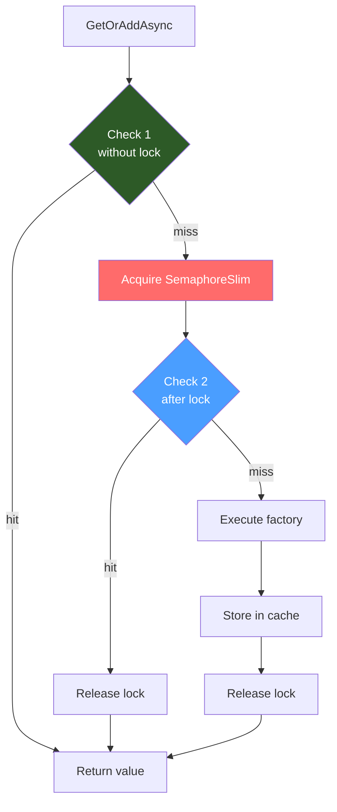

## Definition

The Double-Check Locking pattern optimizes concurrent access to a shared
resource by checking the condition **before** and **after** acquiring a lock.
The first check (without lock) serves as a fast-path for the nominal case
(cache hit). The second check (after lock) protects against races.

## Diagram



## Implementation in Granit

| Component | File | Role |
|-----------|------|------|
| `KeycloakAdminTokenService` | `src/Granit.Identity.Federated.Keycloak/Internal/KeycloakAdminTokenService.cs` | Keycloak token acquisition with double-check locking |

> **Note:** Cache stampede protection was previously implemented via manual
> double-check locking in `DistributedCacheService`. With the migration to
> FusionCache ([ADR-018](/dotnet/architecture/adr/018-fusioncache-caching-provider/)),
> stampede protection is now handled natively by FusionCache. Double-check
> locking remains in use for non-cache scenarios such as token caching.

### Flow

1. **Check 1**: read cached token without lock -- fast-path
2. **Acquire**: `SemaphoreSlim.WaitAsync(cancellationToken)`
3. **Check 2**: re-read cached token after lock
4. **Factory**: request new token from Keycloak if still expired
5. **Store**: cache the new token
6. **Release**: `SemaphoreSlim.Release()` in a `finally`

### Anti-stampede

If 100 simultaneous requests find an expired token:

- All 100 pass Check 1 (expired)
- 1 acquires the lock, 99 wait
- The first requests a new token and caches it
- The 99 pass Check 2 -- valid token, no Keycloak call

Result: **1 single Keycloak request** instead of 100.

## Rationale

Double-check locking remains essential for non-cache shared resources in a
high-concurrency environment. For cache stampede protection, FusionCache
provides this natively via its built-in concurrency control.

## Usage example

```csharp
// Double-check locking for token caching
// 100 simultaneous calls with an expired token:
// -> 1 Keycloak request (the first one)
// -> 99 served from cached token (after the lock)
string token = await tokenService.GetAdminTokenAsync(cancellationToken);
```
