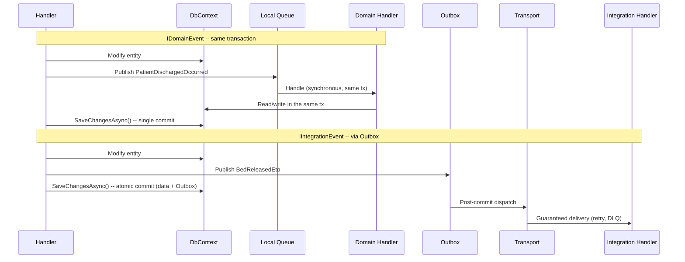

## Definition

Event-driven architecture decouples system components through the publication
and consumption of events. Instead of calling a service directly, a component
publishes an event; interested parties react to it asynchronously.

Granit distinguishes two categories of events with fundamentally different
guarantees:

- **IDomainEvent**: in-process, synchronous, same transaction. Never crosses
  the Outbox. Naming convention: `*Event` suffix.
- **IIntegrationEvent**: cross-module, durable via Wolverine Outbox,
  dispatched only after the transaction commits. Naming convention:
  `*Eto` suffix (Event Transfer Object). Flat DTOs only (never EF Core entities).

## Diagram



## Implementation in Granit

### Marker interfaces

| Interface | File | Routing |
|-----------|------|---------|
| `IDomainEvent` | `src/Granit/Events/IDomainEvent.cs` | Local queue only -- never the Outbox |
| `IIntegrationEvent` | `src/Granit/Events/IIntegrationEvent.cs` | Configured transport (PostgreSQL, RabbitMQ...) via Outbox |

### Wolverine configuration

In `src/Granit.Wolverine/Extensions/WolverineHostApplicationBuilderExtensions.cs`:

```csharp
// Lines 74-77: forces domain events to local
opts.PublishMessage<IDomainEvent>()
    .ToLocalQueue("domain-events");
```

### Existing handlers

| Handler | Event | Type | File |
|---------|-------|------|------|
| `FeatureCacheInvalidationHandler` | `FeatureValueChangedEvent` | Domain | `src/Granit.Features/Cache/FeatureCacheInvalidationHandler.cs` |
| `WebhookFanoutHandler` | `WebhookTrigger` | Integration | `src/Granit.Webhooks/Handlers/WebhookFanoutHandler.cs` |

### Wolverine sidecar pattern

Wolverine handlers can return events via `yield return` or by returning an
`IEnumerable<T>`. Wolverine dispatches them automatically: `IDomainEvent`
goes to local, `IIntegrationEvent` goes to the Outbox.

## Rationale

| Problem | Solution |
|---------|----------|
| Need to react to a change without coupling modules | Handlers subscribe to events without knowing the publisher |
| Transactional guarantee: "if the patient is discharged, the bed must be released" | `IDomainEvent` in the same transaction ensures atomicity |
| Delivery guarantee: "the webhook must be sent even if the server restarts" | `IIntegrationEvent` via Outbox persists the event before dispatch |
| Preventing event loss on rollback | The Outbox is dispatched only after a successful commit |
| Serialization: EF Core entities must not cross service boundaries | `IIntegrationEvent` enforces flat serializable DTOs |

## Usage example

```csharp
// 1. Define a domain event (in-process, same transaction)
public sealed class PatientDischargedOccurred : IDomainEvent
{
    public required Guid PatientId { get; init; }
    public required Guid BedId { get; init; }
}

// 2. Define an integration event (durable, cross-module)
public sealed class BedReleasedEto : IIntegrationEvent
{
    public required Guid BedId { get; init; }
    public required Guid WardId { get; init; }
    public required DateTimeOffset ReleasedAt { get; init; }
}

// 3. Handler publishing both types
public static class DischargePatientHandler
{
    public static IEnumerable<object> Handle(
        DischargePatientCommand command,
        PatientDbContext db)
    {
        Patient patient = db.Patients.Find(command.PatientId)
            ?? throw new EntityNotFoundException(typeof(Patient), command.PatientId);

        patient.Discharge();

        // Domain event -- handled in the same transaction
        yield return new PatientDischargedOccurred
        {
            PatientId = patient.Id,
            BedId = patient.BedId
        };

        // Integration event -- persisted in the Outbox, dispatched after commit
        yield return new BedReleasedEto
        {
            BedId = patient.BedId,
            WardId = patient.WardId,
            ReleasedAt = DateTimeOffset.UtcNow
        };
    }
}
```

## Further reading

- [Event-Driven Architecture Style -- Microsoft Azure Architecture Center](https://learn.microsoft.com/en-us/azure/architecture/guide/architecture-styles/event-driven)
- [Publisher-Subscriber -- Microsoft Cloud Design Patterns](https://learn.microsoft.com/en-us/azure/dotnet/architecture/patterns/publisher-subscriber)
