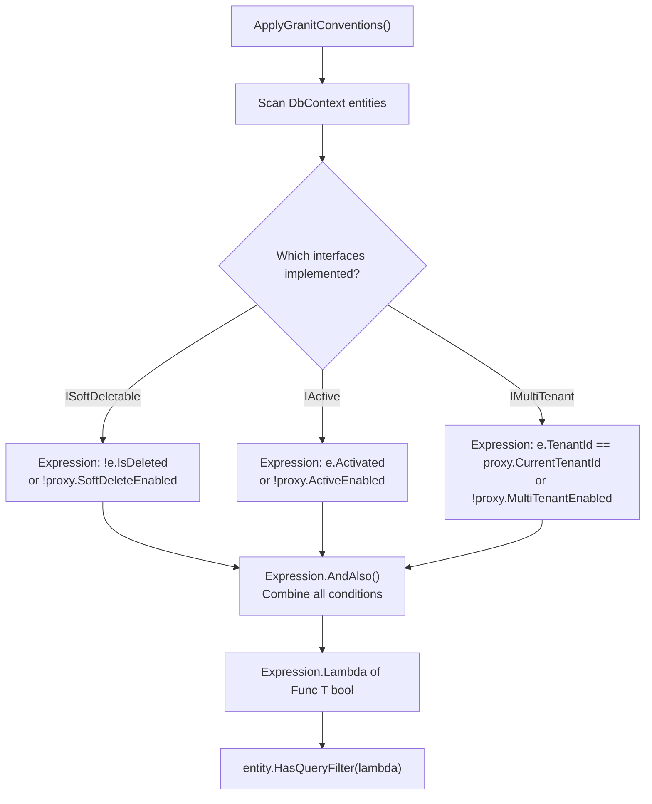

## Definition

Expression Trees allow building queries or filters at runtime as a syntax tree,
instead of writing them statically in source code. EF Core translates these
trees into SQL.

In Granit, `ApplyGranitConventions()` dynamically builds EF Core query filters
for each entity by combining `ISoftDeletable`, `IActive`, and `IMultiTenant`
filters into a single expression.

## Diagram



## Implementation in Granit

| Component | File | Lines |
| --------- | ---- | ----- |
| `ApplyGranitConventions()` | `src/Granit.Persistence/Extensions/ModelBuilderExtensions.cs` | 54-126 |
| `FilterProxy` | `src/Granit.Persistence/Extensions/ModelBuilderExtensions.cs` | 133-140 |

### Why a FilterProxy?

EF Core cannot translate arbitrary method calls (like
`dataFilter.IsEnabled<ISoftDeletable>()`) in a query filter. The `FilterProxy`
exposes **simple properties** that EF Core extracts as SQL parameters:

```csharp
// FilterProxy exposes properties that EF Core understands
internal sealed class FilterProxy(IDataFilter? dataFilter, ICurrentTenant? tenant)
{
    public bool SoftDeleteEnabled => dataFilter?.IsEnabled<ISoftDeletable>() ?? true;
    public bool ActiveEnabled => dataFilter?.IsEnabled<IActive>() ?? true;
    public bool MultiTenantEnabled => dataFilter?.IsEnabled<IMultiTenant>() ?? true;
    public Guid? CurrentTenantId => tenant?.Id;
}
```

### Why named HasQueryFilter calls?

EF Core 10 introduced named query filters: one `HasQueryFilter(name, expr)` call
per interface per entity. Each filter is independent and bypassable individually
via `IgnoreQueryFilters([filterKey])`. Before EF Core 10, `HasQueryFilter` silently
overwrote the previous filter — requiring a combined `AndAlso` expression as a
workaround. Named filters are the idiomatic EF Core 10 solution.

## Rationale

Dynamic construction handles all combinations of interfaces automatically (an
entity can implement 0, 1, 2, or 3 marker interfaces) without writing specific
code for each combination (2^3 = 8 cases).

## Usage example

```csharp
// The application calls a single line in OnModelCreating
protected override void OnModelCreating(ModelBuilder modelBuilder)
{
    modelBuilder.ApplyGranitConventions(serviceProvider);
    // -> Dynamically builds query filters for all entities
}

// The filters are automatic and transparent
List<Patient> patients = await db.Patients.ToListAsync(ct);
// Generated SQL (both named filters applied as AND):
// SELECT * FROM Patients
// WHERE (@SoftDeleteEnabled = 0 OR IsDeleted = 0)
//   AND (@MultiTenantEnabled = 0 OR TenantId = @CurrentTenantId)

// Bypass only soft delete for a single query (EF Core 10):
List<Patient> all = await db.Patients
    .IgnoreQueryFilters([GranitFilterNames.SoftDelete])
    .ToListAsync(ct);
```

## Further reading

- [Expression Trees -- Microsoft .NET Documentation](https://learn.microsoft.com/en-us/dotnet/csharp/advanced-topics/expression-trees/)
